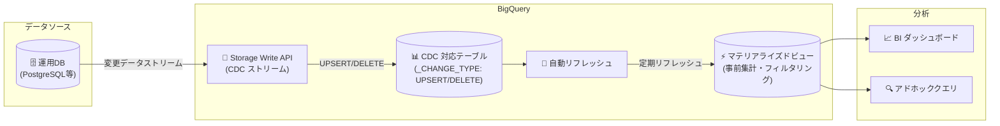

# BigQuery: マテリアライズドビューが CDC 対応テーブルをサポート (GA)

**リリース日**: 2026-04-28

**サービス**: BigQuery

**機能**: マテリアライズドビューによる Change Data Capture (CDC) 対応テーブルのサポート

**ステータス**: GA (一般提供)

📊 [このアップデートのインフォグラフィックを見る](https://takech9203.github.io/google-cloud-news-summary/20260428-bigquery-materialized-views-cdc.html)

## 概要

BigQuery において、アクティブな Change Data Capture (CDC) が有効化されたテーブル上にマテリアライズドビューを作成できるようになった。この機能は一般提供 (GA) として利用可能となっている。

CDC は、Storage Write API を介してストリーミングされる UPSERT や DELETE 操作をリアルタイムで BigQuery テーブルに反映する仕組みである。今回のアップデートにより、このリアルタイムに変更が反映されるテーブルに対してもマテリアライズドビューを適用できるようになり、事前集計やフィルタリングによるクエリ高速化と、データの鮮度を両立したリアルタイム分析基盤の構築が可能になった。

この機能は、データウェアハウスとリアルタイムデータパイプラインの統合を推進する重要なアップデートであり、運用データベースからの変更をストリーミングしつつ、高速な分析クエリを実現したいデータエンジニアやアナリティクスエンジニアに特に有益である。

**アップデート前の課題**

- CDC 対応テーブルに対してマテリアライズドビューを作成できなかったため、リアルタイムデータに対する事前集計の恩恵を受けられなかった
- CDC テーブルへの分析クエリが毎回ベーステーブル全体をスキャンする必要があり、コストとレイテンシが増大していた
- リアルタイム性とクエリパフォーマンスのトレードオフを解消するには、別途 ETL パイプラインを構築して集計テーブルを管理する必要があった

**アップデート後の改善**

- CDC 対応テーブル上にマテリアライズドビューを直接作成でき、自動リフレッシュの恩恵を受けられるようになった
- 事前集計・フィルタリング・結合をマテリアライズドビューに委譲することで、クエリのコストとレイテンシを大幅に削減できるようになった
- 別途集計テーブルの管理パイプラインを構築する必要がなくなり、アーキテクチャの簡素化が実現された

## アーキテクチャ図



CDC ストリームで更新されるベーステーブルに対し、マテリアライズドビューが自動リフレッシュによって事前集計データを維持し、低レイテンシな分析クエリを実現する構成を示している。

## サービスアップデートの詳細

### 主要機能

1. **CDC テーブル上のマテリアライズドビュー作成**
   - アクティブな CDC が有効化されたテーブルをベーステーブルとしてマテリアライズドビューを定義可能
   - 通常の BigQuery テーブル上のマテリアライズドビューと同様に動作し、自動リフレッシュの恩恵を受けられる

2. **max_staleness による鮮度制御**
   - マテリアライズドビューに `max_staleness` オプションを設定し、許容可能なデータの古さを制御
   - CDC テーブルの `max_staleness` 値の少なくとも 2 倍以上に設定する必要がある
   - ランタイムマージジョブを回避し、安定したパフォーマンスを確保

3. **自動リフレッシュとの統合**
   - `enable_refresh = true` と `refresh_interval_minutes` を組み合わせて定期的な自動更新を設定
   - リフレッシュ間隔を `max_staleness` の範囲内に設定することで、常にキャッシュからの高速な応答を実現

## 技術仕様

### マテリアライズドビューと CDC の構成要件

| 項目 | 詳細 |
|------|------|
| ベーステーブル要件 | Storage Write API のデフォルトストリームで CDC が有効 |
| プライマリキー | ベーステーブルにプライマリキーの宣言が必要 (最大 16 列の複合キー対応) |
| max_staleness 設定 | CDC テーブルの max_staleness の少なくとも 2 倍以上 |
| max_staleness 範囲 | 30 分から 3 日の間 |
| ランタイムマージジョブ | マテリアライズドビューでは実行不可 |
| スマートチューニング | CDC 対応テーブル上のマテリアライズドビューでは非対応 |

### 設定例

```sql
-- CDC 対応テーブル上にマテリアライズドビューを作成
CREATE MATERIALIZED VIEW my_project.my_dataset.sales_summary_mv
OPTIONS (
  enable_refresh = true,
  refresh_interval_minutes = 60,
  max_staleness = INTERVAL "4:0:0" HOUR TO SECOND
)
AS
SELECT
  store_id,
  DATE(transaction_time) AS transaction_date,
  SUM(amount) AS total_amount,
  COUNT(*) AS transaction_count
FROM my_project.my_dataset.sales_cdc_table
GROUP BY 1, 2;
```

## 設定方法

### 前提条件

1. ベーステーブルに CDC が有効化されていること (Storage Write API のデフォルトストリームで `_CHANGE_TYPE` を使用)
2. ベーステーブルにプライマリキーが宣言されていること
3. `bigquery.tables.create` 権限を持つ IAM ロール (BigQuery Data Editor 以上)

### 手順

#### ステップ 1: CDC 対応テーブルの確認

```sql
-- テーブルのプライマリキーとCDC設定を確認
SELECT
  table_name,
  constraint_type,
  column_name
FROM my_project.my_dataset.INFORMATION_SCHEMA.TABLE_CONSTRAINTS
JOIN my_project.my_dataset.INFORMATION_SCHEMA.CONSTRAINT_COLUMN_USAGE
  USING (constraint_name)
WHERE table_name = 'sales_cdc_table';
```

#### ステップ 2: マテリアライズドビューの作成

```sql
-- max_staleness をCDCテーブルの2倍以上に設定
CREATE MATERIALIZED VIEW my_project.my_dataset.sales_summary_mv
OPTIONS (
  enable_refresh = true,
  refresh_interval_minutes = 30,
  max_staleness = INTERVAL "2:0:0" HOUR TO SECOND
)
AS
SELECT
  region,
  product_category,
  DATE(event_time) AS event_date,
  SUM(revenue) AS total_revenue,
  COUNT(DISTINCT customer_id) AS unique_customers
FROM my_project.my_dataset.sales_cdc_table
GROUP BY 1, 2, 3;
```

#### ステップ 3: マテリアライズドビューのクエリ

```sql
-- 通常のテーブルと同様にクエリ可能
SELECT region, total_revenue
FROM my_project.my_dataset.sales_summary_mv
WHERE event_date >= '2026-04-01'
ORDER BY total_revenue DESC;
```

## メリット

### ビジネス面

- **リアルタイム分析の実現**: 運用データベースの変更をリアルタイムで反映しつつ、高速な分析クエリを実行できるため、意思決定のスピードが向上する
- **運用コストの削減**: 別途 ETL パイプラインや集計テーブルを管理する必要がなくなり、運用負荷とコストが削減される

### 技術面

- **クエリパフォーマンスの向上**: 事前集計によりスキャンデータ量が削減され、クエリのレイテンシとコストが低減する
- **アーキテクチャの簡素化**: CDC パイプラインとマテリアライズドビューの組み合わせにより、リアルタイムデータウェアハウスを単一のサービスで構築できる
- **自動メンテナンス**: 自動リフレッシュにより手動でのデータ更新が不要となり、データの鮮度が自動的に保たれる

## デメリット・制約事項

### 制限事項

- マテリアライズドビューのベーステーブルが CDC 対応の場合、同一クエリ内でそのベーステーブルとマテリアライズドビューを同時に参照できない
- ランタイムマージジョブが実行できないため、`max_staleness` を適切に設定しないとクエリが失敗する
- スマートチューニング (クエリの自動リライト) は CDC 対応テーブル上のマテリアライズドビューでは利用不可
- `max_staleness` は 30 分から 3 日の範囲で設定する必要がある

### 考慮すべき点

- CDC テーブルの `max_staleness` の少なくとも 2 倍以上をマテリアライズドビューの `max_staleness` に設定する必要があり、設計時に考慮が必要
- 自動リフレッシュの頻度とデータの鮮度要件のバランスを取る必要がある
- バックグラウンド適用ジョブのコンピュートリソース消費を監視し、必要に応じてリザベーションを設定することを推奨

## ユースケース

### ユースケース 1: EC サイトのリアルタイム売上ダッシュボード

**シナリオ**: EC サイトの注文データベースから CDC でリアルタイムに注文情報を BigQuery にストリーミングし、カテゴリ別・地域別の売上集計をダッシュボードで可視化する。

**実装例**:
```sql
CREATE MATERIALIZED VIEW ecommerce.realtime_sales_dashboard
OPTIONS (
  enable_refresh = true,
  refresh_interval_minutes = 15,
  max_staleness = INTERVAL "1:0:0" HOUR TO SECOND
)
AS
SELECT
  product_category,
  shipping_region,
  DATE(order_time) AS order_date,
  SUM(order_total) AS daily_revenue,
  COUNT(*) AS order_count,
  AVG(order_total) AS avg_order_value
FROM ecommerce.orders_cdc
GROUP BY 1, 2, 3;
```

**効果**: 15 分間隔の自動リフレッシュにより、ほぼリアルタイムの売上状況を低コストで可視化。ダッシュボードのクエリがマテリアライズドビューから直接応答されるため、レイテンシが大幅に削減される。

### ユースケース 2: IoT デバイスのセンサーデータ集計

**シナリオ**: 数千台の IoT デバイスからのセンサーデータが CDC 経由で BigQuery にストリーミングされ、デバイスごとの異常検知用に統計値 (平均、最大、最小) を事前集計する。

**効果**: 大量のセンサーデータを毎回フルスキャンする代わりに、マテリアライズドビューの事前集計結果を参照することで、異常検知クエリのコストを 90% 以上削減可能。

## 料金

BigQuery CDC インジェストは以下のコンポーネントに対して料金が発生する:

- **Storage Write API**: データインジェスト料金
- **BigQuery ストレージ**: データ保存料金
- **BigQuery コンピュート**: CDC 行変更操作およびマテリアライズドビューのリフレッシュ処理

マテリアライズドビュー自体の追加料金は発生しないが、自動リフレッシュジョブのコンピュートリソースが消費される。大量の CDC 操作がある場合は、オンデマンド料金の代わりに容量ベースの料金モデル (リザベーション) の利用を推奨する。

詳細は [BigQuery 料金ページ](https://cloud.google.com/bigquery/pricing) を参照。

## 関連サービス・機能

- **BigQuery Storage Write API**: CDC のデータインジェストに使用される API。デフォルトストリームで `_CHANGE_TYPE` 疑似列を指定して UPSERT/DELETE 操作を実行する
- **BigQuery リザベーション**: CDC バックグラウンドジョブに専用コンピュートリソースを割り当て、コストの上限を設定可能
- **BigQuery マテリアライズドビュー (max_staleness)**: データの鮮度とクエリパフォーマンスのバランスを制御する機能
- **Datastream**: 運用データベースから BigQuery への CDC レプリケーションを簡素化するマネージドサービス

## 参考リンク

- 📊 [インフォグラフィック](https://takech9203.github.io/google-cloud-news-summary/20260428-bigquery-materialized-views-cdc.html)
- [公式リリースノート](https://docs.google.com/release-notes#April_28_2026)
- [マテリアライズドビューの概要 - CDC セクション](https://docs.cloud.google.com/bigquery/docs/materialized-views-intro#cdc)
- [BigQuery CDC ドキュメント](https://docs.cloud.google.com/bigquery/docs/change-data-capture)
- [マテリアライズドビューの作成 (max_staleness)](https://docs.cloud.google.com/bigquery/docs/materialized-views-create#max_staleness)
- [BigQuery 料金](https://cloud.google.com/bigquery/pricing)

## まとめ

BigQuery のマテリアライズドビューが CDC 対応テーブルをサポートしたことで、リアルタイムデータストリーミングと高速分析クエリを単一のプラットフォーム上で統合できるようになった。CDC パイプラインを構築済みの組織は、`max_staleness` を適切に設定したマテリアライズドビューを追加することで、既存のワークロードを変更せずにクエリパフォーマンスとコスト効率を大幅に改善できる。

---

**タグ**: #BigQuery #CDC #MaterializedViews #リアルタイム分析 #データエンジニアリング #GA
