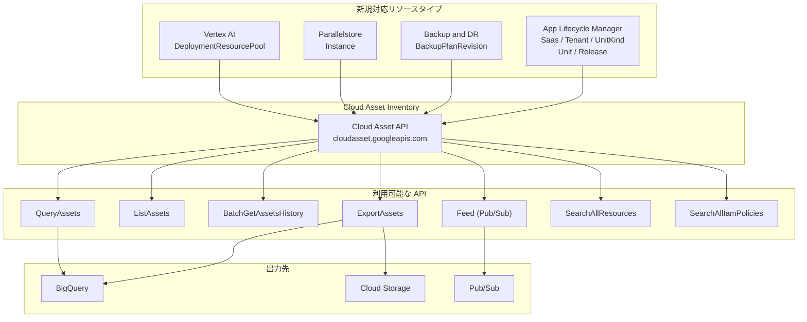

# Cloud Asset Inventory: 新しいリソースタイプの追加 (App Lifecycle Manager, Backup and DR, Parallelstore, Vertex AI)

**リリース日**: 2026-04-28

**サービス**: Cloud Asset Inventory

**機能**: 新しいリソースタイプのサポート追加

**ステータス**: 一般提供 (GA)

:bar_chart: [このアップデートのインフォグラフィックを見る](https://takech9203.github.io/google-cloud-news-summary/20260428-cloud-asset-inventory-new-resource-types.html)

## 概要

Cloud Asset Inventory に 4 つのサービスから合計 8 つの新しいリソースタイプが追加されました。これらのリソースタイプは ExportAssets、ListAssets、BatchGetAssetsHistory、QueryAssets、Feed、SearchAllResources、SearchAllIamPolicies の各 API を通じて利用可能です。

今回追加されたサービスは、SaaS アプリケーションのライフサイクル管理を行う App Lifecycle Manager、バックアップとディザスタリカバリを管理する Backup and DR、高性能並列ファイルシステムの Parallelstore、そして機械学習モデルのデプロイリソース管理を担う Vertex AI DeploymentResourcePool です。これにより、組織全体のこれらのリソースに対する可視性、監査、ガバナンスが Cloud Asset Inventory を通じて統合的に実現できるようになりました。

このアップデートは、マルチクラウド環境やハイブリッド環境でリソースの一元管理を必要とするクラウドアーキテクト、セキュリティ管理者、FinOps チームにとって重要な機能拡張です。

**アップデート前の課題**

- App Lifecycle Manager の SaaS オファリング、テナント、ユニット等のリソースを Cloud Asset Inventory で一元的に把握できなかった
- Backup and DR の BackupPlanRevision のメタデータを資産インベントリとして横断的に検索・エクスポートできなかった
- Parallelstore インスタンスのガバナンスや IAM ポリシー分析を Cloud Asset Inventory の API で実施できなかった
- Vertex AI の DeploymentResourcePool を組織全体で可視化し、コスト最適化やセキュリティ監査を行うことが困難だった

**アップデート後の改善**

- 全 7 つの主要 Cloud Asset Inventory API で新リソースタイプの検索、エクスポート、モニタリングが可能に
- 組織全体のリソースインベントリに新サービスが統合され、セキュリティ監査やコンプライアンスチェックの対象範囲が拡大
- Pub/Sub Feed を活用した新リソースタイプの変更リアルタイム監視が可能に
- BigQuery SQL を使用した新リソースタイプのクエリ分析が実施可能に

## アーキテクチャ図



Cloud Asset Inventory が新しい 4 サービスのリソースメタデータを収集し、7 つの API を通じてエクスポート、検索、モニタリングを提供する全体像を示しています。

## サービスアップデートの詳細

### 主要機能

1. **App Lifecycle Manager リソースタイプの追加**
   - `saasservicemgmt.googleapis.com/Saas` - SaaS オファリングの定義リソース
   - `saasservicemgmt.googleapis.com/Tenant` - テナント管理リソース
   - `saasservicemgmt.googleapis.com/UnitKind` - ユニット種別の定義リソース
   - `saasservicemgmt.googleapis.com/Unit` - 個別デプロイメント単位のリソース
   - `saasservicemgmt.googleapis.com/Release` - リリース管理リソース

2. **Backup and DR リソースタイプの追加**
   - `backupdr.googleapis.com/BackupPlanRevision` - バックアッププランのスナップショット（リビジョン）を表すリソース。バックアッププランの変更履歴を追跡可能

3. **Parallelstore リソースタイプの追加**
   - `parallelstore.googleapis.com/Instance` - 高性能並列分散ファイルシステムのインスタンスリソース。HPC や AI/ML ワークロード向け

4. **Vertex AI リソースタイプの追加**
   - `aiplatform.googleapis.com/DeploymentResourcePool` - 複数のモデルデプロイメント間で VM リソースを共有するためのリソースプール

## 技術仕様

### 新規リソースタイプ一覧

| サービス | リソースタイプ | 説明 |
|------|------|------|
| App Lifecycle Manager | `saasservicemgmt.googleapis.com/Saas` | SaaS オファリング定義 |
| App Lifecycle Manager | `saasservicemgmt.googleapis.com/Tenant` | テナント管理 |
| App Lifecycle Manager | `saasservicemgmt.googleapis.com/UnitKind` | ユニット種別定義 |
| App Lifecycle Manager | `saasservicemgmt.googleapis.com/Unit` | デプロイメント単位 |
| App Lifecycle Manager | `saasservicemgmt.googleapis.com/Release` | リリース管理 |
| Backup and DR | `backupdr.googleapis.com/BackupPlanRevision` | バックアッププランリビジョン |
| Parallelstore | `parallelstore.googleapis.com/Instance` | 並列ファイルシステムインスタンス |
| Vertex AI | `aiplatform.googleapis.com/DeploymentResourcePool` | デプロイメントリソースプール |

### 対応 API

| API | メソッド | 用途 |
|------|------|------|
| ExportAssets | `POST /v1/{parent}:exportAssets` | BigQuery や Cloud Storage へのエクスポート |
| ListAssets | `GET /v1/{parent}/assets` | ページネーション付きアセット一覧取得 |
| BatchGetAssetsHistory | `GET /v1/{parent}:batchGetAssetsHistory` | 最大 35 日間の変更履歴取得 |
| QueryAssets | `POST /v1/{parent}:queryAssets` | BigQuery SQL 互換のクエリ実行 |
| Feed | `POST /v1/{parent}/feeds` | Pub/Sub によるリアルタイム変更通知 |
| SearchAllResources | `GET /v1/{scope}:searchAllResources` | リソースのカスタムクエリ検索 |
| SearchAllIamPolicies | `GET /v1/{scope}:searchAllIamPolicies` | IAM ポリシーの横断検索 |

## 設定方法

### 前提条件

1. Cloud Asset API (`cloudasset.googleapis.com`) がプロジェクトで有効化されていること
2. 適切な IAM ロール (`roles/cloudasset.viewer` 以上) が付与されていること

### 手順

#### ステップ 1: 新しいリソースタイプの検索

```bash
# SearchAllResources で Parallelstore インスタンスを検索
gcloud asset search-all-resources \
  --scope="projects/PROJECT_ID" \
  --asset-types="parallelstore.googleapis.com/Instance"
```

検索結果には、プロジェクト内の全 Parallelstore インスタンスのメタデータが返されます。

#### ステップ 2: BigQuery へのエクスポート

```bash
# Vertex AI DeploymentResourcePool を BigQuery にエクスポート
gcloud asset export \
  --project=PROJECT_ID \
  --asset-types="aiplatform.googleapis.com/DeploymentResourcePool" \
  --content-type=resource \
  --bigquery-table="projects/PROJECT_ID/datasets/DATASET/tables/TABLE" \
  --output-bigquery-force
```

エクスポートされたデータは BigQuery SQL で分析できます。

#### ステップ 3: リアルタイムモニタリングの設定

```bash
# App Lifecycle Manager リソースの変更を Pub/Sub で監視する Feed を作成
gcloud asset feeds create alm-feed \
  --project=PROJECT_ID \
  --asset-types="saasservicemgmt.googleapis.com/Saas,saasservicemgmt.googleapis.com/Tenant" \
  --content-type=resource \
  --pubsub-topic="projects/PROJECT_ID/topics/TOPIC_NAME"
```

Feed を作成すると、指定したリソースタイプの変更が Pub/Sub トピックにリアルタイムで通知されます。

#### ステップ 4: IAM ポリシーの検索

```bash
# Backup and DR BackupPlanRevision に関連する IAM ポリシーを検索
gcloud asset search-all-iam-policies \
  --scope="organizations/ORG_ID" \
  --query="policy:backupdr"
```

組織全体の Backup and DR 関連の IAM ポリシーを横断的に検索できます。

## メリット

### ビジネス面

- **ガバナンスの強化**: App Lifecycle Manager のマルチテナント SaaS 環境全体を Cloud Asset Inventory で一元的に可視化し、コンプライアンス要件への対応が容易に
- **コスト最適化**: Vertex AI DeploymentResourcePool の利用状況を組織横断で把握し、未使用または過剰プロビジョニングされたリソースプールを特定可能
- **災害復旧の監査**: Backup and DR の BackupPlanRevision を追跡し、バックアップ計画の変更履歴を監査証跡として活用

### 技術面

- **統合的な資産管理**: 7 つの主要 API すべてで新リソースタイプに対応し、既存のワークフローにそのまま組み込み可能
- **リアルタイム監視**: Pub/Sub Feed による変更通知で、Parallelstore インスタンスの作成・削除・変更をリアルタイムに検知
- **SQL ベースの分析**: QueryAssets API により BigQuery SQL 互換のクエリで新リソースタイプを分析可能

## デメリット・制約事項

### 制限事項

- Cloud Asset Inventory のデータは結果整合性であり、リソースの更新がインベントリに反映されるまで数分の遅延が発生する可能性がある
- IAM ポリシーのデータは最大約 36 時間の遅延が発生する場合がある
- 変更履歴 (BatchGetAssetsHistory) は最大 35 日間の保持期間に制限される

### 考慮すべき点

- App Lifecycle Manager は現在プレビュー段階のサービスであり、Cloud Asset Inventory でのリソース追跡は可能だが、サービス自体の機能や API に変更が生じる可能性がある
- 大量のリソースタイプを指定した ExportAssets や Feed はコストに影響するため、必要なリソースタイプのみを指定することを推奨

## ユースケース

### ユースケース 1: マルチテナント SaaS 環境のガバナンス

**シナリオ**: ISV が App Lifecycle Manager を使用して複数のテナントに SaaS サービスを提供しており、全テナントのリソース状況を定期的に監査する必要がある

**実装例**:
```bash
# 組織全体の App Lifecycle Manager リソースを BigQuery にエクスポート
gcloud asset export \
  --organization=ORG_ID \
  --asset-types="saasservicemgmt.googleapis.com/Saas,saasservicemgmt.googleapis.com/Tenant,saasservicemgmt.googleapis.com/Unit" \
  --content-type=resource \
  --bigquery-table="projects/PROJECT_ID/datasets/audit/tables/alm_resources" \
  --output-bigquery-force
```

**効果**: 全テナントの SaaS リソース構成を BigQuery で一元分析し、異常なリソース構成やセキュリティリスクを早期に発見可能

### ユースケース 2: ML インフラのコスト最適化

**シナリオ**: 複数のチームが Vertex AI の DeploymentResourcePool を利用しており、使用率の低いリソースプールを特定してコスト最適化を行いたい

**実装例**:
```bash
# DeploymentResourcePool の一覧を取得して分析
gcloud asset search-all-resources \
  --scope="organizations/ORG_ID" \
  --asset-types="aiplatform.googleapis.com/DeploymentResourcePool" \
  --order-by="createTime"
```

**効果**: 組織全体の DeploymentResourcePool を可視化し、未使用プールの削除やリソース統合によるコスト削減を実現

### ユースケース 3: HPC/AI ワークロードのストレージ監査

**シナリオ**: 複数プロジェクトにまたがる Parallelstore インスタンスの利用状況を把握し、不要なインスタンスのクリーンアップを行いたい

**効果**: Parallelstore はスクラッチファイルシステムで容量課金が発生するため、未使用インスタンスの特定と削除により直接的なコスト削減が可能

## 関連サービス・機能

- **Cloud Asset Inventory**: Google Cloud リソースのメタデータインベントリサービス。今回の新リソースタイプの追加により対応範囲が拡大
- **App Lifecycle Manager**: SaaS アプリケーションのライフサイクルを管理するサービス。Saas、Tenant、UnitKind、Unit、Release のリソース階層を持つ
- **Backup and DR**: Google Cloud のバックアップとディザスタリカバリサービス。BackupPlanRevision はバックアッププランの変更スナップショット
- **Parallelstore**: HPC および AI/ML 向けの高性能並列分散ファイルシステム。サブミリ秒のレイテンシと最大 1 TB/s の読み取り速度を提供
- **Vertex AI**: Google Cloud の機械学習プラットフォーム。DeploymentResourcePool は複数モデルの VM 共有によるコスト効率の良いサービング機能

## 参考リンク

- :bar_chart: [インフォグラフィック](https://takech9203.github.io/google-cloud-news-summary/20260428-cloud-asset-inventory-new-resource-types.html)
- [公式リリースノート](https://docs.cloud.google.com/release-notes#April_28_2026)
- [Cloud Asset Inventory ドキュメント](https://docs.cloud.google.com/asset-inventory/docs/asset-inventory-overview)
- [サポートされるリソースタイプ一覧](https://docs.cloud.google.com/asset-inventory/docs/asset-types)
- [Cloud Asset Inventory API リファレンス](https://docs.cloud.google.com/asset-inventory/docs/reference/rest)
- [App Lifecycle Manager ドキュメント](https://docs.cloud.google.com/saas-runtime/docs/overview)
- [Backup and DR ドキュメント](https://cloud.google.com/backup-disaster-recovery)
- [Parallelstore ドキュメント](https://docs.cloud.google.com/parallelstore/docs/overview)
- [Vertex AI モデルコホスティング (DeploymentResourcePool)](https://docs.cloud.google.com/vertex-ai/docs/predictions/model-co-hosting)

## まとめ

今回のアップデートにより、Cloud Asset Inventory が App Lifecycle Manager、Backup and DR、Parallelstore、Vertex AI の合計 8 つの新リソースタイプに対応し、組織全体のクラウドリソースガバナンスの対象範囲がさらに拡大しました。特に、マルチテナント SaaS 管理、バックアップ監査、HPC ストレージ管理、ML インフラのコスト最適化といったユースケースにおいて、Cloud Asset Inventory の各 API を活用した統合的な資産管理が可能になります。既に Cloud Asset Inventory を利用している組織は、追加設定なしで新リソースタイプの検索・エクスポート・モニタリングを開始できます。

---

**タグ**: #CloudAssetInventory #AppLifecycleManager #BackupAndDR #Parallelstore #VertexAI #AssetManagement #Governance #Security #ResourceInventory
