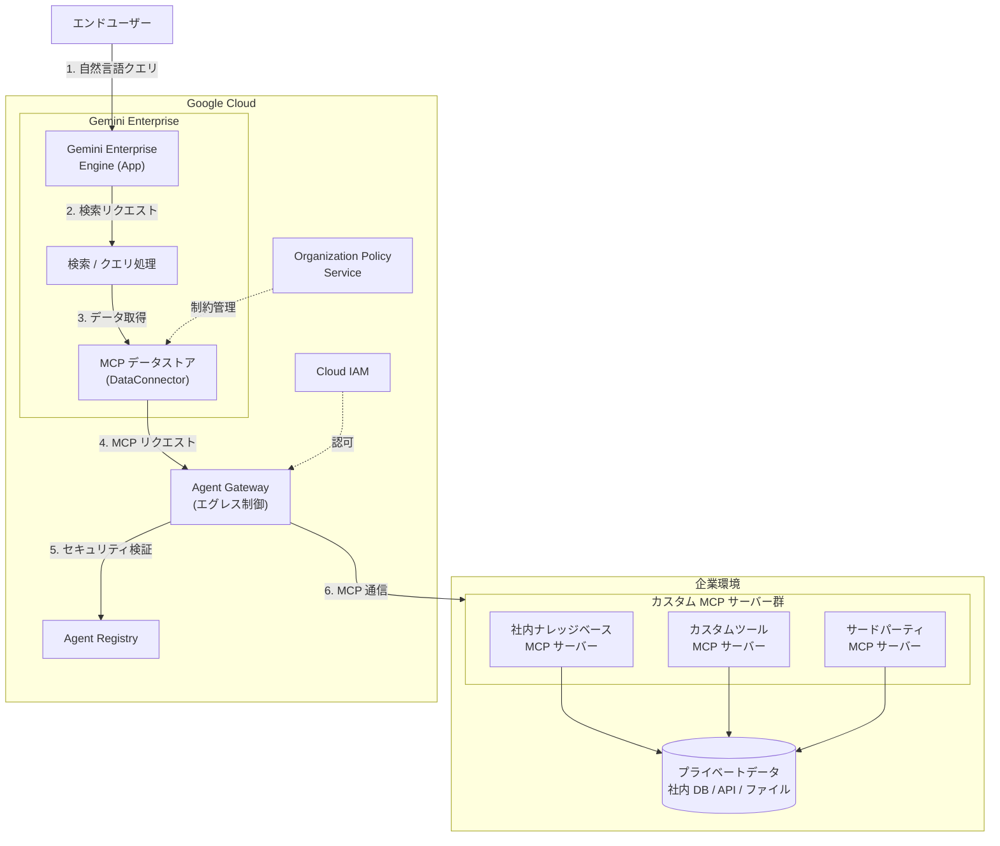

# Gemini Enterprise: カスタム MCP サーバーデータストア (Preview)

**リリース日**: 2026-04-28

**サービス**: Gemini Enterprise

**機能**: カスタム MCP サーバーデータストア (Custom MCP server data stores)

**ステータス**: Public Preview

[このアップデートのインフォグラフィックを見る](https://takech9203.github.io/google-cloud-news-summary/20260428-gemini-enterprise-custom-mcp-server.html)

## 概要

Gemini Enterprise に、カスタム Model Context Protocol (MCP) サーバーを接続してデータストアとして利用できる新機能が Public Preview としてリリースされた。この機能により、企業が保有するプライベートデータ、社内カスタムツール、MCP 準拠のサードパーティシステムに対して、Gemini Enterprise から安全にアクセスできるようになる。

MCP は、大規模言語モデル (LLM) や AI アプリケーションが外部データソースに接続する方法を標準化するオープンプロトコルである。今回のアップデートにより、Gemini Enterprise の標準コネクタライブラリに含まれないデータソースであっても、MCP サーバーとして公開されていれば Gemini Enterprise と統合し、自然言語による検索やデータアクセスが可能になる。

この機能はデフォルトで無効化されており、利用するには組織ポリシー管理者 (Organization Policy Administrator) が組織の制約を解除する必要がある。このセキュリティ・バイ・デフォルトのアプローチにより、企業は外部 MCP サーバーへの接続を組織レベルで統制できる。対象ユーザーは、独自のデータソースや社内ツールを Gemini Enterprise と統合したいエンタープライズ組織の IT 管理者および開発者である。

**アップデート前の課題**

- Gemini Enterprise で利用できるデータソースは、Google データソース (Google Drive、Gmail など) と標準サードパーティコネクタ (SharePoint、Jira、Confluence など) に限定されていた
- 社内独自のデータベースやカスタムツールのデータを Gemini Enterprise の検索対象にするには、カスタムコネクタを Discovery Engine API で開発する必要があり、技術的なハードルが高かった
- MCP 準拠のサードパーティシステムとの直接統合手段がなく、MCP エコシステムの拡大に対応できていなかった

**アップデート後の改善**

- カスタム MCP サーバーを Gemini Enterprise のデータストアとして直接接続できるようになり、統合対象のデータソースが大幅に拡大した
- MCP プロトコルに準拠したサーバーであれば、社内ツールやサードパーティシステムを追加開発なしで接続可能になった
- 組織ポリシーによる制御により、セキュリティを維持しながら柔軟なデータ統合が可能になった

## アーキテクチャ図



Gemini Enterprise がカスタム MCP サーバーを介して企業のプライベートデータにアクセスする全体像を示す。エンドユーザーからの自然言語クエリが Gemini Enterprise Engine を経由し、Agent Gateway によるセキュリティ検証を経て、カスタム MCP サーバーからデータを取得する。組織ポリシーにより MCP データストアの作成が制御される。

## サービスアップデートの詳細

### 主要機能

1. **カスタム MCP サーバー接続**
   - MCP プロトコルに準拠した任意のサーバーを Gemini Enterprise のデータストアとして登録可能
   - 社内のプライベートデータ、カスタム内部ツール、MCP 準拠のサードパーティシステムへのアクセスを実現
   - データソースタイプとして `custom_mcp` を使用して DataConnector リソースを作成

2. **組織ポリシーによるアクセス制御**
   - 機能はデフォルトで無効化 (セキュリティ・バイ・デフォルト)
   - Organization Policy Administrator が組織の制約 (constraint) を解除することで有効化
   - カスタム制約を使用して、MCP コネクタの作成を組織・フォルダ・プロジェクトレベルで制御可能
   - 制約の例: `resource.dataSource == 'custom_mcp'` 条件で DataConnector の CREATE を DENY/ALLOW

3. **Agent Gateway によるエグレスガバナンス**
   - カスタム MCP サーバーへの通信は Agent Gateway を経由し、セキュリティポリシーを適用可能
   - Agent Registry に登録された MCP サーバーのみ通信を許可
   - Model Armor との統合により、プロンプトインジェクション攻撃からの防御が可能

## 技術仕様

### カスタム MCP サーバーデータストアの要件

| 項目 | 詳細 |
|------|------|
| ステータス | Public Preview |
| データソースタイプ | `custom_mcp` |
| プロトコル | Model Context Protocol (MCP) |
| API | Discovery Engine API (`discoveryengine.googleapis.com/DataConnector`) |
| デフォルト状態 | 無効 (組織ポリシーの制約を解除する必要あり) |
| 必要な権限 | Organization Policy Administrator (`roles/orgpolicy.policyAdmin`) - 制約解除用 |
| Agent Gateway 連携 | Agent-to-Anywhere (エグレス) モード |

### 組織ポリシーの制約設定

カスタム MCP コネクタの作成を制御する組織ポリシーの例:

```yaml
# カスタム MCP コネクタの作成を禁止する制約の例
name: organizations/ORGANIZATION_ID/customConstraints/custom.restrictCustomMcpConnector
resourceTypes:
  discoveryengine.googleapis.com/DataConnector
condition: "resource.dataSource == 'custom_mcp'"
actionType: DENY
methodTypes:
  - CREATE
displayName: Restrict custom MCP connectors
description: Custom MCP connectors cannot be created.
```

## 設定方法

### 前提条件

1. Gemini Enterprise が有効化された Google Cloud プロジェクトがあること
2. Organization Policy Administrator (`roles/orgpolicy.policyAdmin`) ロールを持つ管理者アカウントがあること
3. Discovery Engine Editor (`roles/discoveryengine.editor`) ロールが付与されていること
4. カスタム MCP サーバーが構築・稼働済みであること

### 手順

#### ステップ 1: 組織ポリシーの制約を解除する

組織ポリシー管理者がカスタム MCP データストアの組織制約を解除する。詳細な手順は [Override the organization policy for Custom MCP data stores](https://docs.google.com/gemini/enterprise/docs/connectors/custom-mcp-server/override-constraint-for-custom-mcp-data-stores) を参照。

```bash
# 組織ポリシーの制約解除の概念例
# 具体的なコマンドは公式ドキュメントに従うこと
gcloud org-policies set-policy POLICY_FILE.yaml
```

組織ポリシーの変更が反映されるまで最大 15 分程度かかる場合がある。

#### ステップ 2: カスタム MCP サーバーをセットアップする

カスタム MCP サーバーを Gemini Enterprise に接続するための設定を行う。詳細な手順は [Set up your custom MCP server](https://docs.google.com/gemini/enterprise/docs/connectors/custom-mcp-server/set-up-custom-mcp-server) を参照。

#### ステップ 3: データストアの作成と接続

Gemini Enterprise コンソールで MCP データストアを作成し、アプリケーションに接続する。

1. Google Cloud コンソールで Gemini Enterprise ページに移動
2. ナビゲーションメニューから **Data Stores** をクリック
3. **Create Data Store** をクリック
4. データソースとしてカスタム MCP サーバーを選択
5. MCP サーバーの接続情報を設定
6. データストアを作成後、既存のアプリに接続するか、新しいアプリを作成して接続

## メリット

### ビジネス面

- **データ統合範囲の大幅な拡大**: 標準コネクタでカバーされない社内システムやニッチなサードパーティサービスのデータを、Gemini Enterprise の検索対象に追加できる
- **MCP エコシステムの活用**: MCP プロトコルの急速な普及に伴い、対応するツールやサービスが増加しており、それらをすぐに統合に利用できる
- **段階的な導入が可能**: 組織ポリシーによる制御により、部門やプロジェクト単位で段階的に機能を開放できる

### 技術面

- **標準プロトコルによる相互運用性**: MCP はオープンスタンダードであり、ベンダーロックインのリスクが低い
- **セキュリティ・バイ・デフォルト**: デフォルト無効により、意図しない外部接続のリスクを排除
- **Agent Gateway によるガバナンス**: すべての MCP 通信が Agent Gateway を経由し、認可ポリシーの適用、トラフィック監視、Model Armor によるセキュリティ検査が可能
- **既存のカスタムコネクタとの共存**: 従来の Discovery Engine API ベースのカスタムコネクタと MCP ベースの接続を併用可能

## デメリット・制約事項

### 制限事項

- Public Preview であり、「Pre-GA Offerings Terms」が適用される。サポートが限定的な場合がある
- デフォルトで無効化されているため、利用開始前に Organization Policy Administrator による制約解除が必須
- Agent Gateway との統合が必要な場合、追加のネットワーク設定とリソースプロビジョニングが発生する

### 考慮すべき点

- カスタム MCP サーバーの可用性と性能は利用者側の責任となるため、運用体制の整備が必要
- MCP サーバーを経由したデータアクセスのレイテンシーは、サーバーの応答速度に依存する
- 組織ポリシーの変更は組織全体またはフォルダ/プロジェクト階層に影響するため、変更前に影響範囲を十分に評価する必要がある
- Preview 機能のため、GA 時に仕様変更が発生する可能性がある

## ユースケース

### ユースケース 1: 社内ナレッジベースの統合

**シナリオ**: 大規模な製造業の企業が、社内で運用している独自のナレッジベースシステム (Wiki、技術文書管理システム) を MCP サーバーとして公開し、Gemini Enterprise から従業員が自然言語で社内情報を検索できるようにしたい。

**効果**: 従業員は Gemini Enterprise の検索インターフェースから、標準コネクタ対応の Google Drive や SharePoint のデータに加えて、社内独自システムのデータもまとめて検索できるようになる。情報の分散が解消され、必要な情報へのアクセス時間が短縮される。

### ユースケース 2: MCP 準拠サードパーティツールとの統合

**シナリオ**: ソフトウェア開発企業が、GitHub、Linear、Notion など MCP サーバーを提供するサードパーティツールを Gemini Enterprise に接続し、開発チームの生産性を向上させたい。

**効果**: MCP プロトコルに準拠したサードパーティツールを個別のカスタムコネクタ開発なしで Gemini Enterprise に接続できる。開発者は Gemini Enterprise から横断的にプロジェクト情報を検索し、関連するイシュー、ドキュメント、コード情報に素早くアクセスできるようになる。

### ユースケース 3: レガシーシステムの段階的な AI 統合

**シナリオ**: 金融機関が、オンプレミスで運用するレガシーな顧客管理システムや取引記録データベースに MCP サーバーのインターフェースを構築し、Gemini Enterprise と安全に接続したい。

**効果**: Agent Gateway によるエグレスガバナンスと組織ポリシーによるアクセス制御を組み合わせることで、機密性の高い金融データへのアクセスをセキュアに制御しながら、AI によるデータ活用を実現できる。段階的に部門単位で展開し、リスクを最小化しながら導入を進められる。

## 関連サービス・機能

- **Gemini Enterprise コネクタ**: Google データソースおよびサードパーティデータソースを Gemini Enterprise に接続する標準コネクタ群。カスタム MCP サーバーデータストアは、これらの標準コネクタを補完する位置づけ
- **カスタムコネクタ (Discovery Engine API)**: Discovery Engine API を直接使用してカスタムデータソースを統合する既存の方式。MCP サーバー方式はこれに代わるより標準化されたアプローチ
- **Agent Gateway**: Gemini Enterprise からの外部通信を制御するネットワーキングコンポーネント。MCP サーバーへの通信の認可とセキュリティを担当
- **Agent Registry**: エージェント、ツール、MCP サーバーを登録・管理する中央レジストリ。Agent Gateway が通信を許可する対象を管理
- **Organization Policy Service**: Google Cloud リソースの制約を組織レベルで管理するサービス。カスタム MCP コネクタの利用可否を制御
- **Model Armor**: Agent Gateway と統合し、MCP 通信におけるプロンプトインジェクション攻撃や有害コンテンツを検出・ブロック

## 参考リンク

- [インフォグラフィック](https://takech9203.github.io/google-cloud-news-summary/20260428-gemini-enterprise-custom-mcp-server.html)
- [公式リリースノート](https://docs.cloud.google.com/release-notes#April_28_2026)
- [カスタム MCP サーバーのセットアップ](https://docs.google.com/gemini/enterprise/docs/connectors/custom-mcp-server/set-up-custom-mcp-server)
- [カスタム MCP データストアの組織ポリシーの解除](https://docs.google.com/gemini/enterprise/docs/connectors/custom-mcp-server/override-constraint-for-custom-mcp-data-stores)
- [Gemini Enterprise コネクタの概要](https://docs.cloud.google.com/gemini/enterprise/docs/connectors/introduction-to-connectors-and-data-stores)
- [カスタムコネクタ](https://docs.cloud.google.com/gemini/enterprise/docs/connectors/custom-connector)
- [組織ポリシーのカスタム制約](https://docs.cloud.google.com/gemini/enterprise/docs/org-policy-custom-constraints)
- [Agent Gateway の概要](https://docs.cloud.google.com/gemini-enterprise-agent-platform/govern/gateways/agent-gateway-overview)

## まとめ

Gemini Enterprise にカスタム MCP サーバーデータストア機能が Public Preview として追加されたことで、企業が保有するあらゆるデータソースを MCP プロトコル経由で Gemini Enterprise と統合する道が開かれた。セキュリティ・バイ・デフォルトの設計により組織レベルでの統制が確保されており、Agent Gateway によるガバナンスと組み合わせることで、エンタープライズ要件を満たしたデータ統合が可能である。MCP エコシステムの拡大を背景に、今後の GA リリースに向けて早期に評価・検証を開始することを推奨する。

---

**タグ**: #GeminiEnterprise #MCP #ModelContextProtocol #カスタムMCPサーバー #データストア #コネクタ #OrganizationPolicy #AgentGateway #AgentRegistry #DiscoveryEngine #Preview #エンタープライズAI #データ統合
