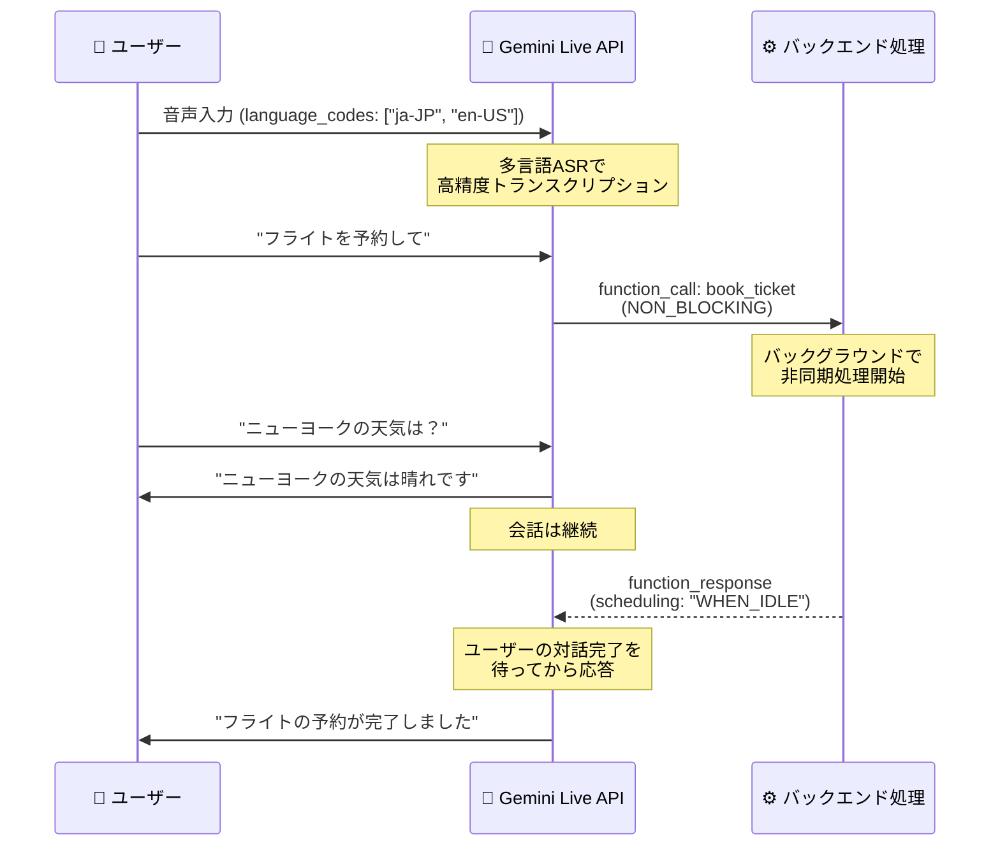

# Gemini Enterprise Agent Platform: Live API 多言語トランスクリプション改善 & 非同期ファンクションコーリング

**リリース日**: 2026-04-28

**サービス**: Gemini Enterprise Agent Platform

**機能**: Gemini Live API トランスクリプション品質改善 / 非同期ファンクションコーリング

**ステータス**: Preview

📊 [このアップデートのインフォグラフィックを見る](https://takech9203.github.io/google-cloud-news-summary/20260428-gemini-live-api-transcription-async.html)

## 概要

Gemini Live API に 2 つの重要な機能強化が追加された。1 つ目は多言語自動音声認識 (ASR) のトランスクリプション品質を向上させる `language_codes` フィールドの追加、2 つ目は会話を中断せずにバックグラウンドで関数を実行できる非同期ファンクションコーリングのパブリックプレビュー提供である。

トランスクリプション改善では、`input_audio_transcription` および `output_audio_transcription` の設定に `language_codes` フィールドを指定することで、言語検出の精度が向上し、特に短いプロンプトでの誤認識リスクが低減される。BCP-47 言語コード形式で複数言語のヒントを提供できる。

非同期ファンクションコーリングでは、Live API における関数呼び出しがデフォルトでノンブロッキングとなり、重い処理（外部 API クエリ、RAG パイプラインなど）をバックグラウンドで実行しつつ、モデルはユーザーとの会話を自然に継続できる。関数レスポンスの処理方法として SILENT、WHEN_IDLE、INTERRUPT の 3 つのポリシーが提供される。

**アップデート前の課題**

- トランスクリプションで言語ヒントを指定する方法がなく、短い音声入力で誤った言語が検出されるリスクがあった
- 多言語環境でのトランスクリプション精度が十分でない場合があった
- ファンクションコーリングがデフォルトで同期的に実行され、関数処理中に音声ストリームが無音となりユーザーが待たされた
- 関数の実行完了後のレスポンスタイミングを制御する手段がなかった

**アップデート後の改善**

- `language_codes` フィールドで BCP-47 言語コードのリストを指定し、トランスクリプション精度を向上
- 複数言語に対応したヒント指定により、短いプロンプトでも正確な言語検出が可能
- 関数呼び出しをバックグラウンドで非同期実行し、会話を中断せずに処理を継続
- SILENT / WHEN_IDLE / INTERRUPT ポリシーで関数レスポンスの処理タイミングを柔軟に制御可能

## アーキテクチャ図



Gemini Live API の非同期ファンクションコーリングにより、バックグラウンドで関数を処理しつつ会話を継続し、完了後にスケジューリングポリシーに従ってレスポンスを返す流れを示している。

## サービスアップデートの詳細

### 主要機能

1. **多言語トランスクリプション品質改善**
   - `input_audio_transcription.language_codes` および `output_audio_transcription.language_codes` フィールドの追加
   - BCP-47 言語コード形式で言語ヒントを指定（例: `["en-US", "ja-JP"]`）
   - 複数言語コードの同時指定に対応
   - 短いプロンプトでの言語誤検出リスクを低減
   - `gemini-live-2.5-flash-native-audio` モデルで利用可能

2. **非同期ファンクションコーリング（パブリックプレビュー）**
   - 関数定義に `behavior: "NON_BLOCKING"` を指定して非同期実行を有効化
   - 関数実行中もモデルはユーザーとの会話を自然に継続
   - レスポンスポリシーによる柔軟な応答タイミング制御
   - 重複する関数呼び出しの処理メカニズム

3. **レスポンスポリシー（scheduling フィールド）**
   - **SILENT**: 関数レスポンスをモデルのコンテキストに追加するが、応答を生成しない。ユーザーが後で質問した際に利用
   - **WHEN_IDLE**: ユーザーとの対話が完了するのを待ってから応答を生成。会話フローを中断しない
   - **INTERRUPT**: 関数レスポンスを受信次第、即座に応答を生成。緊急性の高い通知に適用

## 技術仕様

### トランスクリプション設定

| 項目 | 詳細 |
|------|------|
| フィールド名 | `input_audio_transcription.language_codes` / `output_audio_transcription.language_codes` |
| 言語コード形式 | BCP-47（例: "en-US", "ja-JP", "es-US"） |
| 複数言語指定 | 対応（リスト形式） |
| 対応モデル | gemini-live-2.5-flash-native-audio |
| 対応言語数 | 24 言語 |

### 非同期ファンクションコーリング設定

| 項目 | 詳細 |
|------|------|
| 関数定義の behavior | `NON_BLOCKING`（非同期実行を有効化） |
| scheduling ポリシー | SILENT / WHEN_IDLE / INTERRUPT |
| デフォルト動作 | scheduling 省略時は従来の同期的処理（後方互換性） |
| プロトコル | WebSocket (WSS) |

### トランスクリプション設定例

```python
from google.genai import types

config = types.LiveConnectConfig(
    response_modalities=["audio", "text"],
    input_audio_transcription=types.AudioTranscriptionConfig(
        language_codes=["en-US", "ja-JP"]  # 複数言語ヒントの指定
    ),
    output_audio_transcription=types.AudioTranscriptionConfig(
        language_codes=["en-US"]
    ),
)
```

### 非同期ファンクションコーリング設定例

```python
import asyncio
from google.genai import types

# NON_BLOCKING 関数定義
search_flights = {"name": "search_flights", "behavior": "NON_BLOCKING"}

# バックグラウンドで関数を実行し、WHEN_IDLE ポリシーで応答
async def background_flight_search(call_id, args, session):
    await asyncio.sleep(5)  # 外部 API 呼び出しのシミュレーション
    flight_data = ["ANA NH101: ¥45,000", "JAL JL202: ¥42,000"]

    function_response = types.FunctionResponse(
        id=call_id,
        name="search_flights",
        response={
            "status": "success",
            "flights": flight_data
        },
        scheduling="WHEN_IDLE"  # ユーザーの対話完了後に応答
    )
    await session.send_tool_response(function_responses=[function_response])
```

## メリット

### ビジネス面

- **ユーザー体験の向上**: バックグラウンド処理中も会話が継続され、待ち時間による離脱を防止
- **多言語対応の容易化**: 言語ヒント指定により、グローバル展開する音声エージェントの品質が向上
- **柔軟なインタラクション設計**: SILENT/WHEN_IDLE/INTERRUPT の使い分けで、ユースケースに最適な体験を構築可能

### 技術面

- **ノンブロッキング設計**: 重い関数処理（外部 API、RAG パイプラインなど）が音声ストリームをブロックしない
- **後方互換性**: scheduling フィールド省略時は従来動作を維持し、段階的な移行が可能
- **重複呼び出し制御**: 同一関数の重複呼び出しをクライアント側で検出・無視するパターンをサポート

## デメリット・制約事項

### 制限事項

- 現時点ではパブリックプレビューであり、GA に向けて仕様が変更される可能性がある
- トランスクリプション有効化により追加のトークンが消費される
- SILENT ポリシー使用時、モデルが関数実行を音声で解説してしまう場合があり、システム指示で明示的な抑制が必要な場合がある
- Gemini 3.1 Flash Live では非同期ファンクションコーリングは未サポート

### 考慮すべき点

- INTERRUPT ポリシーは緊急アラート以外では推奨されず、SILENT または WHEN_IDLE の方がスムーズなユーザー体験を提供
- 長時間の非同期処理中はユーザーへの期待値管理のためのテキストメッセージ送信が推奨される
- 重複関数呼び出しへの対応ロジックをクライアント側に実装する必要がある

## ユースケース

### ユースケース 1: 多言語カスタマーサポートエージェント

**シナリオ**: 日本語と英語が混在するコールセンターで、顧客が言語を切り替えながら問い合わせる。

**実装例**:
```python
config = types.LiveConnectConfig(
    response_modalities=["audio", "text"],
    input_audio_transcription=types.AudioTranscriptionConfig(
        language_codes=["ja-JP", "en-US"]
    ),
    output_audio_transcription=types.AudioTranscriptionConfig(
        language_codes=["ja-JP", "en-US"]
    ),
)
```

**効果**: 日英混在の会話でも高精度なトランスクリプションが得られ、対話ログの品質と検索性が向上する。

### ユースケース 2: 旅行予約アシスタント

**シナリオ**: ユーザーがフライト検索を依頼しつつ、結果を待つ間に別の質問（天気、観光情報など）を行う。バックグラウンドで検索が完了したら自然なタイミングで結果を報告する。

**効果**: 検索処理中の無音状態を解消し、ユーザーが会話を続けられるためエンゲージメントが向上。WHEN_IDLE ポリシーにより会話を中断せず結果を通知できる。

### ユースケース 3: IoT デバイス制御エージェント

**シナリオ**: スマートホームのデバイス制御コマンド（照明 ON、エアコン設定変更など）を SILENT ポリシーで実行し、ユーザーとの会話フローを維持。

**効果**: 複数のデバイス操作を連続して実行しつつ、それぞれの完了通知で会話が中断されることなくスムーズな体験を実現する。

## 関連サービス・機能

- **Gemini Live API (gemini-live-2.5-flash-native-audio)**: 今回の機能が実装される基盤モデル。低遅延のリアルタイム音声・映像インタラクションを提供
- **Vertex AI Gemini API**: テキストベースのファンクションコーリングを提供する関連 API。非同期版は Live API 固有の拡張
- **Cloud Speech-to-Text**: 従来型の音声認識サービス。Live API のトランスクリプションは Gemini モデル内蔵の ASR を使用
- **Dialogflow CX**: エージェント構築プラットフォーム。Live API と組み合わせてリアルタイム音声エージェントを構築可能

## 参考リンク

- 📊 [インフォグラフィック](https://takech9203.github.io/google-cloud-news-summary/20260428-gemini-live-api-transcription-async.html)
- [公式リリースノート](https://docs.cloud.google.com/release-notes#April_28_2026)
- [音声トランスクリプション有効化ドキュメント](https://docs.cloud.google.com/gemini-enterprise-agent-platform/models/live-api/start-manage-session#enable-audio-transcription)
- [非同期ファンクションコーリング ドキュメント](https://docs.cloud.google.com/gemini-enterprise-agent-platform/models/live-api/asynchronous-function-calling)
- [Gemini Live API 概要](https://docs.cloud.google.com/vertex-ai/generative-ai/docs/live-api)
- [言語・音声設定ガイド](https://docs.cloud.google.com/vertex-ai/generative-ai/docs/live-api/configure-language-voice)

## まとめ

Gemini Live API の多言語トランスクリプション改善と非同期ファンクションコーリングは、リアルタイム音声エージェントの実用性を大きく向上させるアップデートである。特に非同期ファンクションコーリングにより、外部 API 呼び出しやデータ検索中の無音状態が解消され、自然な会話フローを維持しながらバックグラウンド処理を実行できるようになる。SILENT / WHEN_IDLE / INTERRUPT の 3 つのポリシーを適切に使い分けることで、ユースケースに応じた最適なインタラクション設計が可能となるため、音声エージェント開発者は早期のプレビュー評価を推奨する。

---

**タグ**: #GeminiLiveAPI #ASR #TranscriptionQuality #AsyncFunctionCalling #VoiceAgent #RealtimeAI #GeminiEnterpriseAgentPlatform
