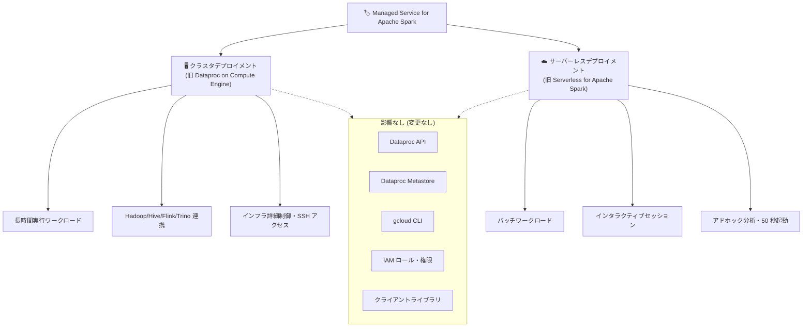

# Managed Service for Apache Spark: ブランド統合の正式発表

**リリース日**: 2026-04-28

**サービス**: Dataplex / Dataproc

**機能**: Managed Service for Apache Spark ブランド統合

**ステータス**: Announcement

📊 [このアップデートのインフォグラフィックを見る](https://takech9203.github.io/google-cloud-news-summary/20260428-managed-service-apache-spark-branding.html)

## 概要

Google Cloud は、Dataproc と Google Cloud Serverless for Apache Spark を「Managed Service for Apache Spark」という単一のアンブレラブランドに統合したことを正式に発表した。この変更により、Google Cloud が提供するすべてのマネージド Spark デプロイメントオプションが 1 つのブランド名の下に集約され、Spark 関連の全機能を包含する統一的なサービスブランドが確立された。

今回の変更は純粋なブランディング統合であり、既存の機能は一切削除されない。Dataproc API、メタストア、クライアントライブラリ、CLI、IAM の名称への影響もない。既存ユーザーはコード変更やインフラ設定の修正を行うことなく、そのまま利用を継続できる。データエンジニアや Solutions Architect にとっては、Google Cloud の Spark サービスポートフォリオの全体像が把握しやすくなり、ワークロードに応じた最適なデプロイメントオプションの選択が容易になる。

**アップデート前の課題**

- Dataproc on Compute Engine (クラスタベース) と Serverless for Apache Spark (サーバーレス) が別々の製品名で提供されており、Google Cloud の Spark 機能群の全体像が分かりにくかった
- 新規ユーザーがワークロードに最適な Spark デプロイメントオプションを選定する際に、製品間の関係性が不明確だった
- ドキュメントやマーケティング資料で異なるブランド名が混在しており、統一されたメッセージングが困難だった

**アップデート後の改善**

- 「Managed Service for Apache Spark」という単一ブランドにより、Google Cloud のマネージド Spark 機能の全体像が一目で把握できるようになった
- クラスタデプロイメント (旧 Dataproc on Compute Engine) とサーバーレスデプロイメント (旧 Serverless for Apache Spark) が明確に 1 つのブランドの下に位置づけられた
- 既存の API、メタストア、CLI、クライアントライブラリ、IAM 名はすべて変更なし。移行作業は一切不要

## アーキテクチャ図

新ブランド「Managed Service for Apache Spark」は、クラスタデプロイメントとサーバーレスデプロイメントの両方を包含するアンブレラブランドである。技術的なインターフェース (API、メタストア、CLI、IAM) は既存のまま維持される。

## サービスアップデートの詳細

### 主要機能

1. **ブランド統合の範囲**
   - Dataproc on Compute Engine と Google Cloud Serverless for Apache Spark が 1 つの「Managed Service for Apache Spark」ブランドに統合
   - Google Cloud のマネージド Spark デプロイメントオプションの全範囲をカバー
   - Google Cloud コンソール上でも統合されたエントリポイント (`console.cloud.google.com/dataproc/overview`) が提供される

2. **クラスタデプロイメント (旧 Dataproc on Compute Engine)**
   - Compute Engine VM 上でマネージド Spark/Hadoop クラスタを提供
   - Spark、Hive、Flink、Trino、Kafka 等のオープンソースフレームワークをサポート
   - Flexible VM、Cluster Scheduled Stop、Zero-scale clusters 等の最新機能を含む
   - YARN ベースのリソース管理、SSH アクセス、詳細なインフラ制御が可能

3. **サーバーレスデプロイメント (旧 Serverless for Apache Spark)**
   - フルマネージドのサーバーレス実行環境で Spark ジョブを提供
   - Standard / Premium の 2 つのティアを提供
   - Premium ティアでは Lightning Engine による高速クエリ実行、GPU サポート、Extended Memory 等の高度な機能を利用可能
   - 起動時間約 50 秒、オートスケーリング対応、カスタムコンテナサポート

## 技術仕様

### デプロイメントオプションの比較

| 項目 | クラスタデプロイメント | サーバーレスデプロイメント |
|------|------------------------|---------------------------|
| 管理モデル | クラスタベース (ユーザーがプロビジョニング) | フルマネージド、サーバーレス |
| 起動時間 | 約 120 秒 | 約 50 秒 |
| 処理フレームワーク | Spark, Hive, Flink, Trino, Kafka | Spark (バッチ + インタラクティブ) |
| GPU サポート | あり | あり (Premium ティア) |
| インタラクティブセッション | なし | あり |
| カスタムコンテナ | なし | あり |
| SSH アクセス | あり | なし |
| リソース管理 | YARN | サーバーレス |
| 課金モデル | クラスタ稼働時間ベース + ライセンス料 | ジョブ実行時間ベース (DCU) |
| CUD 適用 | Compute Engine CUD | BigQuery spend-based CUD |
| ロケーション | ゾーナル | リージョナル |

### 変更の影響範囲

| 項目 | 影響 |
|------|------|
| Dataproc API | 変更なし |
| Dataproc Metastore | 変更なし |
| gcloud CLI | 変更なし |
| クライアントライブラリ | 変更なし |
| IAM ロール/権限名 | 変更なし |
| 既存ワークロード | 影響なし |
| 課金体系 | 変更なし |
| Terraform / IaC リソース名 | 変更なし |

## メリット

### ビジネス面

- **統一されたサービスポートフォリオ**: Google Cloud の Spark 機能群が 1 つのブランドに集約され、社内での理解と意思決定が容易になる
- **サービス選定の明確化**: ワークロード特性に応じて「クラスタデプロイメント」と「サーバーレスデプロイメント」を比較検討しやすくなり、最適なアーキテクチャ選択が促進される
- **マーケットポジショニングの強化**: 競合他社のマネージド Spark サービスと比較する際に、Google Cloud の包括的な Spark ソリューションを明確に示せる

### 技術面

- **ゼロインパクト**: API、メタストア、CLI、IAM 名がすべて既存のまま維持されるため、コードやインフラ設定の変更は一切不要
- **既存機能の完全保持**: すべての既存機能 (Flexible VM、Zero-scale clusters、Lightning Engine 等) がそのまま利用可能
- **運用継続性**: 現在稼働中のクラスタやサーバーレスジョブに影響なし

## デメリット・制約事項

### 制限事項

- 今回の変更はブランディングのみであり、新しい技術的機能の追加は含まれない
- API やリソース名は Dataproc ベースの名前のまま維持されるため、ブランド名 (Managed Service for Apache Spark) と API 名 (Dataproc) の間に不一致が存在する

### 考慮すべき点

- 社内ドキュメント、Wiki、トレーニング資料で「Dataproc」や「Serverless for Apache Spark」を参照している箇所について、新ブランド名への段階的な更新を計画するとよい
- 今後の Google Cloud コンソール UI やドキュメントが新ブランド名に移行していくことが予想されるため、チームメンバーへの周知が推奨される
- IaC (Terraform、Pulumi 等) のリソース名は変更されないため、コメントやドキュメント上のみの更新で十分

## ユースケース

### ユースケース 1: 新規 Spark プロジェクトのデプロイメント選定

**シナリオ**: データプラットフォームチームが新しいデータレイクハウス基盤を構築する際に、Managed Service for Apache Spark の中から最適なデプロイメントオプションを選択する。

**効果**: 統一ブランドの下で「クラスタデプロイメント = 長期稼働、Hadoop エコシステム連携、インフラ制御」と「サーバーレスデプロイメント = オンデマンド実行、高速起動、NoOps」の比較が容易になり、ワークロード特性に基づいた合理的な選択が可能になる。

### ユースケース 2: 既存 Dataproc ユーザーのブランド移行対応

**シナリオ**: 大規模な Dataproc クラスタを運用中の組織が、ブランド変更に伴う対応を確認する。

**効果**: API、メタストア、CLI、IAM 名に変更がないため、Terraform モジュール、CI/CD パイプライン、モニタリング設定等のインフラコードは一切変更不要。社内ドキュメントの用語更新のみで対応完了。

## 料金

ブランド統合に伴う料金体系の変更はない。

- **クラスタデプロイメント**: vCPU あたり 1 セント/時間の Managed Service for Apache Spark ライセンス料 + Compute Engine インフラ費用。秒単位課金 (最低 1 分)
- **サーバーレスデプロイメント Standard ティア**: ジョブ実行中に消費された DCU に基づく課金。起動・シャットダウン時間は課金対象外
- **サーバーレスデプロイメント Premium ティア**: Premium DCU レートでの課金。Lightning Engine、Extended Memory、GPU サポート等の高度な機能を包含

詳細は [Dataproc 料金ページ](https://cloud.google.com/dataproc/pricing) および [Serverless for Apache Spark 料金ページ](https://cloud.google.com/dataproc-serverless/pricing) を参照。

## 利用可能リージョン

Managed Service for Apache Spark は Google Cloud の全リージョンで利用可能。クラスタデプロイメントはゾーナル構成、サーバーレスデプロイメントはリージョナル構成をサポートする。ブランド変更によるリージョン利用可能範囲への影響はない。

## 関連サービス・機能

- **BigQuery**: Spark-BigQuery コネクタにより Spark から BigQuery データへの直接アクセスが可能。BigQuery Studio ノートブックからサーバーレス Spark セッションを利用可能
- **Dataproc Metastore**: Apache Hive メタストアのマネージドサービス。クラスタデプロイメントと連携してテーブルメタデータを管理 (今回の変更で影響なし)
- **Cloud Composer**: Apache Airflow ワークフローから Spark バッチジョブのスケジュール実行が可能
- **Dataplex**: データガバナンスとデータ管理のレイヤーとして、Managed Service for Apache Spark と連携
- **Cloud Storage**: Spark ワークロードのデータストレージとして利用。BigLake テーブルとの連携も可能
- **Cloud Monitoring / Cloud Logging**: Spark ワークロードのモニタリング、ログ管理、アラート設定

## 参考リンク

- 📊 [インフォグラフィック](https://takech9203.github.io/google-cloud-news-summary/20260428-managed-service-apache-spark-branding.html)
- [公式リリースノート](https://docs.cloud.google.com/release-notes#April_28_2026)
- [Dataproc ドキュメント](https://docs.cloud.google.com/dataproc/docs)
- [Managed Service for Apache Spark 概要](https://docs.cloud.google.com/dataproc/docs/concepts/overview)
- [デプロイメントオプションの比較](https://docs.cloud.google.com/dataproc-serverless/docs/concepts/dataproc-compare)
- [サーバーレスデプロイメントのティア](https://docs.cloud.google.com/dataproc-serverless/docs/tiers)
- [Dataproc 料金ページ](https://cloud.google.com/dataproc/pricing)
- [Serverless for Apache Spark 料金ページ](https://cloud.google.com/dataproc-serverless/pricing)

## まとめ

今回の「Managed Service for Apache Spark」ブランド統合は、Google Cloud のマネージド Spark サービスの製品ポジショニングを明確化する戦略的なブランディング変更である。既存の API、メタストア、CLI、IAM 名には一切影響がなく、現在運用中のワークロードはそのまま継続利用できる。既存ユーザーは社内ドキュメントの用語更新を計画し、新規ユーザーは統一ブランドを起点にワークロード特性に最適なデプロイメントオプション (クラスタ or サーバーレス) を選定することを推奨する。

---

**タグ**: #Dataproc #Apache-Spark #Managed-Service-for-Apache-Spark #Serverless-for-Apache-Spark #ブランド統合 #Dataplex #BigData
