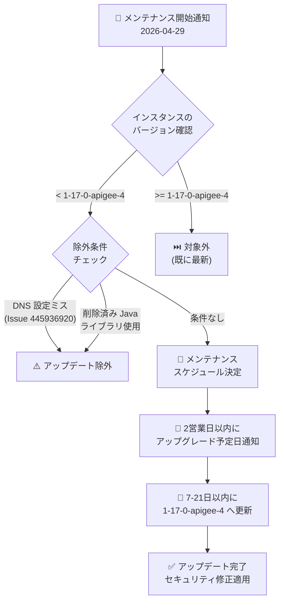

# Apigee X: メンテナンスアップデート (バージョン 1-17-0-apigee-4)

**リリース日**: 2026-04-29

**サービス**: Apigee X

**機能**: Maintenance Update to version 1-17-0-apigee-4

**ステータス**: Announcement

📊 [このアップデートのインフォグラフィックを見る](https://takech9203.github.io/google-cloud-news-summary/20260429-apigee-x-maintenance-1-17-0-4.html)

## 概要

2026年4月29日、Google Cloud は Apigee X のメンテナンスウィンドウが設定されたインスタンスに対して、バージョン 1-17-0-apigee-4 へのメンテナンスアップデートを開始しました。現在のインスタンスバージョンが 1-17-0-apigee-4 未満のインスタンスは、今後7日から21日以内にアップデートが適用されます。

このアップデートには、インフラストラクチャおよびライブラリの更新に加え、複数のセキュリティ脆弱性 (CVE-2025-61726、CVE-2025-61728、CVE-2025-61730、CVE-2025-61731、CVE-2025-61732、CVE-2026-24051、CVE-2026-25765) への修正が含まれています。バージョン 1-17-0-apigee-4 は2026年3月10日にリリースされたバージョンであり、今回はメンテナンスウィンドウを設定済みのインスタンスに対するスケジュール配信の開始を告知するものです。

なお、DNS 設定ミスが存在するインスタンス (Known Issue 445936920) や、2025年10月16日のリリースノートに記載された削除済み Apigee Java ライブラリを使用しているインスタンスは、アップデートの対象外となります。

**アップデート前の課題**

- メンテナンスウィンドウが設定されたインスタンスが、最新のセキュリティパッチおよびインフラストラクチャ改善を受けていない状態にある
- 複数の CVE 脆弱性が未修正の状態で運用されている可能性がある
- バージョン 1-17-0-apigee-3 以前で発生していたメモリリーク、TLS ハンドシェイクエラー、Netty アップグレード後の URI パースエラーが未修正の環境が存在する

**アップデート後の改善**

- セキュリティ脆弱性 7件 (CVE) が修正され、インフラストラクチャのセキュリティが強化される
- インフラストラクチャおよびライブラリが最新化され、パフォーマンスと安定性が向上する
- メンテナンスウィンドウの設定により、業務への影響を最小限にしつつ計画的にアップデートが適用される

## アーキテクチャ図



Apigee メンテナンスアップデートの適用フロー。メンテナンスウィンドウが設定されたインスタンスに対して、バージョン確認と除外条件チェックを経て、スケジュールに基づきアップデートが適用されます。

## サービスアップデートの詳細

### 主要機能

1. **スケジュールメンテナンスの自動適用**
   - メンテナンスウィンドウが設定されたインスタンスに対して、7〜21日以内にバージョン 1-17-0-apigee-4 へのアップデートが自動適用される
   - アップグレード予定日は2営業日以内にメール通知で送付される
   - Week 1 設定のインスタンスは少なくとも1週間前に通知、Week 2 設定は少なくとも2週間前に通知

2. **セキュリティ修正 (バージョン 1-17-0-apigee-4 の内容)**
   - CVE-2025-61726、CVE-2025-61728、CVE-2025-61730、CVE-2025-61731、CVE-2025-61732 の修正
   - CVE-2026-24051、CVE-2026-25765 の修正
   - Apigee インフラストラクチャ全体のセキュリティ強化

3. **除外条件による保護**
   - DNS 設定ミスがあるインスタンス (Known Issue 445936920) は自動アップデートの対象外
   - 削除済み Apigee Java ライブラリを使用しているインスタンスは対象外
   - これにより、アップデートによる予期しない障害を防止

## 技術仕様

### メンテナンスウィンドウの設定オプション

| 項目 | 詳細 |
|------|------|
| メンテナンスウィンドウ | 曜日 + 開始時刻 (UTC) |
| アップデート順序 | Week 1 または Week 2 |
| 通知タイミング | Week 1: 1週間前以上、Week 2: 2週間前以上 |
| アップデート所要時間 | 数時間 (構成により異なる) |
| ウィンドウ数制限 | インスタンスごとに1つのみ |
| 複数インスタンスの間隔 | 同一組織内では12時間以上の間隔を推奨 |

### メンテナンスウィンドウの設定

```bash
AUTH="Authorization: Bearer $(gcloud auth print-access-token)"
curl -X PATCH \
  -H "$AUTH" \
  -H "Content-Type: application/json" \
  -d '{
    "maintenanceUpdatePolicy": {
      "maintenanceWindows": [
        {
          "day": "SUNDAY",
          "startTime": {
            "hours": 23
          }
        }
      ],
      "maintenanceChannel": "WEEK1"
    }
  }' \
  "https://apigee.googleapis.com/v1/organizations/ORG_ID/instances/INSTANCE_ID?updateMask=maintenanceUpdatePolicy.maintenanceWindows,maintenanceUpdatePolicy.maintenanceChannel"
```

## 設定方法

### 前提条件

1. Apigee Organization Admin ロール (`roles/apigee.admin`) または `apigee.instances.update` 権限を持つロールが必要
2. Apigee インスタンスが作成済みであること
3. メンテナンス通知を受信するには、事前にオプトインが必要

### 手順

#### ステップ 1: 現在のメンテナンス設定とスケジュールの確認

```bash
AUTH="Authorization: Bearer $(gcloud auth print-access-token)"
curl -H "$AUTH" \
  "https://apigee.googleapis.com/v1/organizations/ORG_ID/instances/INSTANCE_ID"
```

レスポンスの `scheduledMaintenance` フィールドで予定されたメンテナンスの開始時刻を、`maintenanceUpdatePolicy` フィールドで現在の設定を確認できます。

#### ステップ 2: メンテナンス通知のオプトイン

1. Google Cloud コンソールで「ユーザー設定 > コミュニケーション」ページに移動
2. 「Apigee, Maintenance window」の行で、メールのラジオボタンを「オン」に設定

通知を受信する各ユーザーが個別にオプトインする必要があります。

#### ステップ 3: 除外条件の確認

DNS 設定ミスや削除済み Java ライブラリの使用がないか確認し、該当する場合は事前に修正を行ってください。

## メリット

### ビジネス面

- **計画的なダウンタイム管理**: メンテナンスウィンドウにより、トラフィックが少ない時間帯にアップデートをスケジュール可能
- **事前通知による準備時間の確保**: 2営業日以内に通知が届くため、チーム間の調整やテストの計画が可能

### 技術面

- **セキュリティ強化**: 7件の CVE 脆弱性が修正され、API 基盤のセキュリティレベルが向上
- **段階的ロールアウト**: Week 1/Week 2 の設定により、本番前にステージング環境で動作確認が可能
- **自動適用**: 手動でのバージョンアップ作業が不要

## デメリット・制約事項

### 制限事項

- メンテナンス中は新規インスタンス作成、環境のアタッチ、エンドポイントアタッチメント作成、スケーリング操作ができない
- メンテナンスの正確な所要時間は事前に見積もれない (通常は数時間)
- DNS 設定ミスのあるインスタンスはアップデートが適用されず、手動対応が必要

### 考慮すべき点

- メンテナンスウィンドウの設定変更は、進行中または予定済みのメンテナンスには適用されず、次回以降に反映される
- セキュリティ上の緊急性がある場合、Google がメンテナンスウィンドウ外でアップデートを適用する可能性がある
- Known Issue 445936920 (DNS 設定ミス) に該当するインスタンスは、DNS 設定を修正しない限りアップデートが適用されない

## ユースケース

### ユースケース 1: 本番環境の段階的アップデート

**シナリオ**: EC サイトを運営する企業が、本番環境の Apigee インスタンスを安全にアップデートしたい。トラフィックのピークは平日日中で、日曜深夜が最もトラフィックが少ない。

**実装例**:
```
開発環境: メンテナンスウィンドウ未設定 (最初にアップデート適用)
ステージング環境: Week 1、日曜 23:00 UTC
本番環境: Week 2、日曜 23:00 UTC
```

**効果**: 開発環境で先にアップデートが適用され、動作確認後にステージング、本番と段階的に展開できる。問題発見時に本番への影響を最小化できる。

### ユースケース 2: メンテナンス通知による運用チームの対応

**シナリオ**: 複数のリージョンに Apigee インスタンスを展開している企業が、メンテナンス予定を把握し、モニタリング強化の計画を立てたい。

**効果**: 2営業日以内に届く通知メールにより、運用チームはメンテナンス日時を把握し、監視体制の強化や関係者への事前連絡を行える。

## 料金

Apigee X のメンテナンスアップデートに追加料金は発生しません。Apigee X の料金体系については公式料金ページを参照してください。

## 関連サービス・機能

- **Apigee メンテナンスウィンドウ管理**: メンテナンスの曜日・時刻・順序を設定する機能
- **Cloud Monitoring**: メンテナンス中および前後のインスタンス状態を監視
- **Cloud Logging**: メンテナンス関連のログ確認、DNS 設定エラーの検出
- **IAM (Identity and Access Management)**: メンテナンス設定に必要な権限管理

## 参考リンク

- 📊 [インフォグラフィック](https://takech9203.github.io/google-cloud-news-summary/20260429-apigee-x-maintenance-1-17-0-4.html)
- [公式リリースノート](https://cloud.google.com/release-notes#April_29_2026)
- [Maintenance overview](https://cloud.google.com/apigee/docs/api-platform/system-administration/maintenance)
- [Manage Apigee instance maintenance windows](https://cloud.google.com/apigee/docs/api-platform/system-administration/maintenance-windows)
- [Known Issues](https://cloud.google.com/apigee/docs/release/known-issues)
- [Apigee リリースノート](https://cloud.google.com/apigee/docs/release/release-notes)
- [Apigee 料金ページ](https://cloud.google.com/apigee/pricing)

## まとめ

今回のメンテナンスアップデートは、メンテナンスウィンドウを設定済みの Apigee X インスタンスに対してバージョン 1-17-0-apigee-4 を計画的に適用するものです。7件のセキュリティ脆弱性修正を含む重要なアップデートであるため、DNS 設定ミスや削除済み Java ライブラリの使用がないか事前に確認し、メンテナンス通知のオプトインを行った上で、段階的なロールアウト戦略 (開発 → ステージング → 本番) を採用することを推奨します。

---

**タグ**: #Apigee #APIManagement #Maintenance #Security #CVE #Infrastructure
