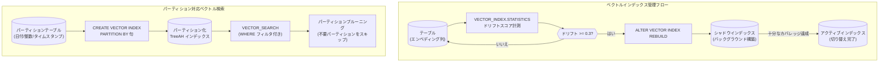

# BigQuery: ベクトルインデックスの機能強化 (ドリフト統計 / パーティション対応)

**リリース日**: 2026-04-29

**サービス**: BigQuery

**機能**: Vector Index のドリフト統計・リビルド機能、およびパーティション対応

**ステータス**: GA (一般提供)

[このアップデートのインフォグラフィックを見る](https://takech9203.github.io/google-cloud-news-summary/20260429-bigquery-vector-index-enhancements.html)

## 概要

BigQuery のベクトルインデックスに関する 2 つの重要な機能が GA (一般提供) となった。1 つ目は `VECTOR_INDEX.STATISTICS` 関数によるインデックスのデータドリフト計測と `ALTER VECTOR INDEX REBUILD` によるダウンタイムなしのインデックス再構築機能、2 つ目は `CREATE VECTOR INDEX` ステートメントの `PARTITION BY` 句による TreeAH ベクトルインデックスのパーティション対応である。

これらの機能は、大規模なベクトル検索ワークロードにおいて、検索精度 (Recall) の維持と I/O コストの削減を実現する。特にデータが頻繁に更新されるテーブルや、時系列・カテゴリ別にデータが分割されているテーブルでのベクトル検索パフォーマンスが大幅に改善される。

対象ユーザーは、BigQuery でベクトル検索 (類似検索、セマンティック検索、レコメンデーション) を活用しているデータエンジニア、ML エンジニア、および Solutions Architect である。

**アップデート前の課題**

- ベクトルインデックス作成後にテーブルデータが大幅に変更されると、データ分布のドリフトによりインデックスの検索精度 (Recall) が低下していたが、ドリフトの程度を定量的に把握する手段がなかった
- インデックスの精度を回復するには、インデックスを DROP して再作成する必要があり、再作成中はインデックスが利用できなかった (ダウンタイムが発生)
- TreeAH ベクトルインデックスではパーティションプルーニングが利用できず、ベクトル検索時にすべてのデータをスキャンする必要があり I/O コストが高かった

**アップデート後の改善**

- `VECTOR_INDEX.STATISTICS` 関数でデータドリフトを 0〜1 の数値で定量的に計測可能になった (0.3 以上で再構築が推奨)
- `ALTER VECTOR INDEX REBUILD` によりダウンタイムなし (シャドウインデックス方式) でインデックスを再構築できるようになった
- TreeAH ベクトルインデックスにパーティションを適用でき、パーティションプルーニングによる I/O コスト削減と検索結果の精度向上が実現した

## アーキテクチャ図



上図は、ベクトルインデックスのドリフト検出から再構築までのフロー (上段) と、パーティション対応による効率的なベクトル検索の仕組み (下段) を示している。

## サービスアップデートの詳細

### 主要機能

1. **VECTOR_INDEX.STATISTICS 関数 (データドリフト計測)**
   - インデックス作成時点と現在のテーブルデータ間のドリフトを FLOAT64 値 (範囲: 0〜1) で返す
   - 値が低いほどドリフトが少なく、0.3 以上で再構築が推奨される
   - テーブルにアクティブなインデックスがない場合は空の結果を返す
   - インデックスのトレーニングが未完了の場合は NULL を返す
   - 必要な IAM ロール: BigQuery Data Editor (`roles/bigquery.dataEditor`) または BigQuery Data Owner (`roles/bigquery.dataOwner`)

2. **ALTER VECTOR INDEX REBUILD (ダウンタイムなし再構築)**
   - シャドウインデックス方式: バックグラウンドで新しいインデックスを構築し、十分なカバレッジに達した時点でアクティブインデックスとして昇格
   - 再構築中も既存のインデックスが利用可能 (ダウンタイムなし)
   - `INFORMATION_SCHEMA.VECTOR_INDEXES` ビューで再構築の進行状況をモニタリング可能
   - `BQ.CANCEL_INDEX_ALTERATION` システムプロシージャで再構築をキャンセル可能

3. **TreeAH ベクトルインデックスのパーティション対応**
   - `CREATE VECTOR INDEX` ステートメントの `PARTITION BY` 句でパーティションを指定
   - パーティションプルーニングにより、フィルタに一致するパーティションのみスキャンし I/O コストを削減
   - プレフィルタリング時に検索結果の漏れが発生しにくくなる
   - 対応パーティションタイプ: DATE、DATETIME、TIMESTAMP (TIMESTAMP_TRUNC)、INTEGER RANGE (RANGE_BUCKET)、取り込み時間 (_PARTITIONTIME)

## 技術仕様

### VECTOR_INDEX.STATISTICS 関数

| 項目 | 詳細 |
|------|------|
| 構文 | `SELECT * FROM VECTOR_INDEX.STATISTICS(TABLE dataset.table_name)` |
| 戻り値 | FLOAT64 (範囲: 0〜1) |
| 推奨再構築閾値 | 0.3 以上 |
| 必要権限 | `roles/bigquery.dataEditor` または `roles/bigquery.dataOwner` |

### ALTER VECTOR INDEX REBUILD

| 項目 | 詳細 |
|------|------|
| 構文 | `ALTER VECTOR INDEX IF EXISTS index_name ON dataset.table REBUILD` |
| 再構築方式 | シャドウインデックス (バックグラウンド) |
| ダウンタイム | なし |
| モニタリング | `INFORMATION_SCHEMA.VECTOR_INDEXES` (last_index_alteration_info) |
| キャンセル | `BQ.CANCEL_INDEX_ALTERATION` プロシージャ |

### パーティション対応の制限事項

| 項目 | 詳細 |
|------|------|
| 対応インデックスタイプ | TreeAH のみ (IVF は非対応) |
| 自動生成エンベディング列 | パーティションインデックス作成不可 |
| PARTITION BY 句 | テーブルの PARTITION BY と同じ指定が必要 |
| ストレージ | 整数範囲/時間単位パーティションではパーティション列がインデックスに格納されストレージコスト増 |

## 設定方法

### 前提条件

1. BigQuery Enterprise Edition 以上のリザベーション (インデックス利用には Standard Edition では不可)
2. テーブルサイズが 10 MB 以上 (それ未満ではインデックスが作成されない)
3. BigQuery Data Editor または Data Owner の IAM ロール

### 手順

#### ステップ 1: データドリフトの確認

```sql
-- インデックス付きテーブルのデータドリフトを確認
SELECT * FROM VECTOR_INDEX.STATISTICS(TABLE my_dataset.my_table);
```

戻り値が 0.3 以上の場合、インデックスの再構築を検討する。

#### ステップ 2: ベクトルインデックスの再構築

```sql
-- ダウンタイムなしでベクトルインデックスを再構築
ALTER VECTOR INDEX IF EXISTS my_index ON my_dataset.my_table REBUILD;
```

再構築はバックグラウンドで実行され、シャドウインデックスが十分なカバレッジに達した時点で自動的にアクティブインデックスに昇格する。

#### ステップ 3: 再構築の進行状況モニタリング

```sql
-- 再構築のステータスとカバレッジを確認
SELECT
  table_name,
  index_name,
  last_index_alteration_info.status AS status,
  last_index_alteration_info.new_coverage_percentage AS coverage
FROM my_project.my_dataset.INFORMATION_SCHEMA.VECTOR_INDEXES;
```

#### ステップ 4: パーティション付きベクトルインデックスの作成

```sql
-- 日付パーティションテーブルの作成
CREATE TABLE my_dataset.my_table(
  embeddings ARRAY<FLOAT64>,
  id INT64,
  date DATE
) PARTITION BY date;

-- パーティション付き TreeAH ベクトルインデックスの作成
CREATE VECTOR INDEX my_index
ON my_dataset.my_table(embeddings)
PARTITION BY date
OPTIONS(index_type='TREE_AH', distance_type='COSINE');
```

#### ステップ 5: パーティションプルーニングを活用したベクトル検索

```sql
-- WHERE 句でパーティション列をフィルタし、プルーニングを有効化
SELECT query.id, base.id, distance
FROM VECTOR_SEARCH(
  (SELECT * FROM my_dataset.my_table WHERE date = '2026-04-01'),
  'embeddings',
  TABLE my_dataset.query_table,
  distance_type => 'COSINE',
  top_k => 10
);
```

## メリット

### ビジネス面

- **運用コスト削減**: パーティションプルーニングにより不要なデータスキャンを回避し、オンデマンド料金 (バイトスキャン課金) を直接削減できる
- **サービス可用性の向上**: ダウンタイムなしのインデックス再構築により、ベクトル検索サービスの SLA を維持しながらインデックスの鮮度を保てる
- **データ品質管理の定量化**: ドリフトスコアにより、インデックスのメンテナンスタイミングを数値基準で判断でき、運用の属人化を防止

### 技術面

- **検索精度 (Recall) の維持**: データ変更に追従してインデックスを再構築できるため、Approximate Nearest Neighbor 検索の精度劣化を防止
- **I/O 効率の向上**: パーティションプルーニングにより、大規模テーブルでも対象パーティションのみスキャンでき、レイテンシと処理コストを削減
- **シャドウインデックス方式**: 再構築中も既存インデックスが有効なため、検索クエリのパフォーマンスに影響を与えない

## デメリット・制約事項

### 制限事項

- パーティション対応は TreeAH インデックスのみ (IVF インデックスでは利用不可)
- 自動生成エンベディング列にはパーティション付きインデックスを作成できない
- パーティション列をインデックスに格納する場合 (整数範囲/時間単位)、ストレージコストが増加する
- テーブルサイズが 10 MB 未満の場合、ベクトルインデックス自体が無効化される
- Standard Edition ではインデックスの利用がサポートされない

### 考慮すべき点

- パーティション化されたインデックスは、大部分のクエリが少数のパーティションに絞り込まれるユースケースで最も効果的。全パーティションをスキャンするクエリではメリットが限定的
- インデックス再構築はバックグラウンドスロットを消費するため、リザベーションのスロット容量に余裕が必要
- ドリフトスコアが 0.3 未満でも、ユースケースによっては再構築が有効な場合がある (精度要件が高い場合など)

## ユースケース

### ユースケース 1: EC サイトの商品レコメンデーション (日次データ更新)

**シナリオ**: 数百万点の商品エンベディングを持つテーブルに毎日新商品が追加され、既存商品の情報も更新される。日次バッチでドリフトをチェックし、必要に応じてインデックスを再構築する。

**実装例**:
```sql
-- 日次バッチジョブ: ドリフトチェック + 条件付き再構築
DECLARE drift_score FLOAT64;
SET drift_score = (
  SELECT * FROM VECTOR_INDEX.STATISTICS(TABLE ecommerce.products)
);

-- ドリフトが閾値を超えた場合に再構築
IF drift_score >= 0.3 THEN
  ALTER VECTOR INDEX IF EXISTS product_embedding_idx
  ON ecommerce.products REBUILD;
END IF;
```

**効果**: 検索精度の劣化を自動検知・修復し、レコメンデーション品質を維持。ダウンタイムなしで再構築されるため、ユーザー体験に影響しない。

### ユースケース 2: 時系列ログデータのセマンティック検索

**シナリオ**: 日付パーティションされたログテーブルに対し、直近 7 日間のログから類似イベントを検索する。パーティション付きインデックスにより、検索対象を限定して I/O コストを削減する。

**実装例**:
```sql
-- 日付パーティション付き TreeAH インデックス
CREATE VECTOR INDEX log_embedding_idx
ON observability.logs(embedding)
PARTITION BY log_date
OPTIONS(index_type='TREE_AH', distance_type='COSINE');

-- 直近 7 日間のみを対象としたセマンティック検索
SELECT base.log_id, base.message, distance
FROM VECTOR_SEARCH(
  (SELECT * FROM observability.logs
   WHERE log_date BETWEEN '2026-04-22' AND '2026-04-29'),
  'embedding',
  TABLE observability.query_embeddings,
  top_k => 5
);
```

**効果**: パーティションプルーニングにより 7 日分のデータのみスキャンし、全期間スキャンと比較して I/O コストを大幅に削減。

## 料金

BigQuery のベクトルインデックスの料金は以下の要素で構成される。

- **インデックス構築・更新**: 組織あたりのインデックス対象テーブル合計サイズが上限以下であれば無料。上限を超える場合は独自リザベーションが必要
- **ベクトル検索クエリ**: BigQuery のコンピュート料金 (オンデマンドまたは Editions) に基づく
- **インデックスストレージ**: アクティブストレージ料金が適用

詳細は [BigQuery の料金ページ](https://cloud.google.com/bigquery/pricing) を参照。

## 関連サービス・機能

- **Vertex AI Vector Search**: 超低レイテンシのオンラインベクトル検索が必要な場合の補完サービス。BigQuery からエンベディングをエクスポートして利用可能
- **VECTOR_SEARCH 関数**: ベクトルインデックスを活用して類似検索を実行する関数
- **AI.SEARCH 関数**: 自然言語クエリから直接セマンティック検索を実行する関数 (自動エンベディング生成と組み合わせ)
- **INFORMATION_SCHEMA.VECTOR_INDEXES**: インデックスのステータス、カバレッジ、再構築状況をモニタリングするビュー
- **BigQuery ML (ML.GENERATE_EMBEDDING)**: エンベディングの生成に使用。Vertex AI のモデルをリモートモデルとして利用

## 参考リンク

- [インフォグラフィック](https://takech9203.github.io/google-cloud-news-summary/20260429-bigquery-vector-index-enhancements.html)
- [公式リリースノート](https://docs.google.com/release-notes#April_29_2026)
- [VECTOR_INDEX.STATISTICS 関数リファレンス](https://docs.cloud.google.com/bigquery/docs/reference/standard-sql/vectorindex_functions#vector_indexstatistics)
- [ベクトルインデックスの再構築](https://docs.cloud.google.com/bigquery/docs/vector-index#rebuild_a_vector_index)
- [ALTER VECTOR INDEX REBUILD ステートメント](https://docs.cloud.google.com/bigquery/docs/reference/standard-sql/data-definition-language#alter_vector_index_rebuild_statement)
- [CREATE VECTOR INDEX ステートメント](https://docs.cloud.google.com/bigquery/docs/reference/standard-sql/data-definition-language#create_vector_index_statement)
- [パーティション付きインデックス](https://docs.cloud.google.com/bigquery/docs/vector-index#partitions)
- [BigQuery 料金](https://cloud.google.com/bigquery/pricing)

## まとめ

BigQuery のベクトルインデックスにおけるドリフト統計・再構築機能とパーティション対応の GA は、大規模ベクトル検索ワークロードの運用品質を大幅に向上させる。特に、データが頻繁に更新される環境での検索精度維持と、パーティションプルーニングによる I/O コスト削減は、本番環境での AI/ML アプリケーション運用に直接的な効果をもたらす。既にベクトルインデックスを利用しているユーザーは、定期的なドリフトチェックの自動化と、適切なパーティション戦略の検討を推奨する。

---

**タグ**: #BigQuery #VectorIndex #VectorSearch #TreeAH #GA #パフォーマンス改善 #コスト最適化
