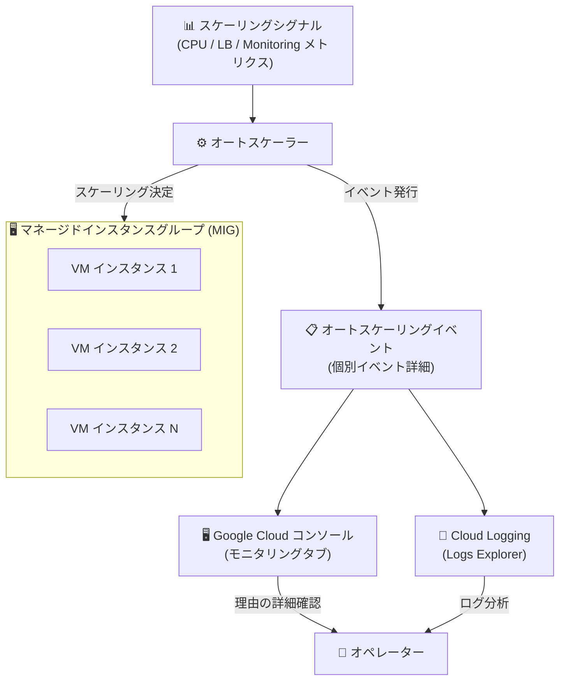

# Compute Engine: オートスケーリングイベントのモニタリング機能

**リリース日**: 2026-04-29

**サービス**: Compute Engine

**機能**: オートスケーリングイベントのモニタリング (Monitor Autoscaling Events)

**ステータス**: Preview

📊 [このアップデートのインフォグラフィックを見る](https://takech9203.github.io/google-cloud-news-summary/20260429-compute-engine-autoscaling-events.html)

## 概要

Compute Engine のオートスケーリングされたマネージドインスタンスグループ (MIG) において、個々のオートスケーリングイベントをモニタリングし、各スケーリング決定の背景にある理由の詳細を確認できる新機能が Preview として提供開始された。

これまでオートスケーラーの動作はグループサイズチャートやログを通じて確認可能だったが、個々のスケーリングイベント単位での詳細な理由確認は容易ではなかった。本機能により、オートスケーラーがなぜスケールアウトまたはスケールインの判断を下したのか、イベントレベルで具体的に把握できるようになる。これは、本番環境のキャパシティ管理やコスト最適化を担当するインフラエンジニア、SRE、DevOps チームにとって大きな価値をもたらす。

**アップデート前の課題**

- オートスケーラーのスケーリング決定の理由を詳細に把握するには、Cloud Logging でリサイズログやステータス変更ログを個別に確認する必要があった
- スケーリングイベント単位で「なぜその判断が行われたか」を直感的に理解するのが困難だった
- 推奨サイズの変更ログ (autoscalingReason) は存在したが、個々のイベントとして体系的にモニタリングする手段が限られていた

**アップデート後の改善**

- 個々のオートスケーリングイベントを独立してモニタリングできるようになった
- 各スケーリング決定の背景にある具体的な理由 (スケーリングシグナル、制限要因など) をイベント単位で確認可能になった
- スケーリング動作のトラブルシューティングやキャパシティプランニングが効率化された

## アーキテクチャ図

オートスケーラーがスケーリングシグナルに基づいて決定を下す際、個々のスケーリングイベントが発行され、Google Cloud コンソールや Cloud Logging を通じて各決定の理由を詳細に確認できる。

## サービスアップデートの詳細

### 主要機能

1. **個別オートスケーリングイベントのモニタリング**
   - オートスケーラーが行う各スケーリング決定をイベントとして個別に追跡可能
   - スケールアウト (インスタンス追加) とスケールイン (インスタンス削除) の両方のイベントを対象

2. **スケーリング決定理由の詳細表示**
   - 各イベントに対して、スケーリング決定の理由が詳細に記録される
   - スケーリングシグナル (CPU 使用率、ロードバランサー利用率、Cloud Monitoring メトリクスなど) の情報
   - スケーリング制限要因 (最大/最小インスタンス数、スケールイン制御、安定化期間) の情報

3. **既存のモニタリング機能との統合**
   - Google Cloud コンソールのモニタリングタブと連携
   - Cloud Logging (Logs Explorer) でのイベント検索・分析が可能
   - 既存のオートスケーラーログ (リサイズログ、ステータス変更ログ) を補完

## 技術仕様

### オートスケーリングイベントで確認可能な情報

| 項目 | 詳細 |
|------|------|
| autoscalingMode | スケーリング時のモード (ON / OFF / ONLY_SCALE_OUT) |
| autoscalingReason.scalingSignal | スケーリング決定に使用されたシグナルの詳細 |
| autoscalingReason.scalingLimit | calculatedSize を制限した要因の詳細 |
| autoscalingReason.summary | スケーリング理由の要約 |
| newSize | 新しい推奨サイズ |
| oldSize | 以前の推奨サイズ |
| calculatedSize | シグナルに基づいて算出されたサイズ |

### スケーリングシグナルの計算詳細

| フィールド | 説明 |
|-----------|------|
| servingSize | 初期化期間中の VM を除いた MIG 内の VM 数 |
| signalTarget | CPU 使用率やメトリクスのターゲット値 |
| signalValue | 現在のシグナル値 |
| singleInstanceAssignment | 各 VM が処理する作業量 (メトリクスベースの場合) |

## メリット

### ビジネス面

- **コスト最適化の促進**: スケーリング決定の理由を理解することで、オートスケーリングポリシーの最適化が容易になり、不必要なスケールアウトによるコスト増を防止できる
- **インシデント対応の高速化**: スケーリング異常の原因特定が迅速になり、MTTR (平均修復時間) の短縮に貢献

### 技術面

- **オートスケーリングポリシーのチューニング**: 実際のスケーリング動作と理由を確認しながら、ターゲット使用率やスケールイン制御のパラメータを最適化できる
- **予測オートスケーリングとの連携理解**: 予測オートスケーリング有効時に、リアクティブシグナルと予測シグナルのどちらが決定に影響したかを確認可能
- **トラブルシューティングの効率化**: 「なぜスケーリングが発生しなかったか」「なぜ予想と異なるサイズにスケーリングされたか」を具体的に把握できる

## デメリット・制約事項

### 制限事項

- Preview 段階のため、GA までに機能の仕様が変更される可能性がある
- Preview 機能は SLA の対象外であり、本番環境での利用は自己責任

### 考慮すべき点

- オートスケーリングイベントのモニタリングにより追加のログが生成されるため、Cloud Logging のコストが若干増加する可能性がある
- 既存のオートスケーラーログ (リサイズログ、ステータス変更ログ) との関係性を理解した上で活用する必要がある

## ユースケース

### ユースケース 1: オートスケーリングポリシーの最適化

**シナリオ**: Web アプリケーションをホストする MIG で、ピーク時に過剰なスケールアウトが発生しコストが増大している。オートスケーリングイベントを確認し、スケーリング決定の理由を分析する。

**効果**: スケーリングシグナルの値とターゲット値の差分を確認し、CPU 使用率のターゲットを 60% から 75% に調整することで、不要なスケールアウトを削減しコストを最適化できる。

### ユースケース 2: スケーリング異常のトラブルシューティング

**シナリオ**: バッチ処理用の MIG でスケールインが期待通りに発生しない。オートスケーリングイベントの詳細を確認し、スケールイン制御 (scale-in controls) や安定化期間が制限要因となっていないか調査する。

**効果**: scalingLimit フィールドから安定化期間が制限要因であることを特定し、必要に応じてスケールイン制御のパラメータを調整することで、リソース解放を適切なタイミングで実行できる。

### ユースケース 3: キャパシティプランニングの改善

**シナリオ**: EC サイトのセール時期に向けて、過去のオートスケーリングイベントを分析し、スケーリングパターンを把握する。

**効果**: 過去のイベント履歴から最大スケールアウト量と頻度を把握し、maxNumReplicas の設定やスケジュールベースのオートスケーリングとの組み合わせを検討できる。

## 料金

オートスケーリングイベントのモニタリング機能自体に追加料金は発生しないと考えられるが、生成されるログに対して Cloud Logging の標準料金が適用される。

詳細は [Compute Engine の料金ページ](https://cloud.google.com/compute/pricing) および [Cloud Logging の料金ページ](https://cloud.google.com/logging/pricing) を参照。

## 関連サービス・機能

- **Cloud Monitoring**: MIG のモニタリングタブで各種メトリクスチャートとオートスケーリングイベントを統合的に確認可能
- **Cloud Logging**: Logs Explorer でオートスケーリングイベントの検索・フィルタリング・分析が可能
- **予測オートスケーリング (Predictive Autoscaling)**: 過去の CPU 使用率パターンから将来の負荷を予測してスケーリング。イベントモニタリングにより予測精度の確認に活用可能
- **スケールイン制御 (Scale-in Controls)**: 急激なスケールインを防止する機能。イベント詳細で制限要因として表示される

## 参考リンク

- 📊 [インフォグラフィック](https://takech9203.github.io/google-cloud-news-summary/20260429-compute-engine-autoscaling-events.html)
- [公式リリースノート](https://docs.cloud.google.com/release-notes#April_29_2026)
- [Monitor autoscaling events ドキュメント](https://docs.cloud.google.com/compute/docs/autoscaler/understanding-autoscaler-decisions#monitor_autoscaling_events)
- [Understanding autoscaler decisions](https://docs.cloud.google.com/compute/docs/autoscaler/understanding-autoscaler-decisions)
- [Viewing autoscaler logs](https://docs.cloud.google.com/compute/docs/autoscaler/viewing-autoscaler-logs)
- [Autoscaling groups of instances](https://docs.cloud.google.com/compute/docs/autoscaler)

## まとめ

Compute Engine のオートスケーリングイベントモニタリング機能は、MIG のスケーリング動作の透明性を大幅に向上させる Preview 機能である。各スケーリング決定の具体的な理由を把握できるようになることで、オートスケーリングポリシーの最適化、コスト管理、障害対応が効率化される。オートスケーリングを利用している環境では、早期にこの機能を試用してスケーリング動作の理解を深めることを推奨する。

---

**タグ**: #ComputeEngine #Autoscaling #MIG #Observability #Monitoring #Preview
