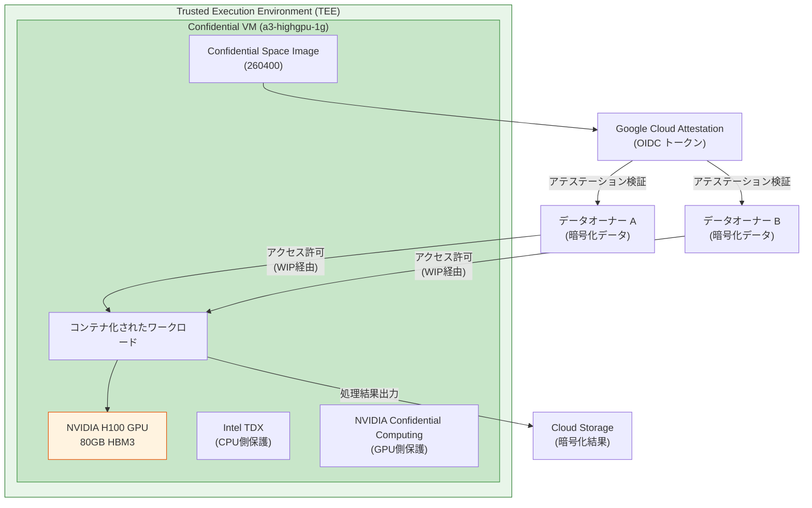

# Confidential Space: H100 GPU (a3-highgpu-1g) サポート GA

**リリース日**: 2026-04-29

**サービス**: Confidential Space (Confidential Computing)

**機能**: H100 GPU (a3-highgpu-1g マシンファミリー) サポートの一般提供開始

**ステータス**: GA (一般提供)

[このアップデートのインフォグラフィックを見る](https://takech9203.github.io/google-cloud-news-summary/20260429-confidential-space-h100-gpu-ga.html)

## 概要

Confidential Space イメージ (260400) がリリースされ、H100 GPU (a3-highgpu-1g マシンファミリー) 上での Confidential Space の実行が一般提供 (GA) となった。これにより、NVIDIA H100 GPU のハードウェアベースの機密コンピューティング機能を活用し、GPU ワークロードをハードウェアレベルで分離した信頼実行環境 (TEE) 上で実行できるようになった。

Confidential Space は、複数の当事者が所有するセンシティブなデータを機密性を保ちながら処理するための隔離環境を提供する。今回の GA により、大規模言語モデル (LLM) の推論やファインチューニングなど、GPU を必要とする機密ワークロードを本番環境で安心して実行できる。

対象ユーザーは、医療データ・金融データ・知的財産などの機密データを GPU で処理する必要がある組織、マルチパーティでのデータ共同分析を行う企業、AI/ML モデルの機密保護を必要とするプロバイダーである。

**アップデート前の課題**

- Confidential Space での GPU ワークロードはプレビュー段階であり、本番環境での利用が保証されていなかった
- GPU を使用する機密 AI/ML ワークロードを信頼実行環境で実行するには、カスタムのセキュリティソリューションを構築する必要があった
- 機密データを扱う GPU 推論ワークロードにおいて、ハードウェアレベルのアテステーション (証明) が GA として提供されていなかった

**アップデート後の改善**

- H100 GPU 上の Confidential Space が GA となり、本番環境での SLA 付きサポートが提供される
- NVIDIA Confidential Computing 技術により、GPU メモリとワークロードがハードウェアレベルで保護される
- Intel TDX による CPU 側の保護と NVIDIA H100 の GPU 側の保護を組み合わせた包括的な機密保護が実現

## アーキテクチャ図



Confidential Space は、Intel TDX と NVIDIA Confidential Computing を組み合わせ、CPU と GPU の両方でハードウェアレベルのワークロード分離を実現する。データオーナーはアテステーションにより、承認されたワークロードのみが機密データにアクセスできることを検証できる。

## サービスアップデートの詳細

### 主要機能

1. **NVIDIA Confidential Computing on H100 GPU**
   - a3-highgpu-1g マシンタイプ (26 vCPU、234 GB メモリ、1x H100 80GB HBM3)
   - Intel TDX による CPU/メモリの保護と NVIDIA H100 のハードウェアベース GPU 保護の組み合わせ
   - GPU アテステーションによるワークロードの整合性検証

2. **Confidential Space イメージ 260400**
   - 新しい Confidential Space ベースイメージの提供
   - Container-Optimized OS ベースのハードニングされた OS
   - 本番用 (`confidential-space`) とデバッグ用 (`confidential-space-debug`) のイメージファミリー

3. **リモートアテステーション**
   - Google Cloud Attestation による OIDC トークンの発行
   - vTPM (仮想 Trusted Platform Module) による測定ベースのブートシーケンス検証
   - ワークロードコンテナイメージのハッシュ検証

## 技術仕様

### a3-highgpu-1g マシンタイプ

| 項目 | 詳細 |
|------|------|
| vCPU 数 | 26 |
| インスタンスメモリ | 234 GB |
| GPU | NVIDIA H100 SXM x 1 |
| GPU メモリ | 80 GB HBM3 |
| ローカル SSD | 750 GiB |
| 最大ネットワーク帯域幅 | 25 Gbps |
| CPU プラットフォーム | Intel Sapphire Rapids |
| 機密コンピューティング技術 | Intel TDX + NVIDIA Confidential Computing |

### サポート対象ゾーン

| ゾーン |
|--------|
| europe-west4-c |
| us-central1-a |
| us-east5-a |

### プロビジョニングモデル

| モデル | 説明 |
|--------|------|
| Spot VM | プリエンプティブルなインスタンス (割込み可能) |
| Flex-start VM | MIG (Managed Instance Group) でのリサイズリクエスト経由 |

## 設定方法

### 前提条件

1. NVIDIA Confidential Computing に対応した GPU クォータの確保
2. Confidential Space 用のサービスアカウントの作成
3. ワークロードコンテナイメージの Artifact Registry への登録
4. ブートディスクサイズ 30 GB 以上の確保 (NVIDIA ドライバーおよび CUDA ツールキット用)

### 手順

#### ステップ 1: Spot VM による Confidential Space インスタンスの作成

```bash
gcloud compute instances create INSTANCE_NAME \
  --provisioning-model=SPOT \
  --confidential-compute-type=TDX \
  --machine-type=a3-highgpu-1g \
  --maintenance-policy=TERMINATE \
  --shielded-secure-boot \
  --image-project=confidential-space-images \
  --image-family=confidential-space \
  --metadata="^~^tee-image-reference=us-docker.pkg.dev/PROJECT_ID/REPO/WORKLOAD:latest~tee-install-gpu-driver=true" \
  --service-account=SA_NAME@PROJECT_ID.iam.gserviceaccount.com \
  --scopes=cloud-platform \
  --boot-disk-size=30G \
  --zone=us-central1-a \
  --project=PROJECT_ID
```

`tee-install-gpu-driver=true` メタデータを設定することで、NVIDIA Confidential Computing に必要なドライバーが自動的にインストールされる。

#### ステップ 2: ワークロード ID プールの設定

```bash
gcloud iam workload-identity-pools create POOL_NAME \
  --location="global" \
  --display-name="Confidential Space Pool"

gcloud iam workload-identity-pools providers create-oidc PROVIDER_NAME \
  --location="global" \
  --workload-identity-pool=POOL_NAME \
  --issuer-uri="https://confidentialcomputing.googleapis.com" \
  --attribute-mapping="google.subject=assertion.sub"
```

データオーナーが Workload Identity Pool を設定し、アテステーション条件に基づいてデータへのアクセスを制御する。

## メリット

### ビジネス面

- **コンプライアンス対応の強化**: 医療 (HIPAA)、金融 (PCI DSS) などの規制要件を満たしつつ GPU ワークロードを実行可能
- **マルチパーティデータ協業の実現**: 複数組織間で機密データを共有せずに GPU ベースの共同分析が可能
- **AI/ML モデルの知的財産保護**: モデルの重みやアルゴリズムをオペレーターからも保護

### 技術面

- **ハードウェアベースの分離**: Intel TDX (CPU) + NVIDIA Confidential Computing (GPU) による二重保護
- **リモートアテステーション**: ワークロードの整合性をハードウェアレベルで暗号学的に検証
- **GA による安定性**: 本番環境向け SLA とサポートの提供

## デメリット・制約事項

### 制限事項

- マルチノードワークロード用のクラスター作成は非サポート
- リザベーション (予約) は非サポート
- Hyperdisk Extreme は非サポート
- ライブマイグレーションは非サポート (メンテナンスポリシーは TERMINATE のみ)
- Spot VM または Flex-start VM でのプロビジョニングが必須

### 考慮すべき点

- GPU アテステーションがインデックス 9 の測定レコード不一致で失敗する既知の問題あり (VM の停止/再起動で回避可能)
- サポートされるゾーンが 3 リージョン (europe-west4-c, us-central1-a, us-east5-a) に限定
- 推奨 OS イメージは ubuntu-2204-lts または cos-tdx-113-lts に限定

## ユースケース

### ユースケース 1: マルチパーティ機密 AI/ML トレーニング

**シナリオ**: 複数の医療機関が患者データを共有せずに、共同で疾病予測 AI モデルをファインチューニングしたい。

**実装例**:
```bash
# 各医療機関のデータは暗号化されて Cloud Storage に保存
# Confidential Space ワークロードのみがアテステーション後にアクセス可能

gcloud compute instances create medical-ai-training \
  --provisioning-model=SPOT \
  --confidential-compute-type=TDX \
  --machine-type=a3-highgpu-1g \
  --image-project=confidential-space-images \
  --image-family=confidential-space \
  --metadata="^~^tee-image-reference=us-docker.pkg.dev/ml-project/repo/federated-training:v1~tee-install-gpu-driver=true" \
  --boot-disk-size=30G \
  --zone=us-central1-a
```

**効果**: 患者データの機密性を保ちながら、H100 GPU の高速処理で大規模モデルのファインチューニングが可能。各医療機関は自身のデータが他者に公開されないことをアテステーションで検証できる。

### ユースケース 2: 機密推論サービス (Confidential Inference)

**シナリオ**: 金融機関が独自の不正検知 AI モデルを第三者のインフラ上で推論サービスとして提供したいが、モデルの重みを公開したくない。

**効果**: モデルの知的財産 (重み、アーキテクチャ) がハードウェアレベルで保護され、インフラオペレーターからも参照不可。H100 の 80GB HBM3 により大規模モデルの効率的な推論が可能。

## 料金

Confidential Space on H100 GPU の料金は、a3-highgpu-1g インスタンスの Spot VM 料金に基づく。Confidential Computing の機能自体に追加料金は発生しないが、対象マシンタイプの利用料金が適用される。

詳細な料金については以下を参照:
- [Compute Engine 料金ページ](https://cloud.google.com/compute/all-pricing#gpus)
- [Confidential Computing 料金](https://cloud.google.com/confidential-computing/pricing)

## 利用可能リージョン

NVIDIA Confidential Computing (a3-highgpu-1g) は以下のゾーンで利用可能:

- europe-west4-c (オランダ)
- us-central1-a (アイオワ)
- us-east5-a (コロンバス)

## 関連サービス・機能

- **Confidential VM**: Confidential Space の基盤となる機密仮想マシン。Intel TDX / AMD SEV による CPU メモリの暗号化を提供
- **Google Cloud Attestation**: ワークロードのリモートアテステーションを検証し、OIDC トークンを発行するサービス
- **Workload Identity Federation**: アテステーショントークンを IAM の認証情報に変換し、保護されたリソースへのアクセスを制御
- **Artifact Registry**: ワークロードコンテナイメージの保管・管理
- **Cloud KMS**: 暗号鍵の管理。データオーナーが暗号鍵へのアクセスをアテステーション条件で制御可能

## 参考リンク

- [インフォグラフィック](https://takech9203.github.io/google-cloud-news-summary/20260429-confidential-space-h100-gpu-ga.html)
- [公式リリースノート](https://cloud.google.com/release-notes#April_29_2026)
- [Confidential Space 概要](https://cloud.google.com/confidential-computing/confidential-space/docs/confidential-space-overview)
- [Confidential Space ワークロードのデプロイ](https://cloud.google.com/confidential-computing/confidential-space/docs/deploy-workloads)
- [Confidential VM サポート構成](https://cloud.google.com/confidential-computing/confidential-vm/docs/supported-configurations)
- [Confidential Space セキュリティ概要](https://cloud.google.com/docs/security/confidential-space)
- [Compute Engine GPU 料金](https://cloud.google.com/compute/all-pricing#gpus)

## まとめ

Confidential Space on H100 GPU の GA は、機密 AI/ML ワークロードを本番環境で実行するための重要なマイルストーンである。Intel TDX と NVIDIA Confidential Computing の組み合わせにより、CPU と GPU の両方でハードウェアレベルの保護が提供され、医療・金融・知的財産保護など、高いセキュリティ要件を持つ GPU ワークロードの実行が可能になった。対象ゾーンが限定的であること、Spot/Flex-start VM でのプロビジョニングが必須であることを考慮し、ワークロードの可用性設計を行うことを推奨する。

---

**タグ**: #ConfidentialComputing #ConfidentialSpace #H100 #GPU #GA #IntelTDX #NVIDIA #a3-highgpu-1g #TEE #MachineLearning #Security
