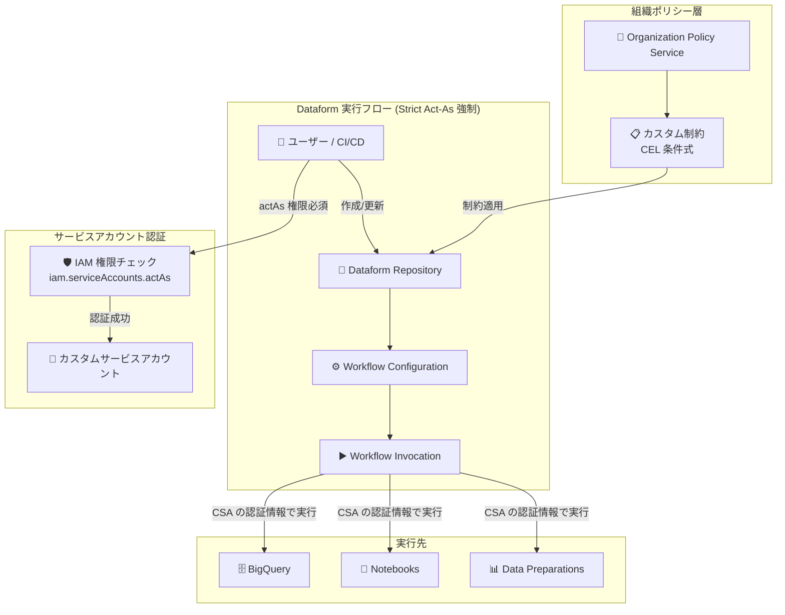

# Dataform: Strict Act-As モードのグローバル強制適用とカスタム組織ポリシー制約の GA

**リリース日**: 2026-04-29

**サービス**: Dataform (BigQuery にも影響)

**機能**: Strict Act-As モードのグローバル強制 / カスタム組織ポリシー制約

**ステータス**: Breaking Change + GA

📊 [このアップデートのインフォグラフィックを見る](https://takech9203.github.io/google-cloud-news-summary/20260429-dataform-strict-act-as-org-policy.html)

## 概要

Dataform において、Strict Act-As モードがすべてのリポジトリに対してグローバルに強制適用されるようになった。これは破壊的変更 (Breaking Change) であり、Dataform ワークフロー、BigQuery パイプライン、ノートブック、データ準備の実行には、カスタムサービスアカウントまたはユーザー認証情報の使用が必須となる。デフォルトの Dataform サービスエージェントのみでのワークフロー実行は不可となった。

同時に、Organization Policy Service のカスタム制約が GA (一般提供) となり、Dataform の Folder および TeamFolder リソースに対して、より細かな制御が可能になった。これにより、組織全体でのガバナンスとセキュリティの統制が強化される。

**アップデート前の課題**

- Strict Act-As モードは任意設定であり、リポジトリ作成時または既存リポジトリの更新時に手動で有効化する必要があった
- デフォルトの Dataform サービスエージェントでワークフローを実行でき、誰がどのサービスアカウントとして実行しているか不明確だった
- 組織ポリシーによる Dataform リソースの制御は、組み込み制約に限定されていた

**アップデート後の改善**

- Strict Act-As モードがグローバルに強制され、すべてのリポジトリで `iam.serviceAccounts.actAs` 権限チェックが有効になった
- カスタムサービスアカウントまたはユーザー認証情報の明示的な設定が必須となり、セキュリティと権限の追跡性が向上した
- カスタム組織ポリシー制約により、Dataform リソースの特定フィールドに対してきめ細かなガバナンス制御が可能になった

## アーキテクチャ図



Strict Act-As モードにより、ユーザーはワークフロー実行時に必ず `iam.serviceAccounts.actAs` 権限を持つ必要があり、カスタムサービスアカウントの認証情報を通じて BigQuery やノートブック等が実行される。組織ポリシーのカスタム制約がリポジトリレベルで追加のガバナンスを提供する。

## サービスアップデートの詳細

### 主要機能

1. **Strict Act-As モードのグローバル強制**
   - すべての Dataform リポジトリに対して自動的に有効化
   - リポジトリの作成・更新、ワークフロー構成の作成・更新、ワークフロー呼び出しの作成、リリース構成の更新時に `iam.serviceAccounts.actAs` 権限チェックが実施される
   - デフォルトの Dataform サービスエージェント単体でのワークフロー実行は不可

2. **カスタムサービスアカウントの必須化**
   - 新規リポジトリ: 作成時にカスタムサービスアカウントを選択
   - ワークフロー構成: 構成ごとにサービスアカウントを指定可能 (未指定時はリポジトリのサービスアカウントを使用)
   - ワークフロー呼び出し: `InvocationConfig` でサービスアカウントを指定可能

3. **カスタム組織ポリシー制約 (GA)**
   - Dataform の 6 種類のリソースに対してカスタム制約を作成可能
   - CEL (Common Expression Language) による柔軟な条件定義
   - CREATE および UPDATE メソッドに対して ALLOW/DENY アクションを設定

### 対象リソースタイプ (カスタム制約)

| リソース | 主な制約可能フィールド |
|----------|----------------------|
| `dataform.googleapis.com/Repository` | `name`, `serviceAccount`, `gitRemoteSettings.url`, `kmsKeyName` |
| `dataform.googleapis.com/WorkflowConfig` | `cronSchedule`, `invocationConfig.serviceAccount`, `releaseConfig` |
| `dataform.googleapis.com/WorkflowInvocation` | `invocationConfig.serviceAccount`, `compilationResult` |
| `dataform.googleapis.com/ReleaseConfig` | `cronSchedule`, `gitCommitish`, `codeCompilationConfig.*` |
| `dataform.googleapis.com/CompilationResult` | `codeCompilationConfig.*`, `workspace` |
| `dataform.googleapis.com/Workspace` | `name` |

## 技術仕様

### Strict Act-As モードの権限要件

| 操作 | 必要な権限 | 対象サービスアカウント |
|------|-----------|----------------------|
| リポジトリ作成/更新 | `iam.serviceAccounts.actAs` | `Repository.ServiceAccount` で指定した SA |
| ワークフロー構成作成/更新 | `iam.serviceAccounts.actAs` | ワークフロー構成の有効サービスアカウント |
| ワークフロー呼び出し作成 | `iam.serviceAccounts.actAs` | 呼び出しの有効サービスアカウント |
| リリース構成更新 | `iam.serviceAccounts.actAs` | 関連するすべてのワークフロー構成の有効 SA |

### 必要な IAM ロール

| ロール | 用途 |
|--------|------|
| `roles/iam.serviceAccountUser` | カスタムサービスアカウントに対する actAs 権限 |
| `roles/iam.serviceAccountAdmin` | サービスアカウントへのロール付与 |
| `roles/logging.viewer` | Cloud Logging での権限問題の確認 |
| `roles/orgpolicy.policyAdmin` | カスタム組織ポリシーの管理 |

## 設定方法

### 前提条件

1. カスタムサービスアカウントが作成済みであること
2. サービスアカウントに BigQuery 実行に必要な権限が付与されていること
3. Dataform サービスエージェントにカスタムサービスアカウントへの `Service Account User` ロールと `Service Account Token Creator` ロールが付与されていること

### 手順

#### ステップ 1: カスタムサービスアカウントの作成

```bash
# カスタムサービスアカウントを作成
gcloud iam service-accounts create dataform-workflow-sa \
  --display-name="Dataform Workflow Service Account" \
  --project=PROJECT_ID

# BigQuery 関連の権限を付与
gcloud projects add-iam-policy-binding PROJECT_ID \
  --member="serviceAccount:dataform-workflow-sa@PROJECT_ID.iam.gserviceaccount.com" \
  --role="roles/bigquery.dataEditor"

gcloud projects add-iam-policy-binding PROJECT_ID \
  --member="serviceAccount:dataform-workflow-sa@PROJECT_ID.iam.gserviceaccount.com" \
  --role="roles/bigquery.jobUser"
```

#### ステップ 2: Dataform サービスエージェントへの権限付与

```bash
# Dataform サービスエージェントにカスタム SA への actAs 権限を付与
gcloud iam service-accounts add-iam-policy-binding \
  dataform-workflow-sa@PROJECT_ID.iam.gserviceaccount.com \
  --member="serviceAccount:service-PROJECT_NUMBER@gcp-sa-dataform.iam.gserviceaccount.com" \
  --role="roles/iam.serviceAccountUser"

# Service Account Token Creator ロールも付与
gcloud iam service-accounts add-iam-policy-binding \
  dataform-workflow-sa@PROJECT_ID.iam.gserviceaccount.com \
  --member="serviceAccount:service-PROJECT_NUMBER@gcp-sa-dataform.iam.gserviceaccount.com" \
  --role="roles/iam.serviceAccountTokenCreator"
```

#### ステップ 3: ユーザーへの actAs 権限付与

```bash
# ワークフローを実行するユーザーに actAs 権限を付与
gcloud iam service-accounts add-iam-policy-binding \
  dataform-workflow-sa@PROJECT_ID.iam.gserviceaccount.com \
  --member="user:USER_EMAIL" \
  --role="roles/iam.serviceAccountUser"
```

#### ステップ 4: カスタム組織ポリシー制約の作成 (オプション)

```yaml
# constraint-restrict-repository-location.yaml
name: organizations/ORGANIZATION_ID/customConstraints/custom.restrictRepositoryLocation
resourceTypes:
  - dataform.googleapis.com/Repository
methodTypes:
  - CREATE
  - UPDATE
condition: "resource.name.contains('/locations/us-central1/')"
actionType: ALLOW
displayName: Only us-central1 region is allowed.
description: All resources must be created in the us-central1 region.
```

```bash
# カスタム制約を適用
gcloud org-policies set-custom-constraint ~/constraint-restrict-repository-location.yaml

# ポリシーを設定
gcloud org-policies set-policy ~/policy-restrict-repository-location.yaml
```

## メリット

### ビジネス面

- **コンプライアンス強化**: 全リポジトリでの権限チェック強制により、監査要件への対応が容易になる
- **ガバナンス向上**: カスタム組織ポリシーにより、組織全体で一貫したリソース管理が可能

### 技術面

- **セキュリティ向上**: 明示的なサービスアカウント指定により、権限の最小化原則を適用しやすくなる
- **追跡性の改善**: 誰がどのサービスアカウントとして実行したかが Cloud Logging で明確に追跡可能
- **きめ細かな制御**: CEL 式によるカスタム制約で、リージョン制限や Git リモート制限など柔軟なポリシーを定義可能

## デメリット・制約事項

### 制限事項

- デフォルトの Dataform サービスエージェントのみでのワークフロー実行は不可 (即座に対応が必要)
- カスタム組織ポリシーの変更は既存リソースに遡及適用されない
- サードパーティリポジトリに接続されたリポジトリでは、コード変更のレビューはユーザーの責任

### 考慮すべき点

- 既存のすべてのリポジトリでカスタムサービスアカウントが設定されていない場合、ワークフロー実行が失敗する可能性がある
- CI/CD パイプラインで Dataform を使用している場合、パイプラインのサービスアカウント設定の更新が必要
- 自動リリース (Cron スケジュール) は、サードパーティリポジトリに接続されていないリポジトリでは使用不可

## ユースケース

### ユースケース 1: 本番環境のワークフロー実行権限の分離

**シナリオ**: 開発チームと本番運用チームで異なるサービスアカウントを使用し、本番 BigQuery データセットへのアクセスを制御したい。

**実装例**:
```yaml
# 開発用サービスアカウント (限定的な権限)
# dev-dataform-sa@project.iam.gserviceaccount.com
# -> roles/bigquery.dataEditor on dev dataset only

# 本番用サービスアカウント (本番データセットへのアクセス)
# prod-dataform-sa@project.iam.gserviceaccount.com
# -> roles/bigquery.dataEditor on prod dataset
```

**効果**: 開発者が誤って本番データを変更するリスクを排除し、権限の最小化原則を徹底できる。

### ユースケース 2: 組織ポリシーによるリージョン制限

**シナリオ**: データレジデンシー要件により、すべての Dataform リポジトリを特定のリージョンに限定したい。

**実装例**:
```yaml
name: organizations/123456789/customConstraints/custom.restrictToJapanRegion
resourceTypes:
  - dataform.googleapis.com/Repository
methodTypes:
  - CREATE
  - UPDATE
condition: "resource.name.contains('/locations/asia-northeast1/')"
actionType: ALLOW
displayName: Only asia-northeast1 (Tokyo) region is allowed.
description: All Dataform repositories must be created in Tokyo region.
```

**効果**: 日本国内のデータレジデンシー要件を組織レベルで強制し、個別プロジェクトでの設定漏れを防止できる。

## 料金

Dataform 自体の使用は無料。ただし、ワークフロー実行時の BigQuery ジョブには通常の BigQuery 料金が適用される。Organization Policy Service のカスタム制約の使用にも追加料金は発生しない。

詳細は [Dataform の料金ページ](https://cloud.google.com/dataform/pricing) を参照。

## 関連サービス・機能

- **BigQuery**: Dataform ワークフローの主要な実行先。パイプライン、ノートブック、データ準備がすべて影響を受ける
- **IAM (Identity and Access Management)**: `iam.serviceAccounts.actAs` 権限が核となるセキュリティメカニズム
- **Organization Policy Service**: カスタム制約によるガバナンス制御の基盤
- **Cloud Logging**: Strict Act-As モードの権限チェック結果のモニタリングに使用
- **BigQuery Data Engineering Agent**: Dataform リポジトリでパイプラインコードを生成するエージェントも影響を受ける

## 参考リンク

- 📊 [インフォグラフィック](https://takech9203.github.io/google-cloud-news-summary/20260429-dataform-strict-act-as-org-policy.html)
- [公式リリースノート](https://docs.cloud.google.com/release-notes#April_29_2026)
- [Strict Act-As モード ドキュメント](https://docs.cloud.google.com/dataform/docs/strict-act-as-mode)
- [カスタム組織ポリシー制約の作成](https://docs.cloud.google.com/dataform/docs/create-custom-constraints)
- [Dataform アクセス制御](https://docs.cloud.google.com/dataform/docs/access-control)
- [サービスアカウントのアタッチ](https://docs.cloud.google.com/iam/docs/attach-service-accounts)

## まとめ

本アップデートは破壊的変更を含む重要な変更であり、すべての Dataform ユーザーに即座の対応が求められる。デフォルトの Dataform サービスエージェントのみでワークフローを実行していた既存環境では、カスタムサービスアカウントの設定と適切な IAM ロールの付与が必須となる。Cloud Logging を使用して権限チェックの状態を確認し、すべてのリポジトリとワークフロー構成でカスタムサービスアカウントが正しく設定されているか検証することを推奨する。

---

**タグ**: #Dataform #BigQuery #IAM #OrganizationPolicy #BreakingChange #Security #ServiceAccount #GA
