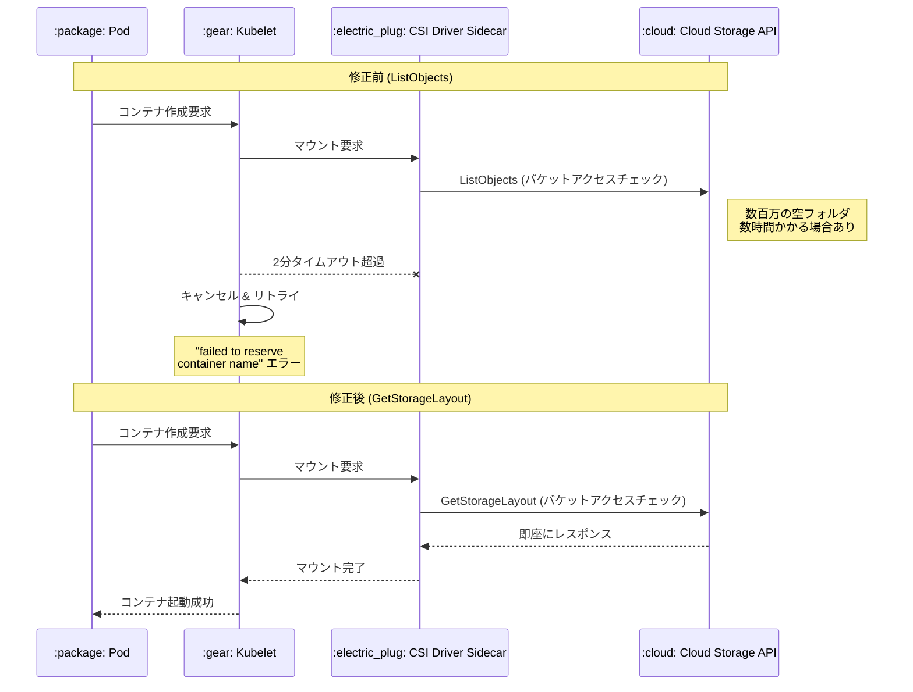

# Google Kubernetes Engine (GKE): Cloud Storage FUSE CSI ドライバーのマウント遅延バグ修正

**リリース日**: 2026-04-29

**サービス**: Google Kubernetes Engine (GKE)

**機能**: Cloud Storage FUSE CSI ドライバーのバケットアクセスチェック改善

**ステータス**: Fixed

:bar_chart: [このアップデートのインフォグラフィックを見る](https://takech9203.github.io/google-cloud-news-summary/20260429-gke-cloud-storage-fuse-csi-fix.html)

## 概要

GKE の Cloud Storage FUSE CSI ドライバーにおいて、Cloud Storage バケットのマウント時に数時間規模の大幅な遅延が発生する重大なバグが修正された。この問題は、数百万の空フォルダを含むバケットをマウントする際に顕著に発生し、`CreateContainer` エラー（「failed to reserve container name」）として表面化していた。

この修正は GKE バージョン 1.34.6-gke.1154000 および 1.35.2-gke.1691000 以降で提供されており、CSI ドライバーサイドカーのバケットアクセスチェックで使用される API メソッドを `ListObjects` から `GetStorageLayout` に置き換えることで、チェック処理をほぼ瞬時に完了させるようになった。

**アップデート前の課題**

- CSI ドライバーサイドカーが `ListObjects` API を使用してバケットアクセスチェックを実行しており、数百万の空フォルダを含むバケットでは完了まで数時間かかることがあった
- kubelet がコンテナ作成リクエストに 2 分間の厳密なタイムアウトを適用するため、FUSE マウントがこの制限を超えると操作がキャンセルされリトライが繰り返された
- コンテナランタイムが最初の試行でブロックされたまま、コンテナ名の予約を保持し続け、「failed to reserve container name」エラーが発生した
- エラーは自己修復するものの、根本的なマウント操作が完了するまでワークロードの起動が大幅に遅延した

**アップデート後の改善**

- `ListObjects` API による非効率なバケットアクセスチェックが `GetStorageLayout` API に置き換えられ、ほぼ瞬時にバリデーションが完了するようになった
- 数百万の空フォルダを含む大規模バケットでもマウント遅延が発生しなくなった
- kubelet のタイムアウトに起因する `CreateContainer` エラーのリトライループが解消された

## アーキテクチャ図



修正前は `ListObjects` API がバケット内の全オブジェクトを列挙するため大規模バケットで長時間ブロックされていたが、修正後は `GetStorageLayout` API により即座にバケットアクセスの有効性が検証される。

## サービスアップデートの詳細

### 主要機能

1. **バケットアクセスチェックの API 変更**
   - CSI ドライバーサイドカーが実行するバケットアクセスチェックのバックエンド API を `ListObjects` から `GetStorageLayout` に変更
   - `GetStorageLayout` はバケットのメタデータのみを返すため、バケット内のオブジェクト数に関係なくほぼ一定時間で完了
   - バケットへの読み取りアクセス権の検証という本来の目的は維持

2. **自己修復動作の解消**
   - 修正前: エラーは「自己修復」するが、根本原因であるマウント操作完了まで待機が必要だった
   - 修正後: タイムアウトに達する前にマウントが完了するため、エラー自体が発生しなくなった

3. **GKE 1.33 向け緩和策の提供**
   - バージョン 1.33.5-gke.2435000 以降では、`skipCSIBucketAccessCheck: 'true'` ボリューム属性を設定することでチェック自体をバイパス可能
   - これは修正パッチが提供されない 1.33 系向けの暫定的な緩和策

## 技術仕様

### 影響を受けるバージョンと修正バージョン

| GKE バージョン系列 | 影響を受けるバージョン | 修正・緩和バージョン |
|------|------|------|
| 1.35 | 1.35.2-gke.1691000 より前 | 1.35.2-gke.1691000 以降 |
| 1.34 | 1.34.6-gke.1154000 より前 | 1.34.6-gke.1154000 以降 |
| 1.33 | 全バージョン (修正なし) | 1.33.5-gke.2435000 以降で緩和策あり |
| 1.33 (旧) | 1.33.5-gke.2435000 より前 | 修正・緩和策なし |

### 根本原因の技術詳細

| 項目 | 詳細 |
|------|------|
| 問題の API | `ListObjects` - バケット内の全オブジェクトを列挙 |
| 修正後の API | `GetStorageLayout` - バケットメタデータのみ取得 |
| kubelet タイムアウト | 2 分 (コンテナ作成リクエスト) |
| 影響条件 | 数百万の空フォルダを含むバケット |
| エラーメッセージ | `CreateContainer` - "failed to reserve container name" |
| エラーの性質 | 自己修復型 (マウント完了後に解消) |

### 緩和策の設定 (GKE 1.33 向け)

```yaml
# PersistentVolume または CSI ボリュームの volumeAttributes に追加
volumeAttributes:
  bucketName: "your-bucket-name"
  skipCSIBucketAccessCheck: "true"
```

## 設定方法

### 前提条件

1. GKE クラスタが稼働していること
2. Cloud Storage FUSE CSI ドライバーが有効化されていること
3. 影響を受けるバージョンで稼働中のクラスタであること

### 手順

#### ステップ 1: 現在のクラスタバージョンの確認

```bash
gcloud container clusters describe CLUSTER_NAME \
  --location=LOCATION \
  --format="value(currentMasterVersion)"
```

#### ステップ 2: クラスタのアップグレード

```bash
# コントロールプレーンのアップグレード
gcloud container clusters upgrade CLUSTER_NAME \
  --location=LOCATION \
  --master \
  --cluster-version=1.34.6-gke.1154000

# ノードプールのアップグレード
gcloud container clusters upgrade CLUSTER_NAME \
  --location=LOCATION \
  --node-pool=NODE_POOL_NAME
```

#### ステップ 3: GKE 1.33 の場合の緩和策適用

```yaml
# エフェメラルボリュームの場合
apiVersion: v1
kind: Pod
metadata:
  name: example-pod
  annotations:
    gke-gcsfuse/volumes: "true"
spec:
  containers:
  - name: app
    image: your-image
    volumeMounts:
    - name: gcs-volume
      mountPath: /data
  volumes:
  - name: gcs-volume
    csi:
      driver: gcsfuse.csi.storage.gke.io
      volumeAttributes:
        bucketName: "your-bucket-name"
        skipCSIBucketAccessCheck: "true"
```

## メリット

### ビジネス面

- **ワークロード起動時間の大幅改善**: 大規模バケットを使用するアプリケーションのデプロイ時間が数時間から数秒に短縮される
- **サービス信頼性の向上**: マウント遅延に起因するコンテナ起動失敗とリトライループが解消され、SLA 遵守が容易になる

### 技術面

- **API 効率の改善**: `GetStorageLayout` はバケットサイズに依存しない一定時間の応答を保証し、スケーラビリティの問題を根本的に解決
- **kubelet タイムアウト競合の解消**: マウント処理が 2 分のタイムアウト内に確実に完了するため、コンテナランタイムの名前予約競合が発生しなくなる

## デメリット・制約事項

### 制限事項

- GKE 1.33.5-gke.2435000 より前のバージョンには修正も緩和策も提供されない
- GKE 1.33 系の場合は完全な修正ではなく、バケットアクセスチェックのバイパスによる緩和策のみ
- `skipCSIBucketAccessCheck: "true"` を使用すると、CSI レベルでのアクセス権事前検証がスキップされる（Cloud Storage FUSE プロセスがバケットアクセス制御を直接処理する）

### 考慮すべき点

- アップグレードにはメンテナンスウィンドウの確保が必要
- `skipCSIBucketAccessCheck` による緩和策は、問題発生時のエラーメッセージが変わる可能性がある（CSI レベルではなく FUSE レベルでのエラーになる）
- ノードプールの段階的アップグレード中は一部ノードで問題が継続する可能性がある

## ユースケース

### ユースケース 1: ML/AI トレーニングデータの大規模バケット

**シナリオ**: 機械学習トレーニングパイプラインで、数百万のデータファイルとディレクトリ構造を持つ Cloud Storage バケットを GKE 上のトレーニング Pod にマウントしている環境。

**効果**: 修正前はトレーニングジョブの起動に数時間の遅延が発生していたが、修正後は即座にマウントが完了し、GPU/TPU リソースの無駄な占有を防止できる。

### ユースケース 2: データレイクのバッチ処理

**シナリオ**: 日次バッチ処理で大量の空フォルダ（パーティションキー構造など）を含むデータレイクバケットを複数の Pod からマウントする環境。

**効果**: バッチジョブのスケジュール通りの実行が保証され、下流のパイプラインへの影響が解消される。

## 関連サービス・機能

- **Cloud Storage FUSE**: GKE Pod から Cloud Storage バケットをローカルファイルシステムとしてマウントするための基盤技術
- **Cloud Storage FUSE CSI ドライバー**: Kubernetes の CSI (Container Storage Interface) を通じて Cloud Storage FUSE を GKE に統合するドライバー
- **Workload Identity Federation for GKE**: CSI ドライバーがバケットへのアクセス認証に使用する ID 連携メカニズム
- **Cloud Storage**: マウント対象のオブジェクトストレージサービス

## 参考リンク

- :bar_chart: [インフォグラフィック](https://takech9203.github.io/google-cloud-news-summary/20260429-gke-cloud-storage-fuse-csi-fix.html)
- [公式リリースノート](https://docs.cloud.google.com/release-notes#April_29_2026)
- [Cloud Storage FUSE CSI ドライバー概要](https://docs.cloud.google.com/kubernetes-engine/docs/concepts/cloud-storage-fuse-csi-driver)
- [Cloud Storage FUSE CSI ドライバーのセットアップ](https://docs.cloud.google.com/kubernetes-engine/docs/how-to/cloud-storage-fuse-csi-driver-setup)
- [ボリューム属性リファレンス](https://docs.cloud.google.com/kubernetes-engine/docs/reference/cloud-storage-fuse-csi-driver/volume-attr)
- [CSI ドライバーサイドカーの構成](https://docs.cloud.google.com/kubernetes-engine/docs/how-to/cloud-storage-fuse-csi-driver-sidecar)
- [トラブルシューティングガイド (GitHub)](https://github.com/GoogleCloudPlatform/gcs-fuse-csi-driver/blob/main/docs/troubleshooting.md)

## まとめ

この修正は、大規模な Cloud Storage バケットを GKE で使用する環境において深刻なパフォーマンス問題を解消する重要なアップデートである。影響を受けるクラスタを運用している場合は、速やかに GKE 1.34.6-gke.1154000 または 1.35.2-gke.1691000 以降へのアップグレードを推奨する。GKE 1.33 系を使用している場合は、`skipCSIBucketAccessCheck: "true"` ボリューム属性の設定による緩和策の適用を検討すべきである。

---

**タグ**: #GKE #CloudStorage #FUSE #CSI #BugFix #Performance #Kubernetes
