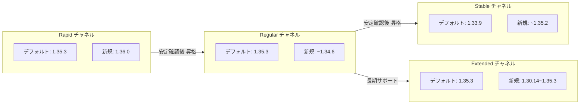

# Google Kubernetes Engine (GKE): Version Updates 2026-R17

**リリース日**: 2026-04-29

**サービス**: Google Kubernetes Engine (GKE)

**機能**: Version Updates 2026-R17

**ステータス**: 一般提供 (GA)

📊 [このアップデートのインフォグラフィックを見る](https://takech9203.github.io/google-cloud-news-summary/20260429-gke-version-updates-2026-r17.html)

## 概要

GKE クラスタバージョンが 2026-R17 として更新された。全リリースチャネル (Rapid、Regular、Stable、Extended) で新しいデフォルトバージョンが設定され、複数の新バージョンが利用可能になった。また、各チャネルで自動アップグレードターゲットが更新され、複数の古いパッチバージョンが 90 日間の非推奨猶予期間付きで廃止予定となった。

今回のアップデートでは、Rapid チャネルに Kubernetes 1.36 系が初めて登場し、Stable チャネルでも 1.35 系が利用可能になるなど、全チャネルで着実にバージョンが進行している。クラスタ管理者は、自動アップグレードターゲットの確認と廃止予定バージョンからの移行計画を検討する必要がある。

**アップデート前の課題**

- 各チャネルのデフォルトバージョンが古く、新規クラスタ作成時に最新のセキュリティ修正やバグ修正が含まれていなかった
- 1.31 系以前のバージョンを実行中のクラスタは最新のセキュリティパッチを受けられない状態だった
- 一部の古いパッチバージョンがまだ利用可能であり、既知の問題を含む可能性があった

**アップデート後の改善**

- 全チャネルで最新のセキュリティ修正とバグ修正を含む新しいデフォルトバージョンが設定された
- 自動アップグレードにより、古いマイナーバージョンから安全に新しいバージョンへ移行可能になった
- 90 日間の非推奨猶予期間により、計画的なバージョン移行が可能

## アーキテクチャ図



GKE のリリースチャネルモデルを示す図。新しいバージョンは Rapid チャネルで最初に利用可能になり、安定性が確認された後に Regular、Stable、Extended チャネルへ段階的に昇格する。

## サービスアップデートの詳細

### 各チャネルの新しいデフォルトバージョン

| チャネル | 新デフォルトバージョン |
|----------|------------------------|
| Rapid | 1.35.3-gke.1522000 |
| Regular | 1.35.3-gke.1234000 |
| Stable | 1.33.9-gke.1060000 |
| Extended | 1.35.3-gke.1234000 |

### 新規利用可能バージョン

#### Rapid チャネル

| マイナーバージョン | 新規パッチバージョン |
|-------------------|---------------------|
| 1.32 | 1.32.13-gke.1407000 |
| 1.33 | 1.33.11-gke.1074000 |
| 1.34 | 1.34.7-gke.1055000 |
| 1.35 | 1.35.3-gke.1737000 |
| 1.36 | 1.36.0-gke.1379000 |

#### Regular チャネル

| マイナーバージョン | 新規パッチバージョン |
|-------------------|---------------------|
| 1.32 | 1.32.13-gke.1318000 |
| 1.33 | 1.33.10-gke.1176000 |
| 1.34 | 1.34.6-gke.1237000 |
| 1.35 | 1.35.3-gke.1389000 |

#### Stable チャネル

| マイナーバージョン | 新規パッチバージョン |
|-------------------|---------------------|
| 1.32 | 1.32.13-gke.1205000 |
| 1.33 | 1.33.10-gke.1067000 |
| 1.34 | 1.34.6-gke.1068000 |
| 1.35 | 1.35.2-gke.1962000 |

#### Extended チャネル

| マイナーバージョン | 新規パッチバージョン (代表) |
|-------------------|---------------------------|
| 1.30 | 1.30.14-gke.2415000 |
| 1.31〜1.35 | 多数のパッチバージョン追加 |
| 1.35 | 1.35.3-gke.1389000 |

### 自動アップグレードターゲット

#### Rapid チャネル

| 現バージョン | アップグレード先 |
|-------------|-----------------|
| 1.31.x | 1.32.13 |
| 1.32.x | 1.33.11 |
| 1.33.x | 1.34.6 |
| 1.34.x | 1.35.3 |

#### Regular チャネル

| 現バージョン | アップグレード先 |
|-------------|-----------------|
| 1.31.x | 1.32.13 |
| 1.32.x | 1.33.10 |
| 1.33.x | 1.34.6 |
| 1.34.x | 1.35.3 |

#### Stable チャネル

| 現バージョン | アップグレード先 |
|-------------|-----------------|
| 1.31.x | 1.32.13 |
| 1.32.x | 1.33.9 |

### 非推奨バージョン (90 日間の猶予期間)

複数のパッチバージョンがコントロールプレーン用途で非推奨となった。90 日間の猶予期間後に削除される。非推奨期間中もバージョンの使用は可能だが、できるだけ早く新しいパッチバージョンへのアップグレードが推奨される。

## 技術仕様

### GKE バージョニングスキーム

| 項目 | 詳細 |
|------|------|
| バージョン形式 | x.y.z-gke.N (例: 1.35.3-gke.1522000) |
| メジャーバージョン (x) | 後方互換性のない変更時にインクリメント |
| マイナーバージョン (y) | Kubernetes の年 3 回のリリースサイクル |
| パッチリリース (z) | 毎週のセキュリティ修正・バグ修正 |
| GKE パッチ (-gke.N) | Google Cloud 固有のセキュリティ更新・バグ修正 |

### バージョンサポート期間

| サポート期間 | 期間 | 対象チャネル |
|-------------|------|-------------|
| Rapid 限定期間 | 約 1-2 ヶ月 | Rapid のみ |
| 標準サポート期間 | 最大 14 ヶ月 | 全チャネル |
| 延長サポート期間 | 追加 10 ヶ月 (合計 24 ヶ月) | Extended のみ (追加料金) |

### バージョン確認コマンド

```bash
# Rapid チャネルのデフォルトバージョン確認
gcloud container get-server-config \
  --flatten="channels" \
  --filter="channels.channel=RAPID" \
  --format="yaml(channels.channel,channels.defaultVersion)" \
  --location=COMPUTE_LOCATION

# Regular チャネルの利用可能バージョン確認
gcloud container get-server-config \
  --flatten="channels" \
  --filter="channels.channel=REGULAR" \
  --format="yaml(channels.channel,channels.validVersions)" \
  --location=COMPUTE_LOCATION
```

## 設定方法

### 前提条件

1. GKE クラスタがリリースチャネルに登録されていること
2. gcloud CLI が最新バージョンにアップデートされていること

### 手順

#### ステップ 1: 現在のクラスタバージョンを確認

```bash
gcloud container clusters describe CLUSTER_NAME \
  --location=LOCATION \
  --format="yaml(currentMasterVersion,currentNodeVersion,releaseChannel)"
```

#### ステップ 2: 利用可能なアップグレードバージョンを確認

```bash
gcloud container get-server-config \
  --flatten="channels" \
  --filter="channels.channel=REGULAR" \
  --format="yaml(channels.channel,channels.defaultVersion,channels.validVersions)" \
  --location=LOCATION
```

#### ステップ 3: 手動アップグレード (任意)

```bash
# コントロールプレーンのアップグレード
gcloud container clusters upgrade CLUSTER_NAME \
  --master \
  --cluster-version=1.35.3-gke.1389000 \
  --location=LOCATION

# ノードプールのアップグレード
gcloud container clusters upgrade CLUSTER_NAME \
  --node-pool=NODE_POOL_NAME \
  --cluster-version=1.35.3-gke.1389000 \
  --location=LOCATION
```

## メリット

### ビジネス面

- **セキュリティリスクの低減**: 最新のセキュリティパッチが自動的に適用され、既知の脆弱性への露出を最小化
- **運用負荷の軽減**: 自動アップグレードにより手動でのバージョン管理が不要

### 技術面

- **最新 Kubernetes 機能の利用**: Rapid チャネルで 1.36 系が利用可能になり、最新の Kubernetes API や機能をいち早く検証可能
- **段階的なロールアウト**: チャネルモデルにより、安定性が確認されたバージョンのみが本番環境に適用される
- **バージョンスキューポリシーの遵守**: ノードはコントロールプレーンの 2 マイナーバージョン以内に維持される

## デメリット・制約事項

### 制限事項

- 非推奨バージョンは 90 日後にコントロールプレーンでの使用が不可能になる (ノードは引き続き利用可能な場合がある)
- Extended チャネルは Autopilot クラスタ、Alpha クラスタ、Windows Server ノードプールでは利用不可
- 延長サポート期間中は追加料金が発生する

### 考慮すべき点

- 自動アップグレードのタイミングはメンテナンスウィンドウの設定に依存するため、事前に適切なメンテナンスウィンドウを設定すること
- マイナーバージョンアップグレード前に非推奨 API の使用有無を確認すること
- 1.31 系を使用中のクラスタは全チャネルで 1.32 系への自動アップグレード対象となるため、早めの検証を推奨

## ユースケース

### ユースケース 1: 本番環境での安定バージョンへのアップグレード

**シナリオ**: Stable チャネルに登録されている本番クラスタが 1.32 系を実行中。1.33 系への自動アップグレードが予定されている。

**実装例**:
```bash
# メンテナンスウィンドウの設定 (営業時間外に実行)
gcloud container clusters update my-prod-cluster \
  --location=asia-northeast1 \
  --maintenance-window-start="2026-05-01T18:00:00Z" \
  --maintenance-window-end="2026-05-02T06:00:00Z" \
  --maintenance-window-recurrence="FREQ=WEEKLY;BYDAY=SA"
```

**効果**: 営業時間外にのみ自動アップグレードが実行され、ビジネスへの影響を最小化

### ユースケース 2: 最新機能の早期検証

**シナリオ**: 開発チームが Kubernetes 1.36 の新機能を早期検証したい。

**実装例**:
```bash
# Rapid チャネルで 1.36 系クラスタを作成
gcloud container clusters create dev-k8s136-test \
  --location=asia-northeast1 \
  --release-channel=rapid \
  --cluster-version=1.36.0-gke.1379000
```

**効果**: 本番環境に影響を与えることなく、最新バージョンの機能検証が可能

## 料金

GKE バージョンアップグレード自体に追加料金は発生しない。ただし、Extended チャネルで延長サポート期間に入ったマイナーバージョンを使用する場合は追加料金が発生する。

| 項目 | 料金 |
|------|------|
| バージョンアップグレード | 無料 |
| 標準サポート期間 (全チャネル) | GKE クラスタ料金に含まれる |
| 延長サポート期間 (Extended チャネル) | クラスタあたり追加料金が発生 |

詳細は [GKE 料金ページ](https://cloud.google.com/kubernetes-engine/pricing) を参照。

## 利用可能リージョン

GKE バージョンアップデートは全リージョン・全ゾーンで段階的にロールアウトされる。ロールアウトの進行状況はリージョンによって異なる場合がある。特定リージョンでの利用可能バージョンは `gcloud container get-server-config --location=LOCATION` で確認可能。

## 関連サービス・機能

- **GKE リリースチャネル**: クラスタのバージョン管理戦略を決定するチャネルシステム
- **GKE メンテナンスウィンドウ**: 自動アップグレードの実行タイミングを制御
- **GKE メンテナンス除外**: 特定期間中のアップグレードを防止
- **Cloud Monitoring / Cloud Logging**: アップグレードイベントの監視とログ記録
- **GKE クラスタ通知 (Pub/Sub)**: アップグレード予定・完了通知の配信

## 参考リンク

- 📊 [インフォグラフィック](https://takech9203.github.io/google-cloud-news-summary/20260429-gke-version-updates-2026-r17.html)
- [公式リリースノート](https://cloud.google.com/release-notes#April_29_2026)
- [GKE バージョニングとサポート](https://cloud.google.com/kubernetes-engine/versioning)
- [GKE リリースチャネル](https://cloud.google.com/kubernetes-engine/docs/concepts/release-channels)
- [GKE ノード自動アップグレード](https://cloud.google.com/kubernetes-engine/docs/how-to/node-auto-upgrades)
- [GKE リリーススケジュール](https://cloud.google.com/kubernetes-engine/docs/release-schedule)
- [料金ページ](https://cloud.google.com/kubernetes-engine/pricing)

## まとめ

2026-R17 バージョンアップデートにより、全チャネルで新しいデフォルトバージョンと追加パッチバージョンが利用可能になった。特に Rapid チャネルでの Kubernetes 1.36 系の登場と、1.31 系クラスタの自動アップグレード対象化が注目点である。非推奨バージョンを使用中のクラスタ管理者は、90 日間の猶予期間内にアップグレード計画を策定し実行することを推奨する。

---

**タグ**: #GKE #Kubernetes #VersionUpdate #ReleaseChannel #AutoUpgrade #2026-R17
