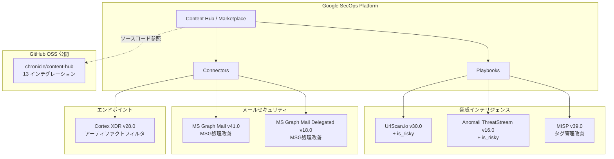

# Google SecOps Marketplace: 複数インテグレーションアップデート

**リリース日**: 2026-04-29

**サービス**: Google SecOps Marketplace

**機能**: インテグレーション更新 (8件) およびソースコード公開 (13件)

**ステータス**: 変更 (複数)

:bar_chart: [このアップデートのインフォグラフィックを見る](https://takech9203.github.io/google-cloud-news-summary/20260429-secops-marketplace-integration-updates.html)

## 概要

Google SecOps Marketplace において、複数のセキュリティインテグレーションが一括更新された。主要な変更として、UrlScan.io および Anomali ThreatStream に `is_risky` リスクスコアリング機能が追加され、エンティティのリスク判定がより精緻に行えるようになった。また、MISP のタグ管理ロジック、Microsoft Graph Mail のMSG添付ファイル処理、Palo Alto Cortex XDR のアーティファクトフィルタリングなど、SOC ワークフローの品質向上に寄与する改善が含まれている。

さらに注目すべきは、Cisco Orbital、F5 Big IQ、FireEye EX など 13 のインテグレーションのソースコードが GitHub 上で公開されたことである。これにより、セキュリティチームはインテグレーションのカスタマイズや独自拡張をより容易に行えるようになった。

対象ユーザーは Google SecOps (旧 Chronicle SOAR) を利用する SOC アナリスト、セキュリティエンジニア、および MSSP である。

**アップデート前の課題**

- UrlScan.io と Anomali ThreatStream のアクションでは、リスク判定結果 (`is_risky`) が返却されず、後続の自動化フローでリスクベースの分岐処理ができなかった
- MISP のタグ操作アクション (追加・削除) でタグ取得ロジックに制限があり、特定条件下でタグ操作が期待通りに動作しないケースがあった
- Microsoft Graph Mail コネクタの MSG 形式添付ファイル処理に問題があり、一部の添付ファイルが正しく解析されなかった
- Palo Alto Cortex XDR コネクタでは、すべてのアーティファクトタイプが取得され、不要なアーティファクトのフィルタリングができなかった
- 多くのインテグレーションのソースコードが非公開であり、カスタマイズや問題のデバッグが困難だった

**アップデート後の改善**

- UrlScan.io (v30.0) と Anomali ThreatStream (v16.0) で `is_risky` ハンドリングが追加され、プレイブックでリスクベースの自動判定・分岐が可能になった
- MISP (v39.0) のタグ取得ロジックが改善され、Add Tag / Remove Tag アクションの信頼性が向上した
- Microsoft Graph Mail (v41.0) および Delegated (v18.0) の MSG 添付ファイル処理ロジックが更新され、正確なメール解析が可能になった
- Palo Alto Cortex XDR (v28.0) で特定のアーティファクトタイプを無視する機能が追加され、ノイズ低減が実現した
- 13 インテグレーションのソースコードが GitHub で公開され、透明性とカスタマイズ性が大幅に向上した

## アーキテクチャ図



Google SecOps Marketplace のインテグレーション更新の全体像。Playbooks で利用する脅威インテリジェンス系アクションに is_risky が追加され、Connectors で利用するメール・EDR 系の処理ロジックが改善された。

## サービスアップデートの詳細

### 主要機能

1. **is_risky リスクスコアリングの追加**
   - UrlScan.io v30.0: Url Check アクションに `is_risky` ハンドリングを追加。URL のスキャン結果に基づいてリスク判定を返却し、プレイブック内でのリスクベース自動判定に活用可能
   - Anomali ThreatStream v16.0: Enrich Entities アクションに `is_risky` ハンドリングを追加。IP、URL、ハッシュ、メールアドレスのエンリッチメント時にリスク判定を返却

2. **MISP タグ管理ロジックの改善 (v39.0)**
   - Add Tag to an Attribute、Add Tag to an Event、Remove Tag from an Attribute、Remove Tag from an Event の 4 アクションでタグ取得ロジックを更新
   - タグの検索・マッチング精度が向上し、大規模な MISP インスタンスでの操作信頼性が改善

3. **Microsoft Graph Mail MSG 処理の更新**
   - Microsoft Graph Mail v41.0: コネクタにおける MSG 添付ファイルの処理ロジックを更新
   - Microsoft Graph Mail Delegated v18.0: 同様に MSG 添付ファイル処理ロジックを更新
   - MSG 形式 (Outlook メッセージファイル) のパースが改善され、フィッシング調査での添付ファイル解析精度が向上

4. **Palo Alto Cortex XDR アーティファクトフィルタリング (v28.0)**
   - コネクタに特定のアーティファクトタイプを無視する機能を追加
   - 不要なアーティファクト (例: 正規プロセスのファイルハッシュなど) を除外し、アラートのノイズを削減

5. **その他の更新**
   - Siemplify v107.0: TIPCommon 依存関係を更新
   - Zerofox v4.0: ドキュメントリンクを更新

6. **ソースコード公開 (13 インテグレーション)**
   - GitHub リポジトリ (chronicle/content-hub) で以下のインテグレーションのソースコードが公開
   - 対象: Cisco Orbital v9.0、F5 Big IQ v8.0、FireEye EX v14.0、HCL BigFix Inventory v6.0、Illusive Networks v8.0、Lastline v10.0、McAfee ATD v18.0、McAfee Active Response v10.0、ObserveIT v6.0、Outpost24 v9.0、Site24x7 v7.0、Splash v8.0、Websense v15.0

## 技術仕様

### インテグレーション更新一覧

| インテグレーション | バージョン | 変更内容 |
|------|------|------|
| UrlScan.io | v30.0 | Url Check アクションに is_risky ハンドリング追加 |
| Siemplify | v107.0 | TIPCommon 依存関係更新 |
| Microsoft Graph Mail | v41.0 | MSG 添付ファイル処理ロジック更新 |
| Zerofox | v4.0 | ドキュメントリンク更新 |
| MISP | v39.0 | タグ取得ロジック更新 (4アクション) |
| Anomali ThreatStream | v16.0 | Enrich Entities に is_risky ハンドリング追加 |
| MS Graph Mail Delegated | v18.0 | MSG 添付ファイル処理ロジック更新 |
| Palo Alto Cortex XDR | v28.0 | 特定アーティファクトタイプの無視機能追加 |

### GitHub 公開インテグレーション一覧

| インテグレーション | バージョン |
|------|------|
| Cisco Orbital | v9.0 |
| F5 Big IQ | v8.0 |
| FireEye EX | v14.0 |
| HCL BigFix Inventory | v6.0 |
| Illusive Networks | v8.0 |
| Lastline | v10.0 |
| McAfee ATD | v18.0 |
| McAfee Active Response | v10.0 |
| ObserveIT | v6.0 |
| Outpost24 | v9.0 |
| Site24x7 | v7.0 |
| Splash | v8.0 |
| Websense | v15.0 |

### is_risky の動作仕様

`is_risky` はアクション実行後にエンティティに対して返却されるブール値で、プレイブックの条件分岐で利用される。

- **UrlScan.io**: Url Check アクションでスキャン結果の verdicts スコアが閾値 (Threshold パラメータ) 以上の場合に `is_risky: True` を返却
- **Anomali ThreatStream**: Enrich Entities アクションで Severity Threshold と Confidence Threshold の両方を超過した場合に `is_risky: True` を返却

## 設定方法

### 前提条件

1. Google SecOps の Content Hub / Marketplace へのアクセス権限
2. 各インテグレーションの API キーおよび接続設定が完了していること
3. `chronicle.admin` IAM ロールまたは適切なマーケットプレイス権限

### 手順

#### ステップ 1: インテグレーションの更新

Google SecOps コンソールで Content Hub > Response Integrations に移動し、対象のインテグレーションを選択して最新バージョンに更新する。

#### ステップ 2: is_risky を活用したプレイブック条件分岐の設定

```
Condition: {Action Result}.is_risky == True
  -> True: エスカレーション / 隔離アクション
  -> False: 通常のエンリッチメントフロー継続
```

#### ステップ 3: Cortex XDR アーティファクトフィルタの設定

コネクタ設定画面で、無視するアーティファクトタイプを指定する。

## メリット

### ビジネス面

- **SOC 効率化**: is_risky によるリスクベース自動判定で、アナリストの判断負荷を軽減し、MTTR (平均修復時間) を短縮
- **ノイズ削減**: Cortex XDR のアーティファクトフィルタにより、重要なアラートへの集中が可能
- **透明性向上**: ソースコード公開により、インテグレーションの動作を事前に検証可能

### 技術面

- **自動化精度の向上**: is_risky フラグにより、プレイブックの条件分岐がより正確に機能
- **メール解析品質**: MSG 添付ファイルの処理改善により、フィッシング調査の精度が向上
- **カスタマイズ性**: GitHub 上のソースコードを参照・フォークして独自のインテグレーション拡張が可能
- **タグ管理信頼性**: MISP のタグ操作ロジック改善により、脅威情報の分類精度が向上

## デメリット・制約事項

### 制限事項

- インテグレーション更新時にオントロジーマッピングの上書き (Override) または保持 (Retain) の選択が必要。カスタムマッピングがある場合は事前にバックアップを推奨
- GitHub 公開されたインテグレーションはコミュニティサポートであり、Google による公式サポートとは異なる場合がある

### 考慮すべき点

- is_risky の閾値設定はユースケースに応じた調整が必要。デフォルト値が環境に適切かを確認すること
- MSG 処理ロジックの変更により、既存のプレイブックで添付ファイルのフィールド名やデータ構造が変わる可能性があるため、テストを推奨
- インテグレーション更新後に問題が発生した場合は、バージョンロールバック機能で以前のバージョンに戻すことが可能

## ユースケース

### ユースケース 1: リスクベースの自動フィッシング対応

**シナリオ**: SOC チームがフィッシングメールに含まれる不審な URL を自動的に分析し、リスクレベルに応じて対応を分岐したい。

**実装例**:
```
Playbook: Phishing URL Investigation
  1. Extract URLs from email
  2. UrlScan.io - Url Check (is_risky enabled)
  3. Condition: is_risky == True
     -> True: Block URL in proxy, Notify SOC Lead, Create ticket
     -> False: Add to watchlist, Continue monitoring
```

**効果**: リスクの高い URL に対して即座に自動ブロックを実行し、アナリストの手動確認待ち時間を排除。

### ユースケース 2: 脅威インテリジェンスエンリッチメントの精緻化

**シナリオ**: Anomali ThreatStream から取得した IOC のリスク判定を自動化し、高リスクのエンティティのみをエスカレーションしたい。

**効果**: is_risky フラグにより、Severity と Confidence の複合条件に基づく自動リスク判定が行われ、誤検知によるアナリスト負荷を大幅に削減。

### ユースケース 3: インテグレーションのカスタム拡張

**シナリオ**: GitHub で公開されたインテグレーションのソースコードを基に、自社環境固有のアーティファクト処理やアクションを追加したい。

**効果**: ソースコードを参照してインテグレーションの内部動作を理解し、Content Hub の IDE を使って自社固有のカスタムアクションを追加可能。

## 関連サービス・機能

- **Google SecOps Content Hub**: インテグレーションの管理・インストール・更新を行うプラットフォーム
- **Google SecOps Playbooks**: インテグレーションのアクションを組み合わせた自動化ワークフロー
- **Google SecOps Connectors**: 外部サービスからのデータ取り込みを担うコンポーネント
- **chronicle/content-hub (GitHub)**: パーサーおよびインテグレーションのオープンソースリポジトリ
- **SOAR SDK**: カスタムインテグレーション開発用の SDK

## 参考リンク

- :bar_chart: [インフォグラフィック](https://takech9203.github.io/google-cloud-news-summary/20260429-secops-marketplace-integration-updates.html)
- [公式リリースノート](https://docs.cloud.google.com/release-notes#April_29_2026)
- [Google SecOps Content Hub ドキュメント](https://docs.cloud.google.com/chronicle/docs/secops/content_hub)
- [Google SecOps Marketplace インテグレーション一覧](https://docs.cloud.google.com/chronicle/docs/soar/marketplace-integrations)
- [chronicle/content-hub GitHub リポジトリ](https://github.com/chronicle/content-hub)
- [UrlScan.io インテグレーション](https://docs.cloud.google.com/chronicle/docs/soar/marketplace-integrations/urlscan-io)
- [Anomali ThreatStream インテグレーション](https://docs.cloud.google.com/chronicle/docs/soar/marketplace-integrations/anomali-threatstream)
- [MISP インテグレーション](https://docs.cloud.google.com/chronicle/docs/soar/marketplace-integrations/misp)

## まとめ

今回の Google SecOps Marketplace アップデートは、SOC の自動化ワークフローの精度向上とオープンソース化の推進という 2 つの重要な方向性を示している。特に `is_risky` フラグの追加はプレイブックのリスクベース判定を大幅に簡素化し、13 インテグレーションのソースコード公開はコミュニティ主導のセキュリティツール開発を促進する。Google SecOps を利用する組織は、既存のプレイブックに is_risky 条件分岐を追加し、自動化レベルの向上を検討すべきである。

---

**タグ**: #GoogleSecOps #SOAR #Marketplace #SecurityIntegrations #ThreatIntelligence #OpenSource #UrlScan #AномaliThreatStream #MISP #CortexXDR #MicrosoftGraphMail
