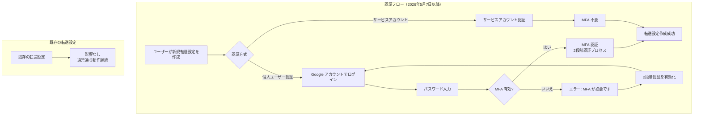

# BigQuery: Data Transfer Service - Google Ads MFA 必須化

**リリース日**: 2026-04-30

**サービス**: BigQuery

**機能**: BigQuery Data Transfer Service - Google Ads MFA Requirement

**ステータス**: Breaking Change

[このアップデートのインフォグラフィックを見る](https://takech9203.github.io/google-cloud-news-summary/20260430-bigquery-data-transfer-google-ads-mfa.html)

## 概要

2026年5月7日より、BigQuery Data Transfer Service を使用して Google Ads からデータを転送する新しい転送設定（transfer configuration）を作成する際、個人ユーザー認証に多要素認証（MFA）が必須となります。これは Google Ads 側のセキュリティ強化に伴う変更であり、不正アクセスからアカウントを保護するための措置です。

この変更は新規の転送設定にのみ適用され、既存の転送設定や転送実行（transfer run）には影響しません。また、サービスアカウントを使用して認証する転送設定には MFA 要件は適用されません。MFA としては、Google アカウントの2段階認証プロセス（2-Step Verification）を有効にすることで要件を満たすことができます。

**アップデート前の課題**

- 個人ユーザー認証で新しい Google Ads 転送設定を作成する際、MFA が必須ではなかったため、パスワードのみでの認証が可能だった
- セキュリティ意識の低いユーザーが MFA を有効にせずに転送設定を作成・管理するリスクがあった
- アカウントが侵害された場合、Google Ads のデータが不正にアクセスされる可能性があった

**アップデート後の改善**

- 新規の Google Ads 転送設定には MFA が必須となり、認証セキュリティが強化される
- 不正アクセスによるデータ漏洩リスクが低減される
- サービスアカウントを使用する場合は MFA 不要のため、自動化ワークフローには影響がない

## アーキテクチャ図



このフローは、2026年5月7日以降に新規の Google Ads 転送設定を作成する際の認証プロセスを示しています。個人ユーザー認証の場合は MFA が必須となり、サービスアカウント認証の場合は MFA なしで設定が可能です。

## サービスアップデートの詳細

### 主要変更点

1. **新規転送設定での MFA 必須化**
   - 2026年5月7日以降、個人ユーザー認証を使用する新しい Google Ads 転送設定の作成には MFA（2段階認証プロセス）が必要
   - Google アカウントの2段階認証プロセスを有効にすることで要件を満たせる

2. **既存設定への影響なし**
   - 既存の転送設定（transfer configuration）は引き続き正常に動作する
   - 既存の転送実行（transfer run）にも影響はない

3. **サービスアカウント認証は対象外**
   - サービスアカウントで認証された転送設定には MFA 要件は適用されない
   - サービスアカウントを使用する場合、Google Ads への直接アカウントアクセスの付与が推奨される

## 技術仕様

### 影響範囲

| 項目 | 詳細 |
|------|------|
| 適用開始日 | 2026年5月7日 |
| 影響対象 | 新規の Google Ads 転送設定（個人ユーザー認証） |
| 影響外 | 既存の転送設定、サービスアカウント認証の転送設定 |
| 必要な認証 | Google アカウントの2段階認証プロセス（2-Step Verification） |
| データソース | google_ads |

### 必要な権限

| 権限 | 説明 |
|------|------|
| bigquery.transfers.update | 転送設定の作成・更新 |
| bigquery.transfers.get | 転送設定の取得 |
| bigquery.datasets.get | データセットの取得 |
| bigquery.datasets.update | データセットの更新 |
| bigquery.jobs.create | ジョブの作成 |
| Google Ads 読み取りアクセス | Customer ID または MCC アカウントへの読み取り権限 |

## 設定方法

### 前提条件

1. Google アカウントの2段階認証プロセスが有効であること
2. BigQuery Admin ロール（roles/bigquery.admin）が付与されていること
3. Google Ads Customer ID または MCC アカウントへの読み取りアクセスがあること

### 手順

#### ステップ 1: 2段階認証プロセスの有効化

Google アカウントの[セキュリティ設定](https://myaccount.google.com/security)にアクセスし、「2段階認証プロセス」を有効にします。

#### ステップ 2: サービスアカウントを使用する場合（MFA 不要の代替手段）

```bash
# サービスアカウントを使用して Google Ads 転送を作成
bq mk \
  --transfer_config \
  --project_id=PROJECT_ID \
  --target_dataset=DATASET \
  --display_name='My Google Ads Transfer' \
  --params='{"customer_id":"123-123-1234","exclude_removed_items":"true"}' \
  --data_source=google_ads \
  --service_account_name=SERVICE_ACCOUNT@PROJECT_ID.iam.gserviceaccount.com
```

サービスアカウントを使用する場合、MFA は不要です。サービスアカウントには Google Ads への直接アカウントアクセスを付与する必要があります。

#### ステップ 3: 個人ユーザー認証で転送を作成する場合

```bash
# 個人ユーザー認証で Google Ads 転送を作成（MFA 必須）
bq mk \
  --transfer_config \
  --target_dataset=mydataset \
  --display_name='My Transfer' \
  --params='{"customer_id":"123-123-1234","exclude_removed_items":"true"}' \
  --data_source=google_ads
```

初回実行時に認証 URL が表示されるため、ブラウザで MFA を含む認証フローを完了させます。

## メリット

### ビジネス面

- **データ保護の強化**: Google Ads のマーケティングデータが不正アクセスから保護される
- **コンプライアンス対応**: 多要素認証の導入により、セキュリティ監査要件を満たしやすくなる

### 技術面

- **アカウント侵害リスクの低減**: パスワード漏洩だけではデータ転送設定の作成が不可能になる
- **サービスアカウント活用の促進**: MFA 不要のサービスアカウント認証への移行が推奨され、自動化が促進される

## デメリット・制約事項

### 制限事項

- 2段階認証プロセスを有効にしていないユーザーは、2026年5月7日以降に新しい Google Ads 転送設定を作成できない
- フェデレーション ID でサインインしたユーザーは、サービスアカウントの使用が必須

### 考慮すべき点

- 既存の転送設定を再作成する必要がある場合（設定変更など）、MFA が必要になる
- 組織内のすべての BigQuery 管理者が2段階認証プロセスを有効にしているか事前確認が必要
- サービスアカウント認証への移行を検討する場合、Google Ads への直接アカウントアクセスの設定が追加で必要

## ユースケース

### ユースケース 1: 既存環境でのサービスアカウント移行

**シナリオ**: マーケティングチームが個人ユーザー認証で Google Ads 転送を運用しており、今後の設定変更に備えてサービスアカウント認証に移行したい

**実装例**:
```bash
# 1. サービスアカウントの作成
gcloud iam service-accounts create bq-ads-transfer \
  --display-name="BigQuery Ads Transfer SA"

# 2. BigQuery Admin 権限の付与
gcloud projects add-iam-policy-binding PROJECT_ID \
  --member="serviceAccount:bq-ads-transfer@PROJECT_ID.iam.gserviceaccount.com" \
  --role="roles/bigquery.admin"

# 3. サービスアカウントで転送設定を作成
bq mk \
  --transfer_config \
  --target_dataset=ads_data \
  --display_name='Google Ads Transfer (SA)' \
  --params='{"customer_id":"123-123-1234"}' \
  --data_source=google_ads \
  --service_account_name=bq-ads-transfer@PROJECT_ID.iam.gserviceaccount.com
```

**効果**: MFA 要件に依存せず、自動化された安定的なデータ転送を実現できる

### ユースケース 2: 新規プロジェクトでの Google Ads データ分析基盤構築

**シナリオ**: 新規プロジェクトで Google Ads のパフォーマンスデータを BigQuery に転送し、分析基盤を構築したい

**効果**: MFA を有効にした上で個人ユーザー認証を使用するか、サービスアカウントを使用することで、セキュアかつ効率的にデータ転送パイプラインを構築できる

## 料金

BigQuery Data Transfer Service による Google Ads からのデータ転送自体には追加料金は発生しません。データが BigQuery に転送された後は、標準の BigQuery [ストレージ料金](https://cloud.google.com/bigquery/pricing#storage)と[クエリ料金](https://cloud.google.com/bigquery/pricing#queries)が適用されます。

## 関連サービス・機能

- **[Google Cloud MFA 要件](https://docs.cloud.google.com/docs/authentication/mfa-requirement)**: Google Cloud 全体での MFA 段階的適用（個人アカウントは2025年5月以降、企業アカウントは2026年Q2以降）
- **[BigQuery Data Transfer Service](https://docs.cloud.google.com/bigquery/docs/dts-introduction)**: SaaS プラットフォームからの自動データ転送サービス
- **[Google Ads API](https://developers.google.com/google-ads/api/docs/release-notes)**: Google Ads データへのプログラムアクセスを提供する API
- **[サービスアカウント認証](https://docs.cloud.google.com/bigquery/docs/use-service-accounts)**: ユーザー認証の代替としてサービスアカウントを使用する方法

## 参考リンク

- [このアップデートのインフォグラフィック](https://takech9203.github.io/google-cloud-news-summary/20260430-bigquery-data-transfer-google-ads-mfa.html)
- [公式リリースノート](https://docs.cloud.google.com/release-notes#April_30_2026)
- [Google Ads Developers Blog - Multi-factor Authentication Requirement](https://ads-developers.googleblog.com/2026/04/multi-factor-authentication-requirement.html)
- [BigQuery Data Transfer Service の変更 - May 7, 2026](https://docs.cloud.google.com/bigquery/docs/transfer-changes#May7-google-ads)
- [Google Ads 転送の設定ドキュメント](https://docs.cloud.google.com/bigquery/docs/google-ads-transfer)
- [サービスアカウントの使用](https://docs.cloud.google.com/bigquery/docs/use-service-accounts)
- [料金ページ](https://cloud.google.com/bigquery/pricing)

## まとめ

本アップデートは、Google Ads のセキュリティ強化の一環として、BigQuery Data Transfer Service での新規転送設定作成時に MFA を必須とする Breaking Change です。2026年5月7日までに、個人ユーザー認証を使用して Google Ads 転送を管理しているユーザーは2段階認証プロセスを有効にするか、サービスアカウント認証への移行を検討することを推奨します。既存の転送設定には影響がないため、即座の対応は必要ありませんが、今後の設定変更や新規作成に備えて早めの準備が望まれます。

---

**タグ**: BigQuery, Data Transfer Service, Google Ads, MFA, セキュリティ, Breaking Change
