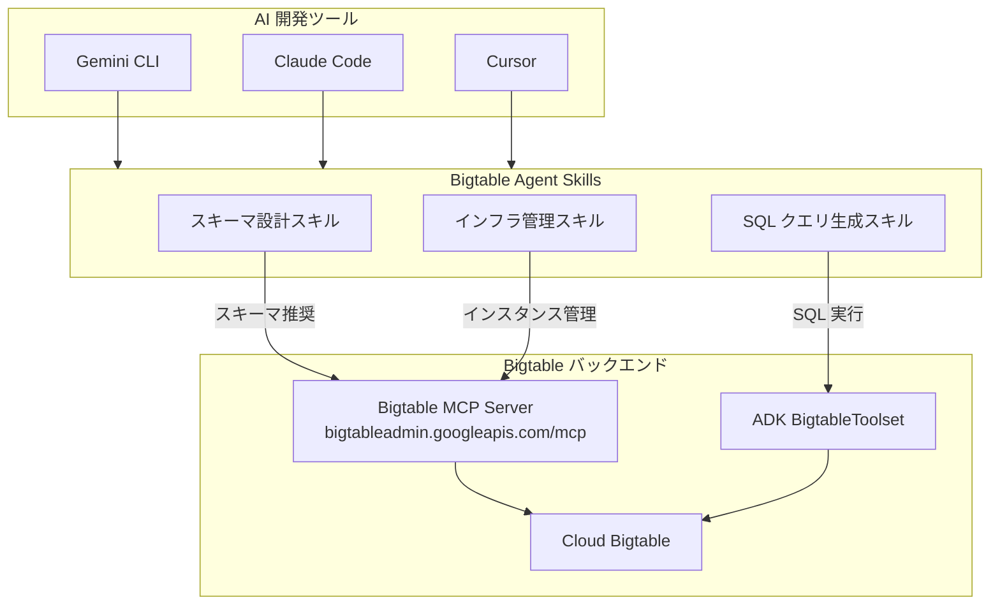

# Bigtable: Bigtable Agent Skills for AI Agents

**リリース日**: 2026-04-30

**サービス**: Bigtable

**機能**: Bigtable Agent Skills for AI Agents

**ステータス**: Feature

[このアップデートのインフォグラフィックを見る](https://takech9203.github.io/google-cloud-news-summary/20260430-bigtable-agent-skills.html)

## 概要

Google Cloud は Bigtable のエコシステムに「Agent Skills」を追加しました。これは AI エージェントが Bigtable 関連のタスクを支援するための、自己完結型のモジュールです。スキーマ設計、SQL クエリの生成、インフラストラクチャ管理といった Bigtable の主要な運用タスクを AI エージェントに委任できるようになります。

Agent Skills は、AI エージェントのための専門知識パッケージとして機能し、Bigtable に特化した指示、ワークフロー、ベストプラクティスをカプセル化しています。これにより、Gemini CLI、Claude Code、Cursor などの AI 開発ツールから Bigtable 関連の質問や操作を高精度で実行できます。このリリースは、2026年2月の Bigtable Admin API MCP サーバー (Preview) や 3月の ADK 向け Bigtable ツール (GA) に続く、Bigtable の AI エージェント統合戦略の最新ステップです。

対象ユーザーは、Bigtable を運用する開発者、データエンジニア、インフラエンジニアであり、特に AI 支援ツールを日常的に活用してデータベース管理の効率化を図りたいチームに適しています。

**アップデート前の課題**

- Bigtable のスキーマ設計には、データアクセスパターンや時系列データの設計ガイドラインなど、専門知識が必要であり、経験が浅い開発者には困難だった
- SQL クエリの生成には GoogleSQL for Bigtable の構文やテーブル構造の理解が必要で、試行錯誤に時間がかかっていた
- インフラ管理 (インスタンスの設定、クラスタのスケーリング、レプリケーション設定など) は Google Cloud コンソールや CLI を通じた手動操作が中心だった
- AI エージェントから Bigtable を操作する場合、MCP サーバーや ADK ツールの設定が必要で、ドメイン固有のベストプラクティスは別途学習する必要があった

**アップデート後の改善**

- AI エージェントが Bigtable のベストプラクティスに基づいたスキーマ設計を提案できるようになった
- 自然言語からの SQL クエリ生成がドメイン専門知識を含んだ形で高精度に実行可能になった
- インフラ管理タスクをエージェントが支援し、設定の推奨やトラブルシューティングを自動化できるようになった
- Agent Skills 仕様に準拠しているため、複数の AI ツール (Gemini CLI、Claude Code、Cursor など) で共通利用可能になった

## アーキテクチャ図



AI 開発ツールから Agent Skills が呼び出され、スキルごとに適切なバックエンド (MCP サーバーまたは ADK ツールセット) を通じて Bigtable と対話します。Agent Skills はドメイン知識とワークフローのカプセル化を担い、バックエンドとの接続を抽象化します。

## サービスアップデートの詳細

### 主要機能

1. **スキーマ設計支援**
   - データアクセスパターンに基づいた行キー設計の推奨
   - カラムファミリーの構成やガベージコレクションルールの提案
   - 時系列データに特化したスキーマパターンの適用

2. **SQL クエリ生成**
   - 自然言語から GoogleSQL for Bigtable クエリへの変換
   - テーブルメタデータの自動取得によるコンテキスト認識型クエリ生成
   - ウィンドウ関数や集計関数を含む高度なクエリの生成支援

3. **インフラストラクチャ管理**
   - インスタンスおよびクラスタの構成確認と最適化提案
   - レプリケーション設定やスケーリングに関するガイダンス
   - バックアップ戦略やモニタリング設定の支援

4. **マルチツール対応**
   - Agent Skills 仕様 (agentskills.io) に準拠したポータブルなスキル定義
   - Gemini CLI、Claude Code、Cursor、GitHub Copilot など主要 AI ツールで利用可能
   - 自動検出によりユーザーの質問に応じて適切なスキルが起動

## 技術仕様

### Agent Skills の構成要素

| 項目 | 詳細 |
|------|------|
| スキル仕様 | Agent Skills specification (agentskills.io) 準拠 |
| リポジトリ | GoogleCloudPlatform/cloud-bigtable-ecosystem |
| バックエンド連携 | Bigtable MCP Server、ADK BigtableToolset |
| 認証方式 | OAuth 2.0 + IAM |
| 対応 AI ツール | Gemini CLI、Claude Code、Cursor、GitHub Copilot |

### Bigtable MCP サーバーとの関係

| コンポーネント | 役割 | ステータス |
|--------------|------|-----------|
| Bigtable Admin API MCP Server | インスタンス・テーブル管理ツールを提供 | Preview (2026年2月~) |
| ADK BigtableToolset | メタデータ取得・SQL 実行ツールを提供 | GA (2026年3月~) |
| Bigtable Agent Skills | ドメイン知識とワークフローの提供 | Feature (2026年4月30日) |
| Database Insights MCP Server | パフォーマンス分析・メトリクス監視 | 利用可能 |

### ADK BigtableToolset の利用可能なツール

```python
# ADK BigtableToolset で利用可能なツール一覧
# - list_instances: プロジェクト内の Bigtable インスタンスを取得
# - get_instance_info: インスタンスのメタデータを取得
# - list_clusters: インスタンス内のクラスタを取得
# - get_cluster_info: クラスタのメタデータを取得
# - list_tables: インスタンス内のテーブルを取得
# - get_table_info: テーブルのメタデータを取得
# - execute_sql: Bigtable テーブルに対して SQL を実行
```

## 設定方法

### 前提条件

1. AI 開発ツール (Gemini CLI、Claude Code、Cursor など) がインストール済みであること
2. Google Cloud プロジェクトで Bigtable API が有効化されていること
3. 適切な IAM ロール (roles/bigtable.admin または roles/mcp.toolUser) が付与されていること

### 手順

#### ステップ 1: Agent Skills のインストール

```bash
# Gemini CLI の場合
gemini extensions install https://github.com/GoogleCloudPlatform/cloud-bigtable-ecosystem

# Claude Code の場合
claude plugin marketplace add GoogleCloudPlatform/cloud-bigtable-ecosystem

# Cursor / GitHub Copilot の場合
npx skills add GoogleCloudPlatform/cloud-bigtable-ecosystem
```

#### ステップ 2: 認証の設定

```bash
# Google Cloud 認証を設定
gcloud auth application-default login
gcloud config set project PROJECT_ID
gcloud auth application-default set-quota-project PROJECT_ID
```

#### ステップ 3: スキルの利用

インストール後、AI ツール内で Bigtable に関連する質問をするだけで、Agent Skills が自動的に起動します。

```
# 使用例: スキーマ設計の相談
"IoT デバイスの温度データを Bigtable に保存したい。最適なスキーマ設計を提案して"

# 使用例: SQL クエリ生成
"過去7日間のデバイスごとの平均温度を取得する SQL を書いて"

# 使用例: インフラ管理
"現在のインスタンスのクラスタ構成を確認して、レイテンシ改善の提案をして"
```

## メリット

### ビジネス面

- **開発生産性の向上**: Bigtable の専門知識がなくても AI エージェントを通じて最適な設計や運用が可能になり、チームの立ち上がり時間を短縮
- **運用コストの削減**: インフラ管理の自動化提案により、手動操作のミスを減らし、リソースの最適化を実現
- **ベストプラクティスの自動適用**: Google Cloud が推奨するパターンがスキルに組み込まれているため、設計品質の底上げが可能

### 技術面

- **コンテキスト認識型支援**: テーブルのメタデータやインスタンス構成を自動取得し、実環境に即した提案を生成
- **トークン効率の最適化**: Progressive Disclosure パターンによりオンデマンドで情報をロードし、AI のコンテキストウィンドウを効率的に使用
- **マルチツール互換性**: Agent Skills 仕様に準拠しているため、特定のツールにロックインされない

## デメリット・制約事項

### 制限事項

- Agent Skills はコミュニティ提供のエコシステムツールであり、Google Cloud のマネージドサービスとしての SLA は適用されない
- AI エージェントによる自律的な操作にはセキュリティリスクが伴うため、本番環境では Human-in-the-Loop パターンの採用が推奨される
- SQL 生成の精度は LLM の能力に依存し、複雑なクエリでは手動確認が必要な場合がある

### 考慮すべき点

- AI エージェントに付与する IAM ロールは最小権限の原則に従い、専用のサービスアカウントを使用すること
- Model Armor の有効化やデータアクセス監査ログの設定など、セキュリティ対策を併せて実施することが推奨される
- マルチテナント環境では、エージェントのデータアクセス範囲を制限するカスタムツールの作成を検討すること

## ユースケース

### ユースケース 1: 新規プロジェクトのスキーマ設計

**シナリオ**: IoT プロジェクトで数百万台のセンサーデバイスからの時系列データを Bigtable に保存する必要があり、最適な行キー設計とカラムファミリー構成を決定したい。

**実装例**:
```
ユーザー: "1000万台のIoTデバイスから1秒ごとに温度・湿度データが送信されます。
過去30日分のデータを保持し、デバイスID別・時間範囲別のクエリが主要な
アクセスパターンです。最適なスキーマを設計してください。"

Agent Skills の応答:
- 行キー: deviceId#reverse_timestamp パターンの推奨
- カラムファミリー: sensor_data (温度・湿度), metadata (デバイス情報)
- GC ルール: 30日間の TTL ベース
- ホットスポット回避のための行キーソルト戦略
```

**効果**: 専門知識がなくても Bigtable のベストプラクティスに準拠したスキーマ設計が可能になり、設計レビューの時間を大幅に短縮

### ユースケース 2: 既存テーブルのクエリ最適化

**シナリオ**: 運用中の Bigtable テーブルに対して複雑な分析クエリを実行したいが、GoogleSQL for Bigtable の構文に不慣れなデータアナリストが迅速にクエリを作成したい。

**効果**: 自然言語からの SQL 変換により、データアナリストが直接 Bigtable のデータにアクセスできるようになり、データエンジニアへの依頼待ち時間を解消

### ユースケース 3: インフラ運用の効率化

**シナリオ**: 複数のリージョンにまたがる Bigtable インスタンスのクラスタ構成を最適化し、コスト削減とレイテンシ改善を同時に達成したい。

**効果**: エージェントが現在の構成を分析し、Edition の選択 (Enterprise / Enterprise Plus) やストレージティアの活用を含む最適化提案を自動生成

## 関連サービス・機能

- **Bigtable Admin API MCP Server**: AI エージェントがインスタンスやテーブルを管理するためのリモート MCP サーバー (Preview)
- **ADK BigtableToolset**: Agent Development Kit で利用可能な Bigtable 連携ツールセット (GA)
- **Database Insights MCP Server**: パフォーマンスメトリクスの分析に特化した MCP サーバー
- **Bigtable Editions**: Enterprise / Enterprise Plus エディションによる高度な機能提供 (GA)
- **GoogleSQL for Bigtable**: SQL ベースのクエリインターフェース (ウィンドウ関数対応で GA)
- **Model Armor**: エージェントの入出力に対するセキュリティ保護機能

## 参考リンク

- [インフォグラフィック](https://takech9203.github.io/google-cloud-news-summary/20260430-bigtable-agent-skills.html)
- [公式リリースノート](https://docs.cloud.google.com/release-notes#April_30_2026)
- [cloud-bigtable-ecosystem GitHub リポジトリ](https://github.com/GoogleCloudPlatform/cloud-bigtable-ecosystem#ai-agent-skills)
- [Bigtable MCP サーバーの使用](https://docs.cloud.google.com/bigtable/docs/use-bigtable-mcp)
- [ADK Bigtable ツール](https://google.github.io/adk-docs/integrations/bigtable/)
- [MCP を使用したエージェント操作のセキュリティベストプラクティス](https://docs.cloud.google.com/bigtable/docs/secure-agent-interactions-mcp)
- [Agent Skills 仕様](https://agentskills.io/specification)

## まとめ

Bigtable Agent Skills は、AI エージェントによる Bigtable 運用支援の統合的なソリューションであり、スキーマ設計から SQL クエリ生成、インフラ管理まで幅広いタスクをカバーします。これまでの MCP サーバーや ADK ツールが「実行能力」を提供していたのに対し、Agent Skills は「ドメイン知識とワークフロー」を提供することで、AI エージェントの Bigtable 支援の質を大幅に向上させます。Bigtable を利用しているチームは、既存の AI 開発ツールに Agent Skills をインストールすることで、即座にこの恩恵を受けることができます。

---

**タグ**: Bigtable, AI Agent, Agent Skills, スキーマ設計, SQL生成, インフラ管理
