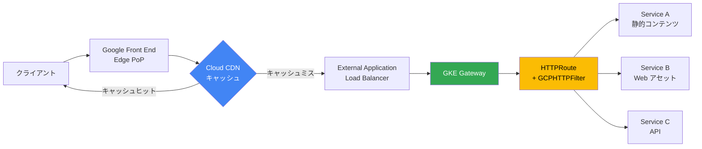

# Cloud CDN: GKE Gateway Cloud CDN サポート (GA)

**リリース日**: 2026-04-30

**サービス**: Cloud CDN

**機能**: GKE Gateway Cloud CDN Support (Generally Available)

**ステータス**: GA (一般提供)

[このアップデートのインフォグラフィックを見る](https://takech9203.github.io/google-cloud-news-summary/20260430-cloud-cdn-gke-gateway-ga.html)

## 概要

Google Kubernetes Engine (GKE) Gateway が Cloud CDN をサポートし、一般提供 (GA) となりました。この統合により、Kubernetes ネイティブの Gateway API を使用して、エッジキャッシュの設定・管理・チューニングを行えるようになります。

Cloud CDN との統合により、コンテンツをユーザーの近くにキャッシュすることで、アプリケーションのレイテンシを改善し、オリジンサーバーの負荷を軽減できます。GKE Gateway API の `GCPHTTPFilter` カスタムリソース定義 (CRD) を使用して、トラフィックの異なるセグメントごとにキャッシュポリシーを細かく設定できます。

この機能は、Kubernetes 環境でアプリケーションを運用しながら、CDN によるコンテンツ配信の最適化を必要とするアプリケーション開発者、クラウドアーキテクト、ネットワークスペシャリストを対象としています。

**アップデート前の課題**

- GKE Gateway でトラフィックを公開する場合、Cloud CDN の設定には別途ロードバランサーの手動設定が必要だった
- Kubernetes マニフェストだけでエッジキャッシュのポリシーを宣言的に管理することができなかった
- トラフィックのセグメントごと (画像、CSS、API レスポンスなど) に異なるキャッシュポリシーを適用するには、複雑なインフラ設定が求められた

**アップデート後の改善**

- `GCPHTTPFilter` リソースを使い、Kubernetes マニフェストだけで Cloud CDN のキャッシュポリシーを宣言的に管理可能に
- HTTPRoute ルールごとに異なるキャッシュポリシーを適用し、トラフィックセグメント単位できめ細かい制御が可能に
- キャッシュモード、TTL、キャッシュキー、ネガティブキャッシュなど豊富な設定を Kubernetes API で一元管理

## アーキテクチャ図



クライアントからのリクエストは Google Front End (GFE) で受信され、Cloud CDN キャッシュを確認します。キャッシュヒットの場合は即座にレスポンスを返し、キャッシュミスの場合はロードバランサーを経由して GKE Gateway のバックエンドサービスにルーティングされます。

## サービスアップデートの詳細

### 主要機能

1. **GCPHTTPFilter によるキャッシュポリシー管理**
   - Kubernetes カスタムリソースとしてキャッシュポリシーを定義
   - HTTPRoute の各ルールに異なるフィルターを適用可能
   - 同じフィルターを複数のルールで再利用可能 (カナリアデプロイ時など)

2. **キャッシュモードの制御**
   - `CACHE_ALL_STATIC`: 静的コンテンツを自動的にキャッシュ
   - オリジンサーバーの Cache-Control ヘッダーに基づくキャッシュ制御
   - デフォルト値による簡易設定も可能

3. **TTL (Time to Live) 設定**
   - `defaultTTL`: キャッシュオブジェクトのデフォルト有効期限を設定
   - `serveWhileStale`: コンテンツ期限切れ後もバックグラウンド再検証しながらキャッシュから配信を継続
   - 時間単位 (h)、分単位 (m)、秒単位 (s) で指定可能

4. **キャッシュキーのカスタマイズ**
   - クエリストリング、ヘッダー、Cookie をキャッシュキーに含めるかどうかを制御
   - `includeQueryString: false` でクエリパラメータを無視し、キャッシュヒット率を向上

5. **ネガティブキャッシュ**
   - エラーレスポンスやリダイレクトをキャッシュし、障害時のオリジン負荷を軽減

6. **キャッシュ無効化 (Invalidation)**
   - ホスト、パス、キャッシュタグ、ステータスコード、MIME タイプなど複数のマッチャーに対応
   - `gcloud compute url-maps invalidate-cdn-cache` コマンドで実行

## 技術仕様

### GCPHTTPFilter リソース仕様

| 項目 | 詳細 |
|------|------|
| API グループ | `networking.gke.io/v1` |
| リソース種別 | `GCPHTTPFilter` |
| 必須 GKE バージョン | 1.35.2-gke.1751000 以降 |
| 対応 GatewayClass | `gke-l7-global-external-managed`, `gke-l7-global-external-managed-mc` |
| 最大キャッシュファイルサイズ | 100 GiB (バイトレンジリクエスト対応時) |
| デフォルトキャッシュ有効期限 | 1 時間 (設定可能) |

### 設定例

```yaml
apiVersion: networking.gke.io/v1
kind: GCPHTTPFilter
metadata:
  name: store-caching-images-filter
spec:
  cachePolicy:
    cacheKeyPolicy:
      includeQueryString: false
    cacheMode: CACHE_ALL_STATIC
    defaultTTL: 12h
```

## 設定方法

### 前提条件

1. GKE クラスタがバージョン 1.35.2-gke.1751000 以降であること
2. `gke-l7-global-external-managed` または `gke-l7-global-external-managed-mc` GatewayClass を使用したグローバル外部 Gateway が構成済みであること
3. HTTPRoute リソースが構成済みであること
4. Certificate Manager を使用して Gateway に SSL 証明書が設定済みであること
5. `roles/compute.networkViewer` IAM ロールが付与されていること

### 手順

#### ステップ 1: GCPHTTPFilter リソースの作成

```yaml
# store-caching-images-filter.yaml
apiVersion: networking.gke.io/v1
kind: GCPHTTPFilter
metadata:
  name: store-caching-images-filter
spec:
  cachePolicy:
    cacheKeyPolicy:
      includeQueryString: false
    cacheMode: CACHE_ALL_STATIC
    defaultTTL: 12h
```

```bash
kubectl apply -f store-caching-images-filter.yaml
```

トラフィックの種類ごとに異なるフィルターを作成します (画像用、Web アセット用、デフォルト用など)。

#### ステップ 2: HTTPRoute にフィルターを適用

```yaml
# store-route-external.yaml
kind: HTTPRoute
apiVersion: gateway.networking.k8s.io/v1
metadata:
  name: store-external
spec:
  parentRefs:
    - kind: Gateway
      name: external-http
  hostnames:
    - "store.example.com"
  rules:
    - matches:
        - path:
            value: /img/
      filters:
        - type: ExtensionRef
          extensionRef:
            group: networking.gke.io
            kind: GCPHTTPFilter
            name: store-caching-images-filter
      backendRefs:
        - name: store-v1
          port: 8080
```

```bash
kubectl apply -f store-route-external.yaml
```

HTTPRoute の各ルールに `ExtensionRef` として GCPHTTPFilter を参照することで、パスベースで異なるキャッシュポリシーを適用します。

#### ステップ 3: 設定の確認

```bash
kubectl describe httproute store-external
kubectl describe gateway external-http
```

Gateway と HTTPRoute のデプロイ状態を確認し、Cloud CDN が有効化されていることを検証します。

## メリット

### ビジネス面

- **レイテンシ改善によるユーザー体験向上**: コンテンツをユーザーに最も近いエッジキャッシュから配信することで、ページ読み込み時間を大幅に短縮
- **オリジン負荷削減によるコスト最適化**: キャッシュヒットにより GKE バックエンドへのリクエスト数が減少し、コンピューティングコストを削減
- **運用効率の向上**: Kubernetes マニフェストで CDN 設定を一元管理でき、Infrastructure as Code のワークフローに統合可能

### 技術面

- **宣言的設定管理**: GitOps ワークフローに適した Kubernetes ネイティブの CRD による設定
- **きめ細かいトラフィック制御**: パスベースのルーティングとキャッシュポリシーの組み合わせにより、コンテンツタイプごとに最適なキャッシュ戦略を適用
- **カナリアデプロイとの統合**: トラフィック分割時にも一貫したキャッシュポリシーを適用可能
- **高可用性**: `serveWhileStale` 設定により、バックエンド障害時でもキャッシュからコンテンツを配信し続けることが可能

## デメリット・制約事項

### 制限事項

- Identity-Aware Proxy (IAP) と Cloud CDN を同じ Gateway で同時に有効にすることはできない
- 1 つの HTTPRoute パスルールには 1 つの GCPHTTPFilter のみ適用可能
- グローバル外部 Gateway (`gke-l7-global-external-managed` / `gke-l7-global-external-managed-mc`) のみ対応。リージョナル Gateway やインターナル Gateway では利用不可
- GKE クラスタがバージョン 1.35.2-gke.1751000 以降である必要がある

### 考慮すべき点

- キャッシュ無効化は手動で行う必要があり、コンテンツ更新時の運用プロセス設計が必要
- Cloud CDN を無効化しても既存のキャッシュは自動削除されないため、再有効化時に古いコンテンツが配信される可能性がある
- 動的コンテンツや認証が必要なコンテンツには適さないため、キャッシュ対象の選定が重要

## ユースケース

### ユースケース 1: E コマースサイトの静的アセット配信

**シナリオ**: GKE 上で運用する E コマースサイトの商品画像や CSS/JS ファイルを、世界中のユーザーに高速に配信したい。

**実装例**:
```yaml
apiVersion: networking.gke.io/v1
kind: GCPHTTPFilter
metadata:
  name: ecommerce-images-filter
spec:
  cachePolicy:
    cacheKeyPolicy:
      includeQueryString: false
    cacheMode: CACHE_ALL_STATIC
    defaultTTL: 24h
    serveWhileStale: 48h
```

**効果**: 画像やスタイルシートのキャッシュヒット率向上により、ページ読み込み時間が短縮され、オリジンサーバーのコンピューティングコストも削減される。

### ユースケース 2: カナリアデプロイ時の一貫したキャッシュポリシー

**シナリオ**: 新バージョンのアプリケーションをカナリアデプロイする際、安定版とカナリア版の両方に同じキャッシュポリシーを適用し、パフォーマンス比較を公平に行いたい。

**効果**: 同じ GCPHTTPFilter を複数のルールで再利用することで、トラフィック分割時にもキャッシュ動作の一貫性を確保し、正確なパフォーマンス評価が可能になる。

### ユースケース 3: マルチサービスアーキテクチャでのきめ細かいキャッシュ戦略

**シナリオ**: マイクロサービスアーキテクチャで、API レスポンス (短 TTL)、静的画像 (長 TTL)、Web アセット (中 TTL) にそれぞれ最適なキャッシュポリシーを適用したい。

**効果**: コンテンツタイプごとに最適化されたキャッシュ戦略により、全体的なキャッシュヒット率を最大化しつつ、データの鮮度も適切に維持できる。

## 料金

Cloud CDN の料金は、キャッシュが有効化されている場合に適用されます。主な料金要素は以下の通りです:

- **キャッシュエグレス (Cache Egress)**: キャッシュからクライアントへのデータ転送料金
- **キャッシュフィル (Cache Fill)**: オリジンからキャッシュへのデータ転送料金
- **HTTP/HTTPS リクエスト料金**: リクエスト数に基づく課金
- **キャッシュ無効化リクエスト**: 無効化操作に対する課金

詳細な料金は [Cloud CDN の料金ページ](https://cloud.google.com/cdn/pricing) を参照してください。

## 利用可能リージョン

Cloud CDN はグローバルサービスであり、Google のエッジネットワーク全体で利用可能です。GKE Gateway は `gke-l7-global-external-managed` GatewayClass を使用するため、グローバルな外部ロードバランサーを通じて世界中のエッジロケーションからキャッシュコンテンツが配信されます。

## 関連サービス・機能

- **GKE Gateway API**: Kubernetes の Gateway API を使用したトラフィック管理の基盤
- **Cloud Load Balancing**: GKE Gateway のバックエンドとして使用されるグローバル外部アプリケーションロードバランサー
- **Service Extensions (GKE Gateway)**: 2026-04-09 に GA となった GKE Gateway 向けの Service Extensions との組み合わせが可能
- **Cloud Monitoring / Cloud Logging**: キャッシュヒット率やパフォーマンスメトリクスのモニタリング
- **Certificate Manager**: Gateway の SSL/TLS 証明書管理 (Cloud CDN 利用の前提条件)

## 参考リンク

- [インフォグラフィック](https://takech9203.github.io/google-cloud-news-summary/20260430-cloud-cdn-gke-gateway-ga.html)
- [公式リリースノート](https://docs.cloud.google.com/release-notes#April_30_2026)
- [ドキュメント: Configure Cloud CDN for Gateway](https://docs.cloud.google.com/kubernetes-engine/docs/how-to/configure-cdn-for-gateway)
- [Cloud CDN 概要](https://docs.cloud.google.com/cdn/docs/overview)
- [料金ページ](https://cloud.google.com/cdn/pricing)

## まとめ

GKE Gateway での Cloud CDN サポートの GA により、Kubernetes ネイティブなワークフローの中でエッジキャッシュを宣言的に管理できるようになりました。GCPHTTPFilter リソースを活用することで、トラフィックセグメントごとに最適なキャッシュ戦略を適用し、アプリケーションのパフォーマンス向上とオリジン負荷削減を同時に実現できます。GKE 上でユーザー向けアプリケーションを運用している組織は、既存の HTTPRoute にフィルターを追加するだけで Cloud CDN の恩恵を受けられるため、早期の導入検討を推奨します。

---

**タグ**: Cloud CDN, GKE, Gateway API, キャッシュ, GA, パフォーマンス
