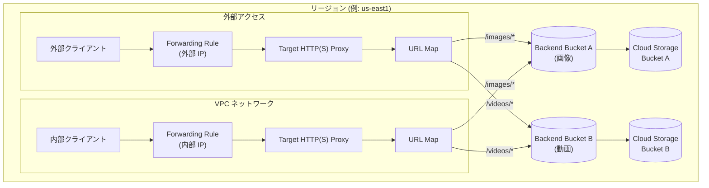

# Cloud Load Balancing: リージョナルロードバランサー向けバックエンド Cloud Storage バケット

**リリース日**: 2026-04-30

**サービス**: Cloud Load Balancing

**機能**: Backend Cloud Storage Buckets for Regional Load Balancers

**ステータス**: GA (一般提供)

[このアップデートのインフォグラフィックを見る](https://takech9203.github.io/google-cloud-news-summary/20260430-cloud-load-balancing-regional-storage-buckets.html)

## 概要

Cloud Load Balancing において、リージョナル外部 Application Load Balancer およびリージョナル内部 Application Load Balancer でバックエンド Cloud Storage バケットが利用可能になった。これにより、リージョナルロードバランサーを経由して Cloud Storage から直接静的コンテンツを配信できるようになる。

従来、バックエンドバケットはグローバル外部 Application Load Balancer およびクラシック Application Load Balancer でのみサポートされていた。今回のアップデートにより、リージョナルスコープのロードバランサーでも同様の機能が利用可能となり、データレジデンシー要件やリージョン内トラフィック制御が必要なワークロードにおいて、静的コンテンツ配信のアーキテクチャの選択肢が広がった。

**アップデート前の課題**

- Cloud Storage バケットをバックエンドとして利用する場合、グローバル外部 Application Load Balancer またはクラシック Application Load Balancer を使用する必要があった
- リージョナルロードバランサーで静的コンテンツを配信するには、バックエンドサービス (Compute Engine VM や Cloud Run) を別途構築する必要があった
- データレジデンシー要件がある環境で、グローバルロードバランサーを使わずに Cloud Storage から直接配信する手段がなかった
- 内部ネットワークから Cloud Storage の静的コンテンツをロードバランサー経由で配信するには、Private Service Connect NEG など複雑な構成が必要だった

**アップデート後の改善**

- リージョナル外部 Application Load Balancer で Cloud Storage バケットを直接バックエンドとして構成可能になった
- リージョナル内部 Application Load Balancer でも Cloud Storage バケットをバックエンドとして利用可能になった
- リージョン内でトラフィックを完結させながら、静的コンテンツを効率的に配信できるようになった
- VPC 内部からロードバランサーを経由して Cloud Storage の静的コンテンツにアクセスするシンプルな構成が可能になった

## アーキテクチャ図



リージョナル外部/内部 Application Load Balancer が URL Map のパスルールに基づいてリクエストを適切なバックエンドバケットにルーティングし、同一リージョン内の Cloud Storage バケットから静的コンテンツを配信する構成を示している。

## サービスアップデートの詳細

### 主要機能

1. **リージョナル外部 Application Load Balancer でのバックエンドバケット**
   - ロードバランシングスキーム `EXTERNAL_MANAGED` を使用してリージョナルバックエンドバケットを作成
   - URL Map によるパスベースルーティングで複数のバケットに振り分け可能
   - HTTP および HTTPS トラフィックの両方に対応

2. **リージョナル内部 Application Load Balancer でのバックエンドバケット**
   - ロードバランシングスキーム `INTERNAL_MANAGED` を使用してリージョナルバックエンドバケットを作成
   - VPC 内部のクライアントから Cloud Storage の静的コンテンツに効率的にアクセス可能
   - サブネットからの内部 IP アドレスを使用したフォワーディングルール

3. **URL Map によるパスベースルーティング**
   - 複数のバックエンドバケットを URL パスに基づいて使い分け可能
   - デフォルトバックエンドバケットと特定パスルールの組み合わせに対応
   - ホストルールとパスマッチャーによる柔軟なルーティング設定

## 技術仕様

### 対応ロードバランサー

| ロードバランサータイプ | ロードバランシングスキーム | スコープ |
|------|------|------|
| リージョナル外部 Application Load Balancer | `EXTERNAL_MANAGED` | リージョナル |
| リージョナル内部 Application Load Balancer | `INTERNAL_MANAGED` | リージョナル |

### 制限事項

| 項目 | 詳細 |
|------|------|
| プライベートバケットアクセス | 非対応 (バケットはインターネットから公開アクセス可能である必要がある) |
| Signed URL | 非対応 |
| Cloud CDN | リージョナルバックエンドバケットでは利用不可 |
| HTTP メソッド | GET のみ対応 (アップロード不可) |
| バケットロケーション | ロードバランサーと同じリージョンのバケットのみ (デュアルリージョン/マルチリージョンバケット非対応) |

### クォータ

| 項目 | 説明 |
|------|------|
| Regional external managed backend buckets | プロジェクト単位のクォータ (`REGIONAL_EXTERNAL_MANAGED_BACKEND_BUCKETS`) |
| Regional internal managed backend buckets | プロジェクト単位のクォータ (`REGIONAL_INTERNAL_MANAGED_BACKEND_BUCKETS`) |

## 設定方法

### 前提条件

1. Google Cloud プロジェクトで Compute Engine API が有効化されていること
2. Cloud Storage バケットがロードバランサーと同じリージョンに作成されていること
3. バケットが公開アクセス可能に設定されていること
4. 必要な IAM ロール: Compute Network Admin (`roles/compute.networkAdmin`)、Storage Object Admin (`roles/storage.objectAdmin`)

### 手順

#### ステップ 1: リージョナル外部 Application Load Balancer でのバックエンドバケット作成

```bash
# バックエンドバケットを作成 (EXTERNAL_MANAGED スキーム)
gcloud compute backend-buckets create backend-bucket-static \
    --gcs-bucket-name=MY_BUCKET_NAME \
    --load-balancing-scheme=EXTERNAL_MANAGED \
    --region=us-east1
```

#### ステップ 2: URL Map の作成

```bash
# URL Map を作成
gcloud compute url-maps create my-url-map \
    --default-backend-bucket=backend-bucket-static \
    --region=us-east1
```

#### ステップ 3: ターゲットプロキシとフォワーディングルールの作成

```bash
# HTTP ターゲットプロキシを作成
gcloud compute target-http-proxies create http-proxy \
    --url-map=my-url-map \
    --region=us-east1

# フォワーディングルールを作成
gcloud compute forwarding-rules create http-fw-rule \
    --load-balancing-scheme=EXTERNAL_MANAGED \
    --network=lb-network \
    --address=RESERVED_IP_ADDRESS \
    --ports=80 \
    --region=us-east1 \
    --target-http-proxy=http-proxy \
    --target-http-proxy-region=us-east1
```

#### ステップ 4: リージョナル内部 Application Load Balancer の場合

```bash
# バックエンドバケットを作成 (INTERNAL_MANAGED スキーム)
gcloud compute backend-buckets create backend-bucket-internal \
    --gcs-bucket-name=MY_BUCKET_NAME \
    --load-balancing-scheme=INTERNAL_MANAGED \
    --region=us-east1

# フォワーディングルールを作成 (内部)
gcloud compute forwarding-rules create http-fw-rule-internal \
    --load-balancing-scheme=INTERNAL_MANAGED \
    --network=lb-network \
    --subnet=subnet-us \
    --subnet-region=us-east1 \
    --ports=80 \
    --target-http-proxy=http-proxy \
    --target-http-proxy-region=us-east1 \
    --region=us-east1
```

## メリット

### ビジネス面

- **データレジデンシー対応**: リージョナルスコープのロードバランサーを使用することで、データがリージョン内に留まることを保証でき、規制要件への対応が容易になる
- **コスト最適化**: 静的コンテンツ配信のために Compute Engine VM や Cloud Run を別途構築する必要がなくなり、インフラストラクチャコストを削減できる
- **アーキテクチャの簡素化**: バックエンドサービスを構築・管理する必要がなくなり、運用負荷が低減する

### 技術面

- **リージョン内トラフィック制御**: トラフィックを特定のリージョン内で完結させることが可能になり、レイテンシの最適化とネットワーク設計の柔軟性が向上
- **内部ネットワークからの直接アクセス**: VPC 内部から Cloud Storage の静的コンテンツにロードバランサー経由で効率的にアクセス可能
- **URL ベースルーティング**: URL Map を活用して複数のバケットへのルーティングを柔軟に設定可能

## デメリット・制約事項

### 制限事項

- プライベートバケットアクセスが非対応のため、バケットを公開設定にする必要がある
- HTTP GET メソッドのみ対応で、ロードバランサー経由でのアップロードは不可
- Cloud CDN との統合が利用できないため、エッジキャッシュの恩恵を受けられない
- Signed URL が利用できないため、アクセス制御は別の手段で実施する必要がある
- ロードバランサーと同じリージョンの単一リージョンバケットのみ対応 (デュアルリージョン/マルチリージョン不可)

### 考慮すべき点

- キャッシュが必要な場合はグローバル外部 Application Load Balancer + Cloud CDN の構成を検討する
- プライベートアクセスが必要な場合は Private Service Connect NEG を経由したデプロイメントを検討する
- バケットへの書き込みが必要なワークロードでは、バックエンドサービスを別途構成する必要がある

## ユースケース

### ユースケース 1: データレジデンシー要件のある静的コンテンツ配信

**シナリオ**: 金融機関や公共機関が、特定のリージョン内でのみデータを処理・配信する規制要件がある環境で、静的アセット (ドキュメント、画像) を配信する必要がある場合。

**実装例**:
```bash
# 東京リージョンでリージョナル外部 ALB + バックエンドバケット構成
gcloud compute backend-buckets create docs-bucket \
    --gcs-bucket-name=regulated-docs-bucket \
    --load-balancing-scheme=EXTERNAL_MANAGED \
    --region=asia-northeast1
```

**効果**: グローバルロードバランサーを使用せずにリージョン内でトラフィックを完結させることで、データレジデンシー要件を満たしながら静的コンテンツを効率的に配信できる。

### ユースケース 2: 社内ポータルの静的アセット配信

**シナリオ**: 企業の VPC 内部で運用されている社内ポータルサイトが、画像や動画などの静的コンテンツを Cloud Storage から配信する場合。リージョナル内部 Application Load Balancer を使用して、外部公開せずに内部クライアントからアクセスする。

**効果**: VPC 内のクライアントがリージョナル内部ロードバランサーを経由して Cloud Storage の静的コンテンツにアクセスでき、外部公開不要でセキュアな内部配信環境を構築できる。

## 料金

Cloud Load Balancing の料金は、フォワーディングルール、トラフィック処理量に基づく。バックエンドバケット自体に追加料金はないが、Cloud Storage のストレージおよびネットワーク料金が別途発生する。

詳細は以下の料金ページを参照:
- [Cloud Load Balancing の料金](https://cloud.google.com/vpc/network-pricing#lb)
- [Cloud Storage の料金](https://cloud.google.com/storage/pricing)

## 利用可能リージョン

リージョナル外部/内部 Application Load Balancer が利用可能なすべてのリージョンで利用可能。バックエンドバケットとして使用する Cloud Storage バケットは、ロードバランサーと同じリージョンに配置する必要がある。

## 関連サービス・機能

- **Cloud Storage**: バックエンドバケットとして使用される静的コンテンツストレージ
- **Cloud CDN**: グローバル外部 Application Load Balancer と組み合わせる場合にキャッシュ機能を提供 (リージョナル LB では利用不可)
- **Private Service Connect**: Cloud Storage API エンドポイントへのプライベートネットワークパスを提供する代替デプロイメント
- **Certificate Manager**: HTTPS ロードバランサー構成時の SSL 証明書管理
- **Shared VPC**: 複数プロジェクトにまたがる環境でのリージョナルロードバランサー構成

## 参考リンク

- [インフォグラフィック](https://takech9203.github.io/google-cloud-news-summary/20260430-cloud-load-balancing-regional-storage-buckets.html)
- [公式リリースノート](https://docs.cloud.google.com/release-notes#April_30_2026)
- [Backend Bucket の概要](https://docs.cloud.google.com/load-balancing/docs/backend-bucket)
- [リージョナル外部 Application Load Balancer with Cloud Storage buckets のセットアップ](https://docs.cloud.google.com/load-balancing/docs/https/setup-reg-ext-app-lb-backend-buckets)
- [リージョナル内部 Application Load Balancer with Cloud Storage buckets のセットアップ](https://docs.cloud.google.com/load-balancing/docs/l7-internal/setup-regional-internal-buckets)
- [Cloud Load Balancing のクォータ](https://docs.cloud.google.com/load-balancing/docs/quotas)

## まとめ

リージョナル外部/内部 Application Load Balancer でバックエンド Cloud Storage バケットがサポートされたことにより、データレジデンシー要件がある環境や VPC 内部からの静的コンテンツ配信において、シンプルかつ効率的なアーキテクチャが実現可能になった。グローバルロードバランサーを使用せずにリージョン内でトラフィックを完結させたい場合や、内部ネットワークから Cloud Storage のコンテンツを配信したい場合は、この機能の導入を検討することを推奨する。

---

**タグ**: Cloud Load Balancing, Cloud Storage, リージョナルLB, 静的コンテンツ, Application Load Balancer
