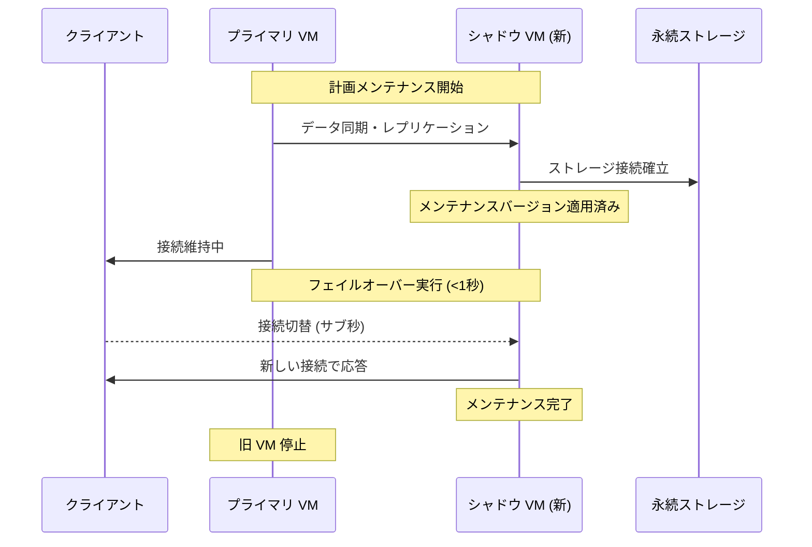

# Cloud SQL for MySQL / Cloud SQL for PostgreSQL: ニアゼロダウンタイム計画オペレーション - 対象インスタンスの拡大

**リリース日**: 2026-04-30

**サービス**: Cloud SQL for MySQL / Cloud SQL for PostgreSQL

**機能**: Near-Zero Downtime Planned Operations - Expanded Eligibility

**ステータス**: Fixed

[このアップデートのインフォグラフィックを見る](https://takech9203.github.io/google-cloud-news-summary/20260430-cloud-sql-near-zero-downtime-enhancements.html)

## 概要

Cloud SQL Enterprise Plus エディションで提供されるニアゼロダウンタイム計画オペレーション機能の対象インスタンスが拡大されました。これまで対象外であった特定の構成を持つインスタンスが、新たにサブ秒のダウンタイムでメンテナンスやスケーリングなどの計画オペレーションを実行できるようになります。

今回のアップデートでは、コネクタ強制(Connector Enforcement)が有効なインスタンスと、非 RFC 1918 IP アドレスを使用するプライベートサービスアクセス構成のインスタンスの 2 つが新たに対象に追加されました。これにより、セキュリティ要件やネットワーク構成上の理由でこれらの設定を使用していた Enterprise Plus ユーザーも、計画メンテナンス時のダウンタイムを 1 秒未満に抑えることが可能になります。

本アップデートは Cloud SQL for MySQL と Cloud SQL for PostgreSQL の両方に適用されます。

**アップデート前の課題**

- コネクタ強制が有効なインスタンスでは、ニアゼロダウンタイム計画オペレーションの対象外であり、メンテナンス時に通常のダウンタイムが発生していた
- 非 RFC 1918 IP アドレスを使用するプライベートサービスアクセス構成のインスタンスでは、ニアゼロダウンタイムの恩恵を受けられなかった
- これらの構成はセキュリティやネットワーク設計上の理由で採用されることが多く、ダウンタイム低減のために構成変更が困難だった

**アップデート後の改善**

- コネクタ強制が有効なインスタンスでもニアゼロダウンタイム計画オペレーションが利用可能になった
- 非 RFC 1918 IP アドレスを使用するプライベートサービスアクセス構成のインスタンスでもニアゼロダウンタイムが適用される
- セキュリティポリシーやネットワーク構成を変更することなく、計画メンテナンス時のダウンタイムを 1 秒未満に削減可能

## アーキテクチャ図



Cloud SQL のニアゼロダウンタイム計画オペレーションでは、メンテナンス適用済みのシャドウ VM を事前に準備し、データ同期後にサブ秒でフェイルオーバーを実行します。コネクタ強制や非 RFC 1918 IP 構成のインスタンスでも、このフェイルオーバープロセスが適用されるようになりました。

## サービスアップデートの詳細

### 主要機能

1. **コネクタ強制有効インスタンスの対象化**
   - Cloud SQL Auth Proxy や Cloud SQL Language Connectors の使用を強制する設定が有効なインスタンスで、ニアゼロダウンタイムが利用可能に
   - コネクタ強制はセキュリティ強化のために IAM 認証を必須とする設定であり、多くのエンタープライズ環境で採用されている
   - フェイルオーバー時もコネクタ経由の接続が維持される

2. **非 RFC 1918 IP アドレスでのプライベートサービスアクセス対応**
   - RFC 1918 以外の IP アドレス範囲(例: 100.64.0.0/10 などの CGNAT 範囲や、組織が所有するパブリック IP 範囲をプライベート利用する場合)でプライベートサービスアクセスを使用するインスタンスが対象に
   - IP アドレス枯渇対策として非 RFC 1918 アドレスを使用している大規模環境に恩恵

## 技術仕様

### ニアゼロダウンタイムの対象オペレーション

| オペレーション | 説明 |
|------|------|
| 定期メンテナンス | Cloud SQL が四半期ごとに実施する自動メンテナンス |
| セルフサービスメンテナンス | ユーザーが任意のタイミングで開始するメンテナンス |
| マイナーバージョンアップグレード | MySQL 8.0 / PostgreSQL のマイナーバージョン更新 |
| エディションアップグレード | Enterprise Plus へのインプレースアップグレード |
| データキャッシュの有効化/無効化 | data cache の切替 |
| インスタンススケールアップ | vCPU/メモリの増加 |
| インスタンススケールダウン | vCPU/メモリの削減(3 時間に 1 回まで) |

### 今回追加された対象構成

| 構成 | 説明 |
|------|------|
| コネクタ強制 | `connector_enforcement` が `REQUIRED` に設定されたインスタンス |
| 非 RFC 1918 IP + PSA | プライベートサービスアクセスで非 RFC 1918 アドレス範囲を使用するインスタンス |

### 前提条件 (MySQL)

| 項目 | 要件 |
|------|------|
| エディション | Cloud SQL Enterprise Plus |
| バイナリログ | 有効であること |
| sync_binlog | 1 (デフォルト値) |
| innodb_flush_log_at_trx_commit | 1 (デフォルト値) |
| replica_skip_errors | OFF (デフォルト値) |
| binlog_order_commit | ON (デフォルト値) |
| レプリカ | プライマリインスタンスのみ対象(レプリカは非対象) |

### 前提条件 (PostgreSQL)

| 項目 | 要件 |
|------|------|
| エディション | Cloud SQL Enterprise Plus |
| レプリカ | プライマリインスタンスのみ対象(レプリカは非対象) |
| Cloud SQL Auth Proxy/Connectors | 最新バージョンへの更新推奨 |

## 設定方法

### 前提条件

1. Cloud SQL Enterprise Plus エディションのインスタンスであること
2. プライマリインスタンスであること(リードレプリカは非対象)
3. Cloud SQL Auth Proxy または Language Connectors を使用している場合は最新バージョンに更新

### 手順

#### ステップ 1: ニアゼロダウンタイムのシミュレーション

```bash
# メンテナンスシミュレーションの実行
gcloud sql instances patch INSTANCE_NAME --simulate-maintenance-event
```

実際のメンテナンス前にシミュレーションを実行して、ダウンタイムが 1 秒未満であることを確認できます。インスタンスのバージョンは変更されません。

#### ステップ 2: コネクタ強制の確認(該当する場合)

```bash
# インスタンスの設定確認
gcloud sql instances describe INSTANCE_NAME --format="value(settings.connectorEnforcement)"
```

コネクタ強制が有効な場合、出力に `REQUIRED` と表示されます。

#### ステップ 3: 非 RFC 1918 IP 構成の確認(該当する場合)

```bash
# ネットワークピアリングのルートエクスポート設定確認
gcloud compute networks peerings list --network=VPC_NETWORK_NAME

# 非 RFC 1918 ルートのエクスポート設定
gcloud compute networks peerings update PEERING_CONNECTION \
  --network=VPC_NETWORK_NAME \
  --export-subnet-routes-with-public-ip \
  --project=PROJECT_ID
```

非 RFC 1918 IP を使用する場合、ネットワークピアリングで適切なルートエクスポートが設定されていることを確認してください。

## メリット

### ビジネス面

- **サービス可用性の向上**: セキュリティ重視の構成(コネクタ強制)を維持したまま、メンテナンス時のダウンタイムを最小化でき、SLA の改善に貢献
- **構成変更不要**: 既存のネットワーク設計やセキュリティポリシーを変更することなく、ニアゼロダウンタイムの恩恵を受けられる
- **運用負荷の軽減**: メンテナンスウィンドウの計画が容易になり、深夜帯のメンテナンス対応が不要に

### 技術面

- **99.99% SLA への貢献**: Enterprise Plus の高可用性 SLA をさらに強化
- **大規模環境への対応**: 非 RFC 1918 IP を使用する IP アドレス枯渇対策環境でもダウンタイムを最小化
- **セキュリティとの両立**: コネクタ強制によるセキュリティ強化とニアゼロダウンタイムを同時に実現

## デメリット・制約事項

### 制限事項

- Cloud SQL Enterprise Plus エディションのみ対象(Enterprise エディションでは利用不可)
- レプリカインスタンス(リードレプリカ含む)は非対象
- MySQL の場合、バイナリログが有効で特定のフラグがデフォルト値である必要がある
- スケールダウンは 3 時間に 1 回のみニアゼロダウンタイムが適用される

### 考慮すべき点

- メンテナンス中に高負荷のクエリが実行されている場合、ダウンタイムが 1 秒を超える可能性がある
- DDL 実行中にメンテナンスが行われた場合、タイムスタンプにずれが発生する可能性がある
- MySQL ではメンテナンス後にサーバー UID が変更される
- PostgreSQL では未ログテーブル(unlogged tables)がメンテナンス後に空になる
- クライアント側の接続設定(タイムアウト、コネクションプーリング等)が実際のダウンタイム体感に影響する

## ユースケース

### ユースケース 1: コネクタ強制を使用するエンタープライズ環境

**シナリオ**: 金融機関のデータベースでは、セキュリティポリシーにより Cloud SQL Auth Proxy 経由の接続のみを許可(コネクタ強制有効)している。これまではメンテナンス時に数分のダウンタイムが発生し、深夜帯にメンテナンスウィンドウを設定する必要があった。

**実装例**:
```bash
# コネクタ強制が有効なインスタンスでシミュレーション実行
gcloud sql instances patch my-finance-db --simulate-maintenance-event

# 結果確認: ダウンタイムが 1 秒未満であることを確認
```

**効果**: メンテナンスウィンドウを業務時間内に設定可能になり、運用チームの深夜対応が不要に

### ユースケース 2: 大規模 VPC での非 RFC 1918 IP 利用

**シナリオ**: 大規模なマルチプロジェクト環境で RFC 1918 アドレス空間が枯渇し、プライベートサービスアクセスに非 RFC 1918 アドレス(Privately Used Public IP)を割り当てている。数百台の Cloud SQL インスタンスのメンテナンスを効率的に管理したい。

**効果**: ネットワーク構成を変更せずに全インスタンスでニアゼロダウンタイムメンテナンスが適用され、四半期メンテナンスの影響を最小限に抑制

## 料金

ニアゼロダウンタイム計画オペレーション機能は Cloud SQL Enterprise Plus エディションに含まれる機能であり、追加料金は発生しません。Enterprise Plus エディション自体の料金が適用されます。

## 関連サービス・機能

- **Cloud SQL Enterprise Plus エディション**: ニアゼロダウンタイムを含む高可用性機能を提供するエディション
- **Cloud SQL Auth Proxy**: Cloud SQL への安全な接続を提供するプロキシ。コネクタ強制と組み合わせて使用
- **Cloud SQL Language Connectors**: 各プログラミング言語から Cloud SQL に安全に接続するためのライブラリ
- **プライベートサービスアクセス (PSA)**: VPC ネットワーク経由で Google マネージドサービスにプライベート接続する機能
- **Cloud SQL 高可用性 (HA)**: リージョナル構成による自動フェイルオーバー機能

## 参考リンク

- [インフォグラフィック](https://takech9203.github.io/google-cloud-news-summary/20260430-cloud-sql-near-zero-downtime-enhancements.html)
- [公式リリースノート](https://docs.cloud.google.com/release-notes#April_30_2026)
- [Cloud SQL メンテナンスについて (MySQL)](https://docs.cloud.google.com/sql/docs/mysql/maintenance)
- [Cloud SQL メンテナンスについて (PostgreSQL)](https://docs.cloud.google.com/sql/docs/postgres/maintenance)
- [Cloud SQL 可用性について](https://docs.cloud.google.com/sql/docs/mysql/availability)
- [Cloud SQL Enterprise Plus エディションの紹介](https://docs.cloud.google.com/sql/docs/mysql/editions-intro)
- [プライベート IP の構成](https://docs.cloud.google.com/sql/docs/mysql/private-ip)

## まとめ

今回のアップデートにより、コネクタ強制や非 RFC 1918 IP アドレスを使用するプライベートサービスアクセス構成という、エンタープライズ環境で一般的な構成のインスタンスでもニアゼロダウンタイム計画オペレーションが利用可能になりました。Cloud SQL Enterprise Plus をご利用の場合は、`gcloud sql instances patch --simulate-maintenance-event` コマンドでシミュレーションを実行し、実際のダウンタイムを事前に確認することを推奨します。

---

**タグ**: Cloud SQL, MySQL, PostgreSQL, Enterprise Plus, ニアゼロダウンタイム, メンテナンス
