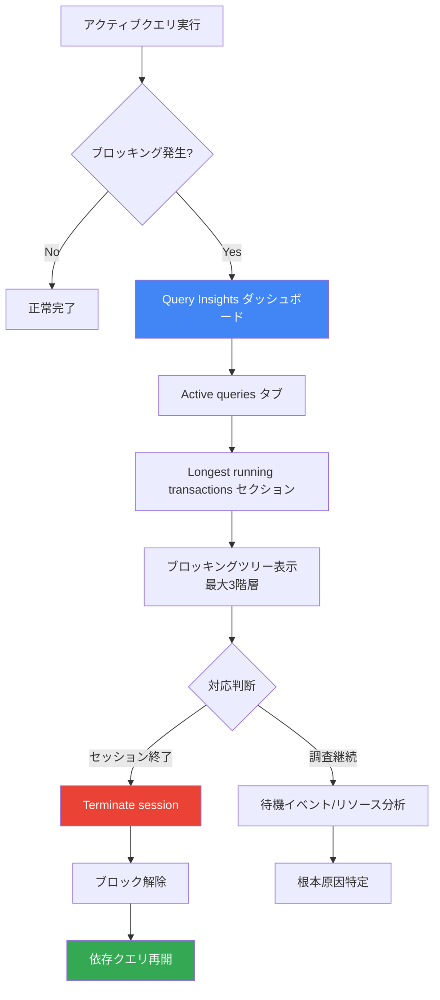

# Cloud SQL for SQL Server: ブロッキングクエリの表示と終了 (Preview)

**リリース日**: 2026-04-30

**サービス**: Cloud SQL for SQL Server

**機能**: View and Terminate Blocking Queries

**ステータス**: Preview

[このアップデートのインフォグラフィックを見る](https://takech9203.github.io/google-cloud-news-summary/20260430-cloud-sql-sql-server-blocking-queries.html)

## 概要

Cloud SQL for SQL Server に、ブロッキングクエリを可視化し終了させるオプション機能が Preview として追加されました。特定のアクティブクエリがブロックされたり、予想以上に長時間実行されている場合、そのクエリが他の依存クエリをブロックする連鎖的な問題を引き起こすことがあります。本機能により、データベース管理者はこれらの問題を迅速に特定し、解決することが可能になります。

この機能は Cloud SQL Enterprise Plus エディションの Query Insights ダッシュボード内で提供され、ブロッキング関係をツリー構造で最大 3 階層まで可視化できます。セッション ID、クエリテキスト、待機イベントタイプ、待機リソース、トランザクション待機時間などの詳細情報を確認した上で、問題のあるセッションを終了させることができます。

対象ユーザーは、SQL Server データベースのパフォーマンス管理を担当する DBA やインフラストラクチャエンジニア、およびアプリケーションのレイテンシ問題を調査する開発者です。

**アップデート前の課題**

- ブロッキングクエリの特定には、sys.dm_exec_requests や sys.dm_os_waiting_tasks などのシステム DMV を直接クエリする必要があり、専門知識が求められた
- ブロッキングチェーンの可視化が困難で、どのクエリがどのクエリをブロックしているかの関係性を把握するのに時間がかかった
- 問題のあるセッションを終了するには KILL コマンドを手動で実行する必要があり、Google Cloud コンソールからの操作ができなかった

**アップデート後の改善**

- Google Cloud コンソールの Query Insights ダッシュボードから、ブロッキング状態のクエリを直感的に確認できるようになった
- ブロッキング関係がツリー構造で最大 3 階層まで可視化され、依存関係を即座に把握できるようになった
- コンソール上のワンクリック操作でブロッキングセッションを終了でき、迅速な問題解決が可能になった

## アーキテクチャ図



Cloud SQL for SQL Server のブロッキングクエリ検出から終了までのフローを示しています。Query Insights ダッシュボードがブロッキング状態を検知し、管理者がツリー構造で依存関係を確認した上でセッション終了を実行できます。

## サービスアップデートの詳細

### 主要機能

1. **ブロッキングクエリの可視化**
   - Active queries タブの Longest running transactions セクションでブロッキング状態を確認可能
   - 砂時計アイコン: 他のクエリの完了を待機中であることを示す (数字付きの場合は依存クエリ数を表示)
   - ブロックアイコン: クエリが完了できず他のクエリをブロックしている可能性を示す
   - セッション ID を展開して最大 3 階層の深さまでブロッキングツリーを調査可能

2. **セッション終了機能**
   - コンソールから対象セッションの「Terminate session」をクリックして終了可能
   - 確認ダイアログで意図しない終了を防止
   - 終了後は Cloud SQL Studio で依存クエリを再実行可能

3. **スリープ状態セッションの詳細確認**
   - Active queries タブに表示されないスリープ状態のセッションについても、SQL スクリプトで最後に実行されたコマンドを確認可能
   - sys.dm_exec_connections と sys.dm_exec_sessions を結合して詳細情報を取得

## 技術仕様

### アクティブクエリの詳細情報

| 項目 | 説明 |
|------|------|
| Session ID | クエリのセッション識別子 |
| Query | SQL クエリテキスト |
| State of session | セッションの状態 |
| Query duration (seconds) | クエリの実行時間 (秒) |
| CPU time (ms) | リクエストが使用した CPU 時間 (ミリ秒) |
| Wait event type | ブロック時の待機イベントタイプ |
| Wait resource | ブロック時に待機中のリソース |
| Transaction wait duration (seconds) | ブロック時の待機時間 (秒) |
| Action | セッション終了などの操作 |

### 必要な IAM ロール

| 操作 | 必要なロール |
|------|------|
| インスタンスアクティビティの確認 | Cloud SQL Viewer (roles/cloudsql.viewer) |
| データベースアクティビティ・長時間トランザクションの確認 | Database Insights Viewer (roles/databaseinsights.viewer) |
| セッション終了 | Cloud SQL Editor (roles/cloudsql.editor) + Database Insights Operations Admin (roles/databaseinsights.operationsAdmin) |

### スリープ状態セッションの調査スクリプト

```sql
SELECT c.session_id, st.text, s.login_name,
       s.open_transaction_count, s.host_name, s.program_name
FROM sys.dm_exec_connections AS c
JOIN sys.dm_exec_sessions AS s ON c.session_id = s.session_id
CROSS APPLY sys.dm_exec_sql_text(c.most_recent_sql_handle) AS st
WHERE s.session_id = BLOCKING_SESSION_ID
```

## 設定方法

### 前提条件

1. Cloud SQL Enterprise Plus エディションのインスタンスを使用していること
2. Query Insights が有効化されていること
3. セッション終了には Cloud SQL Editor および Database Insights Operations Admin ロールが付与されていること

### 手順

#### ステップ 1: ブロッキングクエリ分析の有効化

1. Google Cloud コンソールで Cloud SQL Instances ページに移動
2. 対象インスタンス名をクリックして Overview ページを開く
3. 「Edit」をクリック
4. 「Query insights」セクションを展開
5. 「Enable Query insights」と「Enable Enterprise Plus features」の両方を選択
6. 「Blocked query analysis」を選択
7. 「Save」をクリック

#### ステップ 2: ブロッキングクエリの特定と終了

1. Cloud SQL Instances ページでインスタンスを選択
2. SQL ナビゲーションメニューから「Query insights」をクリック
3. 「Active queries」タブをクリック
4. 「Longest running transactions」セクションでブロッキング状態のクエリを確認
5. セッション ID を展開してブロッキングツリーを調査 (最大 3 階層)
6. 問題のクエリを特定したら「Terminate session」をクリック
7. 確認ダイアログで「Confirm」をクリック

## メリット

### ビジネス面

- **ダウンタイムの削減**: ブロッキング問題を迅速に特定・解決することで、アプリケーションの応答時間悪化やサービス停止を最小限に抑えられる
- **運用効率の向上**: コンソールから直感的に操作でき、専門的な SQL 知識がなくてもブロッキング問題に対処可能

### 技術面

- **可視性の向上**: ブロッキングチェーンを最大 3 階層まで視覚的に把握でき、根本原因の特定が容易になる
- **迅速な問題解決**: KILL コマンドの手動実行が不要で、コンソールからワンクリックでセッション終了が可能
- **自動更新**: ダッシュボードは 60 秒ごとに自動更新され、リアルタイムに近い状態を把握可能

## デメリット・制約事項

### 制限事項

- Cloud SQL Enterprise Plus エディションのインスタンスでのみ利用可能 (Enterprise エディションではセッション終了不可)
- Preview ステータスのため、本番環境での利用にはサポート制限がある可能性がある
- スリープ状態のセッションは Active queries タブには表示されないため、別途 SQL スクリプトでの確認が必要
- 長時間実行中の操作はセッション終了に時間がかかる場合がある

### 考慮すべき点

- セッションの終了はトランザクションのロールバックを引き起こすため、実行中のデータ変更が破棄される可能性がある
- セッション終了には適切な IAM ロール (Cloud SQL Editor + Database Insights Operations Admin) の両方が必要
- ブロッキングの根本原因 (未コミットトランザクション、ロック競合など) は別途調査・解決する必要がある

## ユースケース

### ユースケース 1: 本番環境でのデッドロック的状況の解消

**シナリオ**: 本番環境で複数のバッチ処理が同時に実行され、あるトランザクションが長時間ロックを保持したまま他のトランザクションをブロックしている状況。アプリケーションのタイムアウトエラーが増加し、ユーザーからの問い合わせが発生。

**実装例**:
```
1. Query Insights > Active queries タブを開く
2. Longest running transactions で砂時計/ブロックアイコンのクエリを特定
3. セッション ID を展開してブロッキングの根本原因を確認
4. 問題のセッションを「Terminate session」で終了
5. Cloud SQL Studio で影響を受けたクエリを再実行
```

**効果**: 従来は DBA が DMV を直接クエリしてブロッキングチェーンを手動で追跡する必要があったが、コンソールから数クリックで問題を解決でき、平均復旧時間 (MTTR) を大幅に短縮できる。

### ユースケース 2: 定期バッチ処理のパフォーマンス監視

**シナリオ**: 夜間バッチ処理中に特定のクエリが予想以上に長時間実行され、後続の処理がタイムアウトする問題が繰り返し発生している。

**効果**: ブロッキングクエリ分析を有効化することで、問題発生時にどのクエリがボトルネックになっているかを即座に特定でき、インデックス追加やクエリ最適化など恒久的な対策に繋げられる。

## 料金

ブロッキングクエリの表示・終了機能自体に追加料金は発生しませんが、Cloud SQL Enterprise Plus エディションのインスタンスが前提条件となります。Enterprise Plus エディションの料金については Cloud SQL の料金ページを参照してください。

## 関連サービス・機能

- **Query Insights**: クエリパフォーマンスの診断・分析ツール。ブロッキングクエリ分析はこの機能の拡張として提供
- **Cloud SQL Enterprise Plus エディション**: 高度なパフォーマンス、可用性、可観測性を提供するエディション。本機能の利用に必須
- **Database Insights MCP Server**: AI を活用したパフォーマンス分析が可能な MCP サーバー (GA)
- **Cloud SQL Studio**: SQL クエリの実行環境。セッション終了後のクエリ再実行に使用

## 参考リンク

- [インフォグラフィック](https://takech9203.github.io/google-cloud-news-summary/20260430-cloud-sql-sql-server-blocking-queries.html)
- [公式リリースノート](https://docs.cloud.google.com/release-notes#April_30_2026)
- [ドキュメント: Monitor active queries](https://docs.cloud.google.com/sql/docs/sqlserver/monitor-active-queries)
- [Cloud SQL Enterprise Plus エディション概要](https://docs.cloud.google.com/sql/docs/sqlserver/editions-intro)
- [料金ページ](https://cloud.google.com/sql/pricing)

## まとめ

Cloud SQL for SQL Server のブロッキングクエリの表示・終了機能は、データベースのパフォーマンス問題を迅速に特定・解決するための重要なツールです。Enterprise Plus エディションの Query Insights と統合されており、ブロッキング関係をツリー構造で視覚的に把握し、コンソールから直接セッションを終了できるため、DBA の運用負荷を大幅に軽減します。現在 Preview ステータスですが、本番環境でブロッキング問題に悩まされている場合は、Enterprise Plus エディションへのアップグレードとともに本機能の評価を推奨します。

---

**タグ**: Cloud SQL, SQL Server, ブロッキングクエリ, Preview, パフォーマンス管理
