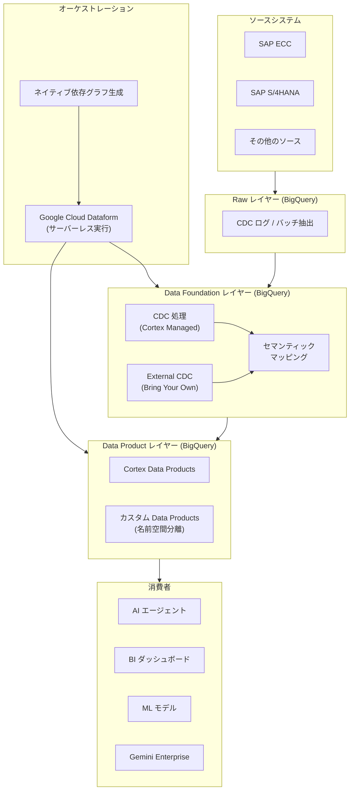

# Cortex Framework: Release 7

**リリース日**: 2026-04-30

**サービス**: Cortex Framework

**機能**: Cortex Framework Release 7

**ステータス**: Public Preview

[このアップデートのインフォグラフィックを見る](https://takech9203.github.io/google-cloud-news-summary/20260430-cortex-framework-release-7.html)

## 概要

Google Cloud Cortex Framework バージョン 7 がパブリックプレビューとしてリリースされました。本バージョンでは、高度にモジュラーなデプロイアーキテクチャ、Dataform を活用したデータオーケストレーションの簡素化、そして BigQuery による次世代 AI 対応データプロダクトのサポート強化が導入されています。

Cortex Framework は、エンタープライズシステムからの生データを信頼性の高いデータアセットに変換するデータプロダクトアクセラレータを提供します。バージョン 7 では、サーバーレスかつ BigQuery ネイティブな実行モデルを採用し、データパイプラインの構築・オーケストレーション・デプロイを大幅に効率化しています。

本アップデートは、SAP ECC や S/4HANA などのエンタープライズシステムからデータを抽出し、高度なアナリティクスや AI/エージェントユースケースに活用したい企業に最適です。

**アップデート前の課題**

- 以前のバージョンでは、Airflow VM や専用のコンピュートクラスタが必要であり、インフラストラクチャのオーバーヘッドが大きかった
- データパイプラインのデプロイ時に不要なテーブルも含めて処理する必要があり、コストと時間が増大していた
- カスタムフィールドやロジックの追加時に標準モデルとの競合が発生しやすく、アップグレードが困難だった
- 複雑なデータモデルの依存関係を手動で管理する必要があった

**アップデート後の改善**

- 必要なデータプロダクトのみを選択するモジュラーデプロイにより、不要なデータ処理を排除
- Dataform によるサーバーレス実行で Airflow VM やコンピュートクラスタが不要に
- ネイティブ依存グラフ生成による自動的な処理順序の解決
- 名前空間ベースの拡張性フレームワークにより、カスタムとCortex標準の明確な分離が可能に
- インクリメンタルローディングによる処理時間とコストの大幅削減

## アーキテクチャ図



Cortex Framework バージョン 7 の 3 層データアーキテクチャを示す図です。ソースシステムから Raw レイヤー、Data Foundation レイヤー、Data Product レイヤーを経て、AI エージェントや BI ダッシュボードなどの消費者に至るデータフローと、Dataform によるサーバーレスオーケストレーションの位置付けを示しています。

## サービスアップデートの詳細

### 主要機能

1. **モジュラーデプロイとスマート依存解決**
   - 必要なデータプロダクトを選択するだけで、フレームワークが自動的に必要なテーブルを特定・取得・変換
   - 不要なデータ処理を排除し、カスタムフィールドやロジックの追加が標準モデルに影響を与えない設計

2. **ネイティブ依存グラフ生成**
   - 複雑なデータモデルの処理順序を自動的に管理
   - 前提条件となるテーブルがデータファンデーションやデータプロダクトのデプロイ前に準備されることを保証

3. **Bring Your Own CDC (外部データファンデーション)**
   - 組み込みの CDC 処理をバイパスし、既存の CDC パイプラインを直接ファンデーションレイヤーに接続可能
   - 柔軟なアーキテクチャにより、様々なレプリケーションツールとの統合が容易

4. **サーバーレス BigQuery ネイティブ実行**
   - Google Cloud Dataform によるバージョン管理された SQL での変換処理
   - Airflow VM やコンピュートクラスタが不要で、インフラストラクチャのオーバーヘッドを最小化

5. **インクリメンタルローディング**
   - 前回実行以降の新規または変更データのみを処理
   - 大規模エンタープライズデータセットの処理時間とコストを大幅に削減

6. **高データフィデリティとセマンティクス**
   - カスタムフィールドの動的検出と取り込み
   - 暗号的なテーブル名からビジネスフレンドリーな用語へのセマンティックマッピング (例: SAP の `bukrs` を `Company Code` に変換)
   - AI 対応メタデータの自動付与
   - SAP TCURX テーブルを使用した正確な通貨小数点シフトなどの高度なロジック処理

7. **マルチシステム SAP サポート**
   - SAP ECC と SAP S/4HANA の両方に対する動的依存解決とロジック差分
   - 複数の SAP ERP システムからのシームレスなデータ統合

8. **拡張性フレームワーク**
   - 名前空間を使用したカスタムデータプロダクトと Cortex Data Products の明確な分離
   - Cortex の最新アップデートを適用してもカスタムワークに影響なし

## 技術仕様

### データアーキテクチャレイヤー

| レイヤー | 役割 | 説明 |
|---------|------|------|
| Raw レイヤー | 不変のランディングゾーン | CDC ログまたはバッチ抽出の格納。最小限の構造変更 |
| Data Foundation レイヤー | 標準化されたデータ表現 | 最新レコードのクリーンな表現。インクリメンタル更新 |
| Data Product レイヤー | 集計・KPI・ビジネスロジック | AI エージェント、Gemini、ML モデル、BI での直接消費用 |

### サポート対象ソースシステム

| ソースシステム | CDC サポート |
|---------------|-------------|
| SAP ECC | Cortex Managed CDC / External CDC |
| SAP S/4HANA | Cortex Managed CDC / External CDC |

### デプロイ構成例

```yaml
data:
  bigQueryLocation: US
  namespaces:
    - name: cortex
      path: cortex
  sources:
    - id: sap_raw
      projectId: YOUR_SOURCE_PROJECT_ID
      datasetId: cortex_sap_raw
  targets:
    - id: sap_foundation
      projectId: YOUR_TARGET_PROJECT_ID
      datasetId: cortex7_sap_data_foundation

deployment:
  targets:
    - type: dataform
      enabled: true
      targetSettings:
        repositoryProjectId: YOUR_REPO_PROJECT_ID
        repositoryRegion: us-central1
        repositoryName: cortex-repository
        workspaceName: dev
```

## 設定方法

### 前提条件

1. Google Cloud プロジェクトの作成と請求先アカウントの設定
2. BigQuery API、Dataform API、Cloud Resource Manager API の有効化
3. 適切な IAM ロールの付与:
   - ビルドプロジェクト: `roles/bigquery.jobUser`
   - ソースプロジェクト: `roles/bigquery.dataViewer`
   - ターゲットプロジェクト: `roles/bigquery.dataEditor`、`roles/dataform.admin`、`roles/serviceusage.serviceUsageAdmin`
4. GitHub リポジトリへのアクセス申請 (Request Access フォーム経由)

### 手順

#### ステップ 1: 構成ファイルの設定

```yaml
# config/config.yaml
data:
  bigQueryLocation: US
  sources:
    - id: sap_raw
      projectId: my-source-project
      datasetId: cortex_sap_raw
  targets:
    - id: sap_foundation
      projectId: my-target-project
      datasetId: cortex7_sap_data_foundation
  modules:
    foundation:
      - moduleId: sap_erp
        type: cortex.sap_erp
        dataSourceId: sap_raw
        dataTargetId: sap_foundation
    product:
      - moduleId: sap_purchasing_organizations
        type: cortex.purchasing_organizations
        dependsOn:
          sapModule: erp
        dataTargetId: product_target
```

プロジェクト ID、データセット ID、使用するモジュールを環境に合わせて設定します。

#### ステップ 2: ビルドとデプロイの実行

```bash
# ビルドとデプロイを一括実行
uv run cortex-build-and-deploy --config "config/config.yaml"
```

このコマンドにより、前提条件の検証、スキーマ情報に基づく .sqlx スクリプトのコンパイル、Dataform リポジトリへのアーティファクト同期が自動実行されます。

#### ステップ 3: 個別実行 (オプション)

```bash
# コンパイルのみ実行
uv run cortex-build --config "config/config.yaml"

# デプロイのみ実行
uv run cortex-deploy --config "config/config.yaml"
```

## メリット

### ビジネス面

- **Time-to-Value の短縮**: モジュラーデプロイと自動依存解決により、データパイプラインの構築時間を大幅に短縮
- **運用コストの削減**: サーバーレス実行により Airflow VM やコンピュートクラスタの管理コストを排除
- **AI 活用の加速**: AI 対応メタデータとエージェントフレンドリーなデータモデルにより、エンタープライズ AI エージェントの構築を加速
- **マルチ ERP 統合**: 複数の SAP システムからのデータを統合的に管理可能

### 技術面

- **インフラ簡素化**: Dataform ベースのサーバーレスアーキテクチャで、インフラ管理の負担を大幅に軽減
- **インクリメンタル処理**: 変更データのみの処理により、BigQuery の処理時間とコストを最適化
- **拡張性**: 名前空間による分離で、カスタマイズとアップグレードの両立を実現
- **データ品質**: セマンティックマッピングと動的スキーマ対応による高いデータフィデリティ

## デメリット・制約事項

### 制限事項

- 現在パブリックプレビュー段階であり、GA ではない
- サポート対象ソースシステムは SAP ECC と SAP S/4HANA に限定 (バージョン 7 時点)
- GitHub リポジトリへのアクセスには事前申請が必要

### 考慮すべき点

- 既存の Cortex Framework (旧バージョン) からの移行計画が必要
- Dataform の利用が前提となるため、既存の Airflow ベースのワークフローからの移行を検討する必要がある
- マルチリージョン (US, EU) と多数の単一リージョンをサポートするが、Dataform リポジトリのリージョンと BigQuery データセットのリージョンを一致させる必要がある

## ユースケース

### ユースケース 1: SAP ERP データの AI エージェント活用

**シナリオ**: 大手製造業が SAP S/4HANA のデータを活用して、調達最適化の AI エージェントを構築したい場合

**実装例**:
```yaml
modules:
  product:
    - moduleId: sap_purchasing_organizations
      type: cortex.purchasing_organizations
      dependsOn:
        sapModule: erp
      dataTargetId: product_target
```

**効果**: AI 対応メタデータ付きのデータプロダクトにより、BigQuery Conversational Analytics や Gemini Enterprise から直接クエリ可能なデータ基盤を迅速に構築

### ユースケース 2: マルチ SAP システム統合

**シナリオ**: グローバル企業が SAP ECC (レガシー) と SAP S/4HANA (新規) の両方のシステムからデータを統合し、統一的な分析基盤を構築したい場合

**効果**: 動的依存解決とロジック差分により、両システムのデータを並列にデプロイ・統合。カスタムフィールドも自動的に検出・取り込み

### ユースケース 3: サプライヤー支出分析

**シナリオ**: 調達部門が SAP ERP データを基に、サプライヤーごとの支出ポジションを分析し、コスト最適化の意思決定を支援したい場合

**効果**: Cortex Framework のソリューションサンプル「Supplier Spend Analysis」を活用し、即座にインサイトを取得可能

## 利用可能リージョン

BigQuery データセットとして以下のリージョングループをサポート:

| リージョングループ | 主要リージョン |
|-------------------|---------------|
| マルチリージョン | US, EU |
| アメリカ | us-central1, us-east1, us-east4, us-west1 など 14 リージョン |
| ヨーロッパ | europe-west1, europe-north1, europe-west3 など 13 リージョン |
| アジア太平洋 | asia-northeast1 (東京), asia-northeast2 (大阪), asia-southeast1 など 11 リージョン |
| 中東・アフリカ | me-central1, me-west1, africa-south1 |

Dataform リポジトリはマルチリージョン (US, EU) を除く全リージョンで利用可能です。

## 関連サービス・機能

- **BigQuery**: データの格納・処理・分析の中核プラットフォーム
- **Dataform**: SQL ベースのデータ変換オーケストレーション
- **BigQuery Connector for SAP**: SAP から BigQuery へのデータレプリケーション
- **BigQuery Toolkit for SAP**: SAP ABAP SDK を使用した BigQuery 連携
- **BigQuery Conversational Analytics**: データプロダクトの対話的分析
- **Gemini Enterprise**: AI エージェントによるデータ活用

## 参考リンク

- [インフォグラフィック](https://takech9203.github.io/google-cloud-news-summary/20260430-cortex-framework-release-7.html)
- [公式リリースノート](https://docs.cloud.google.com/release-notes#April_30_2026)
- [Cortex Framework ドキュメント](https://docs.cloud.google.com/cortex/docs/overview)
- [デプロイ手順](https://docs.cloud.google.com/cortex/docs/deployment)
- [アクセス申請](https://docs.cloud.google.com/cortex/docs/request-access)
- [サポート対象リージョン](https://docs.cloud.google.com/cortex/docs/supported-locations)

## まとめ

Cortex Framework Release 7 は、エンタープライズデータパイプラインの構築と運用を根本的に変革するアップデートです。Dataform によるサーバーレス実行、モジュラーデプロイ、そして AI 対応メタデータの自動付与により、SAP データから AI/エージェントユースケースまでの Time-to-Value を大幅に短縮します。SAP ERP データを BigQuery で活用している、またはこれから活用を検討している企業は、早期にパブリックプレビューへのアクセスを申請し、バージョン 7 の新機能を評価することを推奨します。

---

**タグ**: Cortex Framework, BigQuery, Dataform, AI, データパイプライン, モジュラーアーキテクチャ
