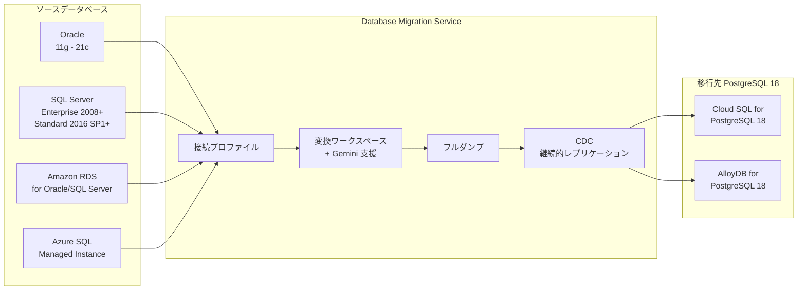

# Cloud Database Migration Service: PostgreSQL 18 サポート (異種データベース移行)

**リリース日**: 2026-04-30

**サービス**: Cloud Database Migration Service

**機能**: PostgreSQL 18 Support for Heterogeneous Migrations

**ステータス**: GA (一般提供)

[このアップデートのインフォグラフィックを見る](https://takech9203.github.io/google-cloud-news-summary/20260430-database-migration-service-postgresql-18.html)

## 概要

Database Migration Service の異種データベース移行 (Heterogeneous Migrations) において、移行先として PostgreSQL バージョン 18 がサポートされました。これにより、Oracle や SQL Server から Cloud SQL for PostgreSQL および AlloyDB for PostgreSQL への移行時に、最新の PostgreSQL 18 を移行先データベースとして選択できるようになりました。

異種データベース移行とは、Oracle や SQL Server といった異なるデータベースエンジンから PostgreSQL への移行を指します。Database Migration Service は、スキーマやコードオブジェクトの自動変換、継続的なデータレプリケーション (CDC)、Gemini を活用したスキーマ変換支援など、包括的な移行ツールを提供しています。今回のアップデートにより、これらの機能がすべて PostgreSQL 18 を移行先として利用可能になります。

このアップデートは、最新バージョンの PostgreSQL を本番環境で利用したい企業や、既存の Oracle/SQL Server ワークロードを Google Cloud のマネージド PostgreSQL サービスへモダナイズしたい組織にとって重要な機能強化です。

**アップデート前の課題**

- 異種データベース移行で PostgreSQL 18 を移行先として選択できなかった
- Oracle や SQL Server から最新の PostgreSQL 18 環境へ直接移行するには手動での対応が必要だった
- PostgreSQL 18 の新機能を活用したい場合、一旦古いバージョンに移行した後にメジャーバージョンアップグレードが必要だった

**アップデート後の改善**

- Oracle および SQL Server から Cloud SQL for PostgreSQL 18 への直接移行が可能になった
- Oracle および SQL Server から AlloyDB for PostgreSQL 18 への直接移行が可能になった
- 移行と同時に最新の PostgreSQL 18 環境を構築でき、追加のバージョンアップグレード作業が不要になった

## アーキテクチャ図



このフローチャートは、異種データベース移行の全体的なデータフローを示しています。ソースデータベースから Database Migration Service を経由し、スキーマ変換とデータ移行を経て、PostgreSQL 18 の移行先に到達します。

## サービスアップデートの詳細

### 主要機能

1. **サポートされる移行先データベース**
   - Cloud SQL for PostgreSQL 18 (Oracle からの移行)
   - Cloud SQL for PostgreSQL 18 (SQL Server からの移行)
   - AlloyDB for PostgreSQL 18 (Oracle からの移行)
   - AlloyDB for PostgreSQL 18 (SQL Server からの移行)

2. **Gemini 支援によるスキーマ変換**
   - 自動変換 (Auto-conversion): 決定論的変換ルールに加え Gemini による品質向上
   - 変換アシスタント: コード説明、問題修正提案、コード最適化
   - パターンマッチング: 手動修正のパターンを学習し他のオブジェクトに適用

3. **移行タイプ**
   - ワンタイム移行: フルダンプのみの一回限りの移行
   - 継続的移行: フルダンプ後に CDC (Change Data Capture) による継続的レプリケーション

4. **フェイルバックレプリケーション**
   - SQL Server から AlloyDB への移行後、元のソースデータベースへのデータ逆方向レプリケーションをサポート

## 技術仕様

### サポートされるソースとデスティネーションの組み合わせ

| ソースデータベース | 移行先 (PostgreSQL 18 対応) |
|------|------|
| Oracle 11g (11.2.0.4) - 21c | Cloud SQL for PostgreSQL 12-18 |
| Oracle 11g (11.2.0.4) - 21c | AlloyDB for PostgreSQL 12-18 |
| Amazon RDS for SQL Server | Cloud SQL for PostgreSQL 12-18 |
| Amazon RDS for SQL Server | AlloyDB for PostgreSQL 14-18 |
| Azure SQL Managed Instance | Cloud SQL for PostgreSQL 12-18 |
| Azure SQL Managed Instance | AlloyDB for PostgreSQL 14-18 |
| Self-managed SQL Server (Enterprise 2008+) | Cloud SQL for PostgreSQL 12-18 |
| Self-managed SQL Server (Standard 2016 SP1+) | AlloyDB for PostgreSQL 14-18 |

### 必要な IAM ロール

| ロール | 用途 |
|------|------|
| roles/datamigration.admin | Database Migration Service の管理操作 |
| roles/alloydb.admin | AlloyDB クラスタ・インスタンスの管理 (AlloyDB 移行時) |
| roles/cloudsql.admin | Cloud SQL インスタンスの管理 (Cloud SQL 移行時) |

## 設定方法

### 前提条件

1. Google Cloud プロジェクトの作成・選択
2. Database Migration Service API、Compute Engine API、Cloud Storage API の有効化
3. 移行先に応じて AlloyDB for PostgreSQL Admin API または Cloud SQL Admin API の有効化
4. 必要な IAM ロールの付与

### 手順

#### ステップ 1: 接続プロファイルの作成

```bash
# ソースデータベースへの接続プロファイルを作成
gcloud database-migration connection-profiles create SOURCE_PROFILE_ID \
    --region=REGION \
    --type=ORACLE \
    --oracle-host=SOURCE_HOST \
    --oracle-port=1521 \
    --oracle-username=USERNAME \
    --oracle-password=PASSWORD
```

ソースデータベース (Oracle または SQL Server) への接続情報を設定します。

#### ステップ 2: 変換ワークスペースの作成とスキーマ変換

Google Cloud Console で変換ワークスペースを作成し、ソースのスキーマとコードオブジェクトを PostgreSQL 構文に変換します。Gemini 自動変換を有効にすると、変換品質が向上します。

#### ステップ 3: 移行ジョブの作成と実行

```bash
# 移行ジョブを作成 (PostgreSQL 18 を移行先として指定)
gcloud database-migration migration-jobs create MIGRATION_JOB_ID \
    --region=REGION \
    --type=CONTINUOUS \
    --source=SOURCE_PROFILE_ID \
    --destination=DESTINATION_PROFILE_ID
```

移行タイプ (ワンタイムまたは継続的) を選択し、移行ジョブを開始します。

## メリット

### ビジネス面

- **移行の一本化**: 最新の PostgreSQL 18 へ直接移行できるため、中間バージョンを経由する必要がなく、プロジェクトの期間とコストを削減
- **最新機能の即時活用**: PostgreSQL 18 の性能改善や新機能を移行完了時点から利用可能
- **マルチクラウド対応**: AWS RDS、Azure SQL からの移行もサポートされ、マルチクラウド戦略の柔軟性が向上

### 技術面

- **Gemini によるスキーマ変換の自動化**: AI を活用した変換により手動修正の量を大幅に削減
- **ダウンタイム最小化**: CDC ベースの継続的レプリケーションにより、カットオーバー時のダウンタイムを最小限に抑制
- **包括的な監視**: テーブルレベルの観測機能により、移行の進捗と健全性をきめ細かく監視可能

## デメリット・制約事項

### 制限事項

- SQL Server Standard edition 2008-2014 からの移行は非サポート
- SQL Server Express および Web edition からの移行は非サポート
- Oracle Autonomous Database からの移行は非サポート
- Database Migration Service はリージョナル製品であり、移行に関連するすべてのエンティティは単一リージョンに配置する必要がある

### 考慮すべき点

- ワンタイム移行の場合、フルダンプ中はソースデータベースへの書き込みを停止することが推奨される
- スキーマ変換には手動調整が必要な場合があり、特に複雑なストアドプロシージャやトリガーの変換は検証が必要
- ネットワーク接続性 (VPC ピアリング、Private Service Connect など) の事前準備が必要な場合がある

## ユースケース

### ユースケース 1: Oracle から AlloyDB for PostgreSQL 18 への移行

**シナリオ**: オンプレミスの Oracle 19c で運用している基幹業務システムを、Google Cloud の AlloyDB for PostgreSQL 18 へ移行し、運用コスト削減とパフォーマンス向上を実現する。

**効果**: AlloyDB の列指向エンジンや AI 統合機能を PostgreSQL 18 環境で活用でき、分析ワークロードのパフォーマンスが大幅に向上する。ライセンスコストの削減も見込める。

### ユースケース 2: SQL Server から Cloud SQL for PostgreSQL 18 へのマルチクラウド移行

**シナリオ**: Amazon RDS for SQL Server で運用しているアプリケーションを、Google Cloud の Cloud SQL for PostgreSQL 18 へ移行し、マルチクラウド戦略の一環としてベンダーロックインを回避する。

**効果**: CDC による継続的レプリケーションにより、移行中もアプリケーションの稼働を維持できる。PostgreSQL 18 のオープンソース互換性により、将来の移植性も確保される。

### ユースケース 3: Azure SQL から AlloyDB への段階的移行

**シナリオ**: Azure SQL Managed Instance で運用中のデータウェアハウスを、AlloyDB for PostgreSQL 18 へ移行。Gemini 支援のスキーマ変換を活用し、複雑な T-SQL コードの変換を効率化する。

**効果**: Gemini の自動変換とパターンマッチング機能により、数千のオブジェクトを持つ大規模スキーマの変換工数を大幅に削減。フェイルバックレプリケーションにより、移行後もロールバックオプションを確保できる。

## 関連サービス・機能

- **AlloyDB for PostgreSQL**: Google Cloud のフルマネージド PostgreSQL 互換データベース。PostgreSQL 18 は 2026年3月18日に GA
- **Cloud SQL for PostgreSQL**: Google Cloud のフルマネージド PostgreSQL データベース。PostgreSQL 18 をサポート
- **Database Migration Service 同種移行**: PostgreSQL 間の移行もサポート (PostgreSQL 18 対応済み)
- **Gemini for Google Cloud**: スキーマ変換の自動化と品質向上に利用される AI 機能

## 参考リンク

- [インフォグラフィック](https://takech9203.github.io/google-cloud-news-summary/20260430-database-migration-service-postgresql-18.html)
- [公式リリースノート](https://docs.cloud.google.com/release-notes#April_30_2026)
- [サポートされるソースとデスティネーション](https://docs.cloud.google.com/database-migration/docs/supported-databases)
- [Oracle から Cloud SQL for PostgreSQL への移行](https://docs.cloud.google.com/database-migration/docs/oracle-to-postgresql/scenario-overview)
- [Oracle から AlloyDB for PostgreSQL への移行](https://docs.cloud.google.com/database-migration/docs/oracle-to-alloydb/scenario-overview)
- [SQL Server から Cloud SQL for PostgreSQL への移行](https://docs.cloud.google.com/database-migration/docs/sqlserver-to-csql-pgsql/scenario-overview)
- [SQL Server から AlloyDB for PostgreSQL への移行](https://docs.cloud.google.com/database-migration/docs/sqlserver-to-alloydb/scenario-overview)
- [Gemini 支援によるコード変換](https://docs.cloud.google.com/database-migration/docs/convert-sql-with-dms)
- [料金ページ](https://docs.cloud.google.com/database-migration/pricing)

## まとめ

今回のアップデートにより、Database Migration Service の異種データベース移行で PostgreSQL 18 が移行先としてサポートされ、Oracle や SQL Server から最新の PostgreSQL 環境への直接移行が可能になりました。既に AlloyDB for PostgreSQL 18 は 2026年3月に GA となっており、Database Migration Service のサポート追加により、エンドツーエンドの移行パスが完成しました。Oracle や SQL Server から Google Cloud への移行を検討している組織は、最新の PostgreSQL 18 を移行先として選択し、Gemini 支援のスキーマ変換を活用して移行を効率化することを推奨します。

---

**タグ**: Database Migration Service, PostgreSQL 18, Cloud SQL, AlloyDB, 異種データベース移行
