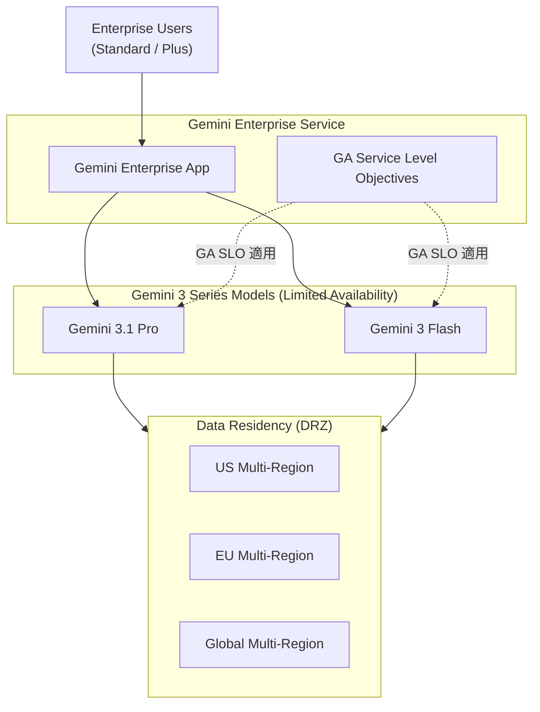

# Gemini Enterprise: Gemini 3.1 Pro および 3 Flash が Limited Availability で利用可能に

**リリース日**: 2026-04-30

**サービス**: Gemini Enterprise

**機能**: Access to Gemini 3.1 Pro and 3 Flash in Limited Availability

**ステータス**: Limited Availability (Pre-GA)

[このアップデートのインフォグラフィックを見る](https://takech9203.github.io/google-cloud-news-summary/20260430-gemini-enterprise-3-1-pro-flash.html)

## 概要

Gemini Enterprise ユーザーが Gemini 3.1 Pro および Gemini 3 Flash を Limited Availability ステータスで利用できるようになりました。これにより、Gemini Enterprise アプリのユーザーは、モデルが Preview 段階にある間も、一般提供 (GA) レベルの Service Level Objectives (SLOs) を Gemini Enterprise サービスの一部として享受できます。

今回の「Limited Availability」は、Pre-GA Offering でありながら、将来的に本番環境レベルの GA SLO を提供することを意図した新しいカテゴリです。Google は現在、モデルのパフォーマンスを監視し、適切な長期 SLO を決定中であり、近日中に正式な SLO を発表する予定です。

このアップデートの主な対象は、Gemini Enterprise Standard および Plus エディションを利用している企業ユーザーです。Gemini 3 シリーズの最新モデルを本番ワークロードで早期に活用したい組織にとって、大きな価値を持つ発表です。

**アップデート前の課題**

- Gemini 3.1 Pro および 3 Flash は Preview 段階であり、本番ワークロードでの利用には GA レベルの SLO が保証されていなかった
- Enterprise ユーザーが最新モデルを業務利用する際、サービスレベルの保証がなく安心して導入できなかった
- Preview モデルに対する Data Residency (DRZ) のコミットメントが限定的だった

**アップデート後の改善**

- Limited Availability により、Preview モデルでありながら GA レベルの SLO が適用される
- Gemini Enterprise ユーザーは Gemini 3.1 Pro と 3 Flash を本番ワークロードで利用可能
- US/EU/グローバルのマルチリージョンで Data Residency (DRZ) がサポートされる
- Cloud Data Processing Addendum に基づく個人データ処理が可能

## アーキテクチャ図

Gemini Enterprise ユーザーがアプリを通じて Gemini 3.1 Pro および 3 Flash にアクセスし、GA レベルの SLO とデータレジデンシー保証のもとで利用する構成を示しています。

## サービスアップデートの詳細

### 主要機能

1. **Gemini 3.1 Pro へのアクセス**
   - 最先端の推論能力を持つ Gemini モデル
   - テキスト、コード、画像、音声、動画、PDF を入力としてサポート
   - 1M トークンのコンテキストウィンドウで大規模なデータセットや複雑な問題に対応
   - ソフトウェアエンジニアリングやエージェンティックワークフローに最適化

2. **Gemini 3 Flash へのアクセス**
   - Gemini 3 Pro の推論能力と Flash ラインの低レイテンシ・高効率を両立
   - 日常タスクから複雑なエージェンティックワークフローまで対応
   - Thinking Level パラメータによる推論レベルの制御 (minimal, low, medium, high)
   - Computer Use 機能のサポート (Preview)

3. **GA レベルの SLO 提供**
   - Preview モデルでありながら本番グレードのサービスレベル目標を適用
   - 可用性とレイテンシに関する定量的な保証
   - 長期 SLO は Google が現在策定中で近日発表予定

## 技術仕様

### モデル比較

| 項目 | Gemini 3.1 Pro | Gemini 3 Flash |
|------|---------------|----------------|
| 最大入力トークン | 1,048,576 | 1,048,576 |
| 最大出力トークン | 65,536 | 65,536 |
| 入力モダリティ | テキスト, コード, 画像, 音声, 動画, PDF | テキスト, コード, 画像, 音声, 動画, PDF |
| 出力モダリティ | テキスト | テキスト |
| Thinking | サポート | サポート |
| Function Calling | サポート | サポート |
| Grounding with Google Search | サポート | サポート |
| Computer Use | 非サポート | サポート (Preview) |
| 最適化領域 | SWE、エージェンティック | 低レイテンシ、高効率 |

### アクセス制限事項

| 項目 | 詳細 |
|------|------|
| アクセス方法 | Gemini Enterprise インターフェースおよび統合サーフェスのみ |
| 直接 API アクセス | 非対応 (Vertex AI API からはアクセス不可) |
| データレジデンシー (DRZ) | US/EU/グローバルマルチリージョンでサポート |
| 国別リージョン (IN, SG, UK, CA) | 近日対応予定 |
| MLP (機械学習処理) | US/EU/グローバルマルチリージョンでサポート |

## メリット

### ビジネス面

- **本番環境での早期採用**: Preview モデルでありながら GA レベルの SLO が保証されるため、最新モデルを安心して本番ワークロードに導入できる
- **データコンプライアンス**: Cloud Data Processing Addendum に基づく個人データ処理が可能で、規制要件を満たしながら最新 AI モデルを活用できる
- **競争優位性**: 最新の推論能力を持つモデルを早期に業務に取り入れることで、競争力を維持できる

### 技術面

- **高度な推論能力**: Gemini 3.1 Pro は改善されたトークン効率と思考能力を提供し、複雑な問題解決が可能
- **柔軟なモデル選択**: 用途に応じて Pro (高精度) と Flash (高効率) を使い分けることができる
- **マルチモーダル対応**: テキスト、画像、音声、動画、PDF など多様な入力形式に対応し、幅広いユースケースをカバー

## デメリット・制約事項

### 制限事項

- Vertex AI API を通じた直接アクセスは不可。Gemini Enterprise インターフェースからのみ利用可能
- 国別リージョン (インド、シンガポール、英国、カナダ) での DRZ および MLP は未対応 (近日対応予定)
- Limited Availability のため、GA の完全な契約コミットメント (ライフタイムサポートや標準的な 12 か月の非推奨通知) は提供されない
- 長期 SLO は現在策定中であり、具体的な数値は未公表

### 考慮すべき点

- モデルのパフォーマンスは Google が引き続きモニタリング中であり、SLO の具体的な値は今後変更される可能性がある
- Limited Availability は Pre-GA Offering であるため、モデルの可用性やパラメータに変更が入る可能性がある
- 直接 API アクセスが必要なワークロードには利用できないため、自動化パイプラインへの組み込みには制限がある

## ユースケース

### ユースケース 1: エンタープライズにおける複雑なドキュメント分析

**シナリオ**: 法務部門が大量の契約書 PDF を Gemini 3.1 Pro の 1M トークンコンテキストウィンドウを活用して分析し、リスク条項を特定する。

**効果**: Preview モデルでありながら GA レベルの SLO が保証されるため、ミッションクリティカルな業務でも安心して利用でき、高精度な推論による法的リスクの早期発見が可能になる。

### ユースケース 2: カスタマーサポートの効率化

**シナリオ**: カスタマーサポートチームが Gemini 3 Flash を活用し、問い合わせ内容の自動分類とドラフト回答生成を行う。低レイテンシ特性を活かしてリアルタイムに近いレスポンスを実現する。

**効果**: Flash モデルの高効率性により大量の問い合わせを処理しながら、SLO 保証により安定したサービス品質を維持できる。

## 利用可能リージョン

| リージョン | DRZ サポート | MLP サポート |
|-----------|-------------|-------------|
| US マルチリージョン | サポート済み | サポート済み |
| EU マルチリージョン | サポート済み | サポート済み |
| グローバルマルチリージョン | サポート済み | サポート済み |
| 国別リージョン (IN, SG, UK, CA) | 近日対応予定 | 近日対応予定 |

## 関連サービス・機能

- **Gemini Enterprise Agent Platform (Vertex AI)**: Gemini 3.1 Pro および 3 Flash の API アクセスは Agent Platform 経由で利用可能 (Limited Availability の対象外)
- **Gemini Enterprise Standard/Plus エディション**: 最新モデルへの優先アクセスが含まれるサブスクリプション
- **NotebookLM Enterprise**: Gemini Enterprise の一部として提供される AI ノートブックサービス
- **Gemini Enterprise Custom MCP Server**: 2026 年 4 月 28 日にプレビュー開始されたカスタム MCP サーバー接続機能

## 参考リンク

- [インフォグラフィック](https://takech9203.github.io/google-cloud-news-summary/20260430-gemini-enterprise-3-1-pro-flash.html)
- [公式リリースノート](https://docs.cloud.google.com/release-notes#April_30_2026)
- [Known Limitations - Using Gemini 3.1 Pro and 3 Flash in Limited Availability](https://docs.cloud.google.com/gemini/enterprise/docs/known-limitations#using-gemini-3-preview)
- [Gemini Enterprise エディション比較](https://docs.cloud.google.com/gemini/enterprise/docs/editions)
- [Gemini 3.1 Pro ドキュメント](https://docs.cloud.google.com/vertex-ai/generative-ai/docs/models/gemini/3-1-pro)
- [Gemini 3 Flash ドキュメント](https://docs.cloud.google.com/vertex-ai/generative-ai/docs/models/gemini/3-flash)

## まとめ

今回の Limited Availability リリースにより、Gemini Enterprise ユーザーは最新の Gemini 3.1 Pro と 3 Flash モデルを GA レベルの SLO 保証付きで本番ワークロードに導入できるようになりました。直接 API アクセスは不可という制約があるものの、Gemini Enterprise アプリを通じた高度な AI 活用が可能です。Enterprise Standard または Plus エディションを利用中の組織は、管理コンソールでモデルの有効化設定を確認し、早期の検証・導入を推奨します。

---

**タグ**: Gemini Enterprise, Gemini 3.1 Pro, Gemini 3 Flash, Limited Availability, AI, LLM
