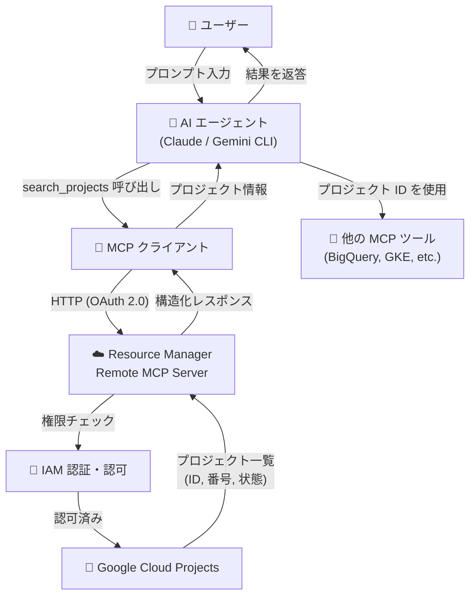

# Resource Manager: Remote MCP Server GA

**リリース日**: 2026-04-30

**サービス**: Resource Manager

**機能**: Remote MCP Server GA (一般提供開始)

**ステータス**: GA (Generally Available)

📊 [このアップデートのインフォグラフィックを見る](https://takech9203.github.io/google-cloud-news-summary/20260430-resource-manager-remote-mcp-server-ga.html)

## 概要

Resource Manager のリモート MCP (Model Context Protocol) サーバーが一般提供 (GA) となった。このリモート MCP サーバーにより、AI エージェントがユーザーの権限に基づいて Google Cloud プロジェクトを動的に検索・識別することが可能になる。エージェントはプロジェクト ID、プロジェクト番号、ライフサイクル状態などの正確な識別子を取得し、後続のリソース操作に活用できる。

MCP は Anthropic が開発したオープンソースプロトコルで、LLM やAI アプリケーションが外部データソースに接続する方法を標準化する。Google Cloud のリモート MCP サーバーは、エンタープライズレベルのガバナンス、セキュリティ、アクセス制御を備えたマネージド HTTP エンドポイントとして提供される。

本アップデートにより、Claude、Gemini CLI、カスタム AI アプリケーションなどの MCP ホストが Resource Manager の `search_projects` ツールを本番環境で利用できるようになった。AI エージェントがプロジェクトのコンテキストを自動解決することで、ユーザーがプロジェクト ID を手動で指定する必要がなくなる。

**アップデート前の課題**

- AI エージェントが Google Cloud プロジェクトを操作する際、ユーザーが手動でプロジェクト ID を指定する必要があった
- エージェントがアクセス可能なプロジェクトを動的に発見する標準的な方法がなかった
- Resource Manager MCP サーバーは Preview 段階であり、本番ワークロードでの SLA が保証されていなかった
- プロジェクト情報の取得に REST API を直接呼び出す実装が必要で、MCP クライアントとの統合が複雑だった

**アップデート後の改善**

- AI エージェントが MCP プロトコル経由でプロジェクトを動的に検索・識別可能になった
- GA によりエンタープライズ SLA が適用され、本番環境での利用が推奨される状態になった
- `search_projects` ツールにより、親リソース (フォルダ/組織)、プロジェクト ID、ラベルなど多様なフィルタでプロジェクトを検索可能
- IAM deny ポリシーによる細粒度のアクセス制御が可能になり、セキュリティ要件の厳しい環境でも導入しやすくなった

## アーキテクチャ図



AI エージェントが Resource Manager MCP サーバーを介してプロジェクトを動的に発見し、取得したプロジェクト ID を他のサービスの MCP ツール呼び出しに活用するフローを示す。

## サービスアップデートの詳細

### 主要機能

1. **search_projects ツール**
   - AI エージェントがアクセス権限のある全プロジェクトを検索可能
   - 親リソース (`parent:folders/223`)、プロジェクト ID (`projectId:my-project`)、ラベル、表示名などでフィルタリング
   - プロジェクト ID、プロジェクト番号、ライフサイクル状態を構造化データとして返却
   - ページネーション対応 (`pageToken`, `pageSize`)

2. **暗黙的コンテキスト解決**
   - ユーザーがプロジェクト ID を明示しなくても、エージェントが自動的に適切なプロジェクトを特定
   - 例: 「payment-processor サービスの状態を確認して」 -> エージェントが `search_projects` で該当プロジェクトを検索し、確認後に操作を実行

3. **IAM deny ポリシーによるアクセス制御**
   - プリンシパル単位でのアクセス制御
   - ツールプロパティ (read-only など) による制御
   - OAuth クライアント ID によるアプリケーション単位の制御

4. **グローバル/リージョナルエンドポイント**
   - グローバルエンドポイント: `cloudresourcemanager.googleapis.com/mcp`
   - リージョナルエンドポイント: `cloudresourcemanager.{REGION}.rep.googleapis.com/mcp`
   - データレジデンシー要件に対応可能

## 技術仕様

### MCP サーバー設定

| 項目 | 詳細 |
|------|------|
| サーバー名 | Resource Manager MCP server |
| エンドポイント | `https://cloudresourcemanager.googleapis.com/mcp` |
| トランスポート | HTTP (Streamable HTTP) |
| 認証 | OAuth 2.0 |
| プロトコルバージョン | MCP 仕様準拠 |

### OAuth スコープ

| スコープ URI | 説明 |
|------|------|
| `https://www.googleapis.com/auth/cloudresourcemanager.read-only` | 読み取り専用アクセス |
| `https://www.googleapis.com/auth/cloudresourcemanager.read-write` | 読み取り・書き込みアクセス |

### search_projects リクエストスキーマ

```json
{
  "query": "string (任意: フィルタクエリ)",
  "pageToken": "string (任意: ページネーショントークン)",
  "pageSize": "integer (任意: 返却するプロジェクト数の上限)"
}
```

## 設定方法

### 前提条件

1. Google Cloud プロジェクトで Resource Manager API が有効化されていること
2. Service Usage Admin ロール (`roles/serviceusage.serviceUsageAdmin`) または同等の権限を持つこと
3. MCP クライアントをサポートする AI アプリケーション (Claude、Gemini CLI など)

### 手順

#### ステップ 1: Resource Manager MCP サーバーの有効化

```bash
gcloud beta services mcp enable cloudresourcemanager.googleapis.com \
  --project=PROJECT_ID
```

2026 年 3 月 17 日以降、Resource Manager API が有効なプロジェクトでは別途の MCP サーバー有効化が不要になる (段階的にリリース中)。

#### ステップ 2: MCP クライアントの設定

AI アプリケーションで以下のサーバー情報を設定する。

```json
{
  "mcpServers": {
    "resource-manager": {
      "url": "https://cloudresourcemanager.googleapis.com/mcp",
      "transport": "http",
      "auth": {
        "type": "oauth2",
        "scope": "https://www.googleapis.com/auth/cloudresourcemanager.read-only"
      }
    }
  }
}
```

#### ステップ 3: ツールの確認

```bash
curl --location 'https://cloudresourcemanager.googleapis.com/mcp' \
  --header 'content-type: application/json' \
  --header 'accept: application/json, text/event-stream' \
  --data '{
    "method": "tools/list",
    "jsonrpc": "2.0",
    "id": 1
  }'
```

`tools/list` メソッドは認証不要で利用可能。

## メリット

### ビジネス面

- **エージェント開発の加速**: プロジェクト情報取得の標準化により、AI エージェントの開発・統合が迅速化
- **運用効率の向上**: ユーザーがプロジェクト ID を手動入力する必要がなくなり、AI エージェントとの対話がスムーズに
- **ガバナンスの強化**: IAM deny ポリシーによりエージェントのアクセスを組織ポリシーに沿って制御可能

### 技術面

- **標準プロトコル準拠**: MCP 仕様に準拠し、Claude、Gemini CLI などの主要 AI アプリケーションとシームレスに統合
- **マネージドインフラ**: Google Cloud がエンドポイントを管理し、可用性・スケーラビリティを保証
- **動的ディスカバリ**: `tools/list` によるツール仕様の動的検出、`search_projects` によるプロジェクトの動的検出を実現
- **セキュリティ**: OAuth 2.0 認証、IAM 認可、Model Armor による MCP コール・レスポンスのセキュリティ保護

## デメリット・制約事項

### 制限事項

- 現時点で公開されているツールは `search_projects` のみ (プロジェクトの作成・削除などの書き込み操作は未提供)
- MCP クライアントをサポートする AI アプリケーションが必要 (従来の REST API クライアントからは直接利用不可)
- リージョナルエンドポイントの利用可能リージョンは Resource Manager MCP リファレンスを参照する必要がある

### 考慮すべき点

- AI エージェント用に専用の ID (サービスアカウント) を作成し、アクセスを制御・監視することが推奨される
- 必要なサービスの MCP サーバーのみを有効化するセキュリティベストプラクティスに従うこと
- 異なるプロジェクトでクライアント認証情報とリソースをホスティングする場合、両方のプロジェクトで有効化が必要

## ユースケース

### ユースケース 1: リソースインベントリ監査

**シナリオ**: 組織内のアクティブな Google Cloud プロジェクトの一覧と状態を AI エージェント経由で定期的に確認する。

**実装例**:
```
ユーザー: 「アクティブな Google Cloud プロジェクトを全て一覧表示して」

エージェントのアクション:
1. search_projects(query: "") を実行
2. 返却されたプロジェクト一覧から lifecycleState が ACTIVE のものを表示
```

**効果**: 手動でのコンソール確認やスクリプト実行が不要になり、対話形式で即座にプロジェクト情報を取得可能。

### ユースケース 2: 暗黙的コンテキスト解決によるマルチサービス操作

**シナリオ**: ユーザーがプロジェクト ID を知らなくても、AI エージェントが適切なプロジェクトを特定してリソース操作を実行する。

**実装例**:
```
ユーザー: 「staging 環境の Cloud Run サービス一覧を見せて」

エージェントのアクション:
1. search_projects(query: "staging") でプロジェクトを検索
2. 候補が複数ある場合はユーザーに確認
3. 確認後、Cloud Run MCP ツールにプロジェクト ID を渡して操作実行
```

**効果**: プロジェクト ID の暗記やドキュメント参照が不要になり、自然言語での操作が実現。

### ユースケース 3: フォルダ/組織ベースのプロジェクト管理

**シナリオ**: 特定の組織構造配下のプロジェクトをフィルタリングして管理タスクを実行する。

**実装例**:
```
ユーザー: 「フォルダ 223 配下のプロジェクトで、production ラベルが付いているものを教えて」

エージェントのアクション:
1. search_projects(query: "parent:folders/223 labels.env:production") を実行
2. 結果を構造化して返答
```

**効果**: 組織階層に基づいた精密なプロジェクト検索が対話形式で可能。

## 料金

Resource Manager API の利用自体は無料。MCP サーバー経由のアクセスについても、Resource Manager API の呼び出しに対する追加料金は発生しない。詳細は公式料金ページを参照。

## 利用可能リージョン

- **グローバルエンドポイント**: `cloudresourcemanager.googleapis.com/mcp` (全リージョン対応)
- **リージョナルエンドポイント**: `cloudresourcemanager.{REGION}.rep.googleapis.com/mcp` (例: `us-central1`)

利用可能なリージョンの完全な一覧は [Resource Manager MCP リファレンス](https://cloud.google.com/resource-manager/reference/mcp) を参照。

## 関連サービス・機能

- **Cloud IAM**: MCP サーバーへのアクセス認証・認可を提供。deny ポリシーによるツールレベルの制御が可能
- **Cloud API Registry**: MCP サーバーの検出・管理・ガバナンスを提供
- **Model Armor**: MCP ツール呼び出しとレスポンスのセキュリティスキャンを実施
- **他の Google Cloud MCP サーバー (BigQuery, GKE など)**: Resource Manager で取得したプロジェクト ID を他サービスの MCP ツールに連携
- **Gemini CLI / Claude**: MCP クライアントとして Resource Manager MCP サーバーに接続する AI アプリケーション

## 参考リンク

- 📊 [インフォグラフィック](https://takech9203.github.io/google-cloud-news-summary/20260430-resource-manager-remote-mcp-server-ga.html)
- [公式リリースノート](https://cloud.google.com/release-notes#April_30_2026)
- [Resource Manager MCP サーバーの使用](https://cloud.google.com/resource-manager/docs/mcp)
- [Resource Manager MCP リファレンス](https://cloud.google.com/resource-manager/reference/mcp)
- [Google Cloud MCP サーバー概要](https://cloud.google.com/mcp/overview)
- [MCP サーバーの認証](https://cloud.google.com/mcp/authenticate-mcp)
- [IAM による MCP 使用の制御](https://cloud.google.com/mcp/control-mcp-use-iam)

## まとめ

Resource Manager リモート MCP サーバーの GA は、Google Cloud 上の AI エージェント開発において重要なマイルストーンである。AI エージェントがプロジェクトを動的に発見・識別できるようになることで、エージェントワークフロー全体の基盤として機能する。エンタープライズでの AI エージェント導入を検討している場合は、まず Resource Manager MCP サーバーを有効化し、エージェントのプロジェクトコンテキスト解決に活用することを推奨する。

---

**タグ**: #ResourceManager #MCP #ModelContextProtocol #AIAgent #GA #GoogleCloud #エージェント #プロジェクト管理
