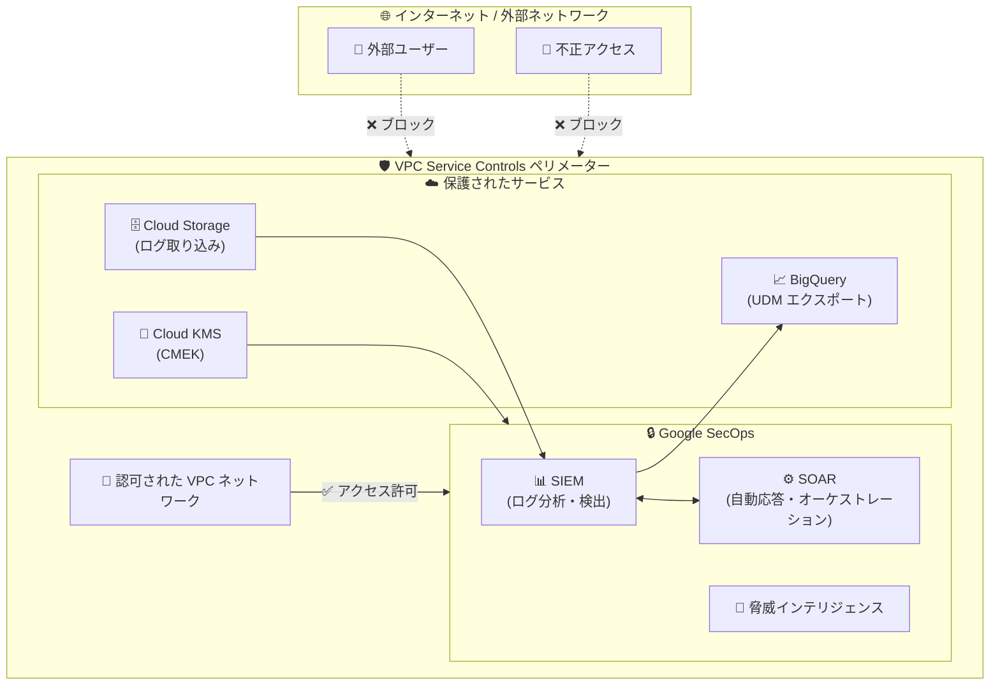

# Google SecOps: VPC Service Controls 一般提供開始 (GA)

**リリース日**: 2026-04-30

**サービス**: Google SecOps (Google Security Operations)

**機能**: VPC Service Controls

**ステータス**: GA (一般提供)

📊 [このアップデートのインフォグラフィックを見る](https://takech9203.github.io/google-cloud-news-summary/20260430-secops-vpc-service-controls-ga.html)

## 概要

Google SecOps (Google Security Operations) における VPC Service Controls のサポートが一般提供 (GA) となった。VPC Service Controls は、Google Cloud のリソースとサービスデータを保護するためのセキュリティ境界 (ペリメーター) を作成し、外部または内部の脅威アクターによる意図しないデータ流出や標的型攻撃からデータを保護する機能である。

今回の GA リリースにより、Google SecOps を利用する組織は、本番環境で VPC Service Controls を完全にサポートされた状態で使用できるようになった。セキュリティオペレーションプラットフォームに保存された脅威インテリジェンスデータ、SIEM ログ、SOAR プレイブック実行データなどの機密情報に対して、ネットワークベースのアクセス制御を適用することで、データ漏洩リスクを最小限に抑えることが可能となる。

この機能は、規制要件の厳しい金融機関、医療機関、政府機関など、セキュリティデータの取り扱いに高いレベルの保護が求められる組織にとって特に重要である。

**アップデート前の課題**

- Google SecOps のデータに対してネットワークレベルでのアクセス境界を設定できなかった
- 盗まれた認証情報や不正アクセスによるセキュリティデータの外部流出リスクがあった
- IAM ポリシーの設定ミスにより、意図せずセキュリティデータが外部に公開されるリスクがあった
- VPC Service Controls は Preview 段階であり、本番環境での SLA 保証がなかった

**アップデート後の改善**

- Google SecOps のリソースとデータを VPC Service Controls ペリメーター内に配置し、ネットワーク境界による保護が可能になった
- 認可されたネットワークからのみのアクセスに制限でき、盗まれた認証情報によるデータ流出リスクを軽減できるようになった
- GA として完全にサポートされた状態で利用可能となり、本番環境での SLA 保証が適用されるようになった
- IAM に加えた追加のセキュリティレイヤーとして、多層防御 (Defense in Depth) を実現できるようになった

## アーキテクチャ図



VPC Service Controls ペリメーターが Google SecOps とその関連サービス (Cloud Storage, BigQuery, Cloud KMS) を包括的に保護し、認可されたネットワークからのみアクセスを許可する構成を示している。

## サービスアップデートの詳細

### 主要機能

1. **サービスペリメーターによるデータ保護**
   - Google SecOps のリソースとデータをサービスペリメーター内に配置
   - ペリメーター外からの不正アクセスをブロック
   - 認可された VPC ネットワークからのプライベートアクセスのみを許可

2. **Ingress/Egress ルールによるきめ細かなアクセス制御**
   - SOAR 側: Secret Manager および Traffic Director へのアクセスルール設定
   - SIEM 側: Cloud Storage (データテーブル使用時) へのアクセスルール設定
   - コンテキストアウェアなアクセスポリシーの適用が可能

3. **VPC Service Controls 準拠機能**
   - Google Cloud Identity 認証、サードパーティ IdP、Workforce Identity Federation をサポート
   - chronicle.googleapis.com および chronicleservicemanager.googleapis.com API に対応
   - BigQuery へのセルフマネージドプロジェクトエクスポートまたは Advanced BigQuery Export をサポート

## 技術仕様

### サポートされる認証方式

| 項目 | サポート状況 |
|------|------|
| Google Cloud Identity 認証 | サポート |
| サードパーティ ID プロバイダー | サポート |
| Workforce Identity Federation | サポート |

### VPC Service Controls 準拠 API

| API エンドポイント | 用途 |
|------|------|
| chronicle.googleapis.com | Google SecOps メイン API |
| chronicleservicemanager.googleapis.com | サービス管理 API |

### 制約事項

| 項目 | 詳細 |
|------|------|
| ImportPushLogs エンドポイント | VPC SC 非対応 (データプッシュ専用のため流出リスクなし) |
| Looker ダッシュボード | VPC SC 環境では非対応 |
| レガシー Cloud Bucket フィード | 非対応 (V2 コネクタへの移行が必要) |
| Pub/Sub 新規サブスクリプション | ペリメーター内では GOOGLE_CLOUD_STORAGE_V2 または EVENT_DRIVEN を使用 |

### Ingress ルール設定例 (SOAR)

```yaml
# SOAR 側の Ingress ルール
- ingressFrom:
    identityType: ANY_SERVICE_ACCOUNT
    sources:
      - accessLevel: "*"
  ingressTo:
    operations:
      - serviceName: secretmanager.googleapis.com
        methodSelectors:
          - method: "*"
    resources:
      - projects/PROJECT_NUMBER

- ingressFrom:
    identities:
      - user:malachite-data-plane-api@prod.google.com
    sources:
      - accessLevel: "*"
  ingressTo:
    operations:
      - serviceName: trafficdirector.googleapis.com
        methodSelectors:
          - method: "*"
    resources:
      - projects/PROJECT_NUMBER
```

## 設定方法

### 前提条件

1. 組織レベルでの VPC Service Controls 設定に必要な IAM ロールを保有していること
2. Google SecOps の Feature RBAC が有効化されていること
3. すべてのエンドポイントが chronicle.googleapis.com API に移行済みであること
4. CMEK 使用時: Cloud KMS プロジェクトが同一ペリメーター内にあること

### 手順

#### ステップ 1: アクセスポリシーの作成

```bash
# 組織のアクセスポリシーを作成
gcloud access-context-manager policies create \
  --organization=ORGANIZATION_ID \
  --title="SecOps VPC SC Policy"
```

組織全体のアクセスポリシーを作成する。既存のポリシーがある場合はこのステップは不要。

#### ステップ 2: サービスペリメーターの作成

```bash
# Google SecOps 用のサービスペリメーターを作成
gcloud access-context-manager perimeters create secops_perimeter \
  --title="Google SecOps Perimeter" \
  --resources="projects/PROJECT_NUMBER" \
  --restricted-services="chronicle.googleapis.com,chronicleservicemanager.googleapis.com" \
  --policy=POLICY_ID
```

Google SecOps にリンクされた Google Cloud プロジェクトをペリメーターに追加する。

#### ステップ 3: Ingress/Egress ルールの設定

```bash
# Ingress ポリシーファイルを適用
gcloud access-context-manager perimeters update secops_perimeter \
  --set-ingress-policies=ingress-policy.yaml \
  --policy=POLICY_ID
```

SOAR 側と SIEM 側それぞれに適切な Ingress/Egress ルールを設定する。

#### ステップ 4: ドライランモードでの検証

```bash
# ドライランモードでペリメーターを作成して検証
gcloud access-context-manager perimeters dry-run create secops_perimeter_dryrun \
  --perimeter-title="SecOps Dry Run" \
  --resources="projects/PROJECT_NUMBER" \
  --restricted-services="chronicle.googleapis.com" \
  --policy=POLICY_ID
```

本番適用前に最初の数週間はドライランモードで Cloud Audit Logs の違反を監視することが推奨される。

## メリット

### ビジネス面

- **コンプライアンス強化**: PCI DSS、HIPAA、SOC 2 などの規制要件に対応するためのデータ保護境界を提供
- **データ流出リスクの最小化**: セキュリティオペレーションデータの不正な外部流出を防止し、ビジネスリスクを低減
- **本番環境での SLA 保証**: GA リリースにより、エンタープライズ SLA の下で安心して利用可能

### 技術面

- **多層防御の実現**: IAM によるアイデンティティベースの制御に加え、ネットワークベースのペリメーター制御を追加
- **きめ細かなアクセス制御**: Ingress/Egress ルールにより、必要なサービス間通信のみを許可する最小権限の原則を適用
- **監査ログの統合**: VPC Service Controls の違反を Cloud Audit Logs で記録し、セキュリティ監視を強化

## デメリット・制約事項

### 制限事項

- Looker ダッシュボードは VPC Service Controls 環境では利用不可 (Google SecOps ネイティブダッシュボードのみ対応)
- ImportPushLogs エンドポイントは VPC Service Controls 非対応 (ただしデータ流出リスクはなし)
- レガシーの Cloud Bucket およびサードパーティ API フィードコネクタは非対応
- ペリメーター内での新規 Pub/Sub サブスクリプション作成時は Cloud Storage V2 または Event Driven フィードの使用が必要

### 考慮すべき点

- VPC Service Controls の設定前に、すべてのエンドポイントを chronicle.googleapis.com API に移行する必要がある
- ドライランモードでの十分な検証期間 (推奨: 2週間以上) を設けること
- Content Hub のレスポンス統合に必要な Ingress/Egress ルールの漏れがないか確認すること
- CMEK 使用時は Cloud KMS プロジェクトの配置に注意 (同一ペリメーター内または SecOps リンクプロジェクト内)

## ユースケース

### ユースケース 1: 金融機関でのセキュリティデータ保護

**シナリオ**: 大手金融機関が Google SecOps を使用して SOC (Security Operations Center) を運用しており、PCI DSS 要件を満たすためにセキュリティログデータの境界制御が必要。

**実装例**:
```yaml
# 金融機関向けペリメーター設定
- ingressFrom:
    identityType: ANY_IDENTITY
    sources:
      - accessLevel: accessPolicies/POLICY/accessLevels/corp_network
  ingressTo:
    operations:
      - serviceName: chronicle.googleapis.com
        methodSelectors:
          - method: "*"
    resources:
      - projects/SECOPS_PROJECT_NUMBER
```

**効果**: 社内ネットワークからのみ SecOps データへのアクセスを許可し、外部からの不正アクセスを完全にブロック。規制要件への準拠を実現。

### ユースケース 2: マルチテナント環境でのデータ分離

**シナリオ**: マネージドセキュリティサービスプロバイダー (MSSP) が複数の顧客向けに Google SecOps を運用しており、顧客間のデータ分離を厳格に実施する必要がある。

**効果**: 顧客ごとにペリメーターを分離し、データの相互参照やクロステナントのデータ流出を防止。各顧客のコンプライアンス要件に個別対応が可能。

## 料金

VPC Service Controls 自体の利用に追加料金は発生しない。ただし、Google SecOps の利用料金は別途適用される。

詳細は以下の料金ページを参照:
- [Google SecOps 料金](https://cloud.google.com/chronicle/pricing)
- [VPC Service Controls 料金](https://cloud.google.com/vpc-service-controls/pricing)

## 利用可能リージョン

VPC Service Controls は Google SecOps が利用可能なすべてのリージョンで使用可能。詳細は [Google SecOps のリージョン情報](https://cloud.google.com/chronicle/docs/reference/regions) を参照。

## 関連サービス・機能

- **VPC Service Controls**: Google Cloud 全体のサービスペリメーター制御を提供する基盤サービス
- **Cloud Audit Logs**: VPC Service Controls の違反検出とアクセスパターンの監査ログを記録
- **Access Context Manager**: アクセスポリシーとアクセスレベルを管理するサービス
- **Cloud KMS (CMEK)**: Google SecOps データの顧客管理暗号鍵による保護
- **Workforce Identity Federation**: VPC Service Controls 環境での外部 IdP 認証連携
- **Security Command Center**: Google Cloud 全体のセキュリティ体制管理とリスク検出

## 参考リンク

- 📊 [インフォグラフィック](https://takech9203.github.io/google-cloud-news-summary/20260430-secops-vpc-service-controls-ga.html)
- [公式リリースノート](https://cloud.google.com/release-notes#April_30_2026)
- [VPC Service Controls for Google SecOps 設定ガイド](https://docs.cloud.google.com/chronicle/docs/secops/vpcsc-for-secops)
- [VPC Service Controls 概要](https://docs.cloud.google.com/vpc-service-controls/docs/overview)
- [サービスペリメーターの概要](https://docs.cloud.google.com/vpc-service-controls/docs/service-perimeters)
- [VPC Service Controls サポート対象プロダクト](https://docs.cloud.google.com/vpc-service-controls/docs/supported-products)

## まとめ

Google SecOps における VPC Service Controls の GA リリースにより、セキュリティオペレーションプラットフォームのデータを VPC ペリメーターで保護できるようになった。特に規制要件の厳しい業界において、データ流出リスクの低減とコンプライアンス対応を強化する重要なマイルストーンである。利用を開始する際は、まずドライランモードで影響を評価し、段階的に適用範囲を拡大することを推奨する。

---

**タグ**: #GoogleSecOps #VPCServiceControls #セキュリティ #GA #データ保護 #コンプライアンス #SIEM #SOAR
