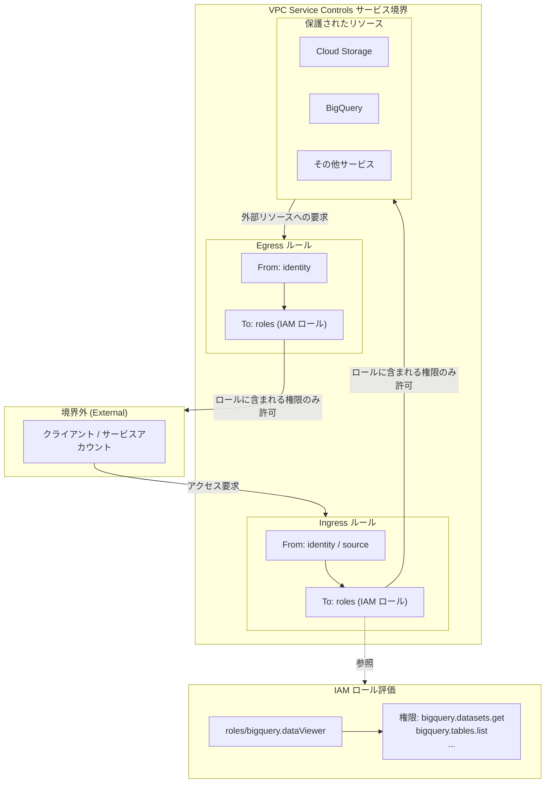

# VPC Service Controls: Ingress/Egress ルールにおける IAM ロールサポートの一般提供開始

**リリース日**: 2026-04-30

**サービス**: VPC Service Controls

**機能**: Ingress/Egress ルールにおける IAM ロールサポート (GA)

**ステータス**: 一般提供 (GA)

[このアップデートのインフォグラフィックを見る](https://takech9203.github.io/google-cloud-news-summary/20260430-vpc-service-controls-iam-roles-ga.html)

## 概要

VPC Service Controls の Ingress (上り) および Egress (下り) ルールにおいて、IAM ロールを使用してサービス境界で保護されたリソースへのアクセスを制御する機能が一般提供 (GA) となりました。これにより、サービス境界を越えたアクセス制御において、個別のメソッドやパーミッションではなく、IAM ロール単位でアクセスを許可できるようになります。

この機能は、VPC Service Controls のセキュリティモデルをより柔軟かつ管理しやすくするものです。従来は `methodSelectors` 属性を使用して個別の API メソッドを指定する必要がありましたが、今回の GA リリースにより `roles` 属性を使用して IAM ロールを直接指定できるようになりました。これにより、アクセスポリシーの設定と保守が大幅に簡素化されます。

対象ユーザーは、VPC Service Controls を使用してマルチプロジェクト環境やマルチ組織間でのデータ交換を管理しているセキュリティ管理者、クラウドアーキテクト、および DevSecOps エンジニアです。

**アップデート前の課題**

- Ingress/Egress ルールでアクセスを許可する際、個別の API メソッドやパーミッションを `methodSelectors` で一つずつ指定する必要があり、設定が複雑だった
- 新しいメソッドが追加された際にルールの手動更新が必要で、運用負荷が高かった
- ロールベースのアクセス制御 (RBAC) の考え方と VPC Service Controls のポリシー管理に乖離があり、IAM ポリシーとの一貫性を保つことが困難だった

**アップデート後の改善**

- Ingress/Egress ルールに IAM ロールを直接指定できるようになり、ルール定義が簡潔になった
- IAM ロールのサポート状況を `gcloud access-context-manager supported-permissions describe` コマンドで確認可能になった
- `gcloud access-context-manager supported-permissions list` コマンドでサポートされている全 IAM ロールの一覧を取得可能になった
- IAM ポリシーと VPC Service Controls ポリシーの整合性が取りやすくなった

## アーキテクチャ図



この図は、VPC Service Controls の境界において、IAM ロールベースの Ingress/Egress ルールがどのようにアクセス制御を行うかを示しています。クライアントからの要求は Ingress ルールで評価され、指定された IAM ロールに含まれる権限に対応するアクションのみが許可されます。

## サービスアップデートの詳細

### 主要機能

1. **IAM ロールによる Ingress/Egress ルール定義**
   - Ingress/Egress ルールの `operations` セクションで `methodSelectors` の代わりに `roles` 属性を使用可能
   - 事前定義ロールおよびカスタムロール (組織レベル) をサポート
   - 複数のロールを組み合わせて指定可能

2. **IAM ロールサポート状況の確認コマンド**
   - `gcloud access-context-manager supported-permissions describe` コマンドで特定ロールのサポート状況を確認
   - ロールごとに SUPPORTED / PARTIALLY_SUPPORTED / NOT_SUPPORTED のステータスを返却
   - サポートされている権限の一覧も同時に取得可能

3. **サポート対象ロール一覧の取得コマンド**
   - `gcloud access-context-manager supported-permissions list` コマンドで全サポート対象ロールを一覧取得
   - Ingress/Egress ルールで使用可能なロールの確認に活用

## 技術仕様

### ロールサポートステータス

| ステータス | 説明 |
|------|------|
| SUPPORTED | ロール内の全権限が Ingress/Egress ルールでサポートされている |
| PARTIALLY_SUPPORTED | ロール内の一部の権限のみがサポートされている |
| NOT_SUPPORTED | ロール内のどの権限もサポートされていない |

### 制約事項

| 項目 | 詳細 |
|------|------|
| プロジェクトレベルのカスタムロール | 使用不可 (`projects/PROJECT_ID/roles/IDENTIFIER` 形式は非対応) |
| 組織レベルのカスタムロール | 使用可能 |
| Cloud Storage 事前定義ロール | 非対応 (カスタムロールのみ使用可能) |
| Cloud KMS ロール | CMEK 関連の境界越えリクエストには使用不可 |
| setIamPolicy 操作 | ロールベースのルールでは許可不可 (methodSelectors を使用) |

### Ingress ルールの YAML 設定例

```yaml
- ingressFrom:
    identityType: ANY_IDENTITY
    sources:
      - accessLevel: accessPolicies/POLICY_ID/accessLevels/LEVEL_NAME
  ingressTo:
    operations:
      - serviceName: bigquery.googleapis.com
        roles:
          - roles/bigquery.dataViewer
          - roles/bigquery.jobUser
    resources:
      - projects/PROJECT_NUMBER
```

### Egress ルールの YAML 設定例

```yaml
- egressTo:
    operations:
      - serviceName: storage.googleapis.com
        roles:
          - organizations/ORG_ID/roles/customStorageReader
    resources:
      - projects/EXTERNAL_PROJECT_NUMBER
  egressFrom:
    identityType: ANY_IDENTITY
```

## 設定方法

### 前提条件

1. VPC Service Controls が有効な Google Cloud 組織
2. `roles/iam.roleViewer` ロール (supported-permissions コマンドの実行に必要)
3. Access Context Manager の管理権限

### 手順

#### ステップ 1: IAM ロールのサポート状況を確認

```bash
# 特定の IAM ロールのサポート状況を確認
gcloud access-context-manager supported-permissions describe roles/bigquery.dataViewer
```

このコマンドにより、指定したロールが VPC Service Controls の Ingress/Egress ルールでサポートされているか、および対応する権限の一覧を確認できます。

#### ステップ 2: サポート対象ロールの一覧取得

```bash
# サポートされている全 IAM ロールの一覧を取得
gcloud access-context-manager supported-permissions list
```

使用したいロールがサポートされていることを確認します。

#### ステップ 3: Ingress ルールの YAML ファイルを作成

```bash
# ingress-rule.yaml を作成
cat > ingress-rule.yaml << 'EOF'
- ingressFrom:
    identityType: ANY_USER_ACCOUNT
    sources:
      - accessLevel: accessPolicies/POLICY_ID/accessLevels/trusted-access
  ingressTo:
    operations:
      - serviceName: bigquery.googleapis.com
        roles:
          - roles/bigquery.dataViewer
    resources:
      - projects/123456789
EOF
```

`methodSelectors` の代わりに `roles` 属性を使用してアクセスを定義します。

#### ステップ 4: サービス境界にポリシーを適用

```bash
# Ingress ポリシーをサービス境界に適用
gcloud access-context-manager perimeters update my-perimeter \
    --set-ingress-policies=ingress-rule.yaml
```

同様に Egress ルールも設定・適用できます。

## メリット

### ビジネス面

- **運用効率の向上**: IAM ロール単位での指定により、ポリシー管理の工数が大幅に削減される
- **ガバナンスの強化**: IAM ロールベースのアクセス制御と VPC Service Controls のポリシーを統一的に管理できる
- **コンプライアンス対応の簡素化**: 職務分離 (SoD) やアクセス権限の監査が IAM ロールレベルで実施可能になる

### 技術面

- **設定の簡素化**: 複数の methodSelectors を個別に列挙する代わりに、ロール名一つで同等のアクセス制御を実現
- **保守性の向上**: IAM ロールに新しい権限が追加された際、VPC Service Controls 側のルールを自動的に反映
- **既存 IAM 設計との整合性**: 組織内で既に定義されている IAM ロール体系をそのまま VPC Service Controls に適用可能

## デメリット・制約事項

### 制限事項

- プロジェクトレベルで作成したカスタムロールは使用できない (組織レベルのカスタムロールのみ対応)
- Cloud Storage の事前定義ロールは非対応であり、カスタムロールを作成して使用する必要がある
- Cloud KMS の CMEK 関連リクエストにはロールベースのルールを使用できない
- `setIamPolicy` 操作はロールベースのルールでは許可できない

### 考慮すべき点

- PARTIALLY_SUPPORTED のロールを使用した場合、未サポートの権限に関するリクエストはブロックされる
- ロールベースのルールで違反が発生した場合、エラーメッセージが「IAM 権限不足」として表示される可能性があり、原因特定に VPC Service Controls 監査ログの確認が必要
- カスタムロールを削除した後に複数の境界で参照されている場合、全境界が編集不能になる可能性がある
- 複数プロジェクトにまたがる複合リクエスト (例: Dataflow テンプレートが別プロジェクトの Cloud Storage を読み取る) では、ロールベースルールが機能しない場合がある

## ユースケース

### ユースケース 1: データアナリストへの BigQuery 読み取りアクセス許可

**シナリオ**: 社外のデータアナリストチームがサービス境界内の BigQuery データセットに対して読み取り専用アクセスを必要としている。

**実装例**:
```yaml
- ingressFrom:
    identities:
      - group:analysts@partner-company.com
    sources:
      - accessLevel: accessPolicies/POLICY/accessLevels/partner-network
  ingressTo:
    operations:
      - serviceName: bigquery.googleapis.com
        roles:
          - roles/bigquery.dataViewer
          - roles/bigquery.jobUser
    resources:
      - projects/data-warehouse-project
```

**効果**: methodSelectors で個別メソッドを列挙する必要がなくなり、BigQuery の読み取り関連権限が網羅的に許可される。ロールの更新に伴い自動的に新しいメソッドも許可対象になる。

### ユースケース 2: マルチ組織間のデータ共有

**シナリオ**: グループ企業間で特定のプロジェクトリソースに対して、限定的なアクセスを相互に許可する必要がある。

**実装例**:
```yaml
- egressTo:
    operations:
      - serviceName: bigquery.googleapis.com
        roles:
          - roles/bigquery.dataViewer
    resources:
      - projects/partner-org-project
  egressFrom:
    identities:
      - serviceAccount:etl-pipeline@my-project.iam.gserviceaccount.com
```

**効果**: データパイプラインのサービスアカウントに対して、パートナー組織のリソースへのアクセスを IAM ロール単位で制御でき、最小権限の原則を維持しながら柔軟なデータ共有を実現。

## 関連サービス・機能

- **Identity and Access Management (IAM)**: VPC Service Controls のロールベースルールで参照する IAM ロールの定義元
- **Access Context Manager**: VPC Service Controls のアクセスポリシーとサービス境界を管理するサービス
- **Cloud Audit Logs**: VPC Service Controls の違反ログの確認やトラブルシューティングに使用
- **Organization Policy Service**: 組織全体のセキュリティポリシーとの連携

## 参考リンク

- [インフォグラフィック](https://takech9203.github.io/google-cloud-news-summary/20260430-vpc-service-controls-iam-roles-ga.html)
- [公式リリースノート](https://docs.cloud.google.com/release-notes#April_30_2026)
- [VPC Service Controls で IAM ロールを構成する](https://docs.cloud.google.com/vpc-service-controls/docs/configure-iam-roles)
- [Ingress/Egress ルールの概要](https://docs.cloud.google.com/vpc-service-controls/docs/ingress-egress-rules)
- [Ingress/Egress ポリシーの構成](https://docs.cloud.google.com/vpc-service-controls/docs/configuring-ingress-egress-policies)
- [VPC Service Controls の概要](https://docs.cloud.google.com/vpc-service-controls/docs/overview)

## まとめ

VPC Service Controls の Ingress/Egress ルールにおける IAM ロールサポートの GA リリースは、サービス境界のアクセス制御をより直感的かつ管理しやすくする重要なアップデートです。組織の既存 IAM 設計を活用し、methodSelectors による個別メソッド指定の複雑さから解放されます。セキュリティ管理者は、まず `gcloud access-context-manager supported-permissions list` で利用可能なロールを確認し、既存のルールをロールベースに移行することを推奨します。

---

**タグ**: VPC Service Controls, IAM, Ingress/Egress Rules, GA, セキュリティ, アクセス制御
