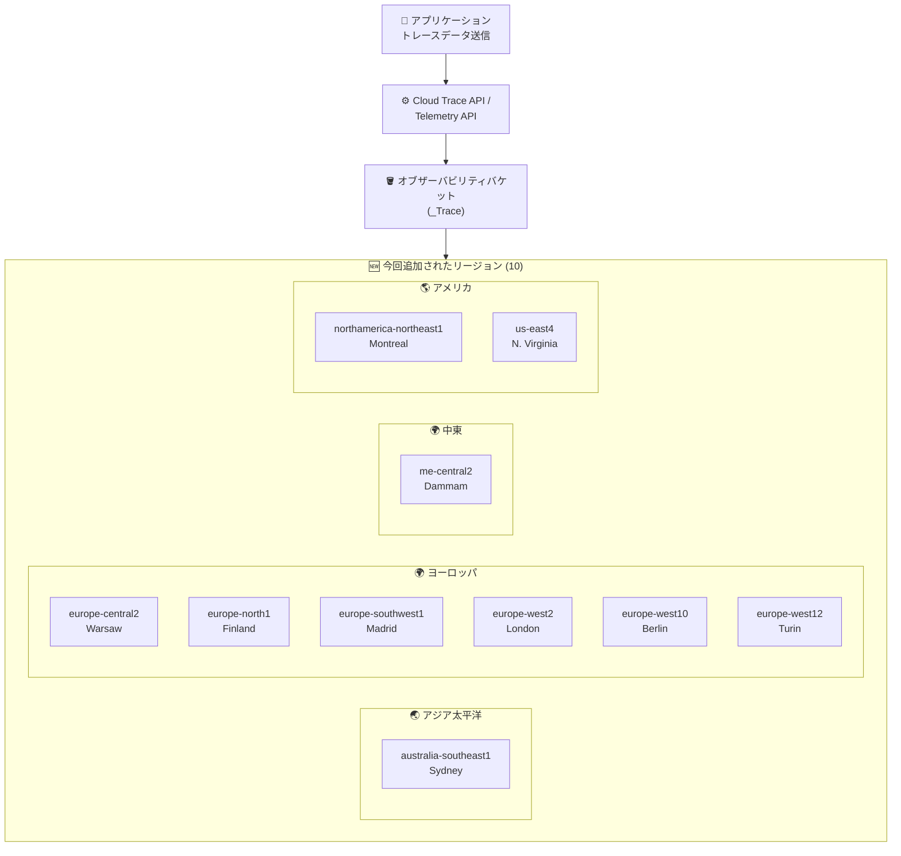

# Cloud Trace (Google Cloud Observability): オブザーバビリティバケットの対応リージョン拡大

**リリース日**: 2026-05-01

**サービス**: Cloud Trace (Google Cloud Observability)

**機能**: オブザーバビリティバケットの対応ロケーション拡大

**ステータス**: Feature (GA)

📊 [このアップデートのインフォグラフィックを見る](https://takech9203.github.io/google-cloud-news-summary/20260501-cloud-trace-observability-buckets-expansion.html)

## 概要

Google Cloud Observability は、トレースデータを保存するオブザーバビリティバケットの対応ロケーションを新たに 10 リージョン追加しました。今回追加されたリージョンは、オーストラリア、ヨーロッパ、中東、北米、米国東部にまたがり、データレジデンシー要件を持つ組織がより柔軟にトレースデータの保存先を選択できるようになりました。

オブザーバビリティバケットは、Cloud Trace のスパンデータを保存するリージョナルリソースです。組織、フォルダ、プロジェクトレベルでデフォルトのストレージロケーションと暗号化設定 (CMEK) を構成できます。今回の拡張により、特にヨーロッパ地域での選択肢が大幅に増え、GDPR やデータ主権に関する規制に対応しやすくなりました。

**アップデート前の課題**

- ヨーロッパの一部リージョン (europe-central2、europe-north1、europe-southwest1、europe-west2、europe-west10、europe-west12) ではオブザーバビリティバケットを配置できなかった
- オーストラリア (australia-southeast1)、中東 (me-central2) でのローカルデータ保存が不可能だった
- northamerica-northeast1 (モントリオール) や us-east4 (北バージニア) を利用するワークロードでは、トレースデータを近隣に保存できなかった

**アップデート後の改善**

- 10 の新リージョンでオブザーバビリティバケットが利用可能になり、合計 40 以上のロケーションに対応
- ヨーロッパ地域で 6 リージョンが追加され、EU データレジデンシー要件への対応が強化された
- カナダ (northamerica-northeast1) や中東 (me-central2) でのデータ主権要件に対応可能になった

## アーキテクチャ図



今回のアップデートにより、オブザーバビリティバケットの配置可能リージョンが 10 追加されました。アプリケーションから送信されたトレースデータは、Cloud Trace API または Telemetry API を経由してオブザーバビリティバケットに保存され、指定リージョン内にデータが保持されます。

## サービスアップデートの詳細

### 主要機能

1. **新規対応リージョン (10 リージョン)**
   - australia-southeast1 (シドニー)
   - europe-central2 (ワルシャワ)
   - europe-north1 (フィンランド)
   - europe-southwest1 (マドリード)
   - europe-west2 (ロンドン)
   - europe-west10 (ベルリン)
   - europe-west12 (トリノ)
   - me-central2 (ダンマーム)
   - northamerica-northeast1 (モントリオール)
   - us-east4 (北バージニア)

2. **デフォルト設定による一括管理**
   - 組織、フォルダ、プロジェクトレベルでデフォルトのストレージロケーションを設定可能
   - リソース階層で設定が自動継承される
   - 各ロケーションに対して CMEK (顧客管理暗号鍵) を設定可能

3. **データレジデンシー対応**
   - 新リージョンでもデータは指定されたリージョン内に保持される
   - CMEK と組み合わせることで、暗号化とデータ所在地の両方を制御可能

## 技術仕様

### 対応リージョン一覧 (今回追加分)

| リージョン | ロケーション | 地域 |
|------|------|------|
| australia-southeast1 | シドニー | アジア太平洋 |
| europe-central2 | ワルシャワ | ヨーロッパ |
| europe-north1 | フィンランド | ヨーロッパ |
| europe-southwest1 | マドリード | ヨーロッパ |
| europe-west2 | ロンドン | ヨーロッパ |
| europe-west10 | ベルリン | ヨーロッパ |
| europe-west12 | トリノ | ヨーロッパ |
| me-central2 | ダンマーム | 中東 |
| northamerica-northeast1 | モントリオール | アメリカ |
| us-east4 | 北バージニア | アメリカ |

### オブザーバビリティバケットの仕様

| 項目 | 詳細 |
|------|------|
| バケット名 | `_Trace` (システム自動作成) |
| データセット名 | `Spans` |
| ビュー名 | `_AllSpans` |
| リソースタイプ | リージョナル (ゾーン間冗長) |
| 暗号化 | Google 管理鍵 (デフォルト) / CMEK (オプション) |

### 制限事項

- オブザーバビリティバケットの変更・削除は不可
- データセットの作成・削除・変更は不可
- ビューの作成・削除・変更は不可
- Google Cloud コンソールからのバケット、データセット、ビュー、リンクの一覧表示は不可

## 設定方法

### 前提条件

1. Cloud Trace API が有効化されていること
2. デフォルト設定の構成には適切な IAM 権限が必要

### 手順

#### ステップ 1: デフォルトストレージロケーションの設定

```bash
# gcloud CLI でデフォルトのストレージロケーションを設定
# (組織レベルの例)
gcloud observability default-settings update \
  --organization=ORGANIZATION_ID \
  --default-storage-location=europe-west2
```

#### ステップ 2: CMEK の設定 (オプション)

```bash
# 特定ロケーションに対して CMEK を設定
gcloud observability default-settings update \
  --organization=ORGANIZATION_ID \
  --location=europe-west2 \
  --kms-key=projects/PROJECT_ID/locations/europe-west2/keyRings/KEY_RING/cryptoKeys/KEY
```

デフォルト設定は新規に作成されるオブザーバビリティバケットにのみ適用されます。既存のバケットには影響しません。

## メリット

### ビジネス面

- **データレジデンシー対応強化**: ヨーロッパ、中東、カナダなど、厳格なデータ保護規制がある地域でのコンプライアンス要件を満たしやすくなった
- **グローバル展開の容易化**: 世界各地のワークロードに対して、近隣リージョンでのトレースデータ保存が可能に

### 技術面

- **レイテンシ低減**: ワークロードと同一リージョンにトレースデータを保存することで、データアクセスのレイテンシを低減
- **リソース階層での一括管理**: 組織レベルで設定を行えば、配下のすべてのプロジェクトに自動適用

## デメリット・制約事項

### 制限事項

- デフォルト設定は新規作成のバケットにのみ適用され、既存バケットには遡及適用されない
- オブザーバビリティバケットの変更・削除はできない
- Gemini Cloud Assist などグローバルにデータを保存するサービスを有効にすると、データレジデンシーが保証されない可能性がある

### 考慮すべき点

- データレジデンシー要件がある場合、Gemini Cloud Assist の利用には注意が必要
- 既存プロジェクトでリージョンを変更する場合、新しいバケットが作成されるタイミングを確認する必要がある

## ユースケース

### ユースケース 1: EU データレジデンシー対応

**シナリオ**: GDPR 準拠が求められるヨーロッパの金融機関が、トレースデータを EU 域内に保持する必要がある

**実装例**:
```bash
# 組織レベルで EU リージョンをデフォルトに設定
gcloud observability default-settings update \
  --organization=ORG_ID \
  --default-storage-location=europe-west2

# CMEK も合わせて設定
gcloud observability default-settings update \
  --organization=ORG_ID \
  --location=europe-west2 \
  --kms-key=projects/PROJECT/locations/europe-west2/keyRings/RING/cryptoKeys/KEY
```

**効果**: すべての新規プロジェクトのトレースデータがロンドン (europe-west2) に保存され、顧客管理鍵で暗号化される

### ユースケース 2: カナダのデータ主権要件

**シナリオ**: カナダ政府関連のワークロードを運用しており、トレースデータをカナダ国内に保持する必要がある

**効果**: northamerica-northeast1 (モントリオール) にオブザーバビリティバケットを配置することで、カナダ国内にデータを保持可能

## 料金

Cloud Trace の料金は、取り込まれたスパン数に基づいて課金されます。オブザーバビリティバケットのリージョン選択による追加料金に関する公式情報は、料金ページをご確認ください。

- [Google Cloud Observability 料金ページ](https://cloud.google.com/products/observability/pricing)

## 利用可能リージョン

今回の追加により、オブザーバビリティバケットは以下の全リージョンで利用可能です。

**マルチリージョン**: eu, us

**アフリカ**: africa-south1

**アメリカ**: northamerica-northeast1, northamerica-northeast2, northamerica-south1, southamerica-west1, us-central1, us-east1, us-east4, us-east5, us-south1, us-west1, us-west2, us-west3

**アジア太平洋**: asia-east1, asia-east2, asia-northeast2, asia-northeast3, asia-south1, asia-south2, asia-southeast2, asia-southeast3, australia-southeast1, australia-southeast2

**ヨーロッパ**: europe-central2, europe-north1, europe-north2, europe-southwest1, europe-west1, europe-west2, europe-west3, europe-west4, europe-west6, europe-west8, europe-west10, europe-west12

**中東**: me-central1, me-central2

## 関連サービス・機能

- **Cloud Logging**: 同様にリージョナルログバケットをサポートし、データレジデンシー要件に対応
- **Cloud Monitoring**: Application Monitoring でトレースデータと連携してパフォーマンス分析を実施
- **Cloud KMS**: CMEK を使用したオブザーバビリティバケットの暗号化に利用
- **Telemetry API**: トレースデータの取り込みに使用される新しい API。リージョナルクォータをサポート

## 参考リンク

- 📊 [インフォグラフィック](https://takech9203.github.io/google-cloud-news-summary/20260501-cloud-trace-observability-buckets-expansion.html)
- [公式リリースノート](https://docs.cloud.google.com/release-notes#May_01_2026)
- [オブザーバビリティバケットのロケーション](https://docs.cloud.google.com/stackdriver/docs/observability/observability-bucket-locations)
- [オブザーバビリティバケットのデフォルト設定](https://docs.cloud.google.com/stackdriver/docs/observability/set-defaults-for-observability-buckets)
- [トレースストレージの概要](https://docs.cloud.google.com/trace/docs/storage-overview)
- [Cloud Trace リリースノート](https://docs.cloud.google.com/trace/docs/release-notes)
- [料金ページ](https://cloud.google.com/products/observability/pricing)

## まとめ

今回のアップデートにより、Cloud Trace のオブザーバビリティバケットが 10 の新リージョンに対応し、特にヨーロッパ地域での選択肢が大幅に拡大しました。データレジデンシーやコンプライアンス要件を持つ組織は、デフォルト設定機能と CMEK を組み合わせることで、組織全体のトレースデータの保存場所と暗号化を一元管理できます。新リージョンでのワークロードを運用している場合は、デフォルトストレージロケーションの設定を確認し、適切なリージョンを指定することを推奨します。

---

**タグ**: #CloudTrace #GoogleCloudObservability #DataResidency #Observability #リージョン拡大 #CMEK #コンプライアンス
