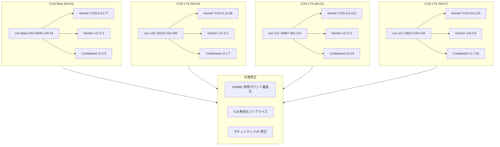

# Container-Optimized OS: 複数イメージのセキュリティ・安定性アップデート (2026年5月)

**リリース日**: 2026-05-01

**サービス**: Container-Optimized OS

**機能**: COS イメージ更新 (M129 Beta / M125 LTS / M121 LTS / M117 LTS)

**ステータス**: 利用可能

📊 [このアップデートのインフォグラフィックを見る](https://takech9203.github.io/google-cloud-news-summary/20260501-container-optimized-os-security-updates-may.html)

## 概要

2026年5月1日、Container-Optimized OS (COS) の複数マイルストーンにわたるイメージアップデートがリリースされた。Beta チャネルの M129 では R595 NVIDIA ドライバーの新規サポート、カーネルスケジューラ拡張機能 (CONFIG_SCHED_CLASS_EXT / CONFIG_EXT_GROUP_SCHED) の有効化、NVIDIA ドライバー v580.126.16/v580.126.20 対応、ext4/jbd2 パフォーマンスリグレッション修正、IOMMU 参照カウントの最適化、30件以上のカーネル CVE セキュリティ修正が含まれている。

LTS チャネルの M125、M121、M117 では、それぞれセキュリティ修正と安定性向上が実施されている。全マイルストーン共通で IOMMU 参照カウントの最適化と TLB 無効化の並行処理修正が適用された。また、セキュリティ強化として `/etc/machine-id` が noexec、nosuid、nodev オプション付きでマウントされるよう変更された。

このアップデートは GKE ノードや Compute Engine VM で COS を利用するすべてのユーザーに影響し、特に GPU ワークロードを実行する環境では NVIDIA ドライバーの新バージョン対応が重要な変更となる。

**アップデート前の課題**

- ext4/jbd2 ファイルシステムにパフォーマンスリグレッションが存在し、CPU ノードでのワークロード性能が低下していた
- IOMMU の参照カウント処理が最適化されておらず、並行 TLB 無効化時にタイムアウトが発生する可能性があった
- `/etc/machine-id` にセキュリティ制限マウントオプションが適用されていなかった
- R595 NVIDIA ドライバーブランチが未サポートだった

**アップデート後の改善**

- ext4/jbd2 パフォーマンスリグレッションが修正され、CPU ノードでのファイルシステム操作性能が回復した
- IOMMU 参照カウントが atomic64_inc_return() を使用して最適化され、シーケンス割り当てがシリアライズされてタイムアウトが防止された
- `/etc/machine-id` が noexec/nosuid/nodev でマウントされ、攻撃対象面が削減された
- R595 NVIDIA ドライバーの本番ブランチおよび v580.126.16/v580.126.20 がサポートされ、最新 GPU ハードウェアへの対応が拡充された

## アーキテクチャ図



各マイルストーンのイメージバージョンとコンポーネント構成を示す。全マイルストーンに共通して IOMMU 最適化と TLB 修正が適用されている。

## サービスアップデートの詳細

### 主要機能

1. **R595 NVIDIA ドライバー本番ブランチサポート (M129 Beta のみ)**
   - R595 NVIDIA ドライバーの本番ブランチが新たにサポートされた
   - NVIDIA ドライバー v580.126.16 および v580.126.20 のサポートが追加された
   - GPU ワークロードの最新ハードウェア対応が強化された

2. **カーネルスケジューラ拡張機能の有効化 (M129 Beta のみ)**
   - CONFIG_SCHED_CLASS_EXT が有効化され、カスタムスケジューリングクラスの拡張が可能になった
   - CONFIG_EXT_GROUP_SCHED が有効化され、グループスケジューリングの拡張が利用可能になった
   - eBPF ベースのカスタムスケジューラ (sched_ext) の実装が可能になった

3. **ext4/jbd2 パフォーマンスリグレッション修正 (M129 Beta / M125 LTS)**
   - CPU ノードで発生していた ext4/jbd2 ファイルシステムのパフォーマンスリグレッションが修正された
   - ストレージ I/O 性能の回復が期待される

4. **IOMMU 最適化 (全マイルストーン共通)**
   - IOMMU 参照カウントが atomic64_inc_return() を使用して最適化された
   - シーケンス割り当てがシリアライズされ、並行 TLB 無効化時のタイムアウトが防止された

5. **セキュリティ強化: /etc/machine-id マウントオプション (M129 Beta / M125 LTS)**
   - `/etc/machine-id` が noexec、nosuid、nodev オプション付きでマウントされるよう変更された
   - 実行可能バイナリの悪用や権限昇格のリスクが軽減された

## 技術仕様

### イメージバージョン一覧

| マイルストーン | イメージ名 | カーネル | Docker | Containerd | チャネル |
|---|---|---|---|---|---|
| M129 | cos-beta-129-19506-120-44 | COS-6.12.77 | v27.5.1 | v2.2.3 | Beta |
| M125 | cos-125-19216-220-180 | COS-6.12.68 | v27.5.1 | v2.1.7 | LTS |
| M121 | cos-121-18867-381-113 | COS-6.6.122 | v27.5.1 | v2.0.8 | LTS |
| M117 | cos-117-18613-534-106 | COS-6.6.123 | v24.0.9 | v1.7.29 | LTS |

### M129 Beta: セキュリティ修正一覧 (主要 CVE)

| CVE | 対象 |
|------|------|
| CVE-2026-23276 ~ CVE-2026-23471 (19件) | Linux カーネル |
| CVE-2026-31392 ~ CVE-2026-31423 (12件) | Linux カーネル |

### M125 LTS: セキュリティ修正

| CVE | 対象 |
|------|------|
| CVE-2026-31431 | Linux カーネル |
| CVE-2026-31664 | Linux カーネル |

### M121 LTS: セキュリティ修正

| CVE | 対象 |
|------|------|
| CVE-2026-31431 | Linux カーネル |
| CVE-2026-31454 | Linux カーネル |
| CVE-2026-31546 | Linux カーネル |
| CVE-2026-31667 | Linux カーネル |

### M117 LTS: セキュリティ修正

| CVE | 対象 |
|------|------|
| CVE-2026-31431 | Linux カーネル |

### カーネル設定変更 (M129 Beta)

```
# 新規有効化されたカーネルコンフィグ
CONFIG_SCHED_CLASS_EXT=y    # sched_ext: eBPF ベースのカスタムスケジューラサポート
CONFIG_EXT_GROUP_SCHED=y    # グループスケジューリング拡張
```

### Sysctl 変更

```
# net.ipv4.udp_mem の値が更新された
# UDP メモリ管理パラメータの調整
net.ipv4.udp_mem: (更新)
```

## メリット

### ビジネス面

- **セキュリティコンプライアンスの強化**: 30件以上の CVE 修正により、セキュリティ監査要件への適合性が向上
- **GPU ワークロードの拡張性**: R595 ドライバーサポートにより、最新 NVIDIA GPU を活用した AI/ML ワークロードの実行が可能に

### 技術面

- **ファイルシステム性能の回復**: ext4/jbd2 リグレッション修正により、ストレージ依存ワークロードの性能が正常化
- **IOMMU 処理の安定性向上**: atomic64 操作とシーケンスシリアライズにより、高負荷環境でのデバイスI/O安定性が向上
- **攻撃対象面の削減**: machine-id の制限的マウントオプションにより、COS ノードのセキュリティポスチャが強化
- **スケジューラのカスタマイズ性**: sched_ext の有効化により、ワークロード固有のスケジューリングポリシーを eBPF で実装可能に

## デメリット・制約事項

### 制限事項

- M129 は Beta チャネルであり、本番環境での使用は推奨されない
- M117 LTS のサポート終了は 2026年9月予定のため、M121 以降への移行計画が必要
- CONFIG_SCHED_CLASS_EXT は M129 Beta のみで有効であり、LTS マイルストーンではまだ利用できない

### 考慮すべき点

- Sysctl パラメータ (net.ipv4.udp_mem) の変更により、UDP バッファリング動作が変わる可能性がある。大量 UDP トラフィックを処理するワークロードでは動作検証を推奨
- NVIDIA ドライバーの更新後、GPU 初期化プロセスに影響が出る可能性があるため、GPU ノードプールのローリングアップデートを推奨

## ユースケース

### ユースケース 1: GKE GPU ノードプールの更新

**シナリオ**: GKE クラスタで NVIDIA GPU を使用した機械学習推論ワークロードを実行しており、最新の NVIDIA ドライバー (v580.126.16/v580.126.20) を利用したい場合。

**効果**: 新しい COS イメージに更新することで、最新 NVIDIA ドライバーが利用可能になり、GPU ワークロードの安定性とセキュリティが向上する。

### ユースケース 2: セキュリティパッチの迅速な適用

**シナリオ**: セキュリティポリシーにより、公開された CVE に対して一定期間内にパッチ適用が求められる環境で COS ベースの VM を運用している場合。

**効果**: ノード自動アップグレードまたは手動イメージ更新により、30件以上のカーネル CVE 修正が適用され、コンプライアンス要件を満たすことができる。

### ユースケース 3: 高負荷環境での安定性向上

**シナリオ**: IOMMU strict モード (iommu.strict=1) を使用する環境で、並行デバイス I/O 処理時にタイムアウトが発生していた場合。

**効果**: IOMMU 参照カウントの最適化と TLB 無効化のシリアライズにより、高負荷時の安定性が大幅に改善される。

## 関連サービス・機能

- **Google Kubernetes Engine (GKE)**: COS はGKE ノードのデフォルト OS イメージであり、ノード自動アップグレードにより自動適用される
- **Compute Engine**: COS イメージを直接使用する VM インスタンスに適用可能
- **NVIDIA GPU (Compute Engine / GKE)**: GPU ドライバーサポートの更新により、GPU アクセラレータ付きインスタンスに影響

## 参考リンク

- 📊 [インフォグラフィック](https://takech9203.github.io/google-cloud-news-summary/20260501-container-optimized-os-security-updates-may.html)
- [公式リリースノート](https://docs.cloud.google.com/release-notes#May_01_2026)
- [COS M129 リリースノート](https://docs.cloud.google.com/container-optimized-os/docs/release-notes/m129)
- [COS M125 リリースノート](https://docs.cloud.google.com/container-optimized-os/docs/release-notes/m125)
- [COS M121 リリースノート](https://docs.cloud.google.com/container-optimized-os/docs/release-notes/m121)
- [COS M117 リリースノート](https://docs.cloud.google.com/container-optimized-os/docs/release-notes/m117)
- [COS でのGPU実行ガイド](https://docs.cloud.google.com/container-optimized-os/docs/how-to/run-gpus)
- [COS セキュリティ概要](https://docs.cloud.google.com/container-optimized-os/docs/concepts/security)

## まとめ

今回のアップデートは、Container-Optimized OS の全アクティブマイルストーンにわたる包括的なセキュリティ・安定性強化リリースである。特に M129 Beta での R595 NVIDIA ドライバーサポートと sched_ext 有効化は、GPU ワークロードおよびカスタムスケジューリングの将来的な活用に向けた重要な基盤となる。COS を使用するすべての環境で、セキュリティ CVE への対応として速やかなイメージ更新を推奨する。

---

**タグ**: Container-Optimized-OS, COS, Security, NVIDIA, GPU, Kernel, GKE, IOMMU, ext4, sched_ext
