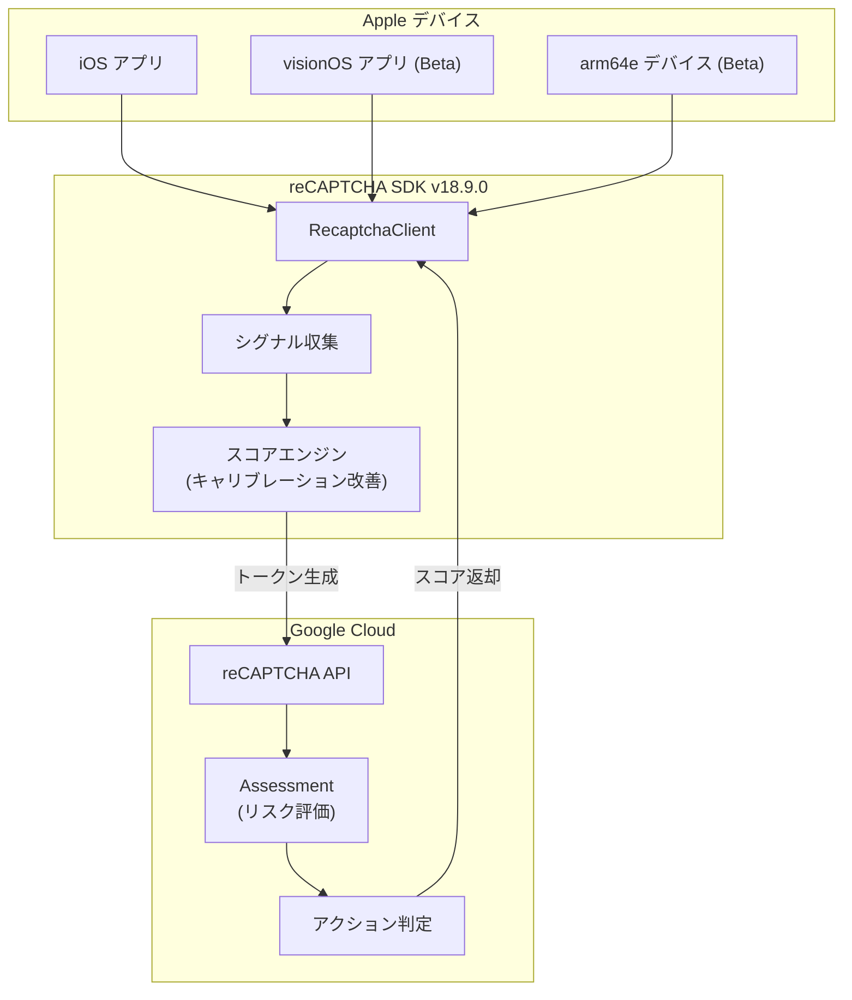

# reCAPTCHA: Mobile SDK v18.9.0 for iOS

**リリース日**: 2026-05-01

**サービス**: reCAPTCHA

**機能**: Mobile SDK v18.9.0 for iOS

**ステータス**: Change

[このアップデートのインフォグラフィックを見る](https://takech9203.github.io/google-cloud-news-summary/20260501-recaptcha-mobile-sdk-v18-9-0.html)

## 概要

reCAPTCHA Mobile SDK v18.9.0 が iOS 向けにリリースされた。本バージョンでは、信頼性の向上とバグ修正に加え、スコア分布のキャリブレーション改善によるボット検出精度の向上が行われている。また、visionOS および arm64e アーキテクチャ (Enhanced Security Features) のベータサポートが追加された。

このアップデートは、iOS アプリケーションにおけるボット対策を強化するものであり、特に Apple Vision Pro (visionOS) への対応は、空間コンピューティング領域でのセキュリティ保護を可能にする重要な進展である。スコア分布のキャリブレーションにより、正規ユーザーとボットの識別精度が向上し、より正確なリスク評価が期待できる。

**アップデート前の課題**

- スコア分布のキャリブレーションが最適化されておらず、一部のケースで誤検知 (false positive) が発生する可能性があった
- visionOS (Apple Vision Pro) 向けアプリケーションでは reCAPTCHA SDK を利用できなかった
- arm64e アーキテクチャおよび Enhanced Security Features (Pointer Authentication) 環境での SDK 動作がサポートされていなかった

**アップデート後の改善**

- スコア分布のキャリブレーション改善により、ボット検出の精度が向上し、正規ユーザーのブロックリスクが低減された
- visionOS 向けアプリケーションでも reCAPTCHA によるボット防御が可能になった (ベータ)
- arm64e および Enhanced Security Features 環境での SDK 動作がサポートされ、より高セキュリティな実行環境での利用が可能になった (ベータ)

## アーキテクチャ図



reCAPTCHA Mobile SDK v18.9.0 は、iOS / visionOS / arm64e 環境のアプリからシグナルを収集し、改善されたスコアエンジンでトークンを生成して Google Cloud のバックエンドに送信する。バックエンドでリスク評価を行い、スコアをアプリに返却する。

## サービスアップデートの詳細

### 主要機能

1. **信頼性の向上とバグ修正**
   - SDK 全般の安定性が向上
   - 既知の不具合が修正され、アプリケーションの動作がより安定

2. **スコア分布キャリブレーションの改善**
   - ボット検出のためのスコア分布が再キャリブレーションされ、精度が向上
   - 正規ユーザーが誤ってブロックされる (false positive) リスクが低減
   - スコア閾値の見直しが推奨される (false positive の確認のため)

3. **visionOS ベータサポート**
   - Apple Vision Pro (visionOS) 向けアプリケーションで reCAPTCHA SDK が利用可能に
   - 空間コンピューティング環境でのボット対策が実現

4. **arm64e および Enhanced Security Features ベータサポート**
   - Apple の Pointer Authentication (PAC) を使用した arm64e アーキテクチャに対応
   - Enhanced Security Features 環境での SDK 動作をサポート
   - より高いセキュリティレベルでの実行が可能に

## 技術仕様

### SDK 要件

| 項目 | 詳細 |
|------|------|
| SDK バージョン | 18.9.0 |
| 対応プラットフォーム | iOS, visionOS (Beta) |
| 最小 iOS バージョン | iOS 15 |
| アーキテクチャ | arm64, arm64e (Beta) |
| 配布方法 | CocoaPods, Swift Package Manager, Direct Download |

### インストール方法

#### CocoaPods

```ruby
source "https://github.com/CocoaPods/Specs.git"

target 'AppTarget' do
  use_frameworks!
  pod "RecaptchaEnterprise", "18.9.0"
end
```

#### Swift Package Manager

Xcode で File > Add Packages を選択し、以下の URL を入力:

```
https://github.com/GoogleCloudPlatform/recaptcha-enterprise-mobile-sdk
```

#### Direct Download

```
https://dl.google.com/recaptchaenterprise/v18.9.0/RecaptchaEnterprise_iOS_xcframework/recaptcha-xcframework.xcframework.zip
```

## 設定方法

### 前提条件

1. iOS 15 以上をターゲットとした Xcode プロジェクト
2. reCAPTCHA キーの作成 (iOS アプリプラットフォーム用)
3. GitHub アカウント (Swift Package Manager 使用時)

### 手順

#### ステップ 1: SDK のインストール

```bash
# CocoaPods の場合
pod update
```

#### ステップ 2: RecaptchaClient の初期化 (Swift)

```swift
import RecaptchaEnterprise

class ViewController: UIViewController {
    var recaptchaClient: RecaptchaClient?

    override func viewDidLoad() {
        super.viewDidLoad()
        Task {
            do {
                self.recaptchaClient = try await Recaptcha.fetchClient(withSiteKey: "KEY_ID")
            } catch let error as RecaptchaError {
                print("RecaptchaClient creation error: \(String(describing: error.errorMessage)).")
            }
        }
    }
}
```

#### ステップ 3: トークンの取得

```swift
Task {
    do {
        let token = try await recaptchaClient.execute(
            withAction: RecaptchaAction.login,
            withTimeout: 10000)
        print(token)
    } catch let error as RecaptchaError {
        print(error.errorMessage)
    }
}
```

#### ステップ 4: スコア閾値の確認

v18.9.0 ではスコア分布のキャリブレーションが変更されているため、既存のスコア閾値設定を確認し、false positive が発生していないかテストすることが推奨される。

## メリット

### ビジネス面

- **ユーザー体験の向上**: スコアキャリブレーション改善により、正規ユーザーが誤ってブロックされるケースが減少し、コンバージョン率への悪影響を軽減
- **プラットフォーム対応の拡大**: visionOS サポートにより、Apple Vision Pro 向けアプリでもボット対策が可能になり、新プラットフォームでの安全なサービス展開を実現

### 技術面

- **セキュリティ強化**: arm64e / Enhanced Security Features 対応により、Pointer Authentication が有効な環境でも安定動作し、セキュリティレベルの高いアプリ構成が可能
- **検出精度の向上**: スコア分布の最適化により、より正確なボット/人間の判別が可能になり、不正アクセス対策の精度が向上

## デメリット・制約事項

### 制限事項

- visionOS サポートはベータ段階であり、本番環境での利用は慎重に検討する必要がある
- arm64e / Enhanced Security Features サポートもベータ段階
- iOS アプリでは視覚的な reCAPTCHA チャレンジ (I'm not a robot) は利用できない

### 考慮すべき点

- スコア分布のキャリブレーション変更に伴い、既存のスコア閾値設定の見直しが必要 (false positive の確認)
- SDK の定期的なアップグレードが推奨されている (非推奨・廃止ポリシーに注意)
- SDK 初期化には数秒かかる場合があるため、アプリの起動時など早い段階での初期化が推奨

## ユースケース

### ユースケース 1: visionOS アプリでのログイン保護

**シナリオ**: Apple Vision Pro 向けの空間コンピューティングアプリケーションにおいて、ログインフローをボットから保護したい場合。

**効果**: visionOS ベータサポートにより、従来は SDK が対応していなかった visionOS プラットフォームでも reCAPTCHA によるリスクスコアリングが利用可能になり、自動化された不正ログイン試行を検出できる。

### ユースケース 2: 高セキュリティ環境でのモバイル決済保護

**シナリオ**: arm64e / Enhanced Security Features を有効にした高セキュリティ構成の iOS アプリで、決済トランザクションを保護したい場合。

**効果**: arm64e ベータサポートにより、Pointer Authentication が有効なデバイスでも SDK が安定動作し、セキュリティを最大限に高めた環境でのトランザクション保護が実現できる。

## 料金

reCAPTCHA は 3 つのティア (Essentials / Premium / Enterprise) で提供される。

### 料金例

| ティア | 月間アセスメント数 | 月額料金 (概算) |
|--------|-------------------|-----------------|
| Essentials | 10,000 まで | 無料 |
| Premium | 1 - 10,000 | 無料 |
| Premium | 10,001 - 100,000 | $8 (定額) |
| Premium | 100,000 超 | $1 / 1,000 アセスメント |
| Enterprise | ボリュームコミットメント | $1 / 1,000 アセスメント (要契約) |

iOS SDK は全ティアで利用可能。無料枠は組織あたり月間 10,000 アセスメントまで。

## 関連サービス・機能

- **reCAPTCHA Account Defender**: モバイルアプリケーションにおけるアカウント関連の不正行為検出 (GA)
- **Identity Platform**: reCAPTCHA Enterprise API との統合によるユーザー認証保護
- **Cloud Armor**: WAF レベルでの reCAPTCHA Enterprise 統合によるボット防御
- **Firebase Authentication**: reCAPTCHA Enterprise との連携によるログインフロー保護

## 参考リンク

- [インフォグラフィック](https://takech9203.github.io/google-cloud-news-summary/20260501-recaptcha-mobile-sdk-v18-9-0.html)
- [公式リリースノート](https://docs.cloud.google.com/release-notes#May_01_2026)
- [iOS SDK 統合ガイド](https://docs.cloud.google.com/recaptcha/docs/instrument-ios-apps)
- [Mobile SDK 非推奨・廃止ポリシー](https://docs.cloud.google.com/recaptcha/docs/deprecation-policy-mobile)
- [料金ティア比較](https://docs.cloud.google.com/recaptcha/docs/compare-tiers)
- [課金情報](https://docs.cloud.google.com/recaptcha/docs/billing-information)

## まとめ

reCAPTCHA Mobile SDK v18.9.0 は、スコア分布のキャリブレーション改善による検出精度向上と、visionOS / arm64e のベータサポート追加が主な変更点である。既存ユーザーはスコア閾値の見直しを行い、false positive が発生していないか確認することが推奨される。新プラットフォームへの対応を検討しているユーザーは、ベータサポートを活用して早期検証を開始することを推奨する。

---

**タグ**: #reCAPTCHA #iOS #MobileSDK #visionOS #arm64e #BotDetection #Security
