# Google SecOps SOAR: Release 6.3.83 全リージョン展開完了

**リリース日**: 2026-05-02

**サービス**: Google SecOps SOAR

**機能**: Release 6.3.83 全リージョン展開

**ステータス**: 全リージョンで利用可能

[このアップデートのインフォグラフィックを見る](https://takech9203.github.io/google-cloud-news-summary/20260502-secops-soar-release-6-3-83.html)

## 概要

Google SecOps SOAR の Release 6.3.83 が全リージョンで利用可能になった。本リリースは 2026 年 4 月 12 日に第 1 フェーズのリージョン群に先行展開され、約 3 週間の安定稼働確認期間を経て、5 月 2 日に全リージョンへの展開が完了した。

本リリースは内部バグ修正および顧客報告バグの修正を含むメンテナンスリリースである。個別の新機能追加は含まれていないが、プラットフォームの安定性と品質向上に寄与するアップデートとなっている。

**アップデート前の課題**

- Release 6.3.83 で修正対象となった内部バグおよび顧客報告バグが存在していた
- 第 2 フェーズリージョン (Singapore、Qatar、Saudi Arabia、Israel、UK、Italy、EU、US) のユーザーは 6.3.82 を使用していた

**アップデート後の改善**

- 内部バグおよび顧客報告バグが修正され、プラットフォームの安定性が向上した
- 全リージョンで同一バージョン (6.3.83) が利用可能になり、リージョン間の機能差異が解消された

## アーキテクチャ図

```mermaid
flowchart LR
    subgraph Phase1["第1フェーズ (4月12日)"]
        JP["🇯🇵 Japan"]
        IN["🇮🇳 India"]
        AU["🇦🇺 Australia"]
        CA["🇨🇦 Canada"]
        DE["🇩🇪 Germany"]
        CH["🇨🇭 Switzerland"]
    end

    subgraph Phase2["第2フェーズ (5月2日)"]
        SG["🇸🇬 Singapore"]
        QA["🇶🇦 Qatar"]
        SA["🇸🇦 Saudi Arabia"]
        IL["🇮🇱 Israel"]
        UK["🇬🇧 UK (London)"]
        IT["🇮🇹 Italy"]
        EU["🇪🇺 EU (multi-region)"]
        US["🇺🇸 US (multi-region)"]
    end

    Release["Release 6.3.83"] --> Phase1
    Phase1 -->|"安定稼働確認"| Phase2
```

Google SecOps SOAR のリリースは 2 段階の段階的ロールアウトで展開される。第 1 フェーズで安定性を確認した後、第 2 フェーズの残りリージョンに展開される。

## サービスアップデートの詳細

### 主要内容

1. **内部バグ修正**
   - Google 内部で検出されたバグの修正が含まれる
   - プラットフォームの内部動作の安定性向上

2. **顧客報告バグ修正**
   - 顧客から報告されたバグの修正が含まれる
   - 具体的な修正内容は個別の Issue ID として管理されている

3. **段階的リリースの完了**
   - 4 月 12 日: 第 1 フェーズリージョン (日本、インド、オーストラリア、カナダ、ドイツ、スイス) に展開
   - 5 月 2 日: 全リージョンで利用可能に (第 2 フェーズリージョンへの展開完了)

## 技術仕様

### リリース展開スケジュール

| フェーズ | 日付 | 対象リージョン |
|----------|------|----------------|
| 第 1 フェーズ | 2026-04-12 | Japan, India, Australia, Canada, Germany, Switzerland |
| 第 2 フェーズ (全リージョン) | 2026-05-02 | Singapore, Qatar, Saudi Arabia, Israel, UK (London), Italy, EU (multi-region), US (multi-region) |

### バージョン情報

| 項目 | 詳細 |
|------|------|
| リリースバージョン | 6.3.83 |
| 前バージョン | 6.3.82 |
| 次バージョン | 6.3.84 (第 1 フェーズ展開中) |
| リリースタイプ | メンテナンスリリース (バグ修正) |

## 利用可能リージョン

全リージョンで利用可能:

- **第 1 フェーズリージョン**: Japan、India、Australia、Canada、Germany、Switzerland
- **第 2 フェーズリージョン**: Singapore、Qatar、Saudi Arabia、Israel、UK (London)、Italy、EU (multi-region)、US (multi-region)

自身が所属するリージョンが不明な場合は、Google SecOps の担当者に確認できる。

## 関連サービス・機能

- **Google SecOps SIEM**: SOAR と統合されたセキュリティ情報イベント管理プラットフォーム。SOAR のプレイブック自動化と連携してインシデント対応を実行する
- **Google Cloud IAM**: SOAR の権限管理が Google Cloud IAM に移行中 (2026 年 3 月 17 日に GA)。レガシー権限グループからの移行が可能
- **Chronicle**: Google SecOps の基盤となるセキュリティ分析プラットフォーム

## 参考リンク

- [インフォグラフィック](https://takech9203.github.io/google-cloud-news-summary/20260502-secops-soar-release-6-3-83.html)
- [公式リリースノート](https://docs.cloud.google.com/chronicle/docs/soar/release-notes#May_02_2026)
- [SOAR 段階的リリース計画](https://docs.cloud.google.com/chronicle/docs/soar/overview-and-introduction/soar-gradual-release)
- [Google Cloud Release Notes](https://docs.cloud.google.com/release-notes#May_02_2026)

## まとめ

Google SecOps SOAR Release 6.3.83 は、内部およびカスタマーバグ修正を含むメンテナンスリリースとして全リージョンへの展開が完了した。特定の新機能追加はないが、プラットフォームの安定性向上に寄与している。SOAR を利用中の組織は、Settings > License ページでバージョンが 6.3.83 に更新されていることを確認することを推奨する。

---

**タグ**: #GoogleSecOps #SOAR #SecurityOperations #Release #BugFix #Chronicle
