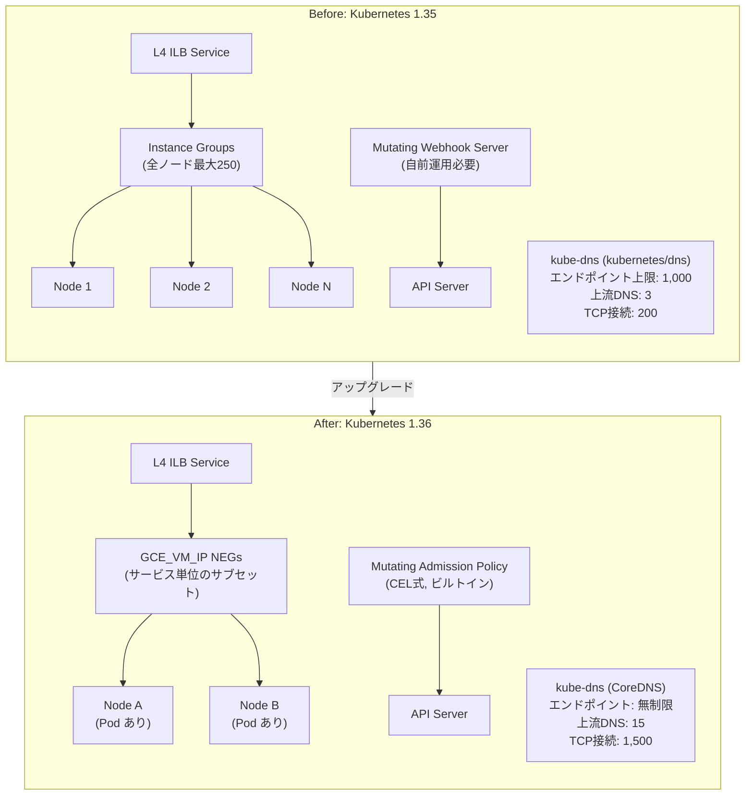

# Google Kubernetes Engine (GKE): Kubernetes 1.36 が Rapid チャネルで利用可能に

**リリース日**: 2026-05-03

**サービス**: Google Kubernetes Engine (GKE)

**機能**: Kubernetes 1.36 available in Rapid channel

**ステータス**: GA (Rapid channel)

📊 [このアップデートのインフォグラフィックを見る](https://takech9203.github.io/google-cloud-news-summary/20260503-gke-kubernetes-1-36-rapid-channel.html)

## 概要

Kubernetes 1.36 が GKE の Rapid チャネルで利用可能になりました。このリリースには、L4 内部ロードバランサーのデフォルト実装の変更、Mutating Admission Policies の GA 化、kube-dns イメージの CoreDNS ベースへの移行という 3 つの主要なアップデートが含まれています。

これらの変更は、GKE クラスターのスケーラビリティ、パフォーマンス、運用効率を大幅に向上させるものです。特に大規模クラスターを運用する組織や、Kubernetes のアドミッション制御をカスタマイズしている組織にとって重要なアップデートとなります。

Rapid チャネルでの提供のため、早期に新機能を検証したいユーザーが対象です。本番環境での利用は Regular または Stable チャネルへの昇格後を推奨します。

**アップデート前の課題**

- L4 内部ロードバランサーは Instance Groups をバックエンドとして使用しており、250 ノードを超えるクラスターでスケーラビリティの問題が発生していた
- リソースの変更(Mutation)には Webhook サーバーの構築・運用が必要で、レイテンシやメンテナンスコストが高かった
- kube-dns (kubernetes/dns ベース) はヘッドレスサービスのエンドポイントが 1,000 に制限され、上流 DNS サーバーは 3 つまで、同時 TCP 接続は 200 に制限されていた

**アップデート後の改善**

- 新規作成される L4 ILB サービスは NEG (Network Endpoint Groups) をデフォルトで使用し、250 ノード制限が解消された
- Mutating Admission Policies により CEL 式でリソース変更が可能になり、Webhook サーバーが不要になった
- CoreDNS ベースの kube-dns により、全エンドポイントの認識、最大 15 の上流 DNS サーバー、最大 1,500 の同時 TCP 接続が可能になった

## アーキテクチャ図



この図は Kubernetes 1.36 における 3 つの主要変更の Before/After を示しています。L4 ILB は Instance Groups から NEG へ、アドミッション制御は Webhook から CEL ベースのポリシーへ、DNS は kubernetes/dns から CoreDNS ベースへそれぞれ移行しています。

## サービスアップデートの詳細

### 主要機能

1. **L4 内部ロードバランサーの GKE サブセッティングデフォルト化**
   - 新規作成される ILB サービスは、Instance Groups ではなく GCE_VM_IP NEG をバックエンドとして使用
   - NEG ベースのアプローチにより、スケーラビリティの向上と同期の高速化を実現
   - 既存の ILB サービスは影響を受けず、引き続き Instance Groups を使用
   - `externalTrafficPolicy: Cluster` の場合、NEG あたり最大 25 ノードエンドポイントで効率的に管理
   - `externalTrafficPolicy: Local` の場合、Pod が存在するノードのみが NEG に含まれる（最大 250 ノード）

2. **Mutating Admission Policies の GA 化**
   - Common Expression Language (CEL) 式を使用してリソースの変更を定義可能
   - Webhook サーバーの構築・デプロイ・スケーリングが不要
   - Kubernetes API サーバーに組み込まれたネイティブ機能として動作
   - JSON Patch 形式でリソースのフィールドを追加・変更・削除可能
   - `reinvocationPolicy` による再呼び出し制御をサポート

3. **kube-dns の CoreDNS ベース実装への移行**
   - EndpointSlices を使用することで全エンドポイントを認識可能に（従来は 1,000 まで）
   - 上流 DNS サーバーのサポート数が 3 から 15 に増加
   - 同時 TCP 接続数が 200 から 1,500 に増加
   - メトリクスポートが 9153 に統一（従来は 10055 と 10054 の 2 ポート）
   - Cloud Monitoring の GKE DNS Observability ダッシュボードとの統合

## 技術仕様

### L4 ILB サブセッティング比較

| 項目 | Before (Instance Groups) | After (NEG) |
|------|--------------------------|-------------|
| バックエンドタイプ | Instance Groups | GCE_VM_IP NEG |
| 最大ノード数 | 250 | 制限なし (Cluster ポリシー時) |
| エンドポイント選択 | 全ノード | Pod が存在するノードのみ |
| 同期速度 | 低速 | 高速 |
| 適用対象 | 既存サービス (変更なし) | 新規作成サービスのみ |

### kube-dns 実装比較

| 機能 | Legacy (1.35 以前) | CoreDNS ベース (1.36 以降) |
|------|-------------------|---------------------------|
| エンドポイント認識数 | 最大 1,000 | 無制限 (EndpointSlices 使用) |
| 上流 DNS サーバー数 | 最大 3 | 最大 15 |
| 同時 TCP 接続数 (アウトバウンド) | 最大 200 | 最大 1,500 |
| メトリクスポート | 10055, 10054 | 9153 |
| コンテナ構成 | マルチコンテナ Pod | 統合コンテナ |

### Mutating Admission Policy の設定例

```yaml
apiVersion: admissionregistration.k8s.io/v1
kind: MutatingAdmissionPolicy
metadata:
  name: "add-default-labels"
spec:
  matchConstraints:
    resourceRules:
    - apiGroups: [""]
      apiVersions: ["v1"]
      operations: ["CREATE"]
      resources: ["pods"]
  failurePolicy: Fail
  reinvocationPolicy: IfNeeded
  mutations:
  - patchType: "JSONPatch"
    jsonPatch:
      expression: >
        [
          JSONPatch{
            op: "add",
            path: "/metadata/labels/environment",
            value: "production"
          }
        ]
```

## 設定方法

### 前提条件

1. GKE クラスターが Rapid チャネルに登録されていること
2. クラスターバージョンが 1.36 以降であること
3. HttpLoadBalancing アドオンが有効であること（L4 ILB NEG 機能に必要、デフォルトで有効）

### 手順

#### ステップ 1: クラスターを Rapid チャネルに設定

```bash
# 新規クラスター作成時
gcloud container clusters create my-cluster \
  --release-channel=rapid \
  --location=us-central1

# 既存クラスターのチャネル変更
gcloud container clusters update my-cluster \
  --release-channel=rapid \
  --location=us-central1
```

Rapid チャネルに設定することで、Kubernetes 1.36 が自動的に適用されます。

#### ステップ 2: L4 ILB サービスの作成（NEG ベース）

```yaml
apiVersion: v1
kind: Service
metadata:
  name: my-internal-service
  annotations:
    networking.gke.io/load-balancer-type: "Internal"
spec:
  type: LoadBalancer
  selector:
    app: my-app
  ports:
  - port: 80
    targetPort: 8080
```

Kubernetes 1.36 では新規作成される ILB サービスは自動的に NEG ベースのサブセッティングを使用します。特別なアノテーションは不要です。

#### ステップ 3: Mutating Admission Policy の適用

```bash
# ポリシーの作成
kubectl apply -f mutating-admission-policy.yaml

# ポリシーバインディングの作成
kubectl apply -f mutating-admission-policy-binding.yaml

# 動作確認
kubectl create deployment test --image=nginx
kubectl get pod -l app=test -o jsonpath='{.items[0].metadata.labels}'
```

#### ステップ 4: kube-dns (CoreDNS) の動作確認

```bash
# kube-dns Pod の確認
kubectl get pods -n kube-system --selector=k8s-app=kube-dns

# メトリクスの確認（ポート 9153）
kubectl port-forward pod/kube-dns-xxxxx -n kube-system 9153:9153
curl http://127.0.0.1:9153/metrics
```

## メリット

### ビジネス面

- **運用コスト削減**: Mutating Admission Policies により Webhook サーバーの運用が不要になり、インフラ管理コストが削減
- **サービス品質向上**: DNS の信頼性向上により、大規模マイクロサービス環境でのサービス間通信の安定性が改善
- **スケーラビリティ**: 250 ノード超のクラスターでも ILB が安定動作し、大規模デプロイメントに対応

### 技術面

- **同期高速化**: NEG ベースの ILB はエンドポイント変更の反映が高速で、Pod のスケーリング時のトラフィック切り替えが迅速
- **DNS 解決の向上**: EndpointSlices 対応により 1,000 を超える Pod を持つヘッドレスサービスでも完全な DNS 解決が可能
- **セキュリティ強化**: CEL ベースのポリシーは API サーバー内で実行されるため、外部 Webhook への通信が不要でネットワーク攻撃面が縮小
- **可観測性**: CoreDNS のメトリクスが Cloud Monitoring と統合され、DNS パフォーマンスの可視化が容易に

## デメリット・制約事項

### 制限事項

- L4 ILB の NEG デフォルト化は新規作成サービスのみに適用。既存サービスの移行は手動対応が必要
- Rapid チャネルでの提供のため、本番環境での利用は推奨されない段階
- GKE サブセッティングは一度有効にすると無効化できない
- `externalTrafficPolicy: Local` 使用時は NEG バックエンドが最大 250 ノードに制限

### 考慮すべき点

- CoreDNS への移行に伴い、メトリクス収集のエンドポイントが変更（10055/10054 から 9153 へ）されるため、既存の監視設定の更新が必要
- Mutating Admission Policy は既存の Pod を更新できないため、ポリシー適用前に作成された Pod は再作成が必要
- kube-dns のカスタム ConfigMap 設定を使用している場合、CoreDNS 形式への設定変換が必要な場合がある
- ヘッドレスサービスのクロス VPC 探索は kube-dns (CoreDNS) でもサポートされない（Cloud DNS for GKE が必要）

## ユースケース

### ユースケース 1: 大規模マイクロサービス環境での ILB 利用

**シナリオ**: 500 ノードを超える GKE クラスターで複数の内部ロードバランサーサービスを運用する組織。従来は 250 ノード制限により、クラスター分割やカスタム設定が必要だった。

**実装例**:
```yaml
apiVersion: v1
kind: Service
metadata:
  name: payment-service
  annotations:
    networking.gke.io/load-balancer-type: "Internal"
spec:
  type: LoadBalancer
  externalTrafficPolicy: Cluster
  selector:
    app: payment
  ports:
  - port: 443
    targetPort: 8443
```

**効果**: 新規サービスは自動的に NEG ベースで作成され、ノード数に依存しないスケーラブルな内部負荷分散が実現。クラスター分割が不要になり、運用の複雑さが大幅に低減。

### ユースケース 2: CEL ベースのリソース変更によるガバナンス

**シナリオ**: 組織のセキュリティポリシーにより、全 Pod に特定のラベルやセキュリティコンテキストを自動付与したい。従来は Webhook サーバーを自前で構築・運用していた。

**実装例**:
```yaml
apiVersion: admissionregistration.k8s.io/v1
kind: MutatingAdmissionPolicy
metadata:
  name: enforce-security-context
spec:
  matchConstraints:
    resourceRules:
    - apiGroups: [""]
      apiVersions: ["v1"]
      operations: ["CREATE"]
      resources: ["pods"]
  mutations:
  - patchType: "JSONPatch"
    jsonPatch:
      expression: >
        [
          JSONPatch{
            op: "add",
            path: "/spec/securityContext/runAsNonRoot",
            value: true
          }
        ]
```

**効果**: Webhook サーバーのデプロイ・スケーリング・メンテナンスが不要になり、API サーバーのネイティブ機能として高信頼性・低レイテンシでポリシーを適用可能。

### ユースケース 3: 大規模ヘッドレスサービスの DNS 解決

**シナリオ**: StatefulSet で 2,000 以上の Pod を持つ分散データベース（例: Cassandra, CockroachDB）を運用。従来の kube-dns では 1,000 エンドポイントまでしか認識できず、一部の Pod への通信が失敗していた。

**効果**: CoreDNS ベースの kube-dns は EndpointSlices を使用して全エンドポイントを認識するため、大規模 StatefulSet でも完全な DNS 解決が保証される。

## 料金

Kubernetes 1.36 の新機能自体に追加料金は発生しません。GKE の料金は通常通り適用されます。

| 項目 | 料金 |
|------|------|
| GKE Autopilot | Pod の vCPU/メモリ/ストレージに基づく従量課金 |
| GKE Standard | クラスター管理料: $0.10/時間 + ノードの Compute Engine 料金 |
| 内部ロードバランサー | 転送ルール料金 + データ処理料金 (NEG/Instance Groups 共通) |
| Rapid チャネル | 追加料金なし |

## 利用可能リージョン

Kubernetes 1.36 は Rapid チャネルを選択したすべての GKE クラスターで利用可能です。Rapid チャネルは全リージョンで提供されています。今後、Regular チャネル、Stable チャネルへと順次展開される予定です。

- **Rapid チャネル**: 利用可能 (2026年5月)
- **Regular チャネル**: 今後数週間で利用可能予定
- **Stable チャネル**: 今後数ヶ月で利用可能予定

## 関連サービス・機能

- **Cloud Load Balancing**: L4 ILB の NEG バックエンドは Cloud Load Balancing の内部パススルー Network Load Balancer として実装
- **Cloud DNS for GKE**: kube-dns の代替として VPC スコープの DNS 解決を提供。クロス VPC のヘッドレスサービス探索が必要な場合に推奨
- **NodeLocal DNSCache**: kube-dns (CoreDNS) と組み合わせることで、ノードレベルの DNS キャッシュによりレイテンシをさらに削減
- **Config Sync**: Mutating Admission Policies を使用した Config Sync システム Pod のノード配置カスタマイズをサポート
- **GKE Gateway Controller**: L7 ロードバランシングの次世代実装。L4 ILB の NEG 化と同様の方向性

## 参考リンク

- 📊 [インフォグラフィック](https://takech9203.github.io/google-cloud-news-summary/20260503-gke-kubernetes-1-36-rapid-channel.html)
- [GKE リリースノート](https://docs.cloud.google.com/release-notes#May_03_2026)
- [Kubernetes 1.36 Release Notes (GitHub)](https://github.com/kubernetes/kubernetes/blob/master/CHANGELOG/CHANGELOG-1.36.md#changelog-since-v1350)
- [Kubernetes 1.36 Release Blog](https://kubernetes.io/blog/2026/04/22/kubernetes-v1-36-release/)
- [L4 内部ロードバランシング ドキュメント](https://docs.cloud.google.com/kubernetes-engine/docs/how-to/internal-load-balancing)
- [Mutating Admission Policies (Kubernetes 公式)](https://kubernetes.io/docs/reference/access-authn-authz/mutating-admission-policy/)
- [GKE kube-dns コンセプト](https://docs.cloud.google.com/kubernetes-engine/docs/concepts/kube-dns)
- [GKE Service Load Balancer コンセプト](https://docs.cloud.google.com/kubernetes-engine/docs/concepts/service-load-balancer)

## まとめ

Kubernetes 1.36 は GKE における 3 つの重要な基盤強化を提供します。L4 ILB の NEG デフォルト化は大規模クラスターでのネットワーク運用を簡素化し、Mutating Admission Policies は Webhook なしでのリソース制御を可能にし、CoreDNS ベースの kube-dns は DNS の信頼性とスケーラビリティを大幅に向上させます。現在は Rapid チャネルでの提供のため、まずは開発・検証環境で新機能の動作を確認し、Regular/Stable チャネルへの昇格に備えた準備を進めることを推奨します。

---

**タグ**: #GKE #Kubernetes #k8s-1.36 #InternalLoadBalancer #NEG #MutatingAdmissionPolicy #CoreDNS #kube-dns #RapidChannel #GKESubsetting #CEL #AdmissionControl
