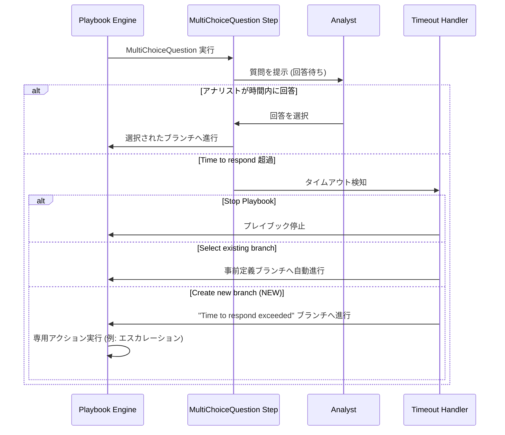

# Google SecOps SOAR: MultiChoiceQuestion ステップの「応答時間超過」オプション強化

**リリース日**: 2026-05-03

**サービス**: Google SecOps / Google SecOps SOAR

**機能**: MultiChoiceQuestion ステップの「Time to respond」オプション強化

**ステータス**: Feature

[このアップデートのインフォグラフィックを見る](https://takech9203.github.io/google-cloud-news-summary/20260503-google-secops-multichoice-time-to-respond.html)

## 概要

Google SecOps SOAR のプレイブック機能において、MultiChoiceQuestion (複数選択質問) ステップの「Time to respond (応答時間)」超過時の動作に、より細かい制御オプションが追加されました。これにより、アナリストが指定時間内に回答しなかった場合のプレイブック実行フローを、より柔軟に設計できるようになります。

従来は応答時間超過時にプレイブックを停止するか、限定的な選択肢しかありませんでしたが、今回のアップデートにより、事前定義された回答ブランチの1つを選択して続行するか、タイムアウト専用のブランチを新たに作成して独自のアクションを定義できるようになりました。

このアップデートは、セキュリティ運用チームがインシデント対応の自動化ワークフローにおいて、人間の判断を待つステップでのタイムアウト処理を最適化することを目的としています。SOC (Security Operations Center) のアナリストやプレイブック設計者が主な対象ユーザーです。

**アップデート前の課題**

- 応答時間超過時の対応が「プレイブックの停止」に限られており、タイムアウト発生時に自動的にエスカレーションや代替処理を行うことが困難だった
- タイムアウト時に特定の回答ブランチを自動選択する仕組みがなく、プレイブックが中断されることで対応遅延が発生していた
- タイムアウト専用の処理パス (例: 上位者への通知、デフォルトアクションの実行) を定義するには、追加のワークアラウンドが必要だった

**アップデート後の改善**

- タイムアウト時に事前定義された回答ブランチの1つを自動選択してプレイブック実行を継続可能になった
- タイムアウト専用の新しいブランチを作成し、独自のアクション (例: マネージャーへのメール送信) を定義できるようになった
- プレイブックの停止、既存ブランチの選択、新規ブランチの作成という3つの選択肢から最適な対応を選べるようになった

## アーキテクチャ図

この図は、MultiChoiceQuestion ステップにおける応答時間超過時の3つの処理パスを示しています。アナリストが時間内に回答した場合は通常フローが実行され、タイムアウト時は設定に応じて停止・既存ブランチ選択・専用ブランチ実行のいずれかが行われます。

## サービスアップデートの詳細

### 主要機能

1. **Stop Playbook (プレイブック停止)**
   - 従来から存在するオプション
   - ユーザーが指定時間内に応答しない場合、プレイブックの実行を完全に停止する
   - 重要な判断が必要で、人間の回答なしに進行すべきでないケースに適する

2. **Select existing branch (既存ブランチの選択)**
   - 今回新たに追加されたオプション
   - タイムアウト時に、既に定義されている回答ブランチの1つを自動的に選択してプレイブックを続行する
   - デフォルトの安全なアクションが明確な場合に有効 (例: 「隔離する」をデフォルトとして自動選択)

3. **Create new branch (新規ブランチの作成)**
   - 今回新たに追加されたオプション
   - タイムアウト専用の「Time to respond exceeded」ブランチがプレイブックデザイナーに生成される
   - 通常の回答オプションとは異なる独自のアクション (マネージャーへのメール送信、チケット作成など) を定義可能
   - プレイブックデザイナー上で「Time to respond exceeded」ラベルとして表示される

## 技術仕様

### 設定パラメータ

| 項目 | 詳細 |
|------|------|
| 対象ステップ | MultiChoiceQuestion フロー |
| タイムアウト設定単位 | 日、時間、分 |
| 最大ブランチ数 | 回答ブランチ最大20 + Time to respond exceeded ブランチ1 |
| 設定場所 | ステップのサイドドロワー > Settings タブ |
| 対応バージョン | Release 6.3.84 以降 |

### ブランチ制限

| 項目 | 詳細 |
|------|------|
| MultiChoiceQuestion 最大ブランチ数 | 20 (2026年4月のアップデートで6から拡大) |
| タイムアウトブランチ | 追加で1ブランチ (設定時のみ) |
| Condition フロー最大ブランチ数 | 19 + Else ブランチ |

## 設定方法

### 前提条件

1. Google SecOps SOAR へのアクセス権限があること
2. プレイブックの編集権限を持っていること
3. Release 6.3.84 が展開済みのリージョンであること

### 手順

#### ステップ 1: MultiChoiceQuestion フローの追加

プレイブックエディタで Response > Playbooks ページを開き、MultiChoiceQuestion フローを目的のステップにドラッグ&ドロップします。ボックスをダブルクリックしてサイドドロワーを開きます。

#### ステップ 2: 質問と回答の設定

Parameters タブで質問テキストと回答選択肢を入力します。最大20の回答ブランチを設定できます。

#### ステップ 3: Time to respond の設定

1. サイドドロワーの **Settings** タブをクリック
2. **Time to respond** オプションを **ON** にトグル
3. 日、時間、分で適切な待ち時間を指定
4. **If Time to Respond exceeded** セクションで以下のいずれかを選択:
   - **Stop Playbook**: プレイブックを停止
   - **Select existing branch**: 既存の回答ブランチから1つを選択
   - **Create new branch**: タイムアウト専用ブランチを新規作成

#### ステップ 4: 保存と確認

**Save** をクリックすると、設定に応じてプレイブックデザイナーに「Time to respond exceeded」ブランチが表示されます (Create new branch 選択時)。必要に応じて、このブランチにアクションを追加します。

## メリット

### ビジネス面

- **インシデント対応時間の短縮**: タイムアウト時に自動的に代替パスが実行されるため、アナリスト不在時でも対応が停滞しない
- **SLA 遵守の向上**: 応答待ちによるプレイブック停滞がなくなり、定められた時間内での対応完了率が改善される
- **エスカレーションの自動化**: タイムアウト専用ブランチにより、管理者への自動通知やチケット起票が可能になる

### 技術面

- **プレイブック設計の柔軟性向上**: タイムアウト処理のための追加ワークアラウンドが不要になり、ネイティブ機能として実装可能
- **分岐ロジックの簡素化**: 1つのステップ内でタイムアウト処理を完結でき、プレイブック全体の複雑さが軽減される
- **既存プレイブックとの互換性**: 既存の Stop Playbook 動作はそのまま維持され、新オプションは追加的に利用可能

## デメリット・制約事項

### 制限事項

- Release 6.3.84 の段階的ロールアウト対象リージョンから順次展開されるため、全リージョンで即時利用可能ではない
- タイムアウトブランチ内のアクションは別途手動で設定する必要がある (テンプレートは提供されない)

### 考慮すべき点

- 「Select existing branch」で自動選択されるブランチの設定が不適切な場合、意図しないアクションが自動実行されるリスクがある
- タイムアウト時間の設定が短すぎると、アナリストが検討中でもタイムアウトが発動する可能性がある
- 既存プレイブックの移行時は、現在の「Stop Playbook」設定を見直し、新しいオプションが適切かどうかを評価する必要がある

## ユースケース

### ユースケース 1: マルウェア検出時の承認ワークフロー

**シナリオ**: エンドポイントでマルウェアが検出された際、アナリストに「端末を隔離するか」「調査を続行するか」を質問するプレイブック。アナリストが15分以内に応答しない場合、安全策として自動的に「隔離する」ブランチを選択。

**効果**: 夜間やアナリスト不在時でも、感染端末が放置されるリスクを最小化。即座に隔離が実行され、後続の調査アクションも自動的に開始される。

### ユースケース 2: フィッシングメール報告のエスカレーション

**シナリオ**: フィッシングメールの報告があった際、Tier 1 アナリストに対応方法を質問。30分以内に回答がない場合、専用の「Time to respond exceeded」ブランチが実行され、Tier 2 マネージャーにメール通知とSlack通知を送信し、ケースの優先度を自動昇格。

**効果**: 未対応のフィッシングインシデントが長時間放置されることを防止。エスカレーションパスが標準化され、対応漏れのリスクを排除。

## 関連サービス・機能

- **Google SecOps SOAR Playbook Engine**: プレイブック全体の実行エンジンであり、今回のフロー制御の基盤
- **Google SecOps SOAR Condition Flow**: 条件分岐フローとの組み合わせで、より複雑な自動化ロジックを構築可能
- **Google SecOps SOAR Approval Links**: MultiChoiceQuestion を外部承認 (メール経由) と連携させる機能
- **Google SecOps SOAR Blocks**: 再利用可能なプレイブックブロックとして、タイムアウト処理パターンを標準化可能

## 参考リンク

- [インフォグラフィック](https://takech9203.github.io/google-cloud-news-summary/20260503-google-secops-multichoice-time-to-respond.html)
- [公式リリースノート](https://docs.cloud.google.com/release-notes#May_03_2026)
- [ドキュメント: Add a multi-choice question flow](https://docs.cloud.google.com/chronicle/docs/soar/respond/working-with-playbooks/using-flows-in-playbooks#multi-choice)
- [ドキュメント: Use flows in playbooks](https://docs.cloud.google.com/chronicle/docs/soar/respond/working-with-playbooks/using-flows-in-playbooks)
- [Google SecOps SOAR リリースノート](https://docs.cloud.google.com/chronicle/docs/soar/release-notes)

## まとめ

今回のアップデートにより、Google SecOps SOAR のプレイブックにおける人間の判断待ちステップでのタイムアウト処理が大幅に柔軟になりました。特に「既存ブランチの自動選択」と「専用ブランチの作成」は、24時間体制のセキュリティ運用において対応漏れを防ぐ重要な改善です。SOC チームは既存のプレイブックを見直し、タイムアウト時の最適な処理パスを設計することを推奨します。

---

**タグ**: #GoogleSecOps #SOAR #Playbook #SecurityAutomation #IncidentResponse #MultiChoiceQuestion #TimeToRespond
