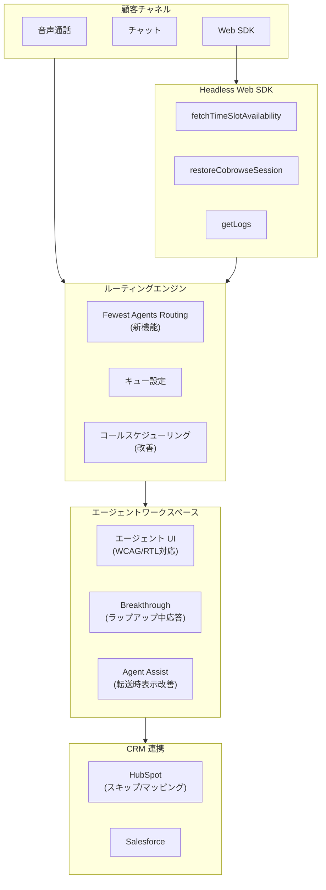

# Google Cloud Contact Center as a Service (CCaaS): Version 4.26 Release

**リリース日**: 2026-05-04

**サービス**: Google Cloud Contact Center as a Service (CCaaS)

**機能**: Version 4.26 Release

**ステータス**: GA (一般提供)

📊 [このアップデートのインフォグラフィックを見る](https://takech9203.github.io/google-cloud-news-summary/20260504-ccaas-4-26.html)

## 概要

Google Cloud CCaaS (Contact Center as a Service) のバージョン 4.26 がリリースされました。本バージョンでは、チャットルーティングの最適化、コールスケジューリングの大幅改善、HubSpot CRM 連携の強化、アクセシビリティ対応の拡充など、コンタクトセンター運用の効率化と品質向上に寄与する多数の機能が追加されています。

CCaaS は Google Cloud のフルスタックコンタクトセンタープラットフォームであり、Gemini Enterprise for CX の一部として、AI ベースのオムニチャネルルーティング、バーチャルエージェント、Agent Assist、インサイト機能を提供します。今回のアップデートでは、エージェントの稼働効率最大化と顧客体験の向上に焦点を当てた機能強化が行われ、30 件以上のバグ修正も含まれています。

本リリースの適用タイミングは、各インスタンスのデプロイメントスケジュールに依存します。

**アップデート前の課題**

- チャットルーティングでは均等分配が行われ、一部のエージェントが遊休状態になりやすかった
- エージェントがラップアップ中に新規コールを受けられず、応答待ち時間が増加していた
- コールスケジューリングのタイムスロット設定が限定的で、再スケジュールやキャンセルが困難だった
- HubSpot 連携時に不要なアカウント/レコードが自動作成されてしまい、CRM データが汚染されていた
- Agent Assist がコール転送時に正しく表示されないケースがあった
- WCAG 準拠や RTL (右から左) 言語のサポートが不十分だった

**アップデート後の改善**

- Fewest Agents Routing により、最も少ないエージェントで最大のチャット処理が可能に
- Breakthrough 機能の改善により、ラップアップ中でもエージェントがコールに応答可能に
- コールスケジューリングが柔軟に設定可能になり、再スケジュール・キャンセルにも対応
- HubSpot 連携でレコード自動作成のスキップとカスタムフィールドマッピングが実現
- 転送時にも Agent Assist が適切に表示されるようになり、ダイレクト着信コールにも対応
- WCAG 準拠、RTL サポート、スクリーンリーダー対応によりアクセシビリティが向上

## アーキテクチャ図

Google Cloud CCaaS 4.26 のアーキテクチャ概要図です。顧客チャネルからルーティングエンジン、エージェントワークスペース、CRM 連携までの主要コンポーネントと、今回のアップデートで強化されたポイントを示しています。

## サービスアップデートの詳細

### 主要機能

1. **Fewest Agents Routing (最少エージェントルーティング)**
   - 新しいチャットルーティングロジックにより、できるだけ少ないエージェントにチャットを集中的に割り当て
   - エージェントの稼働率を最大化し、遊休エージェント数を最小化
   - キューレベルで有効/無効を切り替え可能

2. **コールスケジューリングの改善**
   - タイムスロットの粒度を細かく設定可能に
   - 顧客による再スケジュールとキャンセルに対応
   - キューレベルでのスケジューリング設定が可能
   - Headless Web SDK に `fetchTimeSlotAvailability` メソッドを追加

3. **Breakthrough for Wrap-up (ラップアップ中の割り込み応答)**
   - エージェントがラップアップ (後処理) 中でも新規着信コールに応答可能
   - 応答待ち時間の短縮とエージェント稼働率の向上に貢献
   - 管理者がキューレベルで有効/無効を制御可能

4. **Agent Assist の転送時可視性向上**
   - ダイレクト着信コールの転送時にも Agent Assist が正しく動作
   - 転送先エージェントがリアルタイムで AI アシスト情報を確認可能
   - 顧客との会話コンテキストが転送後も維持される

5. **HubSpot CRM 連携の強化**
   - アカウント/レコードの自動作成をスキップするオプションを追加
   - SDK カスタムデータから HubSpot フィールドへのカスタムフィールドマッピングに対応
   - CRM データの品質管理と柔軟な連携が可能に

6. **アクセシビリティとデザインの改善**
   - WCAG (Web Content Accessibility Guidelines) 準拠の強化
   - RTL (Right-to-Left) 言語サポートの追加
   - スクリーンリーダー対応の改善
   - より多くのユーザーが快適にシステムを利用可能に

7. **Headless Web SDK のアップデート**
   - `fetchTimeSlotAvailability`: 利用可能なタイムスロットを取得
   - `restoreCobrowseSession`: コブラウジングセッションの復元
   - `getLogs`: デバッグ用ログ取得メソッド

### バグ修正

本リリースには 30 件以上のバグ修正が含まれています。主なカテゴリ:

| カテゴリ | 内容 |
|----------|------|
| ルーティング | コールドロップやルーティングエラーの修正 |
| 録音 | 録音の欠落や品質に関する問題の解消 |
| 転送 | 転送時の設定引き継ぎやステータス表示の修正 |
| UI/UX | エージェントデスクトップの表示崩れや動作不具合の修正 |
| CRM 連携 | レコード作成やフィールド同期の問題の修正 |

## 技術仕様

### Fewest Agents Routing の動作仕様

| 項目 | 詳細 |
|------|------|
| 対象チャネル | チャット |
| ルーティングロジック | 最も多くのアクティブチャットを持つエージェントに優先割り当て |
| 設定レベル | キューレベル |
| 目的 | エージェント稼働率の最大化 |
| 従来のロジック | 均等分配 (ラウンドロビン) |

### Headless Web SDK 新メソッド

| メソッド | 用途 | 戻り値 |
|----------|------|--------|
| `fetchTimeSlotAvailability` | 予約可能なタイムスロットの取得 | 利用可能スロット一覧 |
| `restoreCobrowseSession` | コブラウジングセッションの復元 | セッションオブジェクト |
| `getLogs` | SDK のデバッグログ取得 | ログエントリの配列 |

## メリット

### ビジネス面

- **運用コストの削減**: Fewest Agents Routing とBreakthrough 機能により、少ないエージェント数で同量のコールとチャットを処理可能
- **顧客満足度の向上**: コールスケジューリングの柔軟化と待ち時間短縮により、顧客体験が改善
- **CRM データ品質の向上**: HubSpot 連携の制御強化により、不要なレコード作成を防止し、データクレンジングコストを削減
- **グローバル展開の促進**: RTL サポートとアクセシビリティ改善により、中東・アジア市場への対応が容易に

### 技術面

- **ルーティング最適化**: 新しいルーティングアルゴリズムによりリソース効率が向上
- **SDK 機能拡充**: 新メソッドにより開発者がより高度なカスタマイズを実装可能
- **WCAG 準拠**: 法的コンプライアンス要件への対応が容易に
- **デバッグ効率の向上**: `getLogs` メソッドにより SDK のトラブルシューティングが改善

## デメリット・制約事項

### 制限事項

- デプロイメントスケジュールに依存するため、即座にすべてのインスタンスに適用されるわけではない
- Fewest Agents Routing は現時点でチャットチャネルのみが対象であり、音声チャネルには未対応
- HubSpot のカスタムフィールドマッピングは SDK カスタムデータに限定される

### 考慮すべき点

- Fewest Agents Routing を有効化する場合、エージェントの負荷分散ポリシーの見直しが必要
- Breakthrough 機能の有効化は、ラップアップ時間の品質 (後処理の正確性) とのトレードオフを考慮する必要がある
- 30 件以上のバグ修正が含まれるため、アップデート後の動作検証を十分に行うことが推奨される

## ユースケース

### ユースケース 1: 大規模チャットサポートの効率化

**シナリオ**: EC サイトのカスタマーサポートで、繁忙期に 100 名以上のエージェントがチャット対応を行っている。従来のラウンドロビンルーティングでは、一部エージェントが遊休状態となり、人件費効率が低下していた。

**効果**: Fewest Agents Routing を有効化することで、アクティブなエージェント数を最小化し、残りのエージェントを他の業務に割り当て可能。エージェント稼働率の 15-20% 向上が期待される。

### ユースケース 2: 保険会社のコールバック予約システム

**シナリオ**: 保険会社のコールセンターで、顧客が Web サイトからコールバック予約を行う。従来はタイムスロットの変更やキャンセルが電話でしかできなかった。

**効果**: コールスケジューリングの改善により、顧客が自身でタイムスロットの確認、再スケジュール、キャンセルを Web 上で完結可能。Headless Web SDK の `fetchTimeSlotAvailability` を利用してリアルタイムの空き状況を表示。

### ユースケース 3: HubSpot を利用する SaaS 企業のサポート

**シナリオ**: SaaS 企業が HubSpot CRM と CCaaS を連携しているが、チャットボットとの会話でも自動的に CRM レコードが作成され、データベースが不要なレコードで肥大化していた。

**効果**: レコード自動作成のスキップ設定により、人的対応が発生した場合のみレコードを作成。さらにカスタムフィールドマッピングにより、SDK から取得したデータを HubSpot の適切なフィールドに自動マッピング。

## 関連サービス・機能

- **Dialogflow CX**: バーチャルエージェントの構築に使用。CCaaS のルーティング前段で顧客対応を自動化
- **Agent Assist**: エージェントへのリアルタイム AI アシスト。今回のアップデートで転送時の動作が改善
- **Customer Experience Insights**: コンタクトセンターのパフォーマンス分析。CCaaS のデータを元にインサイトを提供
- **Gemini Enterprise for CX**: CCaaS を含むコンタクトセンター AI 統合ソリューション
- **HubSpot / Salesforce 連携**: CRM 統合による顧客データの一元管理

## 参考リンク

- 📊 [インフォグラフィック](https://takech9203.github.io/google-cloud-news-summary/20260504-ccaas-4-26.html)
- [公式リリースノート](https://docs.cloud.google.com/release-notes#May_04_2026)
- [CCAI Platform ドキュメント](https://docs.cloud.google.com/contact-center/ccai-platform/docs)
- [デプロイメントスケジュール](https://cloud.google.com/contact-center/ccai-platform/docs/deployment-schedules)
- [Gemini Enterprise for CX](https://docs.cloud.google.com/solutions/customer-engagement-ai)

## まとめ

Google Cloud CCaaS 4.26 は、コンタクトセンターの運用効率と顧客体験を包括的に向上させるリリースです。特に Fewest Agents Routing によるリソース最適化、コールスケジューリングの柔軟化、HubSpot 連携の制御強化は、即座にビジネス価値を提供する機能です。アクセシビリティの改善はグローバル展開を計画する組織にとって重要な進展であり、30 件以上のバグ修正と合わせて、プラットフォーム全体の安定性と品質が向上しています。

---

**タグ**: #GoogleCloud #CCaaS #ContactCenter #CCAI #ルーティング #コールスケジューリング #HubSpot #アクセシビリティ #WCAG #AgentAssist #WebSDK
