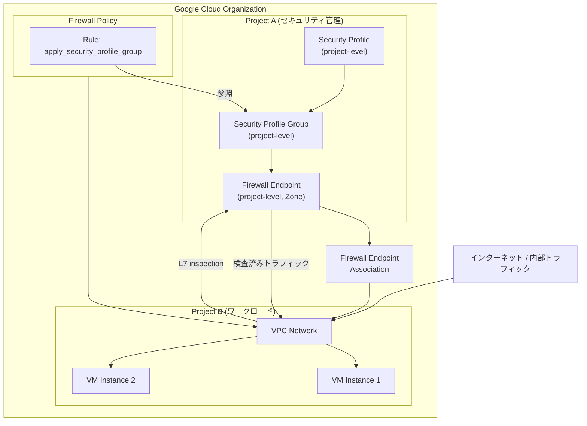

# Cloud NGFW: プロジェクト内での組織レベルリソース管理 (Public Preview)

**リリース日**: 2026-05-04

**サービス**: Cloud NGFW (Cloud Next Generation Firewall)

**機能**: Organization-level resource management in projects

**ステータス**: Public Preview

📊 [このアップデートのインフォグラフィックを見る](https://takech9203.github.io/google-cloud-news-summary/20260504-cloud-ngfw-organization-level-resources.html)

## 概要

Google Cloud は Cloud NGFW において、組織レベルの主要リソースを Google Cloud プロジェクト内で作成・設定できる機能を Public Preview として公開しました。これにより、プロジェクト管理者は組織レベルの権限を取得せずとも、プロジェクト内でセキュリティプロファイル、セキュリティプロファイルグループ、ファイアウォールエンドポイント、およびファイアウォールエンドポイントアソシエーションを管理できるようになります。

この機能は、セキュリティチームとプロジェクトチームの間の権限委譲を容易にし、大規模な組織におけるネットワークセキュリティの運用効率を大幅に向上させます。特に、組織レベルのアクセス権限を持たないプロジェクト管理者が、自身のプロジェクト内で高度な Layer 7 セキュリティ機能（侵入検知・防止、TLS インスペクション）を独立して構成・運用できるようになる点が大きな価値です。

**アップデート前の課題**

- セキュリティプロファイルやファイアウォールエンドポイントの作成には組織レベルの管理者権限が必要だった
- プロジェクトチームが Layer 7 インスペクション機能を利用するには、組織管理者への依頼が必要で、デプロイまでに時間がかかっていた
- 組織管理者に権限が集中し、大規模組織ではボトルネックが発生していた
- プロジェクト固有のセキュリティ要件に対して柔軟な対応が難しかった

**アップデート後の改善**

- プロジェクト管理者がプロジェクト内で独立してセキュリティプロファイルを作成・管理可能になった
- 組織管理者への依頼なしに、プロジェクト単位でファイアウォールエンドポイントをデプロイ可能になった
- セキュリティ運用の分散化により、大規模組織でのスケーラビリティが向上した
- プロジェクトレベルのエンドポイントに同一組織内の任意の VPC ネットワークを関連付け可能になった

## アーキテクチャ図



プロジェクトレベルのファイアウォールエンドポイントが VPC ネットワークのトラフィックを傍受し、同一プロジェクト内のセキュリティプロファイルグループに基づいて Layer 7 インスペクションを実行するアーキテクチャを示しています。

## サービスアップデートの詳細

### 主要機能

1. **プロジェクトレベルのセキュリティプロファイル**
   - プロジェクト内で脅威防御（threat-prevention）タイプのセキュリティプロファイルを作成可能
   - 特定の脅威シグネチャに対するアクション（アラート、拒否、リセット）のオーバーライドを設定可能
   - プロジェクトレベルのセキュリティプロファイルグループからのみ参照可能

2. **プロジェクトレベルのセキュリティプロファイルグループ**
   - プロジェクト内でセキュリティプロファイルグループを作成・管理可能
   - グローバルネットワークファイアウォールポリシーから参照可能
   - 1 グループあたり threat-prevention タイプのプロファイルを最大 1 つ含むことが可能

3. **プロジェクトレベルのファイアウォールエンドポイント**
   - プロジェクト管理者がゾーンごとにファイアウォールエンドポイントを作成・管理可能
   - 同一組織内の任意の VPC ネットワークとのアソシエーションが可能
   - クロスプロジェクトアソシエーション: エンドポイントと VPC が異なるプロジェクトにある場合、両方が同一組織に属する必要あり

4. **プロジェクトレベルのファイアウォールエンドポイントアソシエーション**
   - VPC ネットワークとプロジェクトレベルのファイアウォールエンドポイントを関連付け
   - 1 つの VPC ネットワークにつき、ゾーンあたり 1 つのエンドポイント（組織レベルとプロジェクトレベル合わせて）のみ関連付け可能

## 技術仕様

### パフォーマンス仕様

| 項目 | 詳細 |
|------|------|
| スループット (TLS インスペクションあり) | 最大 2 Gbps |
| スループット (TLS インスペクションなし) | 最大 10 Gbps |
| 接続あたりスループット (TLS あり) | 最大 250 Mbps |
| 接続あたりスループット (TLS なし) | 最大 1.25 Gbps |
| ジャンボフレームサポート | 最大 8,500 バイト (オプション) |
| エンドポイント作成時間 | 約 20 分 |
| アソシエーション作成時間 | 追加約 15 分 |

### IAM 権限

| ロール | 説明 |
|--------|------|
| `roles/compute.networkAdmin` | ファイアウォールエンドポイントの作成 |
| `roles/networksecurity.firewallEndpointAdmin` | ファイアウォールエンドポイントの管理 |
| `networksecurity.firewallEndpoints.create` | エンドポイント作成の個別権限 |

### 組織レベルとプロジェクトレベルの違い

| 項目 | 組織レベル | プロジェクトレベル (Preview) |
|------|-----------|---------------------------|
| セキュリティプロファイルグループの適用範囲 | 組織レベル・プロジェクトレベル両方のエンドポイント | 同一プロジェクトのプロジェクトレベルエンドポイントのみ |
| 階層型ファイアウォールポリシーからの参照 | 可能 | 不可 |
| グローバルネットワークファイアウォールポリシーからの参照 | 可能 | 可能 |
| 必要な権限レベル | 組織管理者 | プロジェクト管理者 |

## 設定方法

### 前提条件

1. Cloud NGFW Enterprise が有効な Google Cloud プロジェクト
2. 対象プロジェクトが組織に属していること
3. Compute Engine API および Network Security API が有効であること
4. 適切な IAM ロール（Compute Network Admin または Firewall Endpoint Admin）

### 手順

#### ステップ 1: セキュリティプロファイルの作成

```bash
gcloud network-security security-profiles \
  threat-prevention create my-security-profile \
  --project=PROJECT_ID \
  --location=global \
  --description="Project-level threat prevention profile"
```

プロジェクト内に脅威防御タイプのセキュリティプロファイルを作成します。

#### ステップ 2: セキュリティプロファイルグループの作成

```bash
gcloud network-security security-profile-groups create my-profile-group \
  --project=PROJECT_ID \
  --location=global \
  --threat-prevention-profile=projects/PROJECT_ID/locations/global/securityProfiles/my-security-profile
```

作成したセキュリティプロファイルをグループに関連付けます。

#### ステップ 3: ファイアウォールエンドポイントの作成

```bash
gcloud network-security firewall-endpoints create my-endpoint \
  --project=PROJECT_ID \
  --zone=us-central1-a \
  --billing-project=PROJECT_ID
```

指定したゾーンにファイアウォールエンドポイントを作成します（約 20 分かかります）。

#### ステップ 4: ファイアウォールエンドポイントアソシエーションの作成

```bash
gcloud network-security firewall-endpoint-associations create my-association \
  --project=PROJECT_ID \
  --zone=us-central1-a \
  --endpoint=projects/PROJECT_ID/locations/us-central1-a/firewallEndpoints/my-endpoint \
  --network=projects/PROJECT_ID/global/networks/my-vpc
```

エンドポイントを VPC ネットワークに関連付けます。

#### ステップ 5: ファイアウォールポリシールールの設定

```bash
gcloud compute network-firewall-policies rules create 100 \
  --firewall-policy=my-policy \
  --global-firewall-policy \
  --action=apply_security_profile_group \
  --security-profile-group=//networksecurity.googleapis.com/projects/PROJECT_ID/locations/global/securityProfileGroups/my-profile-group \
  --direction=INGRESS \
  --layer4-configs=all
```

ファイアウォールポリシーにセキュリティプロファイルグループを適用するルールを追加します。

## メリット

### ビジネス面

- **運用の分散化**: 組織管理者への依存を減らし、プロジェクトチームが自律的にセキュリティ管理を実施可能
- **デプロイ速度の向上**: 組織管理者への申請・承認プロセスが不要になり、セキュリティ構成の展開が迅速化
- **コスト管理の明確化**: プロジェクト単位での請求により、コスト配分が明確に

### 技術面

- **権限の最小化**: 組織レベルの広範な権限を付与せずに、高度なセキュリティ機能を利用可能
- **柔軟な構成**: プロジェクト固有の脅威防御ポリシーをカスタマイズ可能
- **クロスプロジェクト対応**: 同一組織内であれば、異なるプロジェクトの VPC ネットワークとのアソシエーションが可能
- **既存機能との互換性**: グローバルネットワークファイアウォールポリシーからプロジェクトレベルのセキュリティプロファイルグループを参照可能

## デメリット・制約事項

### 制限事項

- Public Preview のため、本番環境での使用には注意が必要（「Pre-GA Offerings Terms」が適用）
- プロジェクトレベルのセキュリティプロファイルグループは組織レベルのファイアウォールエンドポイントに適用不可
- 階層型ファイアウォールポリシーからプロジェクトレベルのセキュリティプロファイルグループを参照することは不可
- 1 つの VPC ネットワークにつき、ゾーンあたり 1 つのエンドポイント（組織レベル・プロジェクトレベル合計）のみ関連付け可能

### 考慮すべき点

- ファイアウォールエンドポイントとセキュリティプロファイルグループが異なるプロジェクトに存在する場合、トラフィックは傍受されるがデフォルトプロファイルが適用される（意図しない動作の可能性）
- エンドポイント作成に約 20 分、アソシエーション作成に追加 15 分を要するため、即座のデプロイには不向き
- Preview 機能のため、サポートが限定的である可能性がある
- エンドポイントを削除する際は、関連するすべての VPC ネットワークアソシエーションを先に解除する必要がある

## ユースケース

### ユースケース 1: マルチチーム組織でのセキュリティ自律運用

**シナリオ**: 大規模な組織で複数のプロジェクトチームがそれぞれの VPC ネットワークを管理している。組織のセキュリティチームは基本方針を定めているが、各プロジェクトチームは独自の脅威検知要件を持っている。

**実装例**:
```bash
# チーム A のプロジェクトでカスタム脅威防御プロファイルを作成
gcloud network-security security-profiles threat-prevention create team-a-profile \
  --project=team-a-project \
  --location=global

# チーム A 独自のセキュリティプロファイルグループを作成
gcloud network-security security-profile-groups create team-a-group \
  --project=team-a-project \
  --location=global \
  --threat-prevention-profile=projects/team-a-project/locations/global/securityProfiles/team-a-profile
```

**効果**: 各チームが組織管理者に依頼することなく、独自のセキュリティポリシーを迅速にデプロイ・更新可能。セキュリティ運用のスピードと柔軟性が向上。

### ユースケース 2: 開発・テスト環境での IDS/IPS 検証

**シナリオ**: セキュリティエンジニアが新しい脅威防御ルールを本番環境に適用する前に、開発プロジェクト内で検証したい。

**効果**: 組織レベルのリソースに影響を与えることなく、プロジェクト内で独立した IDS/IPS 環境を構築し、カスタムシグネチャの検証やパフォーマンステストを実施可能。

### ユースケース 3: 規制対応のためのプロジェクト分離

**シナリオ**: 金融機関が PCI DSS 準拠のために、カード会員データを扱うワークロードを専用プロジェクトで分離管理し、独自の侵入検知ポリシーを適用する必要がある。

**効果**: 規制対象ワークロード専用のプロジェクトに、組織の他部分から独立したセキュリティプロファイルとファイアウォールエンドポイントをデプロイし、コンプライアンス要件を満たすことが可能。

## 料金

Cloud NGFW Enterprise ティアの料金体系が適用されます。

### 料金構成

| 課金要素 | 説明 |
|----------|------|
| ファイアウォールエンドポイント | デプロイされたエンドポイントごとの時間単位課金 |
| データ処理量 | インスペクションされたトラフィックの GB 単位課金 |

### 料金の考慮事項

- Cloud NGFW Enterprise の機能を含むルールでトラフィックが評価された場合に課金が発生
- North-South トラフィック（VM とインターネット間）および East-West トラフィック（VPC 内リソース間）の両方が課金対象
- 同一トラフィックフローが複数のルールで評価されても二重課金は発生しない
- 詳細な料金は [Cloud NGFW pricing](https://cloud.google.com/firewall/pricing) を参照

## 利用可能リージョン

Cloud NGFW Enterprise のファイアウォールエンドポイントはゾーンリソースとして提供されます。Cloud NGFW がサポートされているすべてのリージョン・ゾーンで利用可能です。エンドポイントは保護対象のワークロードと同じゾーンに作成する必要があります。

## 関連サービス・機能

- **Cloud NGFW Enterprise (IDS/IPS)**: プロジェクトレベルのエンドポイントが提供する基盤となる侵入検知・防止サービス
- **VPC ネットワーク**: ファイアウォールエンドポイントアソシエーションを通じてトラフィック検査の対象となるネットワーク
- **グローバルネットワークファイアウォールポリシー**: プロジェクトレベルのセキュリティプロファイルグループを参照可能なポリシー
- **階層型ファイアウォールポリシー**: 組織・フォルダレベルで管理されるポリシー（組織レベルのプロファイルグループのみ参照可能）
- **TLS インスペクション**: ファイアウォールエンドポイントと組み合わせて暗号化トラフィックの検査を実施
- **Cloud Armor**: Web アプリケーション向けの DDoS 防御・WAF（Cloud NGFW と相互補完的に使用）

## 参考リンク

- 📊 [インフォグラフィック](https://takech9203.github.io/google-cloud-news-summary/20260504-cloud-ngfw-organization-level-resources.html)
- [公式リリースノート](https://docs.cloud.google.com/release-notes#May_04_2026)
- [Security profile overview](https://docs.cloud.google.com/firewall/docs/about-security-profiles)
- [Security profile group overview](https://docs.cloud.google.com/firewall/docs/about-security-profile-groups)
- [Firewall endpoint overview](https://docs.cloud.google.com/firewall/docs/about-firewall-endpoints)
- [Cloud NGFW tiers](https://docs.cloud.google.com/firewall/docs/ngfw_tiers)
- [料金ページ](https://cloud.google.com/firewall/pricing)

## まとめ

今回のアップデートにより、Cloud NGFW の組織レベルリソース（セキュリティプロファイル、セキュリティプロファイルグループ、ファイアウォールエンドポイント、エンドポイントアソシエーション）をプロジェクト内で作成・管理できるようになりました。これは大規模組織におけるセキュリティ運用の分散化と迅速化を実現する重要な機能追加です。組織管理者権限を持たないプロジェクトチームでも高度な Layer 7 セキュリティ機能を独立して運用できるため、セキュリティのアジリティ向上に貢献します。Public Preview 段階のため、本番ワークロードへの適用前に十分な検証を行うことを推奨します。

---

**タグ**: #CloudNGFW #Firewall #SecurityProfile #FirewallEndpoint #NetworkSecurity #IDS #IPS #Layer7 #PublicPreview #Enterprise
