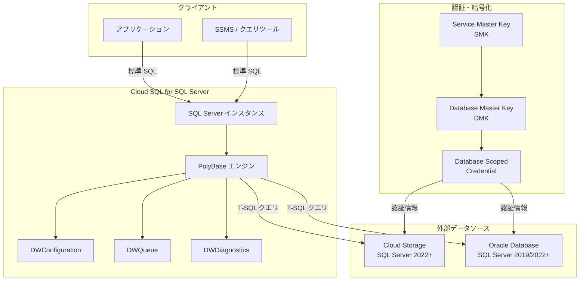

# Cloud SQL for SQL Server: PolyBase サポート (GA)

**リリース日**: 2026-05-04
**サービス**: Cloud SQL for SQL Server
**機能**: PolyBase サポート
**ステータス**: GA (一般提供)

📊 [このアップデートのインフォグラフィックを見る](https://takech9203.github.io/google-cloud-news-summary/20260504-cloud-sql-sqlserver-polybase-ga.html)

## 概要

Cloud SQL for SQL Server で PolyBase が一般提供 (GA) になりました。PolyBase はデータ仮想化技術であり、Cloud SQL for SQL Server インスタンスから Transact-SQL (T-SQL) コマンドを使用して、外部データソースに格納されたデータをローカルテーブルに格納されているかのように直接クエリできます。別途クライアント接続ソフトウェアをインストールする必要はありません。

この機能により、データの移動やコピーなしに、Cloud Storage や Oracle などの外部データソースと SQL Server のデータを統合的に扱うことが可能になります。

## アーキテクチャ図 (mermaid)



## サービスアップデートの詳細

### Before (従来)

- 外部データソースのデータにアクセスするには、ETL パイプラインや別途データ統合ツールが必要
- データの移動・コピーに伴うコストと遅延が発生
- 外部接続用のクライアントソフトウェアのインストールと管理が必要
- リアルタイムなデータ統合が困難

### After (本アップデート後)

- T-SQL コマンドのみで外部データソースを直接クエリ可能
- データのコピーや移動が不要（データ仮想化）
- 追加のクライアントソフトウェアが不要
- Cloud Storage や Oracle のデータをローカルテーブルと同様に扱える
- リードレプリカでも外部テーブルのクエリが可能

## 技術仕様

| 項目 | 内容 |
|------|------|
| 対応エディション | Cloud SQL Enterprise / Enterprise Plus（全エディション対応） |
| 対応マシンシリーズ | 全マシンシリーズ対応 |
| 対応外部データソース | Cloud Storage (SQL Server 2022+)、Oracle (SQL Server 2019/2022+) |
| 認証方式 (Cloud Storage) | Basic 認証（S3 互換アクセスキー） |
| レプリカ対応 | リードレプリカで外部テーブルクエリ可能（明示的な有効化が必要） |
| データベースバージョン | SQL Server 2019、SQL Server 2022、SQL Server 2025 |
| 有効化方法 | データベースフラグによる設定 |

### 必要なデータベースフラグ

| 外部データソース | 必要なフラグ |
|-----------------|-------------|
| Oracle | `cloud sql enable polybase=on` |
| Cloud Storage | `cloud sql enable polybase=on,13702=on` |

## 設定方法

### 1. 新規インスタンスで PolyBase を有効にする (Cloud Storage 向け)

```bash
gcloud sql instances create INSTANCE_NAME \
  --database-version=SQLSERVER_2022_ENTERPRISE \
  --region=LOCATION \
  --root-password=PASSWORD \
  --edition=EDITION \
  --cpu=NUMBER_OF_CPUs \
  --memory=MEMORY_SIZE \
  --database-flags="cloud sql enable polybase=on,13702=on"
```

### 2. 既存インスタンスで PolyBase を有効にする

```bash
gcloud sql instances patch INSTANCE_NAME \
  --database-flags="cloud sql enable polybase=on,13702=on"
```

### 3. 外部データソースの設定 (Cloud Storage の例)

```sql
-- 1. マスターキーの作成
USE polybasedb;
CREATE MASTER KEY ENCRYPTION BY PASSWORD='YourStrongPassword123!';

-- 2. データベーススコープ資格情報の作成
CREATE DATABASE SCOPED CREDENTIAL my_storage_credential
WITH IDENTITY = 'S3 Access Key',
SECRET = 'ACCESS_KEY_ID:SECRET_KEY_ID';

-- 3. 外部データソースの作成
CREATE EXTERNAL DATA SOURCE my_gcs_source
WITH (
  LOCATION = 's3://storage.googleapis.com/',
  CREDENTIAL = my_storage_credential
);

-- 4. 外部ファイルフォーマットの作成
CREATE EXTERNAL FILE FORMAT csv_format
WITH (
  FORMAT_TYPE = DELIMITEDTEXT,
  FORMAT_OPTIONS (
    FIELD_TERMINATOR = ',',
    STRING_DELIMITER = '"',
    FIRST_ROW = 2
  )
);

-- 5. 外部テーブルの作成
CREATE EXTERNAL TABLE my_external_table (
  id INT,
  name NVARCHAR(100),
  value DECIMAL(10,2)
)
WITH (
  LOCATION = 'my-bucket/data/myfile.csv',
  DATA_SOURCE = my_gcs_source,
  FILE_FORMAT = csv_format
);

-- 6. クエリの実行
SELECT * FROM my_external_table;
```

### 4. PolyBase の有効化確認

```bash
gcloud sql instances describe INSTANCE_NAME \
  --format="value(settings.databaseFlags)"
```

### 5. PolyBase の無効化

```bash
gcloud sql instances patch INSTANCE_NAME \
  --database-flags="cloud sql enable polybase=off"
```

## メリット

- **データ移動の削減**: ETL パイプラインを構築せずに外部データを直接クエリ可能。データのコピーや同期が不要
- **運用の簡素化**: 追加のクライアントソフトウェアや接続ミドルウェアが不要。T-SQL のみで完結
- **リアルタイムアクセス**: 外部データソースの最新データをリアルタイムでクエリ可能
- **コスト最適化**: データの重複保存が不要。ストレージコストとデータ転送コストを削減
- **全エディション対応**: Cloud SQL Enterprise / Enterprise Plus の全エディション・全マシンシリーズで利用可能
- **リードレプリカ対応**: 読み取りワークロードをレプリカに分散可能
- **既存スキル活用**: T-SQL の知識のみで外部データアクセスが可能

## デメリット・制約事項

- **Cloud Storage 認証**: Basic 認証のみサポート。より高度な認証方式は非対応
- **ネットワーク制約**: パブリック IP とプライベート IP の両方を構成したリージョナルインスタンスではアウトバウンド接続が非対応
- **HA 制約**: パブリック IP で構成された高可用性 (HA) インスタンスでは PolyBase を使用できない
- **エクスポート非対応**: `allow polybase export` オプションは非サポート。SQL Server から外部データソースへのデータエクスポートは不可
- **Query Insights 非対応**: 外部テーブルクエリは Query Insights 機能でサポートされていない
- **DMK 管理**: データベースマスターキー (DMK) のバックアップ・リストア操作は非サポート。パスワードの手動管理が必要
- **手動エンティティ管理**: Cloud SQL は PolyBase の有効化/無効化のみサポート。SQL Server エンティティ（資格情報、データソース、外部テーブル）は T-SQL で手動管理が必要
- **DW データベース**: 有効化時に DWConfiguration、DWQueue、DWDiagnostics の 3 つのシステムデータベースが自動作成され、同名のユーザーデータベースがある場合は上書きされる

## ユースケース

### 1. データレイク連携
Cloud Storage に格納された大規模なログデータや分析用データを、SQL Server から直接クエリ。データウェアハウスへの ETL なしにアドホック分析が可能。

### 2. マルチデータベース統合クエリ
Oracle データベースに格納されたレガシーデータと SQL Server のデータを結合クエリ。段階的なマイグレーション中でも統合的なレポーティングを実現。

### 3. コールドデータのオフロード
アクセス頻度の低いデータを Cloud Storage に退避し、必要時に PolyBase 経由でクエリ。SQL Server のストレージコストを最適化。

### 4. レポーティング・BI
リードレプリカで PolyBase を有効化し、外部データを含む分析クエリを本番インスタンスに影響なく実行。

## 料金

PolyBase 機能自体に追加料金は発生しません。以下の標準的な Cloud SQL for SQL Server の料金が適用されます:

| 項目 | 説明 |
|------|------|
| インスタンス料金 | vCPU 数、メモリ量、リージョンに基づく従量課金 |
| ストレージ料金 | プロビジョニングしたストレージ容量 (GiB/月) |
| ネットワーク料金 | インスタンスから外部へのネットワーク転送量 |
| IP アドレス料金 | 割り当て・使用した IP アドレス数 |

**コミット利用割引 (CUD)**:
- 1 年コミット: 25% 割引
- 3 年コミット: 52% 割引

外部データソース側の料金（Cloud Storage のストレージ・アクセス料金、Oracle のライセンス料等）は別途発生します。

## 利用可能リージョン

PolyBase は Cloud SQL for SQL Server が利用可能な全リージョンで使用できます。全エディション・全マシンシリーズで対応しています。

## 関連サービス・機能

| サービス・機能 | 関連性 |
|---------------|--------|
| [Cloud Storage](https://cloud.google.com/storage) | PolyBase の外部データソースとして利用可能 |
| [Cloud SQL リードレプリカ](https://docs.cloud.google.com/sql/docs/sqlserver/replication) | PolyBase 外部テーブルをレプリカでもクエリ可能 |
| [BigQuery](https://cloud.google.com/bigquery) | 大規模データ分析の代替手段 |
| [Datastream](https://cloud.google.com/datastream) | リアルタイムデータレプリケーションの代替手段 |
| [Cloud SQL データベースフラグ](https://docs.cloud.google.com/sql/docs/sqlserver/flags) | PolyBase の有効化・無効化に使用 |
| [VPC ネットワーク](https://cloud.google.com/vpc) | プライベート IP 接続でのネットワーク構成 |

## 参考リンク

- [Cloud SQL for SQL Server PolyBase サポートについて](https://docs.cloud.google.com/sql/docs/sqlserver/about-polybase)
- [PolyBase の有効化と無効化](https://docs.cloud.google.com/sql/docs/sqlserver/enable-and-disable-polybase)
- [PolyBase 用の外部データソースの構成](https://docs.cloud.google.com/sql/docs/sqlserver/configure-external-data-sources)
- [Cloud SQL for SQL Server エディション](https://docs.cloud.google.com/sql/docs/sqlserver/editions-intro)
- [Microsoft PolyBase ドキュメント](https://learn.microsoft.com/en-us/sql/relational-databases/polybase/polybase-guide?view=sql-server-ver17)
- [リリースノート](https://docs.cloud.google.com/release-notes#May_04_2026)

## まとめ

Cloud SQL for SQL Server における PolyBase サポートの一般提供 (GA) は、データ仮想化によるマルチソースデータ統合を実現する重要なアップデートです。T-SQL コマンドのみで Cloud Storage や Oracle のデータを直接クエリできるため、複雑な ETL パイプラインの構築や追加ソフトウェアのインストールが不要になります。

全エディション・全マシンシリーズで利用可能であり、リードレプリカでの外部テーブルクエリもサポートしている点が特に強力です。一方で、Cloud Storage への認証が Basic 認証のみ、HA インスタンス (パブリック IP) での利用不可、データエクスポート非対応などの制約がある点には注意が必要です。

データレイク連携やマルチデータベース統合クエリ、コールドデータのオフロードなど、多様なユースケースに対応できるこの機能は、ハイブリッドデータアーキテクチャを採用する組織にとって大きなメリットをもたらします。

---
**タグ**: #CloudSQL #SQLServer #PolyBase #データ仮想化 #外部データソース #CloudStorage #Oracle #GA #データ統合 #T-SQL
