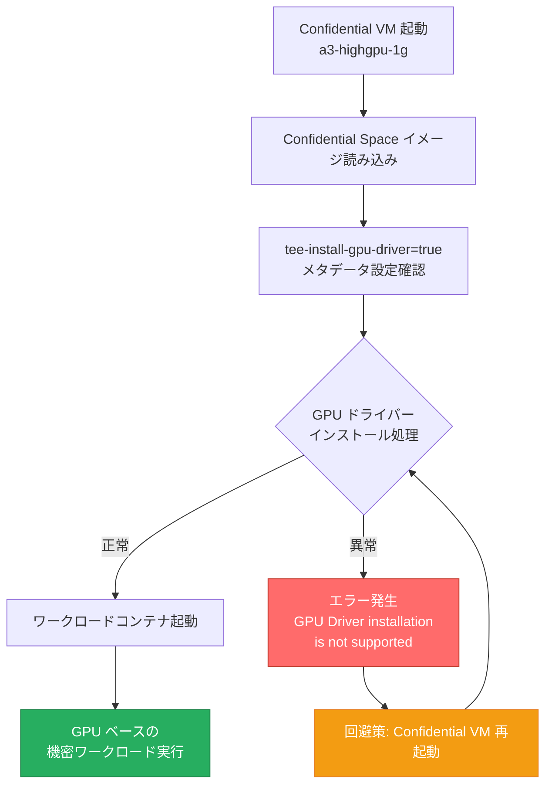

# Confidential Space: NVIDIA H100 GPU 既知の問題と回避策

**リリース日**: 2026-05-04

**サービス**: Confidential Space

**機能**: NVIDIA H100 GPU Known Issue and Workaround

**ステータス**: 既知の問題 (Known Issue)

📊 [このアップデートのインフォグラフィックを見る](https://takech9203.github.io/google-cloud-news-summary/20260504-confidential-space-h100-gpu-known-issue.html)

## 概要

2026年5月4日、Google Cloud は Confidential Space において NVIDIA H100 GPU を使用したワークロード実行時に発生する既知の問題を公表しました。この問題は、Confidential Space イメージ上で GPU ドライバーのインストールプロセスが正常に動作しないことに起因しています。

影響を受けるユーザーは、Confidential VM 上で NVIDIA H100 GPU を使用した機密ワークロードを実行する際に、以下のエラーメッセージが表示される可能性があります: 「failed to get launchspec, make sure you're running inside a GCE VM: GPU Driver installation is not supported.」

この問題は Confidential Space イメージに固有のものであり、回避策として Confidential VM の再起動が有効です。なお、2026年4月29日に Confidential Space での H100 GPU サポート (a3-highgpu-1g マシンファミリー) が GA になったばかりであるため、利用開始直後のユーザーに特に影響する可能性があります。

## アーキテクチャ図



Confidential VM の起動時に GPU ドライバーのインストール処理が失敗する場合があり、VM の再起動により問題が解消されます。

## サービスアップデートの詳細

### 問題の内容

1. **エラーメッセージ**
   - `failed to get launchspec, make sure you're running inside a GCE VM: GPU Driver installation is not supported.`
   - Confidential Space ワークロードに NVIDIA H100 GPU がアタッチされている場合に発生

2. **発生条件**
   - Confidential Space イメージを使用した Confidential VM
   - NVIDIA H100 GPU がアタッチされた構成 (a3-highgpu-1g マシンタイプ)
   - メタデータ変数 `tee-install-gpu-driver=true` が設定されている環境

3. **影響範囲**
   - GPU ドライバーのインストールが完了しないため、GPU ベースのワークロードが起動できない
   - Confidential Space の GPU アテステーション機能も利用不可となる

## 技術仕様

### 影響を受ける構成

| 項目 | 詳細 |
|------|------|
| マシンタイプ | a3-highgpu-1g |
| GPU | NVIDIA H100 80GB |
| Confidential Computing 技術 | Intel TDX |
| プロビジョニングモデル | Spot または Flex-start |
| イメージファミリー | confidential-space / confidential-space-debug |
| 必須メタデータ | tee-install-gpu-driver=true |

### 関連する既知の問題

| 問題 | 回避策 |
|------|--------|
| GPU ドライバーインストール未サポートエラー | Confidential VM の再起動 |
| GPU アテステーション失敗 (index 9 の measurement record 不一致) | Confidential VM の完全な停止と再起動 (ゲスト OS からの再起動では不可) |

## 回避策

### 手順 1: Confidential VM の再起動

Google Cloud Console または gcloud CLI を使用して Confidential VM を再起動します。

```bash
# gcloud CLI を使用した VM の停止と起動
gcloud compute instances stop INSTANCE_NAME \
    --zone=ZONE_NAME \
    --project=PROJECT_ID

gcloud compute instances start INSTANCE_NAME \
    --zone=ZONE_NAME \
    --project=PROJECT_ID
```

### 手順 2: 再起動後の確認

VM が再起動した後、ワークロードが正常に GPU を認識して動作していることを確認します。

```bash
# インスタンスのステータス確認
gcloud compute instances describe INSTANCE_NAME \
    --zone=ZONE_NAME \
    --project=PROJECT_ID \
    --format="value(status)"
```

### 注意事項

- GPU アテステーション失敗の問題とは異なり、本問題ではゲスト OS からの再起動でも回避できる可能性があります
- 再起動後も問題が継続する場合は、VM の完全な停止と再起動 (stop/start) を試してください
- Google は根本的な修正に取り組んでいます

## 関連サービス・機能

- **Confidential Computing**: Google Cloud の機密コンピューティング基盤。Intel TDX 技術を使用してメモリを暗号化し、データの機密性を保護
- **Confidential Space**: マルチパーティ計算や機密データ処理のための TEE (Trusted Execution Environment) 環境
- **NVIDIA Confidential Computing**: H100 GPU のハードウェアベースのセキュリティ機能。SPT (Single GPU Passthrough) モードをサポート
- **Confidential GKE Nodes**: GKE 上で Confidential Computing を利用した GPU ワークロードを実行する機能
- **Compute Engine**: Confidential VM の基盤となるインフラストラクチャサービス

## 参考リンク

- 📊 [インフォグラフィック](https://takech9203.github.io/google-cloud-news-summary/20260504-confidential-space-h100-gpu-known-issue.html)
- [Confidential Space リリースノート](https://docs.cloud.google.com/confidential-computing/confidential-space/docs/release-notes)
- [Confidential Space GPU ワークロードのデプロイ](https://docs.cloud.google.com/confidential-computing/confidential-space/docs/deploy-workloads)
- [Confidential GKE Nodes での GPU 使用](https://docs.cloud.google.com/kubernetes-engine/docs/how-to/gpus-confidential-nodes)
- [VM の停止と起動](https://docs.cloud.google.com/compute/docs/instances/stop-start-instance)

## まとめ

Confidential Space で NVIDIA H100 GPU を使用する際に GPU ドライバーインストールエラーが発生する既知の問題が報告されました。影響を受けるユーザーは Confidential VM を再起動することで問題を回避できます。2026年4月29日に GA となったばかりの機能であるため、新規利用者は本問題を認識した上で運用手順に VM 再起動のステップを含めることを推奨します。Google および NVIDIA による根本修正が進行中です。

---

**タグ**: #ConfidentialSpace #ConfidentialComputing #NVIDIA #H100 #GPU #KnownIssue #IntelTDX #セキュリティ #回避策
