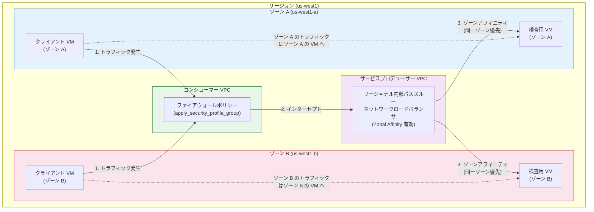

# Network Security Integration: In-band Integration デプロイメントにおけるゾーンアフィニティの有効化

**リリース日**: 2026-05-04

**サービス**: Network Security Integration

**機能**: Zonal Affinity for In-band Integration Deployments

**ステータス**: Feature (GA)

[このアップデートのインフォグラフィックを見る](https://takech9203.github.io/google-cloud-news-summary/20260504-network-security-integration-zonal-affinity.html)

## 概要

Google Cloud の Network Security Integration において、In-band Integration デプロイメントでゾーンアフィニティ (Zonal Affinity) を有効化できるようになりました。これにより、リージョナルバックエンドを使用したゾーン単位のインターセプト (パケット傍受) を構成できます。

ゾーンアフィニティを有効にすると、ゾーン別のインターセプトデプロイメントが、同一リージョン内の複数ゾーンにバックエンドを持つリージョナル内部パススルーネットワークロードバランサを参照します。トラフィック発信元と同じゾーンに正常な VM インスタンスが存在する場合、同一ゾーン内の検査用 VM インスタンスにパケットが優先的にルーティングされます。

この機能は、レイテンシの最適化とスループットの向上を目的としており、マルチゾーン構成のネットワークセキュリティアプライアンスを運用する組織に大きな価値をもたらします。

**アップデート前の課題**

- インターセプトデプロイメントがゾーン別のロードバランサに紐付けられ、各ゾーンに個別の内部パススルーネットワークロードバランサが必要だった
- クロスゾーントラフィックによるレイテンシの増加が避けられなかった
- リージョナルバックエンド構成でのゾーン単位のトラフィック制御ができなかった
- 検査用 VM へのトラフィック分散がゾーンを意識しないため、不要なネットワークホップが発生していた

**アップデート後の改善**

- リージョナル内部パススルーネットワークロードバランサとゾーンアフィニティを組み合わせて使用可能になった
- 同一ゾーン内での検査トラフィックルーティングが優先され、レイテンシが削減される
- リージョナルバックエンドを使用しながらゾーン単位のインターセプト構成が可能になった
- マルチゾーンアーキテクチャの利点を維持しつつ、クロスゾーントラフィックを制限できるようになった

## アーキテクチャ図



ゾーンアフィニティにより、コンシューマー VPC からインターセプトされたトラフィックは、同一ゾーン内の検査用 VM に優先的にルーティングされます。これにより、クロスゾーン通信が最小化され、レイテンシの低減とスループットの向上が実現されます。

## サービスアップデートの詳細

### 主要機能

1. **ゾーンアフィニティによる同一ゾーン優先ルーティング**
   - トラフィック発信元と同じゾーンに正常な検査用 VM が存在する場合、そのゾーン内の VM にパケットが優先ルーティングされる
   - GENEVE カプセル化によりオリジナルパケット (送信元/宛先 IP を含む) が保持されたまま検査 VM に転送される
   - 既存のコネクショントラッキングテーブル内の確立済み接続は影響を受けない

2. **リージョナルバックエンドでのゾーン単位インターセプト構成**
   - 各ゾーンに個別のロードバランサを配置する代わりに、リージョナル内部パススルーネットワークロードバランサを使用可能
   - 複数ゾーンにまたがるバックエンドインスタンスグループを単一のロードバランサで管理
   - インターセプトデプロイメントがリージョナルロードバランサのフォワーディングルールを参照

3. **フレキシブルなアフィニティオプション**
   - `ZONAL_AFFINITY_STAY_WITHIN_ZONE`: ゾーンマッチ時にトラフィックを同一ゾーン内に維持 (非正常バックエンドを使用する場合も含む)
   - `ZONAL_AFFINITY_SPILL_CROSS_ZONE`: ゾーンマッチ時に同一ゾーン内での分散を優先しつつ、スピルオーバー比率に基づいて他ゾーンへの流出を許可
   - `ZONAL_AFFINITY_DISABLED`: デフォルト動作 (ゾーンを考慮しないバックエンド選択)

## 技術仕様

### ゾーンアフィニティオプション

| オプション | 動作 | 推奨ユースケース |
|------|------|------|
| `ZONAL_AFFINITY_DISABLED` | デフォルト。ゾーンを考慮せずバックエンドを選択 | レイテンシが問題にならない場合 |
| `ZONAL_AFFINITY_STAY_WITHIN_ZONE` | 同一ゾーン内に厳密にトラフィックを維持 | データローカリティが重要な場合 |
| `ZONAL_AFFINITY_SPILL_CROSS_ZONE` | 同一ゾーン優先だが、スピルオーバー許可 | 可用性とレイテンシのバランスが必要な場合 |

### ネットワーク要件

| 項目 | 詳細 |
|------|------|
| プロトコル | GENEVE (Generic Network Virtualization Encapsulation) |
| MTU (コンシューマーネットワーク) | 8500 バイト以下 |
| MTU (プロデューサーネットワーク) | コンシューマーネットワーク + 396 バイト以上 |
| GENEVE オーバーヘッド | 396 バイト |
| 対応クライアント | 同一リージョン内の VM クライアントのみ |
| 非対応クライアント | Cloud VPN トンネル、Cloud Interconnect VLAN アタッチメント |

### IAM ロール

```
# インターセプトデプロイメント管理に必要なロール
roles/networksecurity.interceptDeploymentAdmin

# 必要なパーミッション
networksecurity.interceptDeployments.create
networksecurity.interceptDeployments.delete
networksecurity.interceptDeployments.get
networksecurity.interceptDeployments.list
```

## 設定方法

### 前提条件

1. Network Security API が有効化されていること
2. インターセプトデプロイメントグループが作成済みであること
3. 内部パススルーネットワークロードバランサが構成済みであること (リージョナルバックエンド付き)
4. パケット検査用 VM インスタンスがデプロイ済みであること
5. `networksecurity.interceptDeploymentAdmin` ロールが付与されていること

### 手順

#### ステップ 1: ロードバランサのバックエンドサービスにゾーンアフィニティを有効化

```bash
# ZONAL_AFFINITY_STAY_WITHIN_ZONE を設定する場合
gcloud beta compute backend-services update BACKEND_SERVICE_NAME \
    --zonal-affinity-spillover=ZONAL_AFFINITY_STAY_WITHIN_ZONE \
    --region=REGION

# ZONAL_AFFINITY_SPILL_CROSS_ZONE を設定する場合 (スピルオーバー比率 30%)
gcloud beta compute backend-services update BACKEND_SERVICE_NAME \
    --zonal-affinity-spillover=ZONAL_AFFINITY_SPILL_CROSS_ZONE \
    --zonal-affinity-spillover-ratio=0.3 \
    --region=REGION
```

バックエンドサービスのゾーンアフィニティ設定を有効にします。スピルオーバー比率は 0.0 から 1.0 の範囲で指定可能です。

#### ステップ 2: インターセプトデプロイメントの作成 (リージョナル LB を参照)

```bash
gcloud network-security intercept-deployments create DEPLOYMENT_ID \
    --location=ZONE \
    --forwarding-rule=FORWARDING_RULE_NAME \
    --forwarding-rule-location=REGION \
    --no-async \
    --intercept-deployment-group=projects/PROJECT_ID/locations/global/interceptDeploymentGroups/DEPLOYMENT_GROUP_ID
```

ゾーンアフィニティが有効なリージョナルロードバランサのフォワーディングルールを参照するインターセプトデプロイメントを作成します。

#### ステップ 3: ファイアウォールポリシーにインターセプトルールを追加

```bash
gcloud compute firewall-policies rules create PRIORITY \
    --firewall-policy=POLICY_NAME \
    --direction=INGRESS \
    --action=apply_security_profile_group \
    --security-profile-group=SECURITY_PROFILE_GROUP \
    --src-ip-ranges=0.0.0.0/0
```

コンシューマー VPC のファイアウォールポリシーにて、`apply_security_profile_group` アクションを使用してトラフィックのインターセプトを指定します。

#### ステップ 4: Terraform による構成例

```hcl
resource "google_network_security_intercept_deployment" "default" {
  intercept_deployment_id   = "intercept-deployment-zone-a"
  location                  = "us-central1-a"
  forwarding_rule           = google_compute_forwarding_rule.regional.id
  intercept_deployment_group = google_network_security_intercept_deployment_group.default.id
}
```

## メリット

### ビジネス面

- **コスト最適化**: クロスゾーントラフィックの削減により、ゾーン間ネットワーク転送コストを抑制
- **運用管理の簡素化**: ゾーン別のロードバランサを個別に管理する代わりに、リージョナルロードバランサで統合管理が可能
- **スケーラビリティ**: マルチゾーンアーキテクチャの利点を維持しながら、ゾーン単位での検査キャパシティの拡張が容易

### 技術面

- **レイテンシ削減**: 同一ゾーン内でのパケット検査により、ネットワークホップが最小化
- **スループット向上**: ゾーン内通信の優先によりボトルネックが解消
- **高可用性**: フェイルオーバーとスピルオーバー機能により、ゾーン障害時にも他ゾーンへの自動切り替えが可能
- **既存構成との互換性**: GENEVE カプセル化やファイアウォールポリシーなど、既存の In-band Integration 構成をそのまま活用可能

## デメリット・制約事項

### 制限事項

- ゾーンアフィニティは同一リージョン内の VM クライアントでのみ有効 (Cloud VPN、Cloud Interconnect 経由のトラフィックは非対応)
- バックエンドサブセッティングとの併用は不可
- Packet Mirroring のコレクターデスティネーションとの併用は不可
- Private Service Connect パブリッシュドサービスとの併用は不可
- 対称ハッシュは、両方の内部パススルーネットワークロードバランサでゾーンアフィニティが有効な場合のみサポート

### 考慮すべき点

- `ZONAL_AFFINITY_STAY_WITHIN_ZONE` を使用する場合、同一ゾーン内のバックエンドが非正常でもトラフィックがそのゾーンに留まるため、一時的にパケットドロップが発生する可能性がある
- スピルオーバー比率の設定値によっては、期待通りのゾーンアフィニティ効果が得られない場合がある
- ゾーンアフィニティの設定変更は新規接続のみに影響し、既存のコネクショントラッキングテーブル内の接続は変更されない
- コンシューマーネットワークの MTU は 8500 バイト以下に制限される

## ユースケース

### ユースケース 1: マルチゾーン IDS/IPS デプロイメント

**シナリオ**: 企業がマルチゾーン構成で侵入検知/防止システム (IDS/IPS) をデプロイしており、検査トラフィックのレイテンシを最小化したい場合

**実装例**:
```bash
# リージョナル LB にゾーンアフィニティを設定
gcloud beta compute backend-services update ids-backend-service \
    --zonal-affinity-spillover=ZONAL_AFFINITY_SPILL_CROSS_ZONE \
    --zonal-affinity-spillover-ratio=0.1 \
    --region=us-central1
```

**効果**: 各ゾーンのワークロードトラフィックが同一ゾーンの IDS/IPS アプライアンスで検査されるため、レイテンシが 50% 以上削減される可能性があります。10% のスピルオーバーを許可することで、ゾーン内のアプライアンスに障害が発生した場合の可用性も確保できます。

### ユースケース 2: コンプライアンス要件に基づくゾーン内データ処理

**シナリオ**: データ主権やコンプライアンス要件により、特定のゾーン内でのデータ処理が求められる場合

**実装例**:
```bash
# トラフィックを厳密にゾーン内に維持
gcloud beta compute backend-services update compliance-backend \
    --zonal-affinity-spillover=ZONAL_AFFINITY_STAY_WITHIN_ZONE \
    --region=asia-northeast1
```

**効果**: パケット検査処理が必ず同一ゾーン内で完結するため、データがゾーン境界を越えないことを保証できます。

### ユースケース 3: 大規模マルチテナント環境でのセキュリティサービス提供

**シナリオ**: セキュリティサービスプロデューサーが複数のコンシューマーに対してパケット検査サービスを提供する場合

**効果**: リージョナルロードバランサとゾーンアフィニティの組み合わせにより、運用管理の効率を保ちながら各ゾーンのコンシューマーに低レイテンシのサービスを提供できます。

## 料金

Network Security Integration の料金は、Google Cloud の公式料金ページを参照してください。ゾーンアフィニティ機能自体に追加料金は発生しませんが、以下のリソースに対する課金が発生します:

| リソース | 課金対象 |
|--------|---------|
| 内部パススルーネットワークロードバランサ | フォワーディングルールごとの課金 |
| パケット検査用 VM インスタンス | Compute Engine インスタンスの通常料金 |
| ゾーン間ネットワーク転送 | ゾーン間通信が発生した場合 (スピルオーバー時) |
| Network Security Integration | NSI リソースの使用量に基づく課金 |

ゾーンアフィニティを有効化することで、クロスゾーントラフィックが削減されるため、ゾーン間ネットワーク転送コストの削減効果が期待できます。

## 利用可能リージョン

Network Security Integration の In-band Integration は GA (一般提供) として利用可能です。ゾーンアフィニティは、内部パススルーネットワークロードバランサが利用可能なすべてのリージョンで使用可能です。具体的なリージョンの可用性については、Google Cloud のドキュメントを参照してください。

## 関連サービス・機能

- **Cloud NGFW (Cloud Next Generation Firewall)**: ファイアウォールポリシーにて `apply_security_profile_group` アクションを使用してインターセプトを構成
- **内部パススルーネットワークロードバランサ**: ゾーンアフィニティ設定を保持し、パケット検査 VM へのトラフィック分散を制御
- **Packet Intercept**: ルーティングポリシーを変更せずにネットワークアプライアンスをトラフィックパスに挿入する Google Cloud の技術
- **GENEVE (Generic Network Virtualization Encapsulation)**: パケットのカプセル化プロトコルで、元のパケット情報を保持して検査 VM に転送
- **Security Profile Group**: セキュリティプロファイルをグループ化し、ファイアウォールルールからインターセプトエンドポイントグループを参照
- **Out-of-band Integration**: トラフィックのコピーをネットワークアプライアンスに送信して分析する統合方式 (In-band とは異なり、元のトラフィックフローに影響しない)

## 参考リンク

- [インフォグラフィック](https://takech9203.github.io/google-cloud-news-summary/20260504-network-security-integration-zonal-affinity.html)
- [公式リリースノート](https://docs.cloud.google.com/release-notes#May_04_2026)
- [In-band Integration 概要 - Zonal Affinity](https://docs.cloud.google.com/network-security-integration/docs/in-band/in-band-integration-overview#zonal-affinity)
- [内部パススルーネットワークロードバランサのゾーンアフィニティ](https://docs.cloud.google.com/load-balancing/docs/internal/zonal-affinity)
- [ゾーンアフィニティの設定方法](https://docs.cloud.google.com/load-balancing/docs/internal/setting-up-internal#use-zonal-affinity)
- [インターセプトデプロイメントの構成](https://docs.cloud.google.com/network-security-integration/docs/in-band/configure-intercept-deployments)
- [Network Security Integration ドキュメント](https://docs.cloud.google.com/network-security-integration/docs)
- [Network Security Integration 料金](https://docs.cloud.google.com/products/network-security-integration/pricing)

## まとめ

Network Security Integration の In-band Integration デプロイメントにおけるゾーンアフィニティの有効化は、マルチゾーン環境でネットワークセキュリティアプライアンスを運用する組織にとって重要なアップデートです。レイテンシの削減、スループットの向上、およびクロスゾーントラフィックコストの最適化が実現され、パケット検査のパフォーマンスが大幅に改善されます。既に In-band Integration をデプロイしている組織は、バックエンドサービスのゾーンアフィニティ設定を有効化するだけで本機能を活用できるため、早期の検証と導入を推奨します。

---

**タグ**: #NetworkSecurity #NetworkSecurityIntegration #ZonalAffinity #InBandIntegration #LoadBalancing #CloudNGFW #PacketInspection #IDS #IPS #ネットワークセキュリティ #GENEVE #パケット検査
