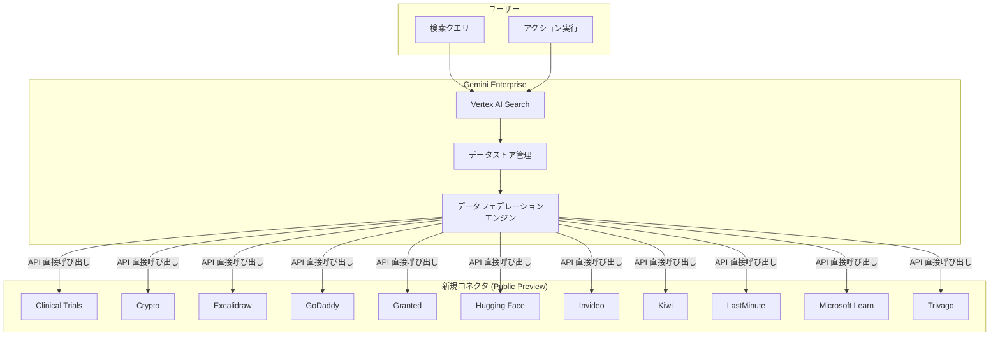

# Gemini Enterprise: 新規データストアコネクタ (Public Preview)

**リリース日**: 2026-05-05
**サービス**: Gemini Enterprise
**機能**: 新規データストアコネクタ 11 種追加
**ステータス**: Public Preview

📊 [このアップデートのインフォグラフィックを見る](https://takech9203.github.io/google-cloud-news-summary/20260505-gemini-enterprise-data-store-connectors.html)

## 概要

Gemini Enterprise に 11 種類の新しいサードパーティデータストアコネクタが Public Preview として追加されました。今回追加されたコネクタは Clinical Trials、Crypto、Excalidraw、GoDaddy、Granted、Hugging Face、Invideo、Kiwi、LastMinute、Microsoft Learn、Trivago です。これらのコネクタはすべてデータフェデレーション方式で動作し、外部データソースから直接情報を取得できます。

Gemini Enterprise のデータストアコネクタは、サードパーティアプリケーションのデータを Gemini Enterprise に接続し、統合的な検索・分析を可能にする機能です。今回のアップデートにより、医療研究、暗号資産、助成金検索、動画生成、AI モデル検索、旅行関連など、多岐にわたる分野のデータソースとの連携が可能になりました。

**アップデート前の課題**

- Gemini Enterprise から上記 11 種類のサードパーティサービスのデータに直接アクセスする手段がなかった
- 各サービスのデータを活用するには、個別に API を構築するか手動でデータを取得する必要があった
- 複数のサードパーティサービスにまたがる統合検索が困難だった

**アップデート後の改善**

- データフェデレーションにより、データのコピーなしに外部データソースから直接情報を取得可能になった
- Google Cloud コンソールからの簡単な設定で各データソースに接続可能になった
- Gemini Enterprise の統合検索基盤を通じて、複数のデータソースを横断的に検索可能になった
- Hugging Face コネクタでは画像生成、Invideo コネクタでは動画生成といったアクション実行も可能になった

## アーキテクチャ図

Gemini Enterprise のデータフェデレーションエンジンが各サードパーティデータソースの API を直接呼び出し、データのコピーなしにリアルタイムで情報を取得する構成です。

## サービスアップデートの詳細

### 主要機能

1. **データフェデレーションによるリアルタイム検索**
   - データを Gemini Enterprise にコピーせず、外部データソースの API を直接呼び出して情報を取得
   - データの鮮度が常に最新に保たれる
   - ストレージコストが発生しない

2. **多分野にわたるデータソース対応**
   - 医療研究 (Clinical Trials): 臨床試験データの検索
   - 暗号資産 (Crypto): 暗号資産関連データの検索
   - 助成金 (Granted): 84,000 件以上の助成金機会、133,000 件以上の米国財団の検索
   - AI/ML (Hugging Face): モデル検索および画像生成アクション
   - 動画制作 (Invideo): スクリプトからの動画生成アクション
   - 旅行 (Kiwi, LastMinute, Trivago): 旅行関連情報の検索
   - ドメイン (GoDaddy): ドメイン関連データの検索
   - コラボレーション (Excalidraw): ホワイトボードデータの検索
   - 技術学習 (Microsoft Learn): Microsoft 技術ドキュメントの検索

3. **アクション実行機能**
   - 一部のコネクタでは検索だけでなくアクションの実行が可能
   - Hugging Face: Z-Image-Turbo モデルによる画像生成
   - Invideo: スクリプト、トピック、雰囲気、ターゲットオーディエンス、プラットフォームを指定した動画生成
   - Granted: 助成金の詳細情報取得、資金提供者の検索、過去の受賞者の確認

## 技術仕様

### 新規コネクタ一覧

| コネクタ名 | データ接続方式 | 主な用途 |
|-----------|--------------|---------|
| Clinical Trials | データフェデレーション | 臨床試験データの検索 |
| Crypto | データフェデレーション | 暗号資産データの検索 |
| Excalidraw | データフェデレーション | ホワイトボードデータの検索 |
| GoDaddy | データフェデレーション | ドメイン関連データの検索 |
| Granted | データフェデレーション | 助成金・資金提供者の検索 |
| Hugging Face | データフェデレーション | AI モデル検索・画像生成 |
| Invideo | データフェデレーション | 動画生成 |
| Kiwi | データフェデレーション | 旅行情報の検索 |
| LastMinute | データフェデレーション | 旅行情報の検索 |
| Microsoft Learn | データフェデレーション | 技術ドキュメントの検索 |
| Trivago | データフェデレーション | 旅行情報の検索 |

### アクション対応状況

| コネクタ名 | アクション | 説明 |
|-----------|-----------|------|
| Granted | Search grants | キーワード、州、ソースタイプ、資金提供者等による助成金検索 |
| Granted | Get grant | スラッグによる特定助成金の詳細取得 |
| Granted | Search funders | 名前、州、NTEE コード、資産範囲等による財団検索 |
| Granted | Get funder | 財団プロフィール（ミッション、財務、受賞歴）の取得 |
| Granted | Get past winners | 特定連邦助成金プログラムの過去の受賞者確認 |
| Hugging Face | Generate Image | Z-Image-Turbo モデルによる画像生成 |
| Invideo | Generate video from script | スクリプトとコンテキストからの動画生成 |

### データフェデレーションの仕組み

データフェデレーションでは、Gemini Enterprise がサードパーティデータソースの API を直接呼び出して情報を取得します。データのコピーが不要なため、以下の特性があります:

- データは外部ソースに保持されたままとなる
- Vertex AI Search のインデックスにデータがコピーされない
- ストレージの心配が不要
- 即座にデータアクセスが可能（インジェスション待ちなし）

## 設定方法

### 前提条件

1. Google Cloud プロジェクトが作成済みであること
2. Gemini Enterprise が有効化されていること
3. 接続先サードパーティサービスのアカウントおよび認証情報があること

### 手順

#### ステップ 1: データストアの作成

Google Cloud コンソールで以下の操作を行います:

1. Google Cloud コンソールで Gemini Enterprise ページに移動
2. ナビゲーションメニューから「Data Stores」をクリック
3. 「Create Data Store」をクリック
4. データソース選択ページで接続したいコネクタを検索・選択

#### ステップ 2: 認証設定

各コネクタに必要な認証情報を入力します。認証方式はコネクタごとに異なります。

#### ステップ 3: リージョンとデータストア名の設定

1. データソースのリージョンを選択
2. データストア名を入力
3. 「Create」をクリック

#### ステップ 4: アプリへの接続

データストア作成後、アプリを作成してデータストアを接続し、検索クエリを実行可能にします。

## メリット

### ビジネス面

- **多様なデータソースの統合**: 医療研究、助成金、旅行、AI/ML など幅広い分野のデータを単一のプラットフォームで検索可能
- **即時利用開始**: データフェデレーションによりデータのコピーが不要で、設定後すぐに利用開始可能
- **コスト効率**: データの重複保存が不要なため、ストレージコストが発生しない

### 技術面

- **データ鮮度の維持**: 外部ソースのデータをリアルタイムで取得するため、常に最新データにアクセス可能
- **簡易な設定**: Google Cloud コンソールから GUI ベースで設定可能
- **アクション統合**: 検索だけでなく、画像生成や動画生成などのアクションも統合的に利用可能

## デメリット・制約事項

### 制限事項

- Public Preview のため、本番環境での利用には SLA が適用されない可能性がある
- データフェデレーションはインデックスを作成しないため、データインジェスション方式と比較して検索品質が低くなる場合がある
- 外部サービスの API 可用性に依存するため、外部サービスの障害時にはデータ取得ができない

### 考慮すべき点

- 各コネクタの認証要件がサービスごとに異なるため、事前に確認が必要
- データフェデレーションはリアルタイム API 呼び出しのため、大量データの検索にはレイテンシが発生する可能性がある
- Public Preview 段階であり、今後仕様が変更される可能性がある

## ユースケース

### ユースケース 1: 医療研究者の臨床試験情報検索

**シナリオ**: 製薬会社の研究者が、特定の疾患に関連する臨床試験情報を Gemini Enterprise の統合検索基盤から検索し、社内の研究データと組み合わせて分析を行う。

**効果**: 外部の臨床試験データベースと社内データを一元的に検索でき、研究の効率化とインサイト発見の迅速化を実現。

### ユースケース 2: 非営利組織の助成金検索

**シナリオ**: 非営利組織のスタッフが Granted コネクタを使用して、組織のミッションに合致する助成金機会を検索し、資金提供者の詳細情報や過去の受賞者情報を確認する。

**効果**: 84,000 件以上の助成金機会と 133,000 件以上の米国財団から最適な資金調達先を効率的に特定可能。

### ユースケース 3: コンテンツ制作チームの AI 活用

**シナリオ**: マーケティングチームが Hugging Face コネクタで画像を生成し、Invideo コネクタでスクリプトから動画を自動生成する。Gemini Enterprise のワークフロー内で完結するため、複数ツールの切り替えが不要。

**効果**: コンテンツ制作のワークフローを Gemini Enterprise に統合し、生産性を向上。

## 関連サービス・機能

- **[Vertex AI Search](https://cloud.google.com/enterprise-search)**: Gemini Enterprise の検索基盤。データストアコネクタから取得したデータの検索を処理
- **[既存の GA コネクタ](https://docs.cloud.google.com/gemini/enterprise/docs/connectors/connect-third-party-data-source)**: Confluence Cloud、Jira Cloud、Microsoft SharePoint 等の一般提供済みコネクタ
- **[Workforce Identity Federation](https://cloud.google.com/iam/docs/workforce-identity-federation)**: サードパーティ ID プロバイダとの連携で、アクセス制御を実現

## 参考リンク

- 📊 [インフォグラフィック](https://takech9203.github.io/google-cloud-news-summary/20260505-gemini-enterprise-data-store-connectors.html)
- [公式リリースノート](https://docs.cloud.google.com/release-notes#May_05_2026)
- [サードパーティデータソースの接続ドキュメント](https://docs.cloud.google.com/gemini/enterprise/docs/connectors/connect-third-party-data-source)
- [コネクタとデータストアの概要](https://docs.cloud.google.com/gemini/enterprise/docs/connectors/introduction-to-connectors-and-data-stores)

## まとめ

Gemini Enterprise に 11 種類の新しいサードパーティデータストアコネクタが Public Preview として追加されたことで、医療研究、助成金検索、AI/ML、動画制作、旅行など多岐にわたる分野のデータソースとの統合が可能になりました。すべてのコネクタがデータフェデレーション方式で動作するため、データのコピーなしに即座に利用を開始できます。

特に Granted、Hugging Face、Invideo コネクタではアクション実行機能も提供されており、単なる検索にとどまらない活用が可能です。Public Preview 段階であるため本番利用には注意が必要ですが、Gemini Enterprise のエコシステム拡大を示す重要なアップデートです。

---
**タグ**: #GeminiEnterprise #DataStoreConnectors #DataFederation #PublicPreview #VertexAISearch #ThirdPartyIntegration #HuggingFace #Invideo #Granted #ClinicalTrials
