# Google SecOps (SIEM): デフォルトパーサー大規模アップデート (2026年5月)

**リリース日**: 2026-05-05

**サービス**: Google SecOps (SIEM)

**機能**: デフォルトパーサーの一括更新 (100以上の製品パーサー)

**ステータス**: 一般提供 (GA)

[このアップデートのインフォグラフィックを見る](https://takech9203.github.io/google-cloud-news-summary/20260505-google-secops-parser-updates-may.html)

## 概要

Google SecOps が、100以上の製品に対応するデフォルトパーサーの大規模アップデートを実施した。パーサーは生のログデータを構造化された Unified Data Model (UDM) 形式に変換する重要なコンポーネントであり、今回のアップデートにより各種セキュリティ製品やクラウドサービスからのログ取り込み精度が向上する。

パーサーの更新は段階的にロールアウトされるため、各リージョンに反映されるまで1〜4日かかる場合がある。自動更新が有効な環境では特別な操作なしに新バージョンが適用される。

今回のアップデートでは、ファイアウォール、EDR、クラウドプラットフォーム、認証基盤、AI セキュリティなど幅広いカテゴリのパーサーが更新されており、特に GCP_MODEL_ARMOR (Model Armor) のパーサー追加は Google Cloud の AI セキュリティ機能との連携強化を示す注目すべきポイントである。

**アップデート前の課題**

- 一部のログソースで新しいログフォーマットや追加フィールドが正しくパースされない場合があった
- Model Armor のログを Google SecOps で構造化して分析する標準的な手段が限られていた
- 各セキュリティ製品のバージョンアップに伴うログ形式の変更に対応が遅れることがあった

**アップデート後の改善**

- 100以上の製品パーサーが最新のログ形式に対応し、UDM への正規化精度が向上
- GCP_MODEL_ARMOR パーサーにより、AI セキュリティの脅威検知データを SecOps で一元管理可能に
- CrowdStrike、SentinelOne、Palo Alto Networks などの主要 EDR/ファイアウォール製品のパーサー精度向上

## アーキテクチャ図

```mermaid
flowchart LR
    subgraph Sources["ログソース"]
        FW["Firewall\n(PAN, FortiGate, Check Point)"]
        EDR["EDR\n(CrowdStrike, SentinelOne)"]
        Cloud["Cloud\n(AWS, Azure, GCP)"]
        Auth["認証\n(Okta, Cisco ISE)"]
        AI["AI Security\n(Model Armor)"]
    end

    subgraph Ingestion["取り込み"]
        API["Ingestion API"]
        Feed["Data Feeds"]
        BP["Bindplane Agent"]
    end

    subgraph Parsing["パーサー処理"]
        DP["デフォルトパーサー\n(今回更新)"]
        UDM["UDM\n正規化データ"]
    end

    subgraph Analytics["分析"]
        Rules["検知ルール"]
        Search["UDM 検索"]
        Dashboard["ダッシュボード"]
    end

    Sources --> Ingestion
    Ingestion --> DP
    DP --> UDM
    UDM --> Analytics
```



デフォルトパーサーは、各種ログソースから取り込まれた生ログを UDM 形式に正規化する中核コンポーネントであり、下流の検知ルールや検索機能の精度に直結する。

## サービスアップデートの詳細

### 主要な更新対象パーサー

今回更新された100以上のパーサーのうち、特に注目すべきものを以下に示す。

#### 1. AI セキュリティ関連 (新規/注目)

| パーサー名 | Ingestion Label | カテゴリ |
|-----------|----------------|---------|
| GCP Model Armor | GCP_MODEL_ARMOR | AI セキュリティ |

Model Armor は LLM のプロンプトとレスポンスをスクリーニングし、プロンプトインジェクション、ジェイルブレイク攻撃、機密データ漏洩などから保護するサービスである。このパーサーにより、Model Armor が検知した脅威イベントを SecOps の UDM として統合的に分析できるようになる。

#### 2. エンドポイントセキュリティ (EDR)

| パーサー名 | Ingestion Label | カテゴリ |
|-----------|----------------|---------|
| CrowdStrike Falcon | CS_EDR | EDR |
| CrowdStrike Alerts API | CS_ALERTS | アラート |
| SentinelOne Deep Visibility | SENTINEL_DV | EDR |
| SentinelOne Cloud Funnel | SENTINELONE_CF | EDR |
| Microsoft Defender for Endpoint | MICROSOFT_DEFENDER_ENDPOINT | EDR |
| Check Point Sandblast | CHECKPOINT_EDR | EDR |

#### 3. ファイアウォール/ネットワーク

| パーサー名 | Ingestion Label | カテゴリ |
|-----------|----------------|---------|
| Palo Alto Networks Firewall | PAN_FIREWALL | ファイアウォール |
| FortiGate | FORTINET_FIREWALL | ファイアウォール |
| Check Point | CHECKPOINT_FIREWALL | ファイアウォール |
| Cisco ASA | CISCO_ASA_FIREWALL | ファイアウォール |
| Azure Firewall | AZURE_FIREWALL | ファイアウォール |
| Azure Front Door | AZURE_FRONT_DOOR | CDN/WAF |

#### 4. クラウドプラットフォーム

| パーサー名 | Ingestion Label | カテゴリ |
|-----------|----------------|---------|
| AWS Aurora | AWS_AURORA | データベース |
| AWS EC2 VPCs | AWS_EC2_VPCS | ネットワーク |
| AWS Security Hub | AWS_SECURITY_HUB | セキュリティ |

#### 5. 認証/アクセス管理

| パーサー名 | Ingestion Label | カテゴリ |
|-----------|----------------|---------|
| Okta | OKTA | IdP |
| Cisco ISE | CISCO_ISE | NAC |
| Cisco Meraki | CISCO_MERAKI | ネットワーク |
| Akeyless Vault Platform | AKEYLESS_VAULT | シークレット管理 |

#### 6. その他

| パーサー名 | Ingestion Label | カテゴリ |
|-----------|----------------|---------|
| Apache Cassandra | CASSANDRA | データベース |

### パーサー更新の管理

Google SecOps では、パーサー更新に対して以下の管理オプションが提供されている。

- **自動更新 (デフォルト)**: 新しい安定バージョンが自動的に適用される
- **手動更新**: 自動更新を無効にし、変更内容を確認してから適用
- **影響分析**: 新バージョンが既存の検知ルールに与える影響を事前にチェック可能
- **ロールバック**: 問題が発生した場合、前のバージョンに戻すことが可能

## 技術仕様

### パーサーの動作仕様

| 項目 | 詳細 |
|------|------|
| ロールアウト期間 | 1〜4日 (段階的にリージョンへ展開) |
| 対象 | 新たに取り込まれるログのみ (既存ログには遡及適用されない) |
| サポートログ形式 | JSON, SYSLOG, CSV, KV, XML, CEF, LEEF 等 |
| パーサータイプ | Prebuilt (Google が管理) |
| 更新頻度 | 通常は月次 (第4週)、臨時アップデートあり |

### パーサー管理の設定

```
Settings > SIEM Settings > Parsers
```

自動更新の有効/無効切り替え:
- **有効にする**: Menu > Turn on auto updates
- **無効にする**: Menu > Turn off auto updates

## メリット

### ビジネス面

- **セキュリティ可視性の向上**: 100以上の製品からのログが最新形式で正しく構造化され、脅威検知の精度が向上
- **AI セキュリティの統合管理**: Model Armor パーサーにより、生成AI のセキュリティイベントを既存の SOC ワークフローに統合可能

### 技術面

- **UDM 正規化品質の向上**: 各ベンダー製品の最新ログフォーマットに対応し、フィールドマッピングの欠落を低減
- **マルチクラウド対応の強化**: AWS、Azure のサービスパーサーも同時に更新され、マルチクラウド環境の一元監視が改善

## デメリット・制約事項

### 制限事項

- パーサー更新は新たに取り込まれるログにのみ適用され、過去に取り込み済みのログには遡及適用されない
- リージョンへの反映に最大4日かかる場合がある
- カスタムパーサーを使用している場合、デフォルトパーサーの更新は適用されない

### 考慮すべき点

- パーサー更新により UDM フィールドのマッピングが変更される場合、既存の検知ルールに影響が出る可能性がある
- 更新前に影響分析機能 (Impact Check) を使用して、既存ルールへの影響を確認することを推奨
- 自動更新を無効にしている場合は、手動で最新バージョンへの更新を検討すること

## ユースケース

### ユースケース 1: Model Armor と SecOps の統合による AI セキュリティ監視

**シナリオ**: 企業が Vertex AI を用いた顧客向けチャットボットを運用しており、プロンプトインジェクション攻撃の検知と対応を SOC で一元管理したい。

**効果**: GCP_MODEL_ARMOR パーサーにより、Model Armor が検知したプロンプトインジェクション試行、機密データ漏洩の試み、有害コンテンツ生成要求などが UDM イベントとして SecOps に取り込まれ、既存の SIEM ルールやアラートワークフローと統合される。

### ユースケース 2: マルチベンダー EDR 環境の統合分析

**シナリオ**: 大規模組織で CrowdStrike、SentinelOne、Microsoft Defender for Endpoint を部門ごとに使い分けており、横断的な脅威ハンティングを行いたい。

**効果**: 各 EDR パーサーが最新バージョンに更新されることで、ベンダー固有のログ形式の差異が吸収され、UDM ベースの統一的なクエリで横断検索が可能になる。

## 関連サービス・機能

- **Model Armor**: LLM のプロンプト/レスポンスをスクリーニングする AI セキュリティサービス。今回 GCP_MODEL_ARMOR パーサーが追加された
- **Security Command Center**: Google Cloud のセキュリティポスチャー管理。Model Armor は SCC の一部としても提供される
- **Cloud Logging / Cloud Monitoring**: Google SecOps の取り込みメトリクスを監視し、パーサーエラーや取り込み異常を検知
- **Google SecOps SOAR**: パーサーで構造化されたアラートに対して自動対応プレイブックを実行

## 参考リンク

- [インフォグラフィック](https://takech9203.github.io/google-cloud-news-summary/20260505-google-secops-parser-updates-may.html)
- [公式リリースノート](https://docs.cloud.google.com/release-notes#May_05_2026)
- [サポートされるデフォルトパーサー一覧](https://docs.cloud.google.com/chronicle/docs/ingestion/parser-list/supported-default-parsers)
- [パーサー更新の管理](https://docs.cloud.google.com/chronicle/docs/event-processing/manage-parser-updates)
- [ログパースの概要](https://docs.cloud.google.com/chronicle/docs/event-processing/parsing-overview)
- [Model Armor 概要](https://docs.cloud.google.com/model-armor/overview)
- [データ取り込みの概要](https://docs.cloud.google.com/chronicle/docs/secops/secops-ingestion)

## まとめ

今回の Google SecOps デフォルトパーサー大規模アップデートは、100以上の製品に対応するパーサーを一括で最新化するものであり、セキュリティ監視の基盤品質を底上げする定期メンテナンスである。特に GCP_MODEL_ARMOR パーサーの追加は、生成AI セキュリティと従来の SIEM 運用を統合する動きとして注目に値する。自動更新が有効な環境では特別な対応は不要だが、カスタムルールを多用している場合は影響分析機能を活用して事前に検証することを推奨する。

---

**タグ**: #GoogleSecOps #SIEM #Parser #ModelArmor #AIセキュリティ #UDM #CrowdStrike #SentinelOne #PaloAltoNetworks #マルチクラウド
