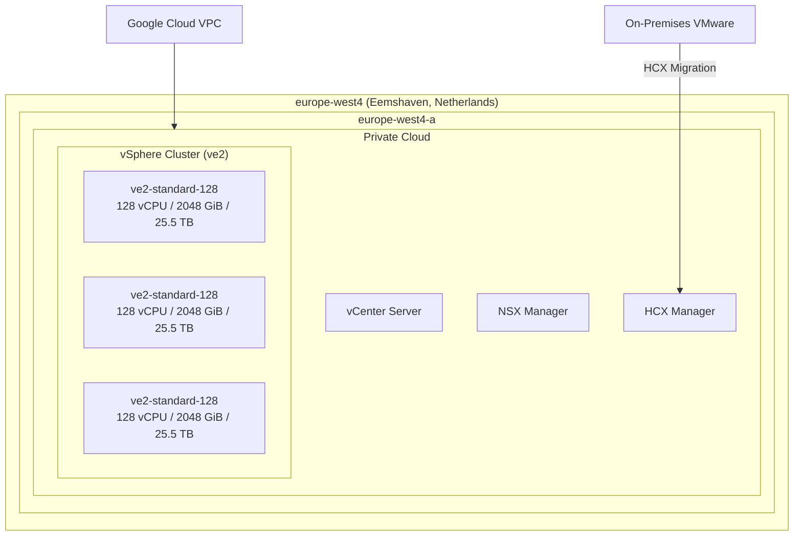

# Google Cloud VMware Engine: ve2 ノードタイプが europe-west4 (オランダ) で利用可能に

**リリース日**: 2026-05-05

**サービス**: Google Cloud VMware Engine

**機能**: ve2 ノードタイプの europe-west4 リージョン展開

**ステータス**: 一般提供開始 (GA)

[このアップデートのインフォグラフィックを見る](https://takech9203.github.io/google-cloud-news-summary/20260505-vmware-engine-ve2-europe-west4.html)

## 概要

Google Cloud VMware Engine の次世代ノードタイプである ve2 が、オランダの Eemshaven リージョン (europe-west4-a) で利用可能になりました。これにより、europe-west4 リージョンのユーザーは従来の ve1 ノードに加え、より高性能な ve2 ノードファミリーを選択できるようになります。

ve2 ノードタイプは、ve1 と比較してノードあたり最大 2048 GiB のメモリと最大 128 vCPU を提供し、ストレージ容量もノードタイプに応じて 12.8 TB から 51.2 TB まで選択可能です。これにより、メモリ集約型やコンピューティング集約型のVMware ワークロードをオランダリージョンで効率的に実行できます。

このアップデートは、ヨーロッパ圏で VMware ワークロードを運用する企業、特にデータ主権要件によりオランダにデータを保持する必要がある組織にとって重要な選択肢の拡大となります。

**アップデート前の課題**

- europe-west4 リージョンでは ve1-standard-72 ノードタイプのみ利用可能であり、ノードあたりのリソースが最大 72 vCPU / 768 GiB メモリ / 19.2 TB ストレージに制限されていた
- 大規模な VMware ワークロードを実行する場合、より多くのノード数が必要であり、コスト効率が低下していた
- ve2 ノードの柔軟な vCPU カスタマイズ (64-128 vCPU) がオランダリージョンでは利用できなかった

**アップデート後の改善**

- europe-west4 リージョンで ve2 ノードファミリー全体 (small, standard, large, mega) が利用可能になり、ワークロードに最適なリソース構成を選択可能に
- ノードあたり最大 2048 GiB メモリ、最大 128 vCPU を活用でき、少ないノード数で大規模ワークロードを集約可能に
- ストレージ容量の選択肢が 12.8 TB から 51.2 TB まで拡大し、ストレージ要件に応じた柔軟な構成が可能に

## アーキテクチャ図



この図は europe-west4-a ゾーンにおける ve2 ノードタイプを使用した VMware Engine プライベートクラウドの構成例を示しています。最低 3 ノードで vSphere クラスターを構成し、vCenter、NSX、HCX の管理コンポーネントが含まれます。

## サービスアップデートの詳細

### 主要機能

1. **ve2 ハイパーコンバージドノードタイプ**
   - ve2-small (12.8 TB ストレージ)、ve2-standard (25.5 TB)、ve2-large (38.4 TB)、ve2-mega (51.2 TB) の 4 つのストレージ層から選択可能
   - 各ストレージ層で 64、80、96、112、128 vCPU の構成を選択可能
   - 全ノードタイプで 2048 GiB (2 TB) のメモリを搭載

2. **ve2 ストレージ専用ノードタイプ**
   - ve2-small-so (12.8 TB)、ve2-standard-so (25.5 TB)、ve2-large-so (38.4 TB)、ve2-mega-so (51.2 TB) が利用可能
   - HCI ノードと同一ノードファミリーのストレージ専用ノードを同じクラスター内に混在可能

3. **カスタムコア数**
   - ノードあたりの利用可能コア数を削減するカスタマイズが可能
   - ライセンスコスト最適化に活用可能

## 技術仕様

### ve2 ノードタイプ一覧

| ノードタイプ | vCPU/ノード | メモリ/ノード (GiB) | ストレージ/ノード (TB) |
|------|------|------|------|
| ve2-small-64 ~ 128 | 64 - 128 | 2048 | 12.8 |
| ve2-standard-64 ~ 128 | 64 - 128 | 2048 | 25.5 |
| ve2-large-64 ~ 128 | 64 - 128 | 2048 | 38.4 |
| ve2-mega-64 ~ 128 | 64 - 128 | 2048 | 51.2 |

### ve1 との比較 (europe-west4 で既存)

| 項目 | ve1-standard-72 | ve2-standard-128 |
|------|------|------|
| vCPU | 72 | 128 |
| メモリ | 768 GiB | 2048 GiB |
| ストレージ | 19.2 TB | 25.5 TB |
| vCPU カスタマイズ | 不可 | 64/80/96/112/128 から選択可能 |

## 設定方法

### 前提条件

1. Google Cloud プロジェクトで VMware Engine API が有効化されていること
2. VMware Engine の IAM ロール (vmwareengine.vmwareengineAdmin) が付与されていること
3. プライベートクラウド用の管理 IP アドレス範囲 (/24 ~ /20) が確保されていること

### 手順

#### ステップ 1: VMware Engine ネットワークの作成

```bash
gcloud vmware networks create my-network \
  --location=global \
  --type=STANDARD \
  --description="VMware Engine network for europe-west4"
```

europe-west4 リージョンで使用するための VMware Engine ネットワークを作成します。

#### ステップ 2: ve2 ノードを使用したプライベートクラウドの作成

```bash
gcloud vmware private-clouds create my-private-cloud \
  --location=europe-west4-a \
  --cluster=my-cluster \
  --node-type-config=type=ve2-standard-128,count=3 \
  --management-range=192.168.0.0/24 \
  --vmware-engine-network=my-network
```

europe-west4-a ゾーンに ve2-standard-128 ノードタイプを使用して 3 ノードのプライベートクラウドを作成します。プロビジョニングには 1 時間以上かかる場合があります。

#### ステップ 3: VPC ピアリングの設定

プライベートクラウドの作成完了後、VMware Engine ネットワークと VPC をピアリング接続して、Google Cloud リソースからプライベートクラウドへのアクセスを有効にします。

## メリット

### ビジネス面

- **EU データ主権への対応**: オランダリージョンで次世代ノードが利用可能になり、GDPR やデータローカライゼーション要件を満たしながら高性能なVMware 環境を構築可能
- **ワークロード集約によるコスト最適化**: ノードあたりのリソースが大幅に増加したため、少ないノード数でワークロードを集約でき、運用コストを削減可能

### 技術面

- **スケールアップの柔軟性**: 64 から 128 vCPU まで段階的に選択可能なカスタムコア構成により、ワークロード要件に最適化されたリソース配分が可能
- **ストレージ階層の選択**: 4 つのストレージ層 (12.8 TB ~ 51.2 TB) から選択可能で、ストレージ集約型ワークロードにも対応

## デメリット・制約事項

### 制限事項

- europe-west4 では現時点で Standard および Single-Node プライベートクラウドタイプのみサポート (Stretched プライベートクラウドは未対応)
- 同一クラスター内では同じノードタイプのノードのみ使用可能 (異なる HCI ノードタイプの混在は不可)
- ve2 ノードの利用には Google アカウントチームへの問い合わせが必要な場合がある

### 考慮すべき点

- ve1 と ve2 の混合プライベートクラウド (Mixed node families) が europe-west4 でサポートされるかは確認が必要
- プライベートクラウドの作成後、ノードタイプの変更はできないため、事前に適切なサイジングを行うことが重要
- Broadcom のライセンスモデル変更に伴い、BYOL (Bring Your Own License) サブスクリプションが必要となる場合がある

## ユースケース

### ユースケース 1: オンプレミス VMware 環境のクラウド移行

**シナリオ**: ヨーロッパに拠点を持つ企業がオンプレミスの VMware 環境を Google Cloud に移行する際、オランダリージョンで高性能なノードタイプを使用してワークロードを集約する。

**効果**: ve2-mega-128 ノードを使用することで、1 ノードあたり 128 vCPU / 2048 GiB メモリ / 51.2 TB ストレージを活用でき、従来の ve1 と比較して大幅に少ないノード数でワークロード移行が完了する。

### ユースケース 2: DR (ディザスタリカバリ) サイトの構築

**シナリオ**: ヨーロッパ内の別リージョン (例: europe-west3 Frankfurt) でプライマリ環境を運用し、europe-west4 (Netherlands) を DR サイトとして ve2 ノードで構築する。

**効果**: HCX を活用したワークロードモビリティにより、リージョン間の DR 環境を VMware ネイティブなツールで構築・運用可能。ve2 ノードの高リソース密度により DR サイトのコストを最適化できる。

## 料金

VMware Engine の料金はノードタイプ、使用時間、およびコミットメント (CUD) の有無により異なります。

- **オンデマンド**: ノード単位の時間課金
- **1 年コミットメント**: 月額固定支払いで割引適用
- **3 年コミットメント**: 最大割引率が適用される長期契約

詳細な料金については [VMware Engine pricing](https://cloud.google.com/vmware-engine/pricing) を参照してください。

## 利用可能リージョン

今回のアップデートにより、ve2 ノードタイプが利用可能なヨーロッパリージョンは以下の通りです:

| リージョン | ゾーン | ve2 サポート |
|------|------|------|
| europe-west2 (London) | europe-west2-a, europe-west2-b | 対応済み |
| europe-west3 (Frankfurt) | europe-west3-a, europe-west3-b | 対応済み |
| europe-west4 (Netherlands) | europe-west4-a | **今回追加** |
| europe-west8 (Milan) | europe-west8-a, europe-west8-b | 対応済み |
| europe-southwest1 (Madrid) | europe-southwest1-a | 対応済み |

## 関連サービス・機能

- **VMware HCX**: オンプレミスからクラウドへのワークロード移行を実現するモビリティプラットフォーム
- **VPC Service Controls**: VMware Engine プライベートクラウドへのアクセスを制御するセキュリティ境界
- **Cloud Interconnect**: オンプレミス環境と Google Cloud を専用回線で接続し、低レイテンシのハイブリッド環境を構築
- **Committed Use Discounts (CUD)**: 1 年または 3 年のコミットメントによるノード料金の割引

## 参考リンク

- [インフォグラフィック](https://takech9203.github.io/google-cloud-news-summary/20260505-vmware-engine-ve2-europe-west4.html)
- [公式リリースノート](https://docs.cloud.google.com/release-notes#May_05_2026)
- [VMware Engine ノードタイプ ドキュメント](https://docs.cloud.google.com/vmware-engine/docs/concepts-node-types)
- [プライベートクラウドの作成手順](https://docs.cloud.google.com/vmware-engine/docs/private-clouds/howto-create-private-cloud)
- [VMware Engine 料金ページ](https://cloud.google.com/vmware-engine/pricing)

## まとめ

Google Cloud VMware Engine の ve2 ノードタイプが europe-west4 (オランダ) で利用可能になったことで、ヨーロッパ圏の VMware ユーザーにとって新たな高性能オプションが追加されました。ve1 と比較して最大 2.7 倍のメモリと 1.8 倍の vCPU を提供する ve2 ノードにより、ワークロード集約とコスト最適化が可能です。オランダリージョンでの VMware ワークロード運用を検討されている場合は、ve2 ノードタイプのサイジング評価を開始することを推奨します。

---

**タグ**: #GoogleCloud #VMwareEngine #ve2 #europe-west4 #Netherlands #リージョン展開 #プライベートクラウド #HCI
