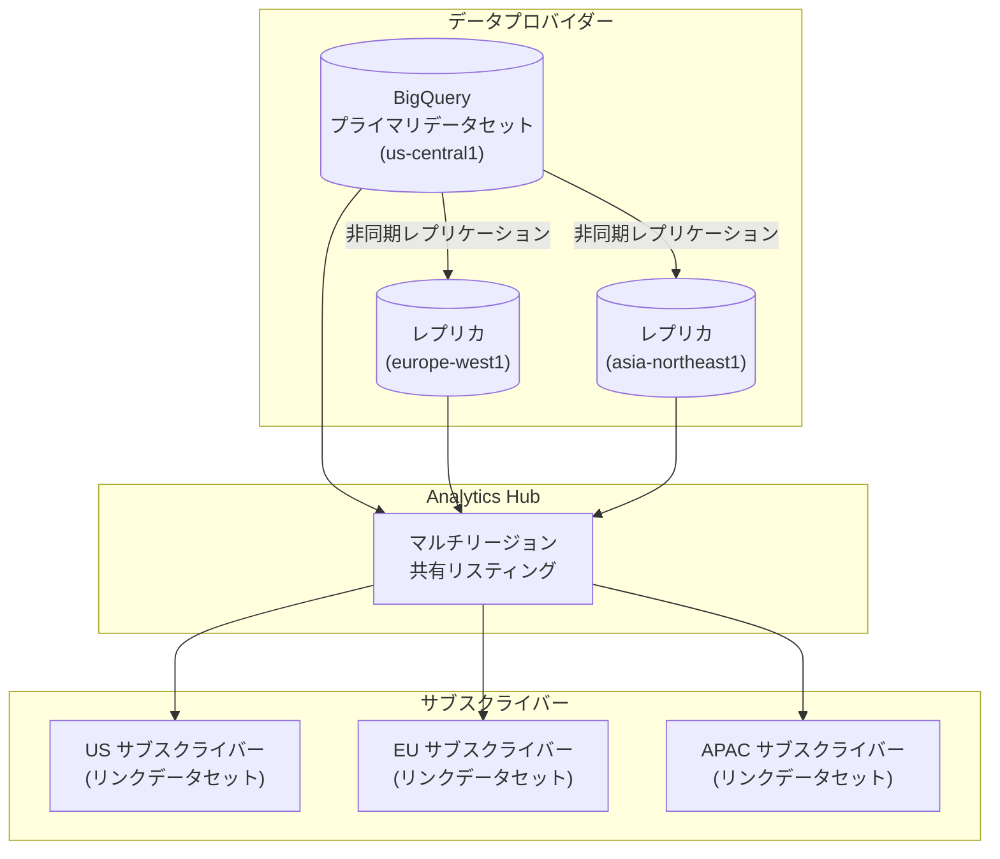

# BigQuery: マルチリージョン共有リスティング GA と Data Transfer Service バックフィル制限の変更

**リリース日**: 2026-05-06

**サービス**: BigQuery

**機能**: マルチリージョン共有リスティング (GA) / Data Transfer Service データ保持ポリシー変更 (Breaking Change)

**ステータス**: GA / Breaking Change (2026年6月1日施行)

[このアップデートのインフォグラフィックを見る](https://takech9203.github.io/google-cloud-news-summary/20260506-bigquery-multi-region-sharing-data-transfer.html)

## 概要

本日、BigQuery に関する 2 つの重要なアップデートが発表されました。1 つ目は、BigQuery の共有リスティング (Analytics Hub) で複数リージョンの構成が一般提供 (GA) になったことです。これにより、データセットとリンクレプリカをグローバルな複数の地理的リージョンで同時に共有できるようになりました。

2 つ目は破壊的変更 (Breaking Change) です。2026年6月1日より、Google Ads のデータ保持ポリシーの変更に伴い、BigQuery Data Transfer Service の Google Ads、Search Ads 360、Google Analytics 4 コネクタで、現在の日付から 37 か月より前の日付を指定したバックフィル実行ではデータが投入されなくなります。

これらのアップデートは、グローバルデータ共有の利便性向上と、広告データの保持ポリシーに基づくデータ取得制限という、異なる性質の変更を含んでいます。特に 2 つ目の変更は、過去データに依存する分析ワークフローに直接影響する可能性があるため、早急な対応が求められます。

**アップデート前の課題**

- Analytics Hub のリスティングは単一リージョンでのみデータセットを共有でき、グローバルに分散するサブスクライバーに対してレイテンシーの問題が発生していた
- 複数リージョンでデータを共有するには、リージョンごとに個別のリスティングを作成・管理する必要があった
- Data Transfer Service のバックフィルではデータソースの保持期間内であれば過去データを自由に取得可能だった

**アップデート後の改善**

- 単一のリスティングで複数リージョンにまたがるデータ共有が可能になり、グローバルなデータアクセスが容易に
- クロスリージョンデータセットレプリケーションと連携し、リスティング作成時にレプリカが存在するリージョンを追加設定可能
- Data Transfer Service のバックフィルには 37 か月の時間制限が適用され、それ以前のデータは取得不可に

## アーキテクチャ図



この図は、マルチリージョン共有リスティングの仕組みを示しています。プロバイダーがクロスリージョンレプリケーションで複数リージョンにデータセットを配置し、単一のリスティングを通じてグローバルなサブスクライバーが最寄りのリージョンからデータにアクセスできます。

## サービスアップデートの詳細

### 1. マルチリージョン共有リスティング (GA)

1. **複数リージョンでのリスティング構成**
   - リスティング作成時に「Region data availability」メニューでデータセットレプリカが存在する追加リージョンを選択可能
   - クロスリージョンデータセットレプリケーションが有効なリージョンのみ選択可能
   - 追加リージョンを選択しない場合、デフォルトで共有データセットのプライマリリージョンが使用される

2. **クロスリージョンデータセットレプリケーションとの連携**
   - 前提条件として共有データセットに対するクロスリージョンレプリケーションの有効化が必要
   - `ALTER SCHEMA ADD REPLICA` DDL ステートメントでレプリカを追加
   - レプリカのステータスは `INFORMATION_SCHEMA.SCHEMATA_REPLICAS` ビューで確認可能

3. **API でのマルチリージョン指定**
   - `projects.locations.dataExchanges.listings.create` メソッドのリクエストボディで `bigqueryDataset.replicaLocations` フィールドに追加リージョンを指定
   - 既存リスティングの更新は `listings.patch` メソッドで `bigqueryDataset.replicaLocations` を `updateMask` に含めて実行

### 2. Data Transfer Service バックフィル制限 (Breaking Change)

1. **対象コネクタ**
   - Google Ads コネクタ
   - Search Ads 360 コネクタ
   - Google Analytics 4 コネクタ

2. **変更内容**
   - 2026年6月1日以降、現在の日付から 37 か月より前の日付を指定したバックフィル実行ではデータが投入されなくなる
   - 通常のスケジュール転送やリフレッシュウィンドウ内のデータ取得には影響なし
   - Google Ads のデータ保持ポリシー変更に起因する制限

3. **影響範囲**
   - 過去 37 か月以上前のデータを対象としたバックフィル操作が失敗する
   - 既に BigQuery に転送済みのデータには影響なし

## 技術仕様

### マルチリージョン共有リスティング

| 項目 | 詳細 |
|------|------|
| ステータス | 一般提供 (GA) |
| 前提条件 | クロスリージョンデータセットレプリケーションの有効化 |
| 設定方法 | Console / API (`bigqueryDataset.replicaLocations`) |
| レプリケーション方式 | 非同期レプリケーション |

### Data Transfer Service バックフィル制限

| 項目 | 詳細 |
|------|------|
| 施行日 | 2026年6月1日 |
| 対象コネクタ | Google Ads, Search Ads 360, Google Analytics 4 |
| バックフィル期間制限 | 現在日から 37 か月以内 |
| 原因 | Google Ads データ保持ポリシーの変更 |

## 設定方法

### マルチリージョン共有リスティングの作成

#### 前提条件

1. 共有するデータセットに対してクロスリージョンレプリケーションを有効化していること
2. Analytics Hub の適切な IAM 権限を持っていること

#### ステップ 1: データセットレプリカの作成

```sql
-- プライマリデータセット (us-central1) にレプリカを追加
ALTER SCHEMA my_dataset ADD REPLICA `europe-west1`
OPTIONS(location='europe-west1');

ALTER SCHEMA my_dataset ADD REPLICA `asia-northeast1`
OPTIONS(location='asia-northeast1');
```

レプリカの作成完了は `INFORMATION_SCHEMA.SCHEMATA_REPLICAS` の `creation_complete` カラムで確認できます。

#### ステップ 2: マルチリージョンリスティングの作成 (API)

```bash
curl -X POST \
  "https://analyticshub.googleapis.com/v1/projects/PROJECT_ID/location/us-central1/dataExchanges/EXCHANGE_ID/listings?listingId=LISTING_ID" \
  -H "Authorization: Bearer $(gcloud auth print-access-token)" \
  -H "Content-Type: application/json" \
  -d '{
    "displayName": "Multi-Region Dataset Listing",
    "bigqueryDataset": {
      "dataset": "projects/PROJECT_ID/datasets/my_dataset",
      "replicaLocations": ["europe-west1", "asia-northeast1"]
    }
  }'
```

### Data Transfer Service バックフィル制限への対応

#### ステップ 1: 影響を受ける転送の確認

```bash
# 既存の Google Ads 転送設定を確認
bq ls --transfer_config --transfer_location=us \
  --filter="dataSourceIds:google_ads"
```

#### ステップ 2: 必要な過去データのバックフィル実行

2026年6月1日までに 37 か月以上前のデータが必要な場合は、期限前にバックフィルを実行してください。

```bash
# 期限前にバックフィルを実行 (例: 2023年1月のデータ)
bq mk --transfer_run \
  --start_time="2023-01-01T00:00:00Z" \
  --end_time="2023-01-31T23:59:59Z" \
  projects/PROJECT_ID/locations/us/transferConfigs/CONFIG_ID
```

## メリット

### ビジネス面 (マルチリージョン共有)

- **グローバルデータ配信の簡素化**: 単一のリスティングで世界中のサブスクライバーにデータを提供でき、管理コストを削減
- **データアクセスのレイテンシー改善**: サブスクライバーが最寄りのリージョンからデータにアクセスできるため、クエリ性能が向上

### 技術面 (マルチリージョン共有)

- **運用負荷の軽減**: リージョンごとに個別のリスティングを作成・管理する必要がなくなった
- **既存インフラとの統合**: クロスリージョンレプリケーション機能との自然な統合により、追加の複雑性なく利用可能

## デメリット・制約事項

### 制限事項

- マルチリージョン共有には事前にクロスリージョンデータセットレプリケーションの設定が必要
- レプリカの非同期レプリケーションにより、セカンダリリージョンでわずかなデータ遅延が発生する可能性がある
- レプリカストレージに対する追加の料金が発生する

### 考慮すべき点 (Data Transfer Service)

- 2026年6月1日以降、37 か月以上前の Google Ads / Search Ads 360 / GA4 データのバックフィルは不可能
- 期限前に必要な過去データの取得を完了させる必要がある
- 既に BigQuery に保存されているデータには影響しないが、新規のバックフィル操作のみ制限される

## ユースケース

### ユースケース 1: グローバル企業のデータマーケットプレイス

**シナリオ**: 複数大陸にオフィスを持つ企業が、各地域のチームに対して分析用データセットを提供する場合

**効果**: 単一のリスティングでグローバルに分散するチームが最寄りリージョンからデータにアクセスでき、クエリ性能の向上と管理の簡素化を実現

### ユースケース 2: Data Transfer Service の移行計画

**シナリオ**: 3年以上前の Google Ads データを定期的にバックフィルして分析に利用している広告運用チーム

**効果**: 6月1日までに必要な過去データをすべてバックフィルしておくことで、変更後も既存の分析ワークフローを維持可能。長期保存が必要な場合は BigQuery 内でのデータ管理戦略の見直しが必要

## 料金

### マルチリージョン共有

| 項目 | 料金 |
|------|------|
| データレプリケーション | [データレプリケーション料金](https://cloud.google.com/bigquery/pricing#data_replication)に準拠 |
| セカンダリリージョンのストレージ | プライマリリージョンと同等のストレージ料金 |
| Analytics Hub リスティング | Analytics Hub の利用料金に準拠 |

### Data Transfer Service

Data Transfer Service 自体の転送料金に変更はありません。バックフィル制限は料金ではなくデータ保持ポリシーに基づく制限です。

## 関連サービス・機能

- **BigQuery Analytics Hub**: データセット共有のためのプラットフォーム。今回のマルチリージョン対応はこの機能の拡張
- **BigQuery クロスリージョンデータセットレプリケーション**: マルチリージョン共有の前提条件となる機能
- **BigQuery Data Transfer Service**: Google Ads、Search Ads 360、GA4 からのデータ転送サービス
- **Google Ads**: データ保持ポリシーの変更元。2026年6月1日施行の新ポリシーが Data Transfer Service に影響

## 参考リンク

- [インフォグラフィック](https://takech9203.github.io/google-cloud-news-summary/20260506-bigquery-multi-region-sharing-data-transfer.html)
- [公式リリースノート](https://docs.cloud.google.com/release-notes#May_06_2026)
- [リスティングの作成 - Analytics Hub ドキュメント](https://docs.cloud.google.com/bigquery/docs/analytics-hub-manage-listings#create_a_listing)
- [Data Transfer Service 変更ログ - Google Ads](https://docs.cloud.google.com/bigquery/docs/transfer-changes#June01-google-ads)
- [Data Transfer Service 変更ログ - Search Ads 360](https://docs.cloud.google.com/bigquery/docs/transfer-changes#June01-search-ads)
- [Data Transfer Service 変更ログ - Google Analytics 4](https://docs.cloud.google.com/bigquery/docs/transfer-changes#June01-ga4)
- [Google Ads 新データ保持ポリシー (2026年6月1日)](https://ads-developers.googleblog.com/2026/05/new-data-retention-policy-for-google.html)
- [クロスリージョンデータセットレプリケーション](https://docs.cloud.google.com/bigquery/docs/data-replication#use_dataset_replication)

## まとめ

今回のアップデートにより、BigQuery のマルチリージョン共有リスティングが GA となり、グローバルなデータ共有がより簡単に実現できるようになりました。一方で、2026年6月1日以降は Data Transfer Service の Google Ads、Search Ads 360、GA4 コネクタで 37 か月以上前のバックフィルが不可能になるため、過去データに依存するワークフローがある場合は期限前に必要なデータのバックフィルを完了させることを推奨します。

---

**タグ**: #BigQuery #AnalyticsHub #DataTransferService #マルチリージョン #BreakingChange #GoogleAds #SearchAds360 #GA4 #データ共有 #バックフィル
