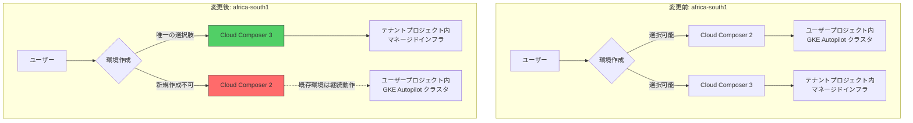

# Cloud Composer: africa-south1 リージョンが Cloud Composer 3 専用に移行

**リリース日**: 2026-05-06

**サービス**: Cloud Composer (Managed Service for Apache Airflow)

**機能**: africa-south1 (ヨハネスブルグ) リージョンにおける Cloud Composer 3 専用化

**ステータス**: Announcement

📊 [このアップデートのインフォグラフィックを見る](https://takech9203.github.io/google-cloud-news-summary/20260506-cloud-composer-africa-south1-composer3.html)

## 概要

Google Cloud は、ヨハネスブルグ (africa-south1) リージョンにおいて Cloud Composer 2 環境の新規作成を終了し、Cloud Composer 3 環境のみをサポートするリージョンへの移行を発表しました。これは、Cloud Composer 3 への段階的な移行戦略の一環として実施されるものです。

Cloud Composer 3 は 2024 年 6 月にパブリックプレビューとして発表された次世代のマネージド Apache Airflow サービスであり、インフラストラクチャの完全なテナントプロジェクト管理、エバーグリーンバージョニング、簡素化されたネットワーク設定、パフォーマンスの向上など、多くの改善が含まれています。2026 年 4 月には「Managed Service for Apache Airflow」への名称変更も行われました。

なお、africa-south1 リージョンに既に存在する Cloud Composer 2 環境は今回の変更による影響を受けません。既存環境は引き続き動作し、管理・更新が可能です。

**アップデート前の課題**

- africa-south1 リージョンで Cloud Composer 2 と Cloud Composer 3 の両方の環境を新規作成可能であり、ユーザーが古いバージョンを選択し続ける可能性があった
- Cloud Composer 2 はクラスタがユーザーのプロジェクト内にデプロイされるため、管理の複雑さが残っていた
- ネットワーク設定やスケーリングの構成が Cloud Composer 3 と比較して複雑であった

**アップデート後の改善**

- africa-south1 リージョンでは新規環境は Cloud Composer 3 のみ作成可能となり、最新機能を自動的に利用できる
- インフラストラクチャがテナントプロジェクトに隠蔽され、運用負荷が軽減される
- 簡素化されたネットワーク設定と自動スケーリングが標準で提供される

## アーキテクチャ図



この図は、africa-south1 リージョンにおける変更前後の環境作成オプションの違いを示しています。変更後は Cloud Composer 3 のみが新規作成可能となります。

## サービスアップデートの詳細

### 主要機能

1. **Cloud Composer 3 専用化**
   - africa-south1 リージョンでは Cloud Composer 2 環境の新規作成が不可能に
   - 新規ユーザーは自動的に Cloud Composer 3 の最新機能を利用可能

2. **既存環境への影響なし**
   - africa-south1 リージョンに既に存在する Cloud Composer 2 環境は影響を受けない
   - 既存環境の更新・アップグレード・削除は引き続き可能

3. **Cloud Composer 3 の主な利点**
   - すべてのインフラストラクチャがテナントプロジェクトに配置
   - エバーグリーンバージョニングによる自動更新
   - 簡素化されたネットワーク設定
   - DAG Processor と Scheduler の分離によるパフォーマンス向上
   - Airflow ワーカーのストレージが 10 倍に拡大
   - Airflow 3 のサポート (GA)

## 技術仕様

### Cloud Composer 2 と Cloud Composer 3 の比較

| 項目 | Cloud Composer 2 | Cloud Composer 3 |
|------|------------------|------------------|
| クラスタ | ユーザープロジェクト内の GKE Autopilot | テナントプロジェクト内 (隠蔽) |
| Airflow バージョン | Airflow 2 | Airflow 2, Airflow 3 |
| ネットワーク設定 | Private Service Connect | 簡素化された設定 (Public/Private 切り替え可能) |
| Executor | Celery Executor | CeleryKubernetes Executor |
| DAG Processor | Scheduler と統合 | 独立コンポーネント |
| イメージバージョン形式 | composer-2.b.c-airflow-x.y.z | composer-3-airflow-x.y.z-build.t |
| データベース保持ポリシー | 非対応 | 対応 |

## 設定方法

### 前提条件

1. Google Cloud プロジェクトが作成済みであること
2. Cloud Composer API が有効化されていること
3. 必要な IAM 権限が付与されていること

### 手順

#### ステップ 1: Cloud Composer 3 環境を africa-south1 に作成

```bash
gcloud composer environments create my-composer3-env \
    --location africa-south1 \
    --image-version composer-3-airflow-2.10.5
```

これにより、africa-south1 リージョンに Cloud Composer 3 環境が作成されます。

#### ステップ 2: 既存の Cloud Composer 2 環境からの移行 (該当する場合)

```bash
# 移行前の互換性チェック
gcloud composer environments check-upgrade \
    my-composer2-env \
    --location africa-south1 \
    --image-version composer-3-airflow-2

# 移行スクリプトを使用した移行
python composer_migrate.py \
    --source-env my-composer2-env \
    --target-env my-composer3-env \
    --location africa-south1
```

移行スクリプトは [GitHub](https://github.com/GoogleCloudPlatform/python-docs-samples/blob/main/composer/tools/composer_migrate.py) で公開されています。

## メリット

### ビジネス面

- **運用コストの削減**: インフラストラクチャ管理がフルマネージドになり、運用チームの負荷が軽減される
- **最新機能へのアクセス**: Airflow 3 サポートや MCP サーバー連携など、最新機能を活用可能

### 技術面

- **簡素化されたアーキテクチャ**: GKE クラスタの管理が不要となり、環境の構成がシンプルになる
- **パフォーマンスの向上**: DAG Processor の分離や 10 倍のワーカーストレージにより、大規模ワークロードへの対応力が向上
- **柔軟なネットワーク設定**: 既存環境でも Public/Private IP の切り替えが可能

## デメリット・制約事項

### 制限事項

- africa-south1 リージョンで Cloud Composer 2 の新規環境を作成することは不可能
- Cloud Composer 2 から Cloud Composer 3 へのインプレース (in-place) アップグレードは非対応。サイドバイサイド方式での移行が必要
- Cloud Composer 3 では KubernetesPodOperator でのカスタムサービスアカウントが非対応

### 考慮すべき点

- 既存の Cloud Composer 2 環境は影響を受けないが、将来的なサポート終了に備えて計画的な移行を推奨
- 移行前に `check-upgrade` コマンドで互換性を確認することが重要
- Cloud Composer 3 の料金モデルは Cloud Composer 2 と異なるため、コスト比較を事前に実施すべき

## ユースケース

### ユースケース 1: アフリカ地域での新規データパイプライン構築

**シナリオ**: アフリカ市場に進出する企業が、ヨハネスブルグリージョンでデータパイプラインを構築する必要がある場合。

**実装例**:
```bash
# Cloud Composer 3 環境作成 (Airflow 3 対応)
gcloud composer environments create africa-pipeline \
    --location africa-south1 \
    --image-version composer-3-airflow-3.1.7
```

**効果**: 最新の Airflow 3 と Cloud Composer 3 の機能をフル活用でき、データレイテンシーを最小限に抑えたパイプラインを構築可能。

### ユースケース 2: 既存 Cloud Composer 2 環境の計画的移行

**シナリオ**: africa-south1 で運用中の Cloud Composer 2 環境を、新しい Cloud Composer 3 環境に段階的に移行する場合。

**効果**: 移行スクリプトやスナップショットを使用した移行ガイドにより、ダウンタイムを最小限に抑えた移行が可能。既存環境は影響を受けないため、十分なテスト期間を確保できる。

## 利用可能リージョン

africa-south1 は、Cloud Composer 3 専用リージョンに移行した複数のリージョンの一つです。同様の移行は他のリージョンでも段階的に実施されています (例: europe-west12 (トリノ)、australia-southeast2 (メルボルン) など)。Cloud Composer 3 はすべての Cloud Composer サポートリージョンで利用可能です。

## 関連サービス・機能

- **Cloud Composer MCP サーバー**: Cloud Composer 環境に AI アプリケーション (Gemini CLI、Claude など) から接続可能なリモート MCP サーバー (Preview)
- **Gemini Cloud Assist Investigations**: Cloud Composer での Airflow タスクのトラブルシューティングを AI が支援 (Private Preview)
- **Cloud Composer 移行スクリプト**: Cloud Composer 2 から 3 への移行を自動化するスクリプト

## 参考リンク

- 📊 [インフォグラフィック](https://takech9203.github.io/google-cloud-news-summary/20260506-cloud-composer-africa-south1-composer3.html)
- [公式リリースノート](https://docs.cloud.google.com/release-notes#May_06_2026)
- [Cloud Composer バージョン比較](https://docs.cloud.google.com/composer/docs/composer-versioning-overview#comparison)
- [Cloud Composer 2 から 3 への移行ガイド (スクリプト)](https://docs.cloud.google.com/composer/docs/composer-2/migrate-composer-3-script)
- [Cloud Composer 2 から 3 への移行ガイド (スナップショット)](https://docs.cloud.google.com/composer/docs/composer-2/migrate-composer-3)
- [Cloud Composer 料金](https://docs.cloud.google.com/composer/pricing)

## まとめ

africa-south1 リージョンにおける Cloud Composer 3 専用化は、Google Cloud がマネージド Airflow サービスを最新世代に段階的に統一していく方針の一部です。既存の Cloud Composer 2 環境は直ちに影響を受けませんが、今後の移行に備えて `check-upgrade` コマンドによる互換性確認と移行計画の策定を推奨します。新規にこのリージョンで環境を構築する場合は、Cloud Composer 3 の改善されたアーキテクチャと Airflow 3 サポートを活用できます。

---

**タグ**: #CloudComposer #ManagedAirflow #africa-south1 #Composer3 #Migration #RegionUpdate
