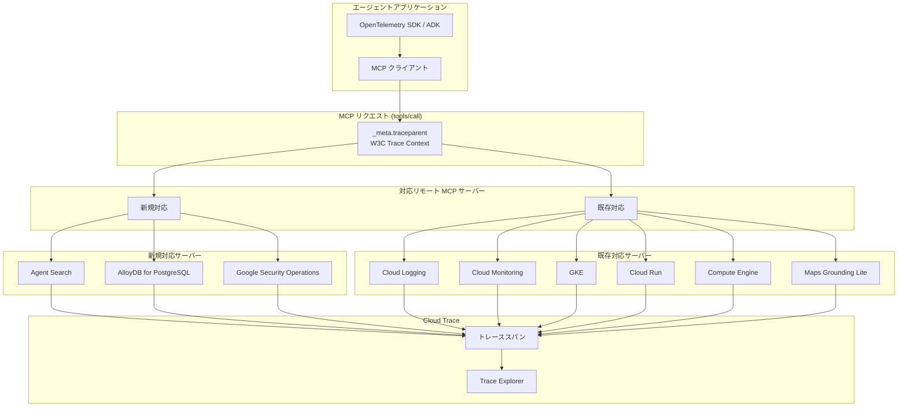

# Cloud Trace: リモート MCP サーバーの tools/call トレーススパン対応拡大

**リリース日**: 2026-05-06

**サービス**: Cloud Trace

**機能**: リモート MCP サーバーによる tools/call オペレーションのトレーススパン自動生成

**ステータス**: Feature

[このアップデートのインフォグラフィックを見る](https://takech9203.github.io/google-cloud-news-summary/20260506-cloud-trace-mcp-server-spans.html)

## 概要

Google Cloud は、リモート MCP (Model Context Protocol) サーバーにおける Cloud Trace のトレーススパン自動生成機能の対象サービスを拡大しました。新たに Agent Search、AlloyDB for PostgreSQL、Google Security Operations の 3 つのリモート MCP サーバーが `tools/call` オペレーション時にトレーススパンを自動生成するようになりました。

この機能により、エージェント型 AI アプリケーションが MCP サーバーを呼び出す際の挙動を Cloud Trace で可視化できるようになります。開発者はツール呼び出しの成否、レイテンシの原因、エラーの発生箇所をエンドツーエンドで追跡可能になり、複雑なエージェントアプリケーションのデバッグと最適化が大幅に容易になります。

本アップデートは、2026 年 4 月 10 日に発表された MCP サーバーの Cloud Trace 対応に続く拡張であり、対応サービスの範囲が着実に広がっています。

**アップデート前の課題**

- Agent Search、AlloyDB for PostgreSQL、Google Security Operations の MCP サーバーを利用する際、ツール呼び出しのトレース情報が Cloud Trace に自動送信されなかった
- エージェントアプリケーションがこれらのサービスの MCP ツールを呼び出した際に、レイテンシの原因やエラーの発生箇所を特定するのが困難だった
- 複数の MCP サーバーを横断するエージェントフローにおいて、一部のサービスだけトレース情報が欠落し、全体像の把握が困難だった

**アップデート後の改善**

- Agent Search、AlloyDB for PostgreSQL、Google Security Operations の MCP サーバーが `tools/call` オペレーション時にトレーススパンを自動生成
- Cloud Trace Explorer でこれらのサービスへの MCP ツール呼び出しのパフォーマンスとエラーを可視化可能に
- 既存の対応サービス (Cloud Logging、Cloud Monitoring、GKE、Cloud Run、Compute Engine 等) と合わせて、より包括的なエージェントアプリケーションのオブザーバビリティを実現

## アーキテクチャ図



エージェントアプリケーションが MCP リクエストに W3C Trace Context を含めて送信すると、対応する各リモート MCP サーバーが `tools/call` オペレーションのトレーススパンを生成し、Cloud Trace に送信します。

## サービスアップデートの詳細

### 主要機能

1. **tools/call オペレーションの自動スパン生成**
   - 対応する MCP サーバーがリクエストを受信すると、`tools/call` オペレーションに対してトレーススパンを自動的に生成
   - スパン名は `tools/call <TOOL_NAME>` の形式 (OpenTelemetry Semantic Conventions for MCP に準拠)
   - 認証済みかつ認可されたリクエストが対象

2. **W3C Trace Context によるコンテキスト伝播**
   - MCP リクエストの `params._meta.traceparent` フィールドを通じてトレースコンテキストを伝達
   - HTTP ヘッダーの `traceparent` ヘッダーによる伝達もサポート
   - sampled フラグが `1` に設定されている場合にスパンが生成

3. **豊富なスパン属性**
   - `gen_ai.tool.name`: 呼び出された MCP ツール名
   - `mcp.method.name`: MCP オペレーション名 (`tools/call`)
   - `mcp.protocol.version`: 使用された MCP プロトコルバージョン
   - `error.message` / `error.type`: エラー情報 (エラー発生時)

### 新規対応サービス

| サービス | 用途 |
|----------|------|
| Agent Search | AI エージェント向け検索機能を提供する MCP サーバー |
| AlloyDB for PostgreSQL | AlloyDB クラスターおよびインスタンスの管理を AI アプリケーションから行う MCP サーバー |
| Google Security Operations | セキュリティオペレーション (SIEM/SOAR) の操作を AI エージェントから行う MCP サーバー |

## 技術仕様

### トレースコンテキストの形式

MCP リクエストにトレースコンテキストを含める方法:

```json
{
  "jsonrpc": "2.0",
  "method": "tools/call",
  "params": {
    "name": "TOOL_NAME",
    "arguments": {
      
    },
    "_meta": {
      "traceparent": "00-TRACE_ID-PARENT_SPAN_ID-01",
      "tracestate": "vendor=specific_information"
    }
  },
  "id": 1
}
```

### スパン属性一覧

| 属性カテゴリ | 属性名 | 説明 |
|-------------|--------|------|
| リソース属性 | `cloud.account.id` | Google Cloud 課金プロジェクト ID |
| リソース属性 | `gcp.mcp.server.id` | MCP サーバーの URN |
| リソース属性 | `gcp.project_id` | テレメトリデータ送信先プロジェクト ID |
| スパン属性 | `gen_ai.operation.name` | `execute_tool` (固定値) |
| スパン属性 | `gen_ai.tool.name` | 呼び出された MCP ツール名 |
| スパン属性 | `mcp.method.name` | `tools/call` |
| スパン属性 | `mcp.protocol.version` | MCP プロトコルバージョン |
| スコープ属性 | `gcp.server.service` | MCP サーバーのサービス名 |

## 設定方法

### 前提条件

1. Cloud Trace API が有効化された Google Cloud プロジェクト
2. OpenTelemetry SDK または Agent Development Kit (ADK) がインストールされたアプリケーション
3. 対象の MCP サーバーの API が有効化されていること

### 手順

#### ステップ 1: トレースコンテキストの伝播を有効化

OpenTelemetry Semantic Conventions for MCP をサポートするフレームワークまたは SDK を使用してアプリケーションを構成します。Agent Development Kit (ADK) を使用する場合:

```python
from google.adk import Agent
from opentelemetry import trace
from opentelemetry.sdk.trace import TracerProvider
from opentelemetry.exporter.otlp.proto.grpc.trace_exporter import OTLPSpanExporter

# TracerProvider の設定
provider = TracerProvider()
provider.add_span_processor(
    BatchSpanProcessor(OTLPSpanExporter())
)
trace.set_tracer_provider(provider)

# ADK エージェントの構成 (トレースコンテキストは自動伝播)
agent = Agent(
    name="my-agent",
    tools=["agent-search", "alloydb", "secops"]
)
```

#### ステップ 2: Trace Explorer でスパンを確認

Google Cloud Console で Trace Explorer を開き、以下のフィルタを適用します:

```
mcp.method.name = "tools/call"
```

特定のサービスのスパンのみを表示する場合は、`gcp.server.service` 属性でフィルタリングします。

## メリット

### ビジネス面

- **エージェントアプリケーションの信頼性向上**: MCP ツール呼び出しの失敗原因を迅速に特定し、ユーザー体験の改善につなげられる
- **運用コストの削減**: 問題の根本原因分析にかかる時間を短縮し、MTTR (平均復旧時間) を改善

### 技術面

- **エンドツーエンドの可視性**: エージェントアプリケーションから MCP サーバーまでの完全なトレースを取得可能
- **標準ベースの実装**: W3C Trace Context と OpenTelemetry Semantic Conventions に準拠しており、既存のオブザーバビリティスタックとシームレスに統合
- **自動インストルメンテーション**: MCP サーバー側でのスパン生成は自動的に行われ、追加のコード変更が不要

## デメリット・制約事項

### 制限事項

- `tools/call` オペレーションのみがトレーススパンを生成する (その他の MCP オペレーションは非対応)
- 生成されるのは単一のスパンのみで、`tools/call` オペレーション内部の子スパンは生成されない
- W3C Trace Context 形式のみサポート (`X-Cloud-Trace-Context` など非 W3C ヘッダーは非対応)

### 考慮すべき点

- 認証済みかつ認可されたリクエストのみがトレース対象となる
- sampled フラグが `1` に設定されている必要がある
- API の有効化やポリシーチェックを通過しないリクエストはトレース対象外となる場合がある

## ユースケース

### ユースケース 1: セキュリティオペレーションエージェントのデバッグ

**シナリオ**: Google Security Operations の MCP サーバーを利用してインシデント調査を自動化するエージェントを構築している。エージェントが特定のケースで期待通りに動作しない原因を調査したい。

**効果**: Cloud Trace Explorer で当該エージェントのトレースを確認し、`tools/call` スパンのエラー属性やレイテンシを分析することで、ツール呼び出しの失敗箇所や遅延の原因を迅速に特定できる。

### ユースケース 2: マルチサービスエージェントのパフォーマンス最適化

**シナリオ**: Agent Search でデータを検索し、AlloyDB for PostgreSQL に結果を保存するマルチステップエージェントのレスポンスタイムを最適化したい。

**効果**: 各 MCP ツール呼び出しのスパンを Trace Explorer で比較し、どのステップがボトルネックになっているかを視覚的に把握できる。ネットワークレイテンシか MCP サーバーの処理時間かを切り分け、適切な最適化戦略を策定できる。

## 料金

Cloud Trace の利用料金に準じます。スパンの取り込みと保存に対して課金されます。

| 項目 | 料金 |
|------|------|
| 最初の 250 万スパン/月 | 無料 |
| 250 万スパン超過分 | $0.20 / 100 万スパン |

※ 最新の料金情報は公式料金ページを参照してください。

## 関連サービス・機能

- **Cloud Trace**: 分散トレーシングサービス。MCP サーバーからのスパンデータを収集・可視化
- **OpenTelemetry**: トレースコンテキストの伝播と収集に使用されるオープンソースのオブザーバビリティフレームワーク
- **Agent Development Kit (ADK)**: Google のエージェント開発フレームワーク。OpenTelemetry によるインストルメンテーションをサポート
- **Cloud Trace Explorer**: トレースデータの検索・分析 UI

## 参考リンク

- [インフォグラフィック](https://takech9203.github.io/google-cloud-news-summary/20260506-cloud-trace-mcp-server-spans.html)
- [公式リリースノート](https://docs.cloud.google.com/release-notes#May_06_2026)
- [ドキュメント: Investigate MCP calls using Trace](https://docs.cloud.google.com/stackdriver/docs/instrumentation/trace-remote-mcp-server-calls)
- [Cloud Trace の概要](https://docs.cloud.google.com/trace/docs/overview)
- [MCP サーバーの Cloud Trace 対応について](https://docs.cloud.google.com/mcp/monitor-mcp-tool-use-with-cloud-trace)
- [料金ページ](https://cloud.google.com/trace#pricing)

## まとめ

今回のアップデートにより、Agent Search、AlloyDB for PostgreSQL、Google Security Operations の 3 つのリモート MCP サーバーが Cloud Trace のトレーススパン自動生成に対応しました。エージェント型 AI アプリケーションを構築している開発者は、OpenTelemetry または ADK を使用してトレースコンテキストを伝播するだけで、これらのサービスへの MCP ツール呼び出しのパフォーマンスとエラーを Cloud Trace Explorer で可視化できます。対応サービスの継続的な拡大により、Google Cloud 上のエージェントアプリケーション全体のオブザーバビリティが着実に向上しています。

---

**タグ**: #CloudTrace #MCP #Observability #AgentSearch #AlloyDB #GoogleSecurityOperations #OpenTelemetry #AI #エージェント
