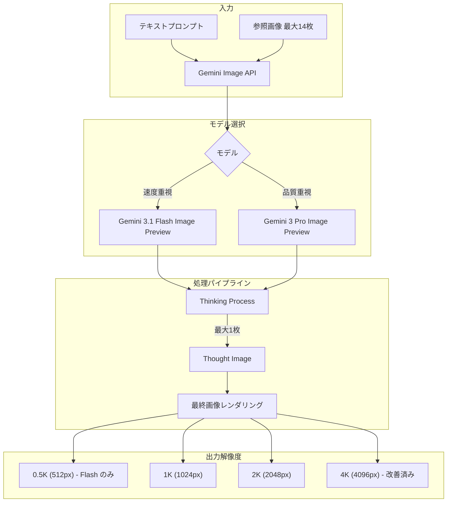

# Gemini Enterprise Agent Platform: Gemini 3.1 Flash Image / Gemini 3 Pro Image アップデート

**リリース日**: 2026-05-06

**サービス**: Gemini Enterprise Agent Platform

**機能**: Gemini 3.1 Flash Image Preview および Gemini 3 Pro Image Preview の改善

**ステータス**: Change (Preview)

[このアップデートのインフォグラフィックを見る](https://takech9203.github.io/google-cloud-news-summary/20260506-gemini-3-1-flash-pro-image-updates.html)

## 概要

Gemini Enterprise Agent Platform において、Gemini 3.1 Flash Image Preview および Gemini 3 Pro Image Preview に複数の改善が導入されました。主な変更点として、4K 出力品質と効率性の向上、思考画像（thought image）の最大数の制限、新しい解像度パラメータ値の追加、およびデフォルト思考レベルの変更が含まれます。

これらのアップデートは、画像生成ワークフローの効率化とレイテンシ削減を目的としており、特に高スループットが要求される本番環境での利用を想定しています。Gemini 3.1 Flash Image は速度と効率性に最適化されたモデル、Gemini 3 Pro Image はプロフェッショナルなアセット制作に最適化されたモデルとして、それぞれの特性に応じた改善が行われています。

**アップデート前の課題**

- 4K 画像出力において効率性に改善の余地があった
- 思考画像（thought image）が複数生成される場合があり、レスポンス時間に影響していた
- Gemini 3.1 Flash Image の 512 解像度パラメータは限定的な表記のみ対応していた
- Gemini 3.1 Flash Image のデフォルト思考レベルがレイテンシの面で最適ではなかった

**アップデート後の改善**

- 両モデルで 4K 出力品質と処理効率が向上
- 思考画像の最大数が 1 枚に制限され、レスポンス時間が改善
- `image_size` パラメータで "512", "512p", "512P", "512PX", "512px" が利用可能になり、0.5MP 解像度の指定が柔軟に
- Gemini 3.1 Flash Image のデフォルト思考レベルが Minimal に変更され、低レイテンシ応答が標準に

## アーキテクチャ図



Gemini Image モデルの処理パイプラインを示しています。入力からモデル選択、思考プロセス（最大 1 枚の思考画像）を経て、各解像度で最終画像を出力します。

## サービスアップデートの詳細

### 主要機能

1. **4K 出力品質と効率性の向上**
   - Gemini 3.1 Flash Image Preview および Gemini 3 Pro Image Preview の両方で 4K 出力が改善
   - 4K 画像（4096x4096px）の生成効率が向上し、より高品質な出力が可能に

2. **思考画像（Thought Image）の制限**
   - 両モデルで思考画像の最大数が 1 枚に制限
   - 以前はモデルが最大 2 枚の中間画像を生成して構図やロジックをテストしていたが、今回のアップデートで 1 枚に制限
   - これによりレスポンス時間の短縮とトークン消費の削減が期待される

3. **512 解像度パラメータの拡張（Flash Image のみ）**
   - `image_size` パラメータで以下の値が新たに受け付け可能に: "512", "512p", "512P", "512PX", "512px"
   - 0.5MP（512px）解像度の出力画像を生成
   - これにより、サムネイルやプレビュー用途に最適な低解像度画像の指定が容易に

4. **デフォルト思考レベルの変更（Flash Image のみ）**
   - Gemini 3.1 Flash Image Preview のデフォルト `thinkingLevel` が Minimal に変更
   - Minimal は完全に思考を無効にするわけではなく、最低限の思考プロセスを維持
   - サポートされる思考レベル: `minimal`（デフォルト）および `high`
   - `high` に設定することで、より複雑なプロンプトに対する品質向上が可能

## 技術仕様

### モデル比較

| 項目 | Gemini 3.1 Flash Image Preview | Gemini 3 Pro Image Preview |
|------|------|------|
| モデル ID | gemini-3.1-flash-image-preview | gemini-3-pro-image-preview |
| 最大入力トークン | 131,072 | 65,536 |
| 最大出力トークン | 32,768 | 32,768 |
| 対応解像度 | 0.5K, 1K, 2K, 4K | 1K, 2K, 4K |
| 対応アスペクト比 | 1:1, 1:4, 1:8, 2:3, 3:2, 3:4, 4:1, 4:3, 4:5, 5:4, 8:1, 9:16, 16:9, 21:9 | 1:1, 2:3, 3:2, 3:4, 4:3, 4:5, 5:4, 9:16, 16:9, 21:9 |
| 最大参照画像数 | 14枚（オブジェクト10枚 + キャラクター4枚） | 14枚（オブジェクト6枚 + キャラクター5枚） |
| デフォルト思考レベル | Minimal（今回変更） | - |
| 最大思考画像数 | 1枚（今回変更） | 1枚（今回変更） |
| リージョン | global | global |

### image_size パラメータ（Flash Image）

| 値 | 解像度 | 消費トークン数 |
|------|------|------|
| "512", "512p", "512P", "512PX", "512px" | 0.5MP (512px) | 747 |
| "1K" | 1MP (1024x1024px) | 1,120 |
| "2K" | 2MP (2048x2048px) | 1,680 |
| "4K" | 4MP (4096x4096px) | 2,520 |

### API リクエスト例

```python
from google import genai
from google.genai import types

client = genai.Client()

# Gemini 3.1 Flash Image - 512px 解像度で生成
response = client.models.generate_content(
    model="gemini-3.1-flash-image-preview",
    contents="A minimalist logo design for a coffee shop",
    config=types.GenerateContentConfig(
        response_modalities=["IMAGE"],
        response_format={"image": {"image_size": "512px"}},
        thinking_config=types.ThinkingConfig(
            thinking_level="minimal",
            include_thoughts=False
        ),
    )
)

for part in response.parts:
    if part.text is not None:
        print(part.text)
    elif image := part.as_image():
        image.save("logo_512.png")
```

```python
# Gemini 3.1 Flash Image - 4K 高品質生成（思考レベル High）
response = client.models.generate_content(
    model="gemini-3.1-flash-image-preview",
    contents="A detailed architectural visualization of a modern glass building",
    config=types.GenerateContentConfig(
        response_modalities=["IMAGE"],
        response_format={"image": {"image_size": "4K"}},
        thinking_config=types.ThinkingConfig(
            thinking_level="High",
            include_thoughts=True
        ),
    )
)
```

## 設定方法

### 前提条件

1. Google Cloud プロジェクトで課金が有効であること
2. Gemini Enterprise Agent Platform API（または Vertex AI API）が有効であること
3. 適切な IAM 権限（`aiplatform.endpoints.predict` など）が付与されていること

### 手順

#### ステップ 1: API の有効化

```bash
gcloud services enable aiplatform.googleapis.com
```

#### ステップ 2: 認証情報の設定

```bash
gcloud auth application-default login
```

#### ステップ 3: Python SDK のインストール

```bash
pip install google-genai
```

## メリット

### ビジネス面

- **コスト最適化**: 512px 解像度オプションにより、プレビューやサムネイル用途では低コスト（約 $0.045/画像）で画像生成が可能
- **レスポンス時間の短縮**: デフォルト思考レベルの Minimal 化と思考画像の 1 枚制限により、インタラクティブなアプリケーションでのユーザー体験が向上
- **4K 品質の向上**: マーケティング素材や商品画像など、高品質が求められるアセットの品質が改善

### 技術面

- **柔軟なパラメータ指定**: 512 解像度の複数表記対応により、異なるコードスタイルやフレームワークとの互換性が向上
- **予測可能なレイテンシ**: 思考画像の 1 枚制限により、レスポンス時間のばらつきが軽減
- **効率的なトークン消費**: 4K 出力の効率改善により、同じトークン予算でより高品質な結果が得られる

## デメリット・制約事項

### 制限事項

- Preview ステータスのため、SLA や非推奨ポリシーの対象外
- 思考画像が 1 枚に制限されたことで、非常に複雑なプロンプトでは構図の試行が減少する可能性がある
- `image_size` の指定には大文字 "K" が必要（例: "1K", "2K", "4K"）。小文字（"1k" など）はエラーとなる
- 512 解像度は Gemini 3.1 Flash Image のみで利用可能（Pro Image では非対応）

### 考慮すべき点

- デフォルト思考レベルが Minimal に変更されたため、品質重視のユースケースでは明示的に `thinkingLevel: "High"` を指定する必要がある
- 思考トークンは `includeThoughts` の設定に関わらず課金対象
- コード対応が不要な場合でも、レスポンスに含まれる `thought_signature` フィールドをマルチターン会話で正しく返却する必要がある

## ユースケース

### ユースケース 1: EC サイトの商品画像バリエーション生成

**シナリオ**: EC サイトで商品画像のバリエーション（異なる背景、角度）を大量に生成する必要がある場合

**実装例**:
```python
# 低レイテンシ・高スループットで商品画像バリエーションを生成
response = client.models.generate_content(
    model="gemini-3.1-flash-image-preview",
    contents=[
        "この商品を白い背景で、斜め45度から撮影したように生成してください",
        product_image,  # 参照画像
    ],
    config=types.GenerateContentConfig(
        response_modalities=["TEXT", "IMAGE"],
        response_format={"image": {"image_size": "1K"}},
        thinking_config=types.ThinkingConfig(thinking_level="minimal"),
    )
)
```

**効果**: デフォルト Minimal 思考により高スループットで大量のバリエーションを生成可能。1K 解像度で EC サイト掲載に十分な品質を確保。

### ユースケース 2: SNS 向けサムネイル一括生成

**シナリオ**: ブログ記事やニュース記事のサムネイル画像を 512px で効率的に生成

**実装例**:
```python
# 512px でサムネイル生成（最低コスト）
response = client.models.generate_content(
    model="gemini-3.1-flash-image-preview",
    contents="Tech blog thumbnail: AI and cloud computing, modern flat design",
    config=types.GenerateContentConfig(
        response_modalities=["IMAGE"],
        response_format={"image": {"image_size": "512px", "aspect_ratio": "16:9"}},
    )
)
```

**効果**: 1 画像あたり約 $0.045 のコストで高品質なサムネイルを生成。512px 解像度は SNS のサムネイル表示に最適。

### ユースケース 3: プロフェッショナル広告素材の 4K 生成

**シナリオ**: デジタルサイネージや印刷用の高解像度広告素材を生成

**実装例**:
```python
# Pro Image で 4K 高品質広告素材を生成
response = client.models.generate_content(
    model="gemini-3-pro-image-preview",
    contents="Luxury watch advertisement, dramatic lighting, black background, 4K detail",
    config=types.GenerateContentConfig(
        response_modalities=["IMAGE"],
        response_format={"image": {"image_size": "4K", "aspect_ratio": "21:9"}},
    )
)
```

**効果**: 改善された 4K 出力品質により、印刷やデジタルサイネージにも耐えうる高精細な広告素材を生成。

## 料金

Gemini API の有料ティアで利用可能です（無料ティアは非対応）。

### Gemini 3.1 Flash Image Preview 料金

| 項目 | Standard 料金 (USD) |
|------|------|
| 入力 | $0.50 / 1M トークン (テキスト/画像) |
| 出力 (テキスト・思考) | $3.00 / 1M トークン |
| 出力 (画像) | $60.00 / 1M トークン |
| 0.5K 画像 (512px) | 約 $0.045 / 画像 (747 トークン) |
| 1K 画像 (1024px) | 約 $0.067 / 画像 (1,120 トークン) |
| 2K 画像 (2048px) | 約 $0.101 / 画像 (1,680 トークン) |
| 4K 画像 (4096px) | 約 $0.151 / 画像 (2,520 トークン) |

### Gemini 3 Pro Image Preview 料金

| 項目 | Standard 料金 (USD) |
|------|------|
| 入力 | $2.00 / 1M トークン (テキスト/画像) |
| 出力 (テキスト・思考) | $12.00 / 1M トークン |
| 出力 (画像) | $120.00 / 1M トークン |
| 1K/2K 画像 | 約 $0.134 / 画像 (1,120 トークン) |
| 4K 画像 | 約 $0.24 / 画像 (2,000 トークン) |

## 利用可能リージョン

両モデルとも **global** エンドポイントでのみ利用可能です。

- エンドポイント: `global`
- Vertex AI の場合、ロケーションを `global` に設定する必要があります

## 関連サービス・機能

- **Gemini Enterprise Agent Platform**: 本アップデートの対象プラットフォーム。画像生成を含む AI エージェント機能を提供
- **Grounding with Google Search**: 画像生成時にリアルタイムデータに基づいた画像を生成可能（Flash Image は Web 検索と画像検索の両方に対応）
- **Content Credentials (C2PA)**: 生成画像にデジタル来歴情報を付与する機能
- **Vertex AI Batch Prediction**: 大量の画像生成リクエストをバッチ処理で効率的に実行可能

## 参考リンク

- [インフォグラフィック](https://takech9203.github.io/google-cloud-news-summary/20260506-gemini-3-1-flash-pro-image-updates.html)
- [公式リリースノート](https://cloud.google.com/release-notes#May_06_2026)
- [Gemini 3.1 Flash Image ドキュメント](https://docs.cloud.google.com/vertex-ai/generative-ai/docs/models/gemini/3-1-flash-image)
- [Gemini 3 Pro Image ドキュメント](https://docs.cloud.google.com/vertex-ai/generative-ai/docs/models/gemini/3-pro-image)
- [画像生成ガイド](https://ai.google.dev/gemini-api/docs/image-generation)
- [料金ページ](https://ai.google.dev/gemini-api/docs/pricing)

## まとめ

今回のアップデートは、Gemini 画像生成モデルの実用性を大きく向上させるものです。特にデフォルト思考レベルの Minimal 化と思考画像の 1 枚制限により、本番環境でのレイテンシが改善され、インタラクティブなアプリケーションでの活用が促進されます。高品質な 4K 出力が必要な場合は思考レベルを High に明示的に設定し、低レイテンシが優先される場合はデフォルトの Minimal を活用することで、用途に応じた最適な画像生成が可能になります。

---

**タグ**: #GeminiEnterpriseAgentPlatform #Gemini3.1FlashImage #Gemini3ProImage #ImageGeneration #4K #ThinkingLevel #Preview
