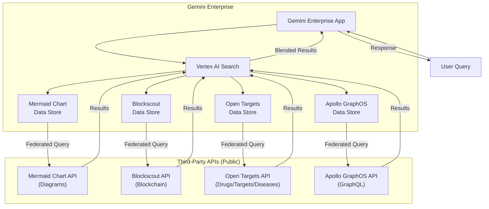

# Gemini Enterprise: 新規データストア追加 - Mermaid Chart, Blockscout, Open Targets, Apollo GraphOS MCP Tools

**リリース日**: 2026-05-06

**サービス**: Gemini Enterprise

**機能**: 新規データストア - Mermaid Chart, Blockscout, Open Targets, Apollo GraphOS MCP Tools (Public Preview)

**ステータス**: Public Preview

[このアップデートのインフォグラフィックを見る](https://takech9203.github.io/google-cloud-news-summary/20260506-gemini-enterprise-new-data-stores.html)

## 概要

Gemini Enterprise に 4 つの新しいサードパーティデータストアが Public Preview として追加されました。追加されたのは Mermaid Chart（ダイアグラム描画ツール）、Blockscout（ブロックチェーンエクスプローラー）、Open Targets（創薬プラットフォーム）、Apollo GraphOS MCP Tools（GraphQL 管理プラットフォーム）の 4 種類です。

これらのデータストアはすべてデータフェデレーション方式で接続され、Gemini Enterprise から直接サードパーティの API にクエリを送信してデータを取得します。データのインデックス化やコピーは行われないため、ストレージの追加消費なく即座にデータにアクセスできます。

4 つのコネクタはいずれもパブリック API を使用しており、認証設定が不要です。これにより、セットアップが簡素化され、迅速にデータソースを接続して利用を開始できます。

**アップデート前の課題**

- ダイアグラム（Mermaid Chart）、ブロックチェーンデータ、創薬関連データ、GraphQL スキーマ情報を Gemini Enterprise 内で統合的に検索する手段がなかった
- これらの外部データソースの情報を参照するために、個別のツールやプラットフォームに切り替える必要があった
- 複数のデータソースからの検索結果を統合的に表示する仕組みが限定的だった

**アップデート後の改善**

- Gemini Enterprise の統合検索インターフェースから、ダイアグラム、ブロックチェーン、創薬、GraphQL の各データに直接アクセス可能になった
- データフェデレーションにより、データのコピーやインデックス化なしにリアルタイムでサードパーティデータを検索可能になった
- 認証不要のパブリック API コネクタにより、セットアップが簡素化された

## アーキテクチャ図



ユーザーのクエリが Gemini Enterprise アプリに送信されると、Vertex AI Search がフェデレーテッドクエリとして各サードパーティ API に直接リクエストを送信し、結果を統合して返却します。

## サービスアップデートの詳細

### 主要機能

1. **Mermaid Chart データストア**
   - Mermaid Chart からダイアグラムをレンダリングおよび検索可能
   - エンティティタイプ: Diagrams
   - Mermaid コードを使用したダイアグラムの直接取得に対応

2. **Blockscout データストア**
   - 複数のブロックチェーンネットワークにわたる深層ブロックチェーン分析を実行可能
   - パブリックブロックチェーンデータへのアクセスを提供
   - ブロックチェーンエンティティの検索に対応

3. **Open Targets データストア**
   - Open Targets Platform からの薬剤・ターゲット・疾患データの検索および取得が可能
   - エンティティタイプ: Drugs, Targets, Diseases
   - 創薬研究のためのデータアクセスを統合

4. **Apollo GraphOS MCP Tools データストア**
   - Apollo GraphOS の仕様およびドキュメントへの直接アクセスを提供
   - GraphQL スキーマ管理に関する情報検索に対応
   - MCP (Model Context Protocol) ツールとしての統合

## 技術仕様

### データフェデレーションの仕組み

| 項目 | 詳細 |
|------|------|
| データ接続方式 | データフェデレーション（リアルタイム API 呼び出し） |
| データコピー | なし（サードパーティにデータが保持されたまま） |
| 認証要件 | 不要（すべてパブリック API） |
| クエリ最適化 | LLM によるクエリ書き換えが実行される場合あり |
| サポートリージョン | Global, US, EU |

### 各コネクタの比較

| コネクタ | 対象データ | エンティティタイプ | 用途 |
|----------|-----------|-------------------|------|
| Mermaid Chart | ダイアグラム | Diagrams | 技術文書の可視化 |
| Blockscout | ブロックチェーン | Blockchain entities | オンチェーン分析 |
| Open Targets | 創薬データ | Drugs, Targets, Diseases | 医薬品研究 |
| Apollo GraphOS | GraphQL スキーマ | GraphQL specifications | API 管理 |

### 必要な IAM ロール

```
roles/discoveryengine.editor
```

データストア作成に必要なロールです。IAM ページからユーザーに Discovery Engine Editor ロールを付与してください。

## 設定方法

### 前提条件

1. Google Cloud プロジェクトが作成されていること
2. Discovery Engine Editor ロール（`roles/discoveryengine.editor`）がユーザーに付与されていること
3. 課金が有効になっていること

### 手順

#### ステップ 1: データストアの作成

1. Google Cloud コンソールで Gemini Enterprise ページに移動
2. ナビゲーションメニューから **Data stores** をクリック
3. **Create data store** をクリック
4. Source セクションで対象のコネクタ（例: Mermaid Chart）を検索して選択

#### ステップ 2: エンティティの選択

1. Data セクションで検索対象のエンティティを選択
   - Mermaid Chart: Diagrams
   - Open Targets: Drugs, Targets, Diseases
   - Blockscout: Blockchain entities
   - Apollo GraphOS: GraphQL specifications

#### ステップ 3: 構成の設定

1. Multi-region リストからデータコネクタのロケーションを選択（Global, US, EU）
2. コネクタ名を入力
3. US または EU を選択した場合は暗号化設定を構成
   - Google マネージド暗号化キーまたは Cloud KMS キーを選択

#### ステップ 4: 課金設定とデータストア作成

1. Billing セクションで General pricing を選択
2. **Create** をクリック
3. データストアの状態が Creating から Active に変わるまで待機

#### ステップ 5: アプリへの接続

1. 既存のアプリにデータストアを接続するか、新しいアプリを作成して接続

## メリット

### ビジネス面

- **多様なデータソースの統合検索**: ダイアグラム、ブロックチェーン、創薬、GraphQL といった異なる分野のデータを一元的に検索できるようになり、業務効率が向上
- **即時利用可能**: パブリック API を利用するため認証設定が不要で、セットアップ後すぐに利用を開始可能
- **専門分野への対応拡大**: ブロックチェーン開発、バイオテクノロジー、API 管理などの専門領域でも Gemini Enterprise を活用可能

### 技術面

- **データフェデレーションによるリアルタイム性**: データのコピーやインデックス化が不要なため、常に最新のデータにアクセス可能
- **ストレージコスト削減**: フェデレーション方式のため追加のストレージ消費が発生しない
- **VPC Service Controls 対応**: VPC Service Controls ペリメータの適用が可能（ただし既存データストアには再作成が必要）

## デメリット・制約事項

### 制限事項

- Public Preview 段階のため、サポートが限定的であり、Pre-GA Offerings Terms が適用される
- VPC Service Controls ペリメータを既存のデータストアに適用する場合は、データストアの削除と再作成が必要
- サポートされるロケーションは Global, US, EU のみ
- フェデレーション方式のためデータがインデックス化されず、検索品質がインジェスト方式と比較して低くなる可能性がある

### 考慮すべき点

- クエリ文字列がサードパーティの検索バックエンドに送信されるため、機密情報を含むクエリには注意が必要
- LLM によるクエリ書き換えにより、セッションのクエリ履歴の一部がサードパーティに送信される可能性がある
- 複数のフェデレーテッドデータソースが有効な場合、クエリがすべてのデータソースに送信される可能性がある
- サードパーティシステムに到達したデータは、そのシステムの利用規約とプライバシーポリシーに準拠する

## ユースケース

### ユースケース 1: 技術文書とアーキテクチャ図の統合検索

**シナリオ**: エンジニアリングチームが技術文書作成時に、Mermaid Chart に保存されたアーキテクチャ図と、Apollo GraphOS に登録された API スキーマ情報を同時に検索し、整合性のあるドキュメントを作成する。

**効果**: 複数のツールを切り替えることなく、Gemini Enterprise 上で必要な情報を統合的に取得でき、ドキュメント作成の効率が向上する。

### ユースケース 2: ブロックチェーンプロジェクトのデータ分析

**シナリオ**: Web3 開発チームが Blockscout コネクタを使用して、複数のブロックチェーンネットワークにわたるトランザクションデータやスマートコントラクトの情報を Gemini Enterprise から直接分析する。

**効果**: 個別のブロックチェーンエクスプローラーにアクセスすることなく、統合的なインターフェースからオンチェーンデータを検索・分析できる。

### ユースケース 3: 創薬研究における標的探索

**シナリオ**: 製薬企業の研究者が Open Targets コネクタを使用して、特定の疾患に関連する薬剤ターゲットや既存薬剤の情報を、他の社内データソースと組み合わせて検索する。

**効果**: Open Targets Platform のデータと社内のリサーチデータを Gemini Enterprise 上で統合的に検索でき、創薬研究の意思決定が迅速化される。

## 料金

Gemini Enterprise のデータストアには General pricing（従量課金制）が適用されます。データストア作成時に Billing セクションで General pricing を選択する必要があります。

詳細な料金情報については、[Gemini Enterprise の料金ページ](https://cloud.google.com/gemini/enterprise/pricing)および[ライセンス情報](https://docs.cloud.google.com/gemini/enterprise/docs/licenses)を参照してください。

## 利用可能リージョン

| リージョン | 対応状況 |
|-----------|---------|
| Global | 対応 |
| US | 対応 |
| EU | 対応 |

US または EU リージョンを選択した場合は、暗号化設定（Google マネージド暗号化キーまたは Cloud KMS キー）の構成が必要です。

## 関連サービス・機能

- **Vertex AI Search**: Gemini Enterprise のデータストアの基盤となる検索エンジン。フェデレーテッドクエリの実行を担当
- **Discovery Engine**: データストアの作成・管理に使用される基盤サービス
- **Cloud KMS**: US/EU リージョンでのカスタマー管理暗号化キー（CMEK）に対応
- **VPC Service Controls**: データストアのセキュリティ境界の設定に使用

## 参考リンク

- [インフォグラフィック](https://takech9203.github.io/google-cloud-news-summary/20260506-gemini-enterprise-new-data-stores.html)
- [公式リリースノート](https://cloud.google.com/release-notes#May_06_2026)
- [サードパーティデータソースの接続](https://docs.cloud.google.com/gemini/enterprise/docs/connectors/connect-third-party-data-source)
- [Mermaid Chart コネクタ](https://docs.cloud.google.com/gemini/enterprise/docs/connectors/mermaid_chart)
- [Blockscout コネクタ](https://docs.cloud.google.com/gemini/enterprise/docs/connectors/blockscout)
- [Open Targets コネクタ](https://docs.cloud.google.com/gemini/enterprise/docs/connectors/open_targets)
- [Apollo GraphOS コネクタ](https://docs.cloud.google.com/gemini/enterprise/docs/connectors/apollo-graphos)
- [コネクタとデータストアの概要](https://docs.cloud.google.com/gemini/enterprise/docs/connectors/introduction-to-connectors-and-data-stores)

## まとめ

Gemini Enterprise に Mermaid Chart、Blockscout、Open Targets、Apollo GraphOS MCP Tools の 4 つの新しいデータストアが Public Preview として追加されました。これらはすべてデータフェデレーション方式で接続され、認証不要のパブリック API を使用するため、迅速にセットアップして利用を開始できます。ダイアグラム作成、ブロックチェーン分析、創薬研究、GraphQL 管理といった専門領域のデータを Gemini Enterprise の統合検索基盤に取り込むことで、組織全体のデータアクセシビリティと分析能力が向上します。

---

**タグ**: #GeminiEnterprise #DataStores #DataFederation #MermaidChart #Blockscout #OpenTargets #ApolloGraphOS #PublicPreview #ThirdPartyConnectors
