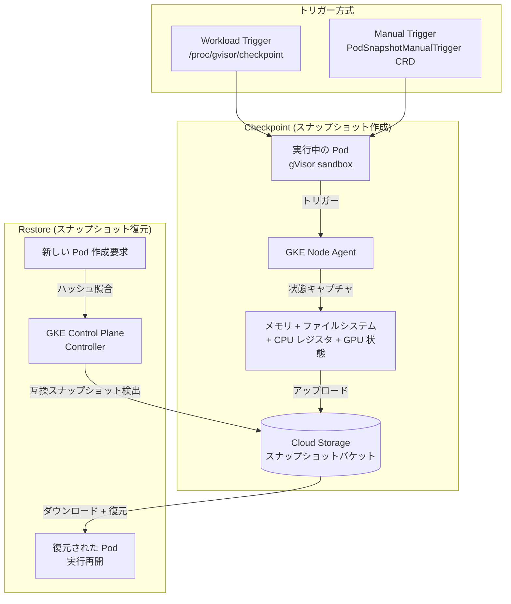

# Google Kubernetes Engine (GKE): Pod Snapshots GA / Confidential GKE Nodes ライブマイグレーション / Cloud Storage FUSE 修正

**リリース日**: 2026-05-06

**サービス**: Google Kubernetes Engine (GKE)

**機能**: Pod Snapshots GA + Confidential GKE Nodes Live Migration + Cloud Storage FUSE Fix

**ステータス**: GA (Pod Snapshots)、Feature (Confidential Nodes Live Migration)、Fixed (Cloud Storage FUSE)

[このアップデートのインフォグラフィックを見る](https://takech9203.github.io/google-cloud-news-summary/20260506-gke-pod-snapshots-confidential-nodes.html)

## 概要

GKE の 2026 年 5 月 6 日リリースでは、3 つの重要なアップデートが含まれている。最も注目すべきは **GKE Pod Snapshots の一般提供 (GA)** で、バージョン 1.35.3-gke.1234000 以降のクラスタで利用可能になった。Pod Snapshots は実行中の Pod の完全な状態 (メモリ、ファイルシステム、CPU レジスタ) をスナップショットとして保存し、新しいレプリカ作成時にスナップショットから復元することで、ワークロードの起動レイテンシを大幅に短縮する機能である。

2 つ目のアップデートとして、**GKE Standard クラスタにおける Confidential GKE Nodes のライブマイグレーション対応** が発表された。AMD SEV を有効にした C3D マシンシリーズで、ホストメンテナンスイベント時にノードを停止することなくライブマイグレーションが可能になった。

3 つ目は **Cloud Storage FUSE CSI ドライバーの ARM64 ノードにおけるバグ修正** で、64 KiB ページサイズを使用する ARM64 ノード (A4X、A4X Max インスタンスなど) でファイル読み取りが不完全になる問題が解決された。

**アップデート前の課題**

- Pod Snapshots は Preview ステータスであり、本番環境での利用にはリスクがあった
- Confidential GKE Nodes では、ホストメンテナンスイベント時にノードが停止 (TERMINATE) され、Pod に中断が発生していた
- ARM64 ノード (64 KiB ページサイズ) で Cloud Storage FUSE を使用すると、カーネルの先読みメカニズムにより不完全なファイル読み取りや早期 EOF エラーが発生していた

**アップデート後の改善**

- Pod Snapshots が GA となり、本番ワークロードで SLA 付きで利用可能に
- C3D + AMD SEV 構成の Confidential GKE Nodes でライブマイグレーションが可能になり、メンテナンス時の Pod 中断を回避
- ARM64 ノードでの Cloud Storage FUSE 読み取りエラーが修正され、A4X/A4X Max インスタンスで安定したストレージアクセスが可能に

## アーキテクチャ図



Pod Snapshots は gVisor サンドボックス上で動作する Pod の完全な状態を Cloud Storage に保存し、新しい Pod の作成時に互換性のあるスナップショットから自動的に復元する。トリガーはアプリケーション内部からのシグナル (Workload Trigger) または手動の CRD 作成 (Manual Trigger) の 2 方式をサポートする。

## サービスアップデートの詳細

### 主要機能

1. **GKE Pod Snapshots (GA)**
   - バージョン 1.35.3-gke.1234000 以降の Standard クラスタで利用可能
   - 実行中の Pod の完全な状態 (メモリ、ファイルシステム、CPU レジスタ、GPU 状態) をスナップショットとして保存
   - 新しいレプリカ作成時にスナップショットから復元し、コールドスタートを回避
   - AI 推論ワークロード (大規模モデルのロード) やライブラリ依存が多いアプリケーションの起動時間を大幅に短縮
   - GPU 状態のスナップショットもサポート (NVIDIA cuda-checkpoint による GPU メモリの保存)

2. **Confidential GKE Nodes ライブマイグレーション**
   - GKE Standard クラスタで C3D マシンシリーズ + AMD SEV 構成のノードに対応
   - ホストメンテナンスイベント時に Pod を停止せずにライブマイグレーション可能
   - これまでは Confidential VM がメンテナンス時に TERMINATE されていたが、C3D + AMD SEV の組み合わせでこの制約を解消

3. **Cloud Storage FUSE CSI ドライバー ARM64 修正**
   - 64 KiB ページサイズの ARM64 ノード (A4X、A4X Max インスタンス) での不完全ファイル読み取り問題を修正
   - 原因: カーネルの先読み (read-ahead) メカニズムが Cloud Storage FUSE レイヤーの容量を超えるリクエストを発行
   - 修正バージョン: 1.33.11-gke.1019000 以降、1.34.6-gke.1154000 以降、1.35.2-gke.1485000 以降

## 技術仕様

### Pod Snapshots の構成要素

| 項目 | 詳細 |
|------|------|
| 必須クラスタバージョン | 1.35.3-gke.1234000 以降 (GA) |
| クラスタモード | Standard モードのみ |
| ランタイム | gVisor (runtimeClassName: gvisor) |
| スナップショット保存先 | Cloud Storage バケット |
| サポートマシンタイプ | E2 以外の全マシンタイプ (E2 は動的アーキテクチャのため非対応) |
| GPU サポート | あり (NVIDIA cuda-checkpoint によるGPU状態保存) |
| CRD | PodSnapshotStorageConfig, PodSnapshotPolicy, PodSnapshotManualTrigger |

### スナップショットに含まれる状態

| カテゴリ | 含まれる | 含まれない |
|----------|----------|------------|
| アプリケーション状態 | 全ファイルディスクリプタ、スレッド、CPU レジスタ、メモリ | - |
| ファイルシステム | コンテナ rootfs、EmptyDir、tmpfs | Persistent Volume |
| ネットワーク | ループバック接続、リスニングソケット、Unix-Domain ソケット | 外部接続 (復元時に切断)、iptables/nftables ルール |

### Confidential GKE Nodes ライブマイグレーション要件

| 項目 | 詳細 |
|------|------|
| クラスタモード | Standard |
| マシンシリーズ | C3D |
| Confidential Computing 技術 | AMD SEV |
| OS イメージ | ライブマイグレーション対応 OS |

## 設定方法

### 前提条件 (Pod Snapshots)

1. GKE Standard クラスタ (バージョン 1.35.3-gke.1234000 以降)
2. gVisor が有効なノードプール
3. Cloud Storage バケット (スナップショット保存用)
4. Workload Identity Federation for GKE の有効化

### 手順

#### ステップ 1: Pod Snapshots を有効にしたクラスタの作成

```bash
gcloud beta container clusters create my-cluster \
  --location=us-central1 \
  --cluster-version=1.35.3-gke.1234000 \
  --workload-pool=PROJECT_ID.svc.id.goog \
  --workload-metadata=GKE_METADATA \
  --enable-pod-snapshots
```

#### ステップ 2: gVisor ノードプールの作成

```bash
gcloud container node-pools create snapshot-pool \
  --cluster=my-cluster \
  --location=us-central1 \
  --machine-type=n2-standard-4 \
  --image-type=cos_containerd \
  --sandbox type=gvisor
```

#### ステップ 3: PodSnapshotStorageConfig の作成

```yaml
apiVersion: podsnapshot.gke.io/v1
kind: PodSnapshotStorageConfig
metadata:
  name: my-storage-config
spec:
  snapshotStorageConfig:
    gcs:
      bucket: "my-snapshots-bucket"
      path: "snapshots"
```

#### ステップ 4: PodSnapshotPolicy の作成

```yaml
apiVersion: podsnapshot.gke.io/v1
kind: PodSnapshotPolicy
metadata:
  name: my-snapshot-policy
  namespace: my-namespace
spec:
  storageConfigName: my-storage-config
  selector:
    matchLabels:
      app: my-app
  triggerConfig:
    type: workload
    postCheckpoint: resume
```

## メリット

### ビジネス面

- **起動時間の大幅短縮**: AI 推論ワークロードなど初期化に時間がかかるアプリケーションの起動レイテンシを数秒レベルに短縮し、スケールアウト時のユーザー体験を改善
- **Confidential Computing の可用性向上**: ライブマイグレーション対応により、セキュリティ要件の高いワークロードでもメンテナンスダウンタイムを回避

### 技術面

- **GPU 状態の保存と復元**: LLM 推論サーバーのモデルウェイトを含む GPU メモリをスナップショットに含めることで、GPU ワークロードのスケーリングを効率化
- **宣言的な設定**: CRD ベースの設定により、GitOps ワークフローとの統合が容易
- **ARM64 の安定性向上**: A4X/A4X Max インスタンスでの Cloud Storage FUSE の信頼性が向上し、ARM ベースの高性能コンピューティングが安定

## デメリット・制約事項

### 制限事項

- Pod Snapshots は Standard クラスタのみ対応 (Autopilot 非対応)
- gVisor ランタイムが必須 (通常の runc ランタイムでは利用不可)
- E2 マシンタイプは動的アーキテクチャのため非対応
- Persistent Volume はスナップショットに含まれない
- 外部ネットワーク接続は復元時に切断される
- Confidential Nodes のライブマイグレーションは C3D + AMD SEV の組み合わせのみ対応 (SEV-SNP、Intel TDX は非対応)

### 考慮すべき点

- GPU 状態はプロセスメモリに書き込まれるため、スナップショット/リストア時にメモリ使用量が増加する。Pod のメモリリミットを適切に設定する必要がある
- 復元後は新しい IP アドレス、ホスト名が割り当てられる。アプリケーションはこれらの変更に対応する設計が必要
- PVC を使用するワークロードでは、チェックポイント後のデータ変更による不整合リスクに注意 (postCheckpoint: stop の使用を推奨)
- スナップショットの互換性はハードウェア (マシンシリーズ、アーキテクチャ)、gVisor バージョン、GPU ドライバーバージョンの一致が必要

## ユースケース

### ユースケース 1: AI 推論サーバーの高速スケールアウト

**シナリオ**: LLM ベースの推論サービスで、モデルウェイトのロードに数分かかるため、トラフィック急増時のスケールアウトが間に合わない。

**実装例**:
```yaml
apiVersion: v1
kind: Pod
metadata:
  labels:
    app: llm-inference
spec:
  runtimeClassName: gvisor
  containers:
  - name: inference-server
    image: my-inference-server:latest
    resources:
      limits:
        nvidia.com/gpu: "1"
        memory: "32Gi"
```

**効果**: モデルウェイトを含む GPU 状態がスナップショットから復元されるため、新しいレプリカが数秒で推論可能な状態になる。

### ユースケース 2: Confidential Computing ワークロードの高可用性

**シナリオ**: 規制対象データを処理する Confidential GKE Nodes ワークロードで、ホストメンテナンス時のダウンタイムを最小化したい。

**効果**: C3D + AMD SEV 構成でライブマイグレーションが有効になり、ホストメンテナンスイベント時にもワークロードの中断なく処理を継続できる。NotReady 状態によるPod の再スケジューリングが不要になる。

## 料金

Pod Snapshots の利用には以下のコストが発生する:

- **Cloud Storage**: スナップショットデータの保存に Cloud Storage の標準料金が適用
- **GKE クラスタ**: Standard クラスタの通常料金 (Pod Snapshots 自体の追加料金は公式ドキュメントに記載なし)
- **Confidential GKE Nodes**: Confidential VM の追加料金が適用

詳細は [GKE 料金ページ](https://cloud.google.com/kubernetes-engine/pricing) および [Cloud Storage 料金ページ](https://cloud.google.com/storage/pricing) を参照。

## 関連サービス・機能

- **Cloud Storage**: Pod Snapshots のスナップショットデータ保存先
- **gVisor**: Pod Snapshots が動作するサンドボックスランタイム
- **Workload Identity Federation for GKE**: Pod から Cloud Storage への認証に使用
- **Confidential Computing (AMD SEV)**: Confidential GKE Nodes の基盤技術
- **Cloud Storage FUSE CSI ドライバー**: GKE から Cloud Storage バケットをファイルシステムとしてマウント
- **Compute Engine C3D マシンシリーズ**: ライブマイグレーション対応の Confidential VM 基盤

## 参考リンク

- [インフォグラフィック](https://takech9203.github.io/google-cloud-news-summary/20260506-gke-pod-snapshots-confidential-nodes.html)
- [公式リリースノート](https://docs.cloud.google.com/release-notes#May_06_2026)
- [GKE Pod Snapshots コンセプト](https://docs.cloud.google.com/kubernetes-engine/docs/concepts/pod-snapshots)
- [GKE Pod Snapshots 使い方ガイド](https://docs.cloud.google.com/kubernetes-engine/docs/how-to/pod-snapshots)
- [Confidential GKE Nodes ドキュメント](https://docs.cloud.google.com/kubernetes-engine/docs/how-to/confidential-gke-nodes)
- [Cloud Storage FUSE CSI ドライバー](https://docs.cloud.google.com/kubernetes-engine/docs/how-to/cloud-storage-fuse-csi-driver-setup)
- [GKE 料金ページ](https://cloud.google.com/kubernetes-engine/pricing)

## まとめ

GKE Pod Snapshots の GA 化は、AI/ML 推論ワークロードをはじめとする初期化時間の長いアプリケーションの運用を大きく変える機能である。GPU 状態を含む完全なプロセス状態のスナップショットと高速リストアにより、水平スケーリングの応答性が劇的に改善される。Confidential GKE Nodes のライブマイグレーション対応と Cloud Storage FUSE の ARM64 修正と合わせて、GKE の信頼性とパフォーマンスが総合的に向上しているため、該当環境を利用しているユーザーはクラスタのバージョンアップグレードを検討すべきである。

---

**タグ**: #GKE #PodSnapshots #ConfidentialComputing #CloudStorageFUSE #ARM64 #gVisor #GPU #AI推論 #ライブマイグレーション #AMD-SEV
