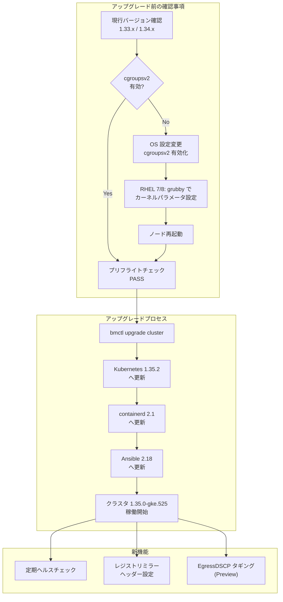

# Google Distributed Cloud (ベアメタル): バージョン 1.35.0 リリース

**リリース日**: 2026-05-06

**サービス**: Google Distributed Cloud (software only) for bare metal

**機能**: バージョン 1.35.0-gke.525 リリース (Kubernetes 1.35 プラットフォームアップデート)

**ステータス**: Available (ダウンロード可能)

📊 [このアップデートのインフォグラフィックを見る](https://takech9203.github.io/google-cloud-news-summary/20260506-google-distributed-cloud-bare-metal-1-35-0.html)

## 概要

Google Distributed Cloud (software only) for bare metal 1.35.0-gke.525 がダウンロード可能になりました。本リリースは Kubernetes v1.35.2-gke.300 をベースとしており、プラットフォーム全体の大幅なアップデートを含みます。

最も重要な変更点として、本リリースから **cgroupsv2 が必須要件** となり、cgroupsv1 のサポートが完全に廃止されました。cgroupsv1 が検出された場合、プリフライトチェックによりクラスタの作成やアップグレードがブロックされます。特に RHEL 7 または 8 を使用している環境では、アップグレード前に手動で cgroupsv2 を有効化する必要があります。

その他、コンテナランタイムの containerd 2.1 へのアップグレード、Ansible 2.18 への更新、レジストリミラーの設定簡素化、定期ヘルスチェックの追加、EgressDSCP タギングのプレビューサポートなど、多数の機能強化が含まれています。

**アップデート前の課題**

- cgroupsv1 環境でも動作していたが、最新の Kubernetes 機能やリソース管理の制限があった
- containerd 2.0 では一部のコンテナイメージ互換性やパフォーマンスに制約があった
- レジストリミラーの設定がクラスタ構成ファイル内で分散しており、管理が煩雑だった
- Secret や ConfigMap のマウント不整合を自動検出する仕組みがなかった

**アップデート後の改善**

- cgroupsv2 への統一により、リソース管理の一貫性と最新カーネル機能の活用が可能に
- containerd 2.1 により、コンテナランタイムのパフォーマンスと安定性が向上
- レジストリミラーをクラスタ構成ファイルのヘッダーセクションで一元管理可能に
- 定期ヘルスチェックにより、Secret/ConfigMap のマウント不整合を 5 分以内に検出

## アーキテクチャ図



本図は 1.35.0 へのアップグレードフローと、cgroupsv2 の必須要件確認から新機能の利用開始までの流れを示しています。

## サービスアップデートの詳細

### 主要機能

1. **cgroupsv2 必須化 (Breaking Change)**
   - cgroupsv1 のサポートが完全に廃止され、cgroupsv2 が必須要件に
   - プリフライトチェックにより、cgroupsv1 が検出された場合はクラスタ作成・アップグレードが自動的にブロック
   - RHEL 7 または 8 (デフォルトで cgroupsv1) を使用している場合、アップグレード前に手動で OS を設定する必要あり

2. **Kubernetes 1.35 プラットフォームアップデート**
   - 基盤となる Kubernetes が v1.35.2-gke.300 に更新
   - 最新の Kubernetes API および機能が利用可能に

3. **containerd 2.1 へのアップグレード**
   - コンテナランタイムが containerd 2.0 から 2.1 に更新
   - パフォーマンス改善とセキュリティ強化を含む

4. **定期ヘルスチェック (Secret/ConfigMap マウント監視)**
   - GKE Pod 上の Secret および ConfigMap マウントの整合性を定期的にチェック
   - コンテンツの不一致が 5 分以上続いた場合にレポート
   - 古くなった (stale) マウントの早期検出が可能に

5. **Ansible 2.18 へのアップグレード**
   - Ansible バージョンが 2.18 に更新
   - ターゲットノードに Python 3.9 が必要
   - RHEL 8.10 以降が必要

6. **レジストリミラーのヘッダーセクション設定**
   - クラスタ構成ファイルのヘッダーセクションでレジストリミラーを設定可能に
   - 構成管理の簡素化

7. **EgressDSCP タギングサポート (Preview)**
   - Egress トラフィックに DSCP (Differentiated Services Code Point) タグを付与可能
   - ネットワーク QoS ポリシーの実装を支援

## 技術仕様

### バージョン情報

| 項目 | 詳細 |
|------|------|
| GDC バージョン | 1.35.0-gke.525 |
| Kubernetes バージョン | v1.35.2-gke.300 |
| containerd バージョン | 2.1 |
| Ansible バージョン | 2.18 |
| 必須 Python バージョン | 3.9 (ターゲットノード) |
| cgroup 要件 | cgroupsv2 必須 (v1 非サポート) |

### cgroupsv2 有効化 (RHEL 7/8)

```bash
# RHEL 8 での cgroupsv2 有効化
sudo grubby --update-kernel=ALL --args="systemd.unified_cgroup_hierarchy=1"

# ノードを再起動
sudo reboot

# cgroupsv2 が有効化されたことを確認
# /sys/fs/cgroup/cgroup.controllers が存在すれば cgroupsv2
ls /sys/fs/cgroup/cgroup.controllers
```

## 設定方法

### 前提条件

1. 現行クラスタが 1.33.x または 1.34.x であること (バージョンスキュールールに準拠)
2. 全ノードで cgroupsv2 が有効であること
3. ターゲットノードに Python 3.9 がインストールされていること
4. RHEL 使用時は 8.10 以降であること
5. サードパーティストレージベンダー使用時は、1.35.0 の認定済みパートナーを確認

### 手順

#### ステップ 1: cgroupsv2 の確認と有効化

```bash
# cgroupsv2 が有効か確認
if [ -f /sys/fs/cgroup/cgroup.controllers ]; then
    echo "cgroupsv2 is enabled"
else
    echo "cgroupsv1 detected - must enable cgroupsv2 before upgrade"
fi
```

RHEL 7/8 の場合は前述のカーネルパラメータ設定とノード再起動が必要です。

#### ステップ 2: クラスタのアップグレード

```bash
# アップグレードの実行
bmctl upgrade cluster -c CLUSTER_NAME --kubeconfig ADMIN_KUBECONFIG
```

リリース後、GKE On-Prem API クライアント (Google Cloud コンソール、gcloud CLI、Terraform) で利用可能になるまで約 7~14 日かかります。

## メリット

### ビジネス面

- **運用の安定性向上**: 定期ヘルスチェックにより、マウント不整合を早期に検出し、サービス影響を最小化
- **ネットワーク QoS 管理**: EgressDSCP タギングにより、アプリケーショントラフィックの優先度制御が可能に

### 技術面

- **最新プラットフォーム基盤**: Kubernetes 1.35 と containerd 2.1 による最新機能とパフォーマンス向上
- **一貫したリソース管理**: cgroupsv2 統一により、リソース制御の予測可能性が向上
- **構成管理の簡素化**: レジストリミラーのヘッダーセクション設定により、クラスタ構成がシンプルに

## デメリット・制約事項

### 制限事項

- cgroupsv1 環境ではクラスタ作成・アップグレードが不可 (Breaking Change)
- RHEL 7/8 使用環境では、アップグレード前に手動での OS 設定変更と再起動が必要
- Ansible 2.18 により Python 3.9 が必須となり、古い OS バージョンでは対応不可
- RHEL 8.10 未満のバージョンはサポート対象外に

### 考慮すべき点

- cgroupsv2 への移行に伴い、既存のモニタリングツールや cgroup ベースのカスタムスクリプトの動作確認が必要
- containerd 2.1 へのアップグレードにより、一部のコンテナイメージや設定の互換性を事前に検証する必要がある
- サードパーティストレージベンダーが 1.35.0 の認定を完了しているか事前確認が必要
- リリース後 7~14 日で GKE On-Prem API クライアント経由の操作が可能になる点に注意

## ユースケース

### ユースケース 1: RHEL 環境のアップグレード

**シナリオ**: RHEL 8.6 で稼働中のオンプレミスクラスタを 1.35.0 にアップグレードしたい

**実装例**:
```bash
# 1. RHEL バージョンを 8.10 以上にアップデート
sudo dnf update

# 2. cgroupsv2 を有効化
sudo grubby --update-kernel=ALL --args="systemd.unified_cgroup_hierarchy=1"
sudo reboot

# 3. Python 3.9 を確認
python3 --version

# 4. アップグレード実行
bmctl upgrade cluster -c my-cluster --kubeconfig admin-kubeconfig
```

**効果**: 最新の Kubernetes 1.35 機能と containerd 2.1 のパフォーマンス向上を活用可能

### ユースケース 2: マウント不整合の早期検出

**シナリオ**: 本番環境で Secret ローテーション後に Pod のマウントが更新されないケースを検出したい

**効果**: 定期ヘルスチェックにより、Secret/ConfigMap の変更が Pod に反映されない状態を 5 分以内に自動検出し、運用チームに通知

## 関連サービス・機能

- **GKE Enterprise**: Google Distributed Cloud は GKE Enterprise の一部として提供されるオンプレミス/エッジ向け Kubernetes プラットフォーム
- **Anthos Config Management**: クラスタ構成のポリシー管理と一貫性の確保に使用
- **Connect Gateway**: リモートクラスタへの安全なアクセスを提供
- **GKE On-Prem API**: Google Cloud コンソール、gcloud CLI、Terraform によるクラスタライフサイクル管理

## 参考リンク

- 📊 [インフォグラフィック](https://takech9203.github.io/google-cloud-news-summary/20260506-google-distributed-cloud-bare-metal-1-35-0.html)
- [公式リリースノート](https://docs.cloud.google.com/release-notes#May_06_2026)
- [クラスタのアップグレード手順](https://docs.cloud.google.com/kubernetes-engine/distributed-cloud/bare-metal/docs/how-to/upgrade)
- [ダウンロードページ](https://docs.cloud.google.com/kubernetes-engine/distributed-cloud/bare-metal/docs/downloads)
- [認定ストレージパートナー](https://docs.cloud.google.com/anthos/docs/resources/partner-storage)
- [既知の問題](https://docs.cloud.google.com/kubernetes-engine/distributed-cloud/bare-metal/docs/troubleshooting/known-issues)

## まとめ

Google Distributed Cloud for bare metal 1.35.0 は、cgroupsv2 必須化という重要な Breaking Change を含むメジャーアップデートです。RHEL 7/8 環境では事前の OS 設定変更が不可欠であり、アップグレード計画時に十分なテストと準備期間を確保することを強く推奨します。新機能の定期ヘルスチェックや EgressDSCP タギングは運用の安定性とネットワーク管理の柔軟性を向上させる重要な追加です。

---

**タグ**: #GoogleDistributedCloud #GDC #BareMetaI #Kubernetes #cgroupsv2 #containerd #OnPremise #EdgeComputing #GKEEnterprise
