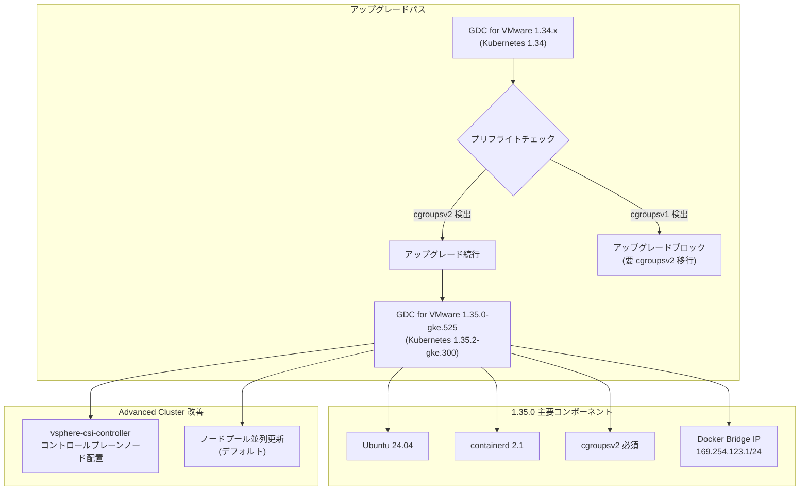

# Google Distributed Cloud (software only) for VMware: バージョン 1.35.0 リリース

**リリース日**: 2026-05-06

**サービス**: Google Distributed Cloud (software only) for VMware

**機能**: バージョン 1.35.0-gke.525 メジャーアップデート

**ステータス**: 一般提供開始 (GA)

📊 [このアップデートのインフォグラフィックを見る](https://takech9203.github.io/google-cloud-news-summary/20260506-google-distributed-cloud-vmware-1-35-0.html)

## 概要

Google Distributed Cloud (software only) for VMware 1.35.0-gke.525 がダウンロード可能になりました。本リリースは Kubernetes 1.35 への大規模プラットフォームアップデートを含み、コンテナランタイム、OS イメージ、cgroups の要件に関する複数の破壊的変更を伴います。

最も重要な変更点として、cgroupsv2 が必須要件となり、cgroupsv1 のサポートが完全に廃止されました。プリフライトチェックにより cgroupsv1 が検出された場合、クラスタの作成やアップグレードが自動的にブロックされます。これにより、環境の事前確認が不可欠となっています。

本リリースは既存の Advanced Cluster ユーザーおよび VMware 上で GKE をオンプレミス運用している組織を対象としており、特に Ubuntu 24.04 への移行、containerd 2.1 へのアップグレード、レガシー OS イメージタイプの廃止など、基盤レベルの刷新が含まれます。

**アップデート前の課題**

- cgroupsv1 環境がまだサポートされており、レガシー環境での運用が継続されていた
- レガシー OS イメージタイプ (ubuntu, ubuntu_containerd, cos) がまだ利用可能だった
- Docker ブリッジ IP のデフォルト (172.17.0/16) が顧客ネットワークと競合する可能性があった
- vsphere-csi-controller がワーカーノードにデプロイされており、リソース利用の最適化ができていなかった
- ノードプールの更新ポリシーがシーケンシャルであり、大規模クラスタのアップデートに時間がかかっていた

**アップデート後の改善**

- cgroupsv2 への完全移行により、最新のリソース管理機能を活用可能に
- Ubuntu 24.04 と containerd 2.1 による最新のセキュリティパッチと安定性の確保
- Docker ブリッジ IP が 169.254.123.1/24 に変更され、ネットワーク競合リスクが大幅に低減
- vsphere-csi-controller がコントロールプレーンノードにデプロイされ、ワーカーノードのリソースを節約
- Advanced Cluster のノードプール更新がデフォルトで並列実行に変更され、アップグレード時間を短縮

## アーキテクチャ図



本図はバージョン 1.34.x から 1.35.0 へのアップグレードフロー、プリフライトチェックによる cgroupsv2 検証、および新バージョンの主要コンポーネント構成を示しています。

## サービスアップデートの詳細

### 主要機能

1. **Kubernetes 1.35 プラットフォームアップデート**
   - Kubernetes v1.35.2-gke.300 をベースとして動作
   - 最新の Kubernetes API および機能を利用可能

2. **cgroupsv2 必須化 (破壊的変更)**
   - cgroupsv1 のサポートが完全に廃止
   - クラスタ作成およびアップグレード時にプリフライトチェックが実行される
   - cgroupsv1 が検出された場合、オペレーションが自動的にブロックされる
   - 事前に全ノードの cgroups バージョンを確認し、移行が必要

3. **コンテナランタイムアップグレード**
   - containerd がバージョン 2.0 から 2.1 にアップグレード
   - Ubuntu イメージが全ノードタイプで 24.04 に統一

4. **レガシー OS イメージタイプの廃止**
   - `ubuntu`、`ubuntu_containerd`、`cos` の OSImageType オプションがサポート対象外に
   - これらを使用しているクラスタはアップグレード前に設定変更が必要

5. **Advanced Cluster 向けの改善**
   - デフォルトのノードプール更新ポリシーがシーケンシャルから並列に変更
   - Docker ブリッジ IP がデフォルトで 169.254.123.1/24 に変更 (旧: 172.17.0/16)
   - vsphere-csi-controller がコントロールプレーンノードにデプロイされるように変更

6. **オペレーション改善**
   - gkectl がクラスタ操作後に Operation ID と Operation Type をコンソールに出力
   - トラブルシューティングや監査ログとの連携が容易に

### 主要な修正

1. **VMware クラスタアップグレードの修正**
   - 非 Advanced から Advanced へのアップグレードがスタックする問題を修正

2. **gke-nodepool ラベルの修正**
   - 予期しない `-np` サフィックスが付加される問題を修正

3. **stackdriver.enableVPC の修正**
   - 非推奨フィールドがアップグレードをブロックする問題を修正

4. **node-problem-detector の修正**
   - 非 Advanced クラスタに誤ってデプロイされる問題を修正

5. **プロキシ設定の修正**
   - ホワイトスペースの問題でクラスタ作成が失敗する問題を修正

6. **gkectl upgrade admin リトライの修正**
   - 失敗後の再実行で AlreadyExists エラーが発生する問題を修正

7. **レジストリミラー CA 証明書の修正**
   - システム証明書プールが無視される問題を修正

8. **vSphere VM 作成のタイムアウト追加**
   - VM 作成が無期限にハングする問題に対し、1 時間のタイムアウトを追加

9. **OIDC ログインの修正**
   - Advanced Cluster へのアップグレード後に OIDC ログインが失敗する問題を修正

## 技術仕様

### バージョン情報

| 項目 | 詳細 |
|------|------|
| GDC バージョン | 1.35.0-gke.525 |
| Kubernetes バージョン | v1.35.2-gke.300 |
| containerd バージョン | 2.1 |
| Ubuntu バージョン | 24.04 |
| cgroups 要件 | cgroupsv2 必須 |
| Docker ブリッジ IP (Advanced) | 169.254.123.1/24 |

### 廃止された OS イメージタイプ

| OS イメージタイプ | ステータス |
|------------------|-----------|
| `ubuntu` | サポート廃止 |
| `ubuntu_containerd` | サポート廃止 |
| `cos` | サポート廃止 |

## 設定方法

### 前提条件

1. 全ノードが cgroupsv2 で動作していること
2. レガシー OS イメージタイプ (ubuntu, ubuntu_containerd, cos) を使用していないこと
3. GDC for VMware 1.34.x が稼働していること

### 手順

#### ステップ 1: cgroupsv2 の確認

```bash
# 各ノードで cgroups バージョンを確認
stat -fc %T /sys/fs/cgroup/
# "cgroup2fs" と表示されれば cgroupsv2
```

cgroupsv1 の場合はノードの OS を更新し、cgroupsv2 を有効にしてください。

#### ステップ 2: クラスタのアップグレード

```bash
# アップグレードの実行
gkectl upgrade cluster \
  --kubeconfig [ADMIN_CLUSTER_KUBECONFIG] \
  --config [USER_CLUSTER_CONFIG]
```

アップグレード時にプリフライトチェックが自動的に実行され、cgroupsv1 が検出された場合はオペレーションがブロックされます。

## メリット

### ビジネス面

- **運用効率の向上**: ノードプールの並列更新により、大規模クラスタのアップグレード時間を大幅に短縮
- **安定性の向上**: 多数のバグ修正により、アップグレード失敗のリスクを低減

### 技術面

- **最新プラットフォーム基盤**: Kubernetes 1.35、Ubuntu 24.04、containerd 2.1 による最新のセキュリティとパフォーマンス
- **ネットワーク競合の排除**: Docker ブリッジ IP のリンクローカルアドレスへの変更により、企業ネットワークとの競合リスクを排除
- **リソース効率**: vsphere-csi-controller のコントロールプレーン移動により、ワーカーノードのリソースを解放
- **デバッグ容易性**: gkectl の Operation ID/Type 出力により、問題発生時の追跡が容易に

## デメリット・制約事項

### 制限事項

- cgroupsv1 環境ではアップグレード不可 (プリフライトチェックによるブロック)
- レガシー OS イメージタイプを使用しているクラスタは事前に設定変更が必要
- Docker ブリッジ IP の変更が既存のワークロードに影響を与える可能性がある (Advanced Cluster のみ)

### 考慮すべき点

- cgroupsv2 への移行は一部のワークロード (特に古いコンテナイメージ) に互換性の問題を引き起こす可能性がある
- containerd 2.0 から 2.1 へのアップグレードに伴い、コンテナランタイムの設定ファイル形式に変更がある可能性がある
- リリース後、GKE On-Prem API クライアント (Google Cloud Console、gcloud CLI、Terraform) で利用可能になるまで約 7-14 日かかる

## ユースケース

### ユースケース 1: 大規模オンプレミス環境のモダナイゼーション

**シナリオ**: 数十台のノードを持つ VMware 上の GDC クラスタを運用しており、OS とランタイムの最新化が必要な環境。

**効果**: Ubuntu 24.04 と containerd 2.1 への自動移行により、セキュリティパッチの適用範囲が広がり、最新の CVE に対する保護が強化される。

### ユースケース 2: ネットワーク競合の解消

**シナリオ**: 企業ネットワークで 172.17.0.0/16 帯を使用しており、Docker ブリッジ IP との競合でクラスタ作成や運用に問題が発生していた環境。

**効果**: デフォルト Docker ブリッジ IP が 169.254.123.1/24 (リンクローカル) に変更されたことで、企業ネットワーク帯との競合が解消され、ネットワーク設計の制約が緩和される。

## 関連サービス・機能

- **GKE Enterprise**: GDC for VMware は GKE Enterprise の一部として提供されるオンプレミス Kubernetes ソリューション
- **vSphere CSI Driver**: ストレージプロビジョニングのためのコントロールプレーン統合が改善
- **Anthos Config Management**: Advanced Cluster でのポリシー管理と構成同期

## 参考リンク

- 📊 [インフォグラフィック](https://takech9203.github.io/google-cloud-news-summary/20260506-google-distributed-cloud-vmware-1-35-0.html)
- [公式リリースノート](https://docs.cloud.google.com/release-notes#May_06_2026)
- [クラスタのアップグレード手順](https://docs.cloud.google.com/kubernetes-engine/distributed-cloud/vmware/docs/how-to/upgrading)
- [脆弱性修正一覧](https://docs.cloud.google.com/kubernetes-engine/distributed-cloud/vmware/docs/vulnerabilities)

## まとめ

Google Distributed Cloud for VMware 1.35.0 は、cgroupsv2 必須化を筆頭に、OS イメージ、コンテナランタイム、ネットワーク設定において基盤レベルの大規模な刷新を含むメジャーリリースです。アップグレードを計画する際は、まず全ノードの cgroupsv2 対応状況を確認し、レガシー OS イメージタイプからの移行を完了させることが最優先です。多数のバグ修正と運用改善も含まれており、安定したオンプレミス Kubernetes 環境の維持に不可欠なアップデートです。

---

**タグ**: #GoogleDistributedCloud #VMware #Kubernetes #cgroupsv2 #containerd #Ubuntu #OnPremises #GKE #AdvancedCluster #Upgrade
