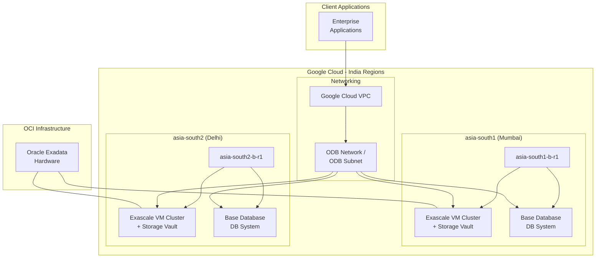

# Oracle Database@Google Cloud: インドリージョン (ムンバイ・デリー) の Exascale / Base Database Service 対応

**リリース日**: 2026-05-06

**サービス**: Oracle Database@Google Cloud

**機能**: Exadata Database Service on Exascale Infrastructure および Base Database Service のインドリージョン対応

**ステータス**: GA (一般提供)

📊 [このアップデートのインフォグラフィックを見る](https://takech9203.github.io/google-cloud-news-summary/20260506-oracle-database-google-cloud-india-regions.html)

## 概要

Oracle Database@Google Cloud の Exadata Database Service on Exascale Infrastructure および Base Database Service が、インドの 2 つのリージョン (ムンバイおよびデリー) で利用可能になりました。具体的には、asia-south1-b-r1 (ムンバイ) と asia-south2-b-r1 (デリー) のゾーンが新たにサポートされます。

Oracle Database@Google Cloud は、Google Cloud のデータセンター内で Oracle Cloud Infrastructure (OCI) の Exadata ハードウェア上に Oracle Database サービスを展開するパートナーシップサービスです。今回のインドリージョン拡張により、インド国内のデータレジデンシー要件を持つ企業が、低レイテンシで Oracle Database ワークロードを実行できるようになります。

これまで Exascale Infrastructure と Base Database Service はインドリージョンでは利用できませんでしたが、今回の対応により、インド市場でのエンタープライズデータベースワークロードの選択肢が大幅に広がりました。

**アップデート前の課題**

- Exadata Database Service on Exascale Infrastructure をインドリージョンで利用できず、Exascale の柔軟なスケーリング機能をインド国内で活用できなかった
- Base Database Service がインドリージョンで提供されていなかったため、シンプルな Oracle Database ワークロードでも他のリージョンを選択する必要があった
- インドのデータレジデンシー要件を持つ企業は、これらのサービスタイプでの Oracle Database@Google Cloud 利用が制限されていた

**アップデート後の改善**

- ムンバイ (asia-south1-b-r1) とデリー (asia-south2-b-r1) で Exascale Infrastructure が利用可能になり、即時かつゼロダウンタイムでのストレージ拡張が可能に
- Base Database Service がインド 2 リージョンで利用可能になり、DB システムを Google Cloud コンソールから直接プロビジョニング可能に
- インド国内でのデータレジデンシー要件を満たしつつ、Google Cloud と Oracle Database の統合メリットを享受可能に

## アーキテクチャ図

この図は、インドの 2 リージョン (ムンバイ・デリー) における Oracle Database@Google Cloud のデプロイメント構成を示しています。Google Cloud VPC から ODB Network を経由して、各ゾーンの Exascale VM Cluster および Base Database DB System に接続します。

## サービスアップデートの詳細

### 主要機能

1. **Exadata Database Service on Exascale Infrastructure (インドリージョン)**
   - Exascale VM Cluster と Exascale Storage Vault をムンバイ・デリーで作成可能
   - 即時かつゼロダウンタイムでのストレージ拡張を実現
   - VM あたり 8~200 ECPU (4 の倍数) でスケーリング可能
   - クラスタあたり最大 10 VM をサポート

2. **Base Database Service (インドリージョン)**
   - DB システムをムンバイ・デリーで作成・管理可能
   - Google Cloud コンソール、gcloud CLI、API からプロビジョニング
   - ODB Network 経由で Google Cloud VPC と接続

3. **既存の Exadata Database Service との補完**
   - ムンバイでは 2025 年 11 月から Exadata Database Service が利用可能
   - 今回の拡張により、同リージョンで Exascale と Base DB も利用可能になり、完全なサービスラインナップが揃う

## 技術仕様

### 対応リージョン・ゾーン

| サービスタイプ | リージョン | ゾーン | 場所 |
|------|------|------|------|
| Exadata Database Service on Exascale Infrastructure | asia-south1 | asia-south1-b-r1 | ムンバイ, インド |
| Exadata Database Service on Exascale Infrastructure | asia-south2 | asia-south2-b-r1 | デリー, インド |
| Base Database Service | asia-south1 | asia-south1-b-r1 | ムンバイ, インド |
| Base Database Service | asia-south2 | asia-south2-b-r1 | デリー, インド |

### Exascale VM Cluster の主要仕様

| 項目 | 詳細 |
|------|------|
| VM 数 (最大) | 10 VM / クラスタ |
| Enabled ECPU / VM | 8~200 (4 の倍数) |
| Reserved ECPU / VM | 0~192 (4 の倍数) |
| VM ファイルシステムストレージ (Smart Storage) | 220~1,100 GiB / VM |
| VM ファイルシステムストレージ (Block Storage) | 260~1,100 GiB / VM |
| Exascale Storage Vault 容量 | 300~100,000 GiB |
| ライセンスタイプ | License Included / BYOL |

### 必要な IAM ロール

| ロール | 用途 |
|------|------|
| `roles/oracledatabase.exadbVmClusterAdmin` | Exascale VM Cluster の作成・管理 |
| `roles/oracledatabase.exascaleDbStorageVaultAdmin` | Exascale Storage Vault の作成・管理 |

## 設定方法

### 前提条件

1. Oracle Database@Google Cloud のマーケットプレイス注文が有効であること
2. Oracle Database@Google Cloud API がプロジェクトで有効化されていること
3. ODB Network と ODB Subnet が対象リージョン・ゾーンに作成済みであること
4. 必要な IAM ロールが付与されていること

### 手順

#### ステップ 1: ODB Network の作成

対象ゾーン (asia-south1-b-r1 または asia-south2-b-r1) に ODB Network と ODB Subnet を作成します。ODB Network は Google Cloud VPC と Oracle Database@Google Cloud リソースを接続するために必要です。

#### ステップ 2: Exascale VM Cluster の作成 (Exascale Infrastructure の場合)

Google Cloud コンソールで以下の手順を実行します:

1. Exadata Database Service > Exascale Infrastructure ページに移動
2. VM Clusters タブで「Create」をクリック
3. リージョン: asia-south1 または asia-south2 を選択
4. ゾーン: asia-south1-b-r1 または asia-south2-b-r1 を選択
5. VM 数、ECPU、ストレージ容量を設定
6. Exascale Storage Vault を選択または新規作成

#### ステップ 3: DB System の作成 (Base Database Service の場合)

Google Cloud コンソール、gcloud CLI、または API を使用して、対象ゾーンに DB System を作成します。DB System には単一のクライアントサブネットが必要です。

## メリット

### ビジネス面

- **データレジデンシー準拠**: インド国内にデータを保持する規制要件を満たしつつ、Oracle Database のフルマネージドサービスを利用可能
- **レイテンシの削減**: インド国内のユーザーやアプリケーションからのアクセスが低レイテンシで実現
- **コスト最適化**: Base Database Service によるシンプルなワークロード向けの低コストオプションがインドで利用可能に

### 技術面

- **柔軟なスケーリング**: Exascale Infrastructure によるゼロダウンタイムでのストレージ拡張
- **Google Cloud 統合**: IAM、VPC、Cloud Monitoring など Google Cloud のネイティブサービスとの統合
- **マルチリージョン構成**: ムンバイとデリーの 2 リージョンで DR / HA 構成が可能

## デメリット・制約事項

### 制限事項

- Exascale VM Cluster と ODB Network は同一リージョン・ゾーンに配置する必要がある
- リージョン・ゾーンの選択は作成後に変更不可
- Exascale VM Cluster あたりの VM 数は最大 10 台
- Autonomous AI Database Service のインドリージョン対応は既に提供済み (別途リリース)

### 考慮すべき点

- Oracle Database@Google Cloud の利用にはマーケットプレイスでの注文が必要
- OCI 側のリソース管理は一部 OCI コンソールで行う必要がある
- ライセンス形態 (License Included / BYOL) の選択がコストに大きく影響

## ユースケース

### ユースケース 1: インド国内のデータレジデンシー要件への対応

**シナリオ**: インドの金融機関が規制要件により顧客データをインド国内に保持する必要があり、かつ Oracle Database のエンタープライズ機能を活用したい場合。

**効果**: ムンバイまたはデリーリージョンで Exascale Infrastructure を利用することで、データ主権要件を満たしつつ、高性能な Oracle Database 環境を Google Cloud 上で運用できる。

### ユースケース 2: インド市場向けアプリケーションの低レイテンシデプロイ

**シナリオ**: グローバル企業がインド市場向けの ERP や CRM アプリケーションを Oracle Database バックエンドで運用しており、エンドユーザーへの応答速度を改善したい場合。

**効果**: Base Database Service をインドリージョンにデプロイすることで、アプリケーションとデータベース間のネットワークレイテンシを大幅に削減し、ユーザーエクスペリエンスを向上させる。

### ユースケース 3: ムンバイ・デリー間の DR 構成

**シナリオ**: ミッションクリティカルな Oracle Database ワークロードに対して、インド国内で地理的に分散した災害復旧 (DR) 構成を構築したい場合。

**効果**: ムンバイをプライマリ、デリーをセカンダリとする DR 構成により、インド国内でのビジネス継続性を確保できる。

## 利用可能リージョン

今回追加されたリージョン:

| リージョン | ゾーン | 場所 | 対応サービス |
|------|------|------|------|
| asia-south1 | asia-south1-b-r1 | ムンバイ, インド | Exascale Infrastructure, Base Database Service |
| asia-south2 | asia-south2-b-r1 | デリー, インド | Exascale Infrastructure, Base Database Service |

参考: ムンバイ (asia-south1) では Exadata Database Service が 2025 年 11 月から既に利用可能です。

## 関連サービス・機能

- **Exadata Database Service**: 専用 Exadata ハードウェア上での Oracle Database 運用 (ムンバイ・デリーで既に対応済み)
- **Autonomous AI Database Service**: 自律型データベースサービス (ムンバイ・デリーで既に対応済み)
- **ODB Network**: Google Cloud VPC と Oracle Database@Google Cloud リソースを接続するネットワーク機能
- **Cloud Key Management Service (CMEK)**: 顧客管理暗号鍵による Exadata VM Cluster の暗号化

## 参考リンク

- 📊 [インフォグラフィック](https://takech9203.github.io/google-cloud-news-summary/20260506-oracle-database-google-cloud-india-regions.html)
- [公式リリースノート](https://docs.cloud.google.com/release-notes#May_06_2026)
- [サポートされるリージョンとゾーン](https://docs.cloud.google.com/oracle/database/docs/regions-and-zones)
- [Oracle Database@Google Cloud 概要](https://docs.cloud.google.com/oracle/database/docs/overview)
- [Exascale VM Cluster の作成](https://docs.cloud.google.com/oracle/database/docs/create-exascale-clusters)
- [Base Database Service (DB System) の作成](https://docs.cloud.google.com/oracle/database/docs/create-base-db-system)

## まとめ

Oracle Database@Google Cloud の Exadata Database Service on Exascale Infrastructure と Base Database Service がインドのムンバイ・デリーリージョンに拡張されたことで、インド市場でのエンタープライズ Oracle Database ワークロードの展開がより柔軟になりました。インド国内でのデータレジデンシー要件を持つ企業は、これらのサービスを活用して低レイテンシかつ高性能な Oracle Database 環境を Google Cloud 上で構築できます。インドリージョンでの Oracle Database@Google Cloud 利用を検討している場合は、マーケットプレイスでの注文手続きと ODB Network の事前設定を開始することを推奨します。

---

**タグ**: #OracleDatabase #GoogleCloud #ExascaleInfrastructure #BaseDatabaseService #India #Mumbai #Delhi #RegionExpansion #Exadata
