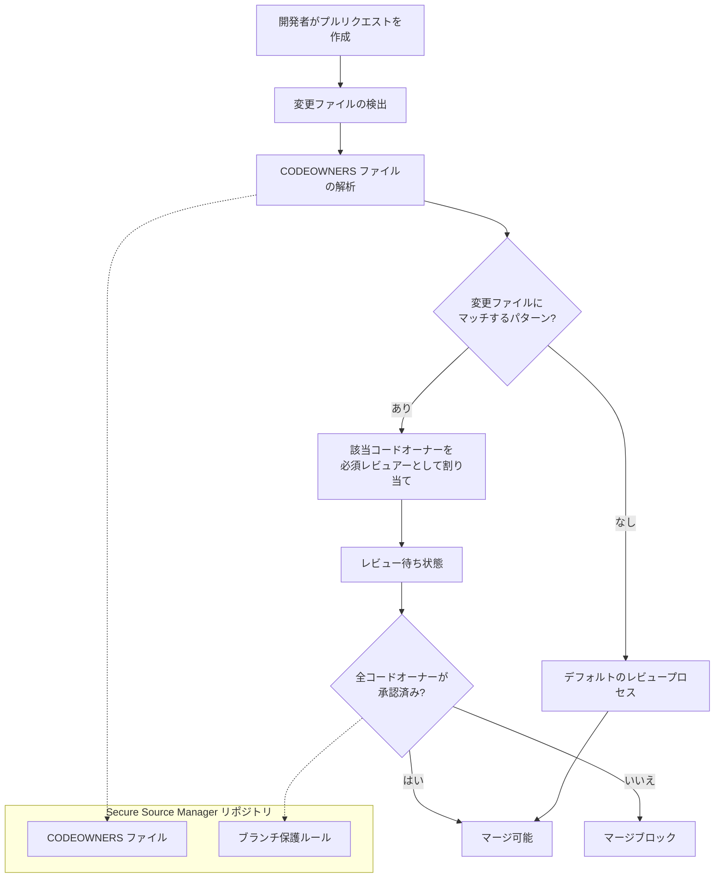

# Secure Source Manager: CODEOWNERS ファイルによるプルリクエスト必須レビュアー定義

**リリース日**: 2026-05-06

**サービス**: Secure Source Manager

**機能**: CODEOWNERS ファイルサポート

**ステータス**: GA (一般提供)

[このアップデートのインフォグラフィックを見る](https://takech9203.github.io/google-cloud-news-summary/20260506-secure-source-manager-codeowners.html)

## 概要

Secure Source Manager に CODEOWNERS ファイルのサポートが追加されました。この機能により、リポジトリ内のファイルやディレクトリごとに、プルリクエストの必須レビュアーを宣言的に定義できるようになります。

CODEOWNERS ファイルは、コードベースの各部分に対して責任を持つチームや個人を明示的に指定するための設定ファイルです。プルリクエストが作成されると、変更されたファイルに対応するコードオーナーが自動的にレビュアーとして割り当てられ、適切な担当者によるレビューが確実に行われるようになります。

この機能は、大規模な開発チームや複数のコンポーネントを持つリポジトリにおいて、コードレビュープロセスの自動化とガバナンス強化を実現します。既存のブランチ保護ルールと組み合わせることで、より精緻なアクセス制御とレビュー体制を構築できます。

**アップデート前の課題**

- プルリクエスト作成時に手動でレビュアーを選択する必要があり、適切な担当者が割り当てられないケースがあった
- ファイルやディレクトリ単位での自動レビュアー割り当てができず、ブランチ保護ルールでは全体的なレビュー人数のみ制御可能だった
- コードの所有権が暗黙的であり、どのチームがどの部分に責任を持つか明文化されていなかった

**アップデート後の改善**

- CODEOWNERS ファイルにより、ファイルパターンごとに必須レビュアーを宣言的に定義可能になった
- プルリクエスト作成時に変更対象のコードオーナーが自動的にレビュアーとして割り当てられるようになった
- コードの所有権がリポジトリ内で明文化され、チーム間の責任範囲が明確になった

## アーキテクチャ図



CODEOWNERS ファイルに基づいて、プルリクエストの変更対象ファイルから必須レビュアーを自動的に特定し、全コードオーナーの承認が得られるまでマージをブロックするワークフローを示しています。

## サービスアップデートの詳細

### 主要機能

1. **CODEOWNERS ファイルによる所有権定義**
   - リポジトリのルートまたは特定ディレクトリに CODEOWNERS ファイルを配置
   - グロブパターンを使用してファイルやディレクトリを指定
   - ユーザーまたはチーム単位でコードオーナーを割り当て

2. **プルリクエストへの自動レビュアー割り当て**
   - プルリクエスト作成時に変更ファイルを解析
   - CODEOWNERS の定義に基づいて該当するオーナーを自動的にレビュアーとして追加
   - 複数のパターンにマッチする場合、すべての該当オーナーが割り当てられる

3. **ブランチ保護ルールとの連携**
   - 既存のブランチ保護ルール (必須レビュー人数、承認者要件) と併用可能
   - CODEOWNERS による必須レビュアーの承認がマージ条件に追加される
   - ステイルレビューブロックなど既存の保護機能とも統合

## 技術仕様

### CODEOWNERS ファイル形式

| 項目 | 詳細 |
|------|------|
| ファイル名 | `CODEOWNERS` |
| 配置場所 | リポジトリルート、`.securesourcemanager/` ディレクトリ |
| パターン構文 | グロブパターン (例: `*.go`, `docs/**`, `src/api/`) |
| オーナー指定 | ユーザーメールアドレスまたはチーム名 |

### CODEOWNERS ファイルの記述例

```text
# デフォルトオーナー (全ファイル)
* @platform-team

# Go ソースファイル
*.go @backend-team

# ドキュメント
docs/** @docs-team

# インフラ設定
terraform/** @infra-team @security-team

# API 定義
api/v1/** @api-team @backend-team
```

## 設定方法

### 前提条件

1. Secure Source Manager インスタンスが作成済みであること
2. リポジトリに対して Repo Admin ロール (`roles/securesourcemanager.repoAdmin`) を持つこと
3. ブランチ保護ルールが設定済みであること (推奨)

### 手順

#### ステップ 1: CODEOWNERS ファイルの作成

```text
# CODEOWNERS ファイルをリポジトリルートに作成
# 各行は「パターン オーナー」の形式

# デフォルトオーナー
* @default-reviewers

# バックエンドコード
src/backend/** @backend-team

# フロントエンドコード
src/frontend/** @frontend-team

# セキュリティ関連ファイル
*.policy @security-team
```

リポジトリのルートディレクトリに `CODEOWNERS` ファイルを作成し、ファイルパターンとオーナーのマッピングを記述します。

#### ステップ 2: ブランチ保護ルールとの組み合わせ

Secure Source Manager の Web インターフェースからブランチ保護ルールを設定し、CODEOWNERS による必須レビューを有効化します。

1. リポジトリの Settings を開く
2. Branch rule タブで対象ブランチのルールを編集
3. 「Require a pull request before merging」を有効化
4. 必須レビュアー数と承認者数を設定

## メリット

### ビジネス面

- **コードレビューの品質向上**: 各コード領域の専門家が自動的にレビュアーに割り当てられることで、レビューの質が向上する
- **コンプライアンス強化**: コード変更に対する承認プロセスが自動化・文書化され、監査対応が容易になる
- **チーム間コラボレーションの改善**: コードの所有権が明確になり、責任範囲が可視化される

### 技術面

- **レビュープロセスの自動化**: 手動でのレビュアー選択が不要になり、開発者の負担が軽減される
- **ソフトウェアサプライチェーンセキュリティの強化**: 重要なコード変更が適切な権限を持つレビュアーなしにマージされることを防止
- **宣言的な設定管理**: CODEOWNERS ファイル自体がバージョン管理され、変更履歴を追跡可能

## デメリット・制約事項

### 制限事項

- CODEOWNERS に指定されたユーザーが退職やチーム異動した場合、ファイルの更新を忘れるとレビュープロセスがブロックされる可能性がある
- 大規模リポジトリでは CODEOWNERS ファイルの管理自体が複雑になる場合がある

### 考慮すべき点

- CODEOWNERS ファイルの変更自体もレビュー対象とすることを推奨 (CODEOWNERS ファイル自体のオーナーを設定)
- 既存のブランチ保護ルールとの相互作用を事前に確認する必要がある
- チームメンバーの変更に合わせて CODEOWNERS ファイルを定期的に見直すプロセスが必要

## ユースケース

### ユースケース 1: マイクロサービスリポジトリの管理

**シナリオ**: 複数のマイクロサービスを monorepo で管理しているチームで、各サービスの担当チームがそれぞれのコード変更をレビューする必要がある。

**実装例**:
```text
# CODEOWNERS
services/auth/** @auth-team
services/payment/** @payment-team
services/notification/** @notification-team
deploy/** @platform-team @sre-team
```

**効果**: 各サービスの変更が対応するチームの承認なしにマージされることを防ぎ、サービス間の意図しない影響を低減する。

### ユースケース 2: セキュリティクリティカルなコードの保護

**シナリオ**: 暗号化処理や認証ロジックなど、セキュリティ上重要なコードに対してセキュリティチームのレビューを必須にしたい。

**実装例**:
```text
# CODEOWNERS
**/crypto/** @security-team
**/auth/** @security-team @identity-team
*.policy @security-team
Dockerfile @security-team @platform-team
```

**効果**: セキュリティクリティカルなコードの変更に対してセキュリティ専門家のレビューが保証され、脆弱性の混入リスクを低減する。

## 関連サービス・機能

- **Secure Source Manager ブランチ保護**: CODEOWNERS と組み合わせてマージ条件を強化。必須レビュー人数や承認者要件と連携する
- **Cloud Build**: トリガーファイルとステータスチェックを組み合わせることで、コードレビューとビルド検証の両方を自動化
- **IAM (Identity and Access Management)**: レビュアーや承認者のロール (Repo Writer, Repo Admin, Pull Request Approver) を管理
- **VPC Service Controls**: Secure Source Manager インスタンスをサービス境界内に配置し、データ流出を防止

## 参考リンク

- [インフォグラフィック](https://takech9203.github.io/google-cloud-news-summary/20260506-secure-source-manager-codeowners.html)
- [公式リリースノート](https://docs.google.com/release-notes#May_06_2026)
- [CODEOWNERS ドキュメント](https://docs.cloud.google.com/secure-source-manager/docs/codeowners)
- [ブランチ保護の概要](https://docs.cloud.google.com/secure-source-manager/docs/branch-protection-overview)
- [ブランチ保護の設定](https://docs.cloud.google.com/secure-source-manager/docs/configure-branch-protection)
- [プルリクエストの操作](https://docs.cloud.google.com/secure-source-manager/docs/work-with-issues-pull-requests)
- [Secure Source Manager の概要](https://docs.cloud.google.com/secure-source-manager/docs/overview)

## まとめ

Secure Source Manager の CODEOWNERS ファイルサポートにより、コードレビュープロセスの自動化と組織的なコードガバナンスが大幅に強化されました。特に大規模チームや厳格なコンプライアンス要件を持つ組織にとって、コードの所有権を明文化し、適切なレビュアーによる承認を自動的に要求できることは重要な改善です。既存のブランチ保護ルールと組み合わせて活用することを推奨します。

---

**タグ**: #SecureSourceManager #CODEOWNERS #CodeReview #PullRequest #BranchProtection #ソフトウェアサプライチェーンセキュリティ #DevOps #GoogleCloud
