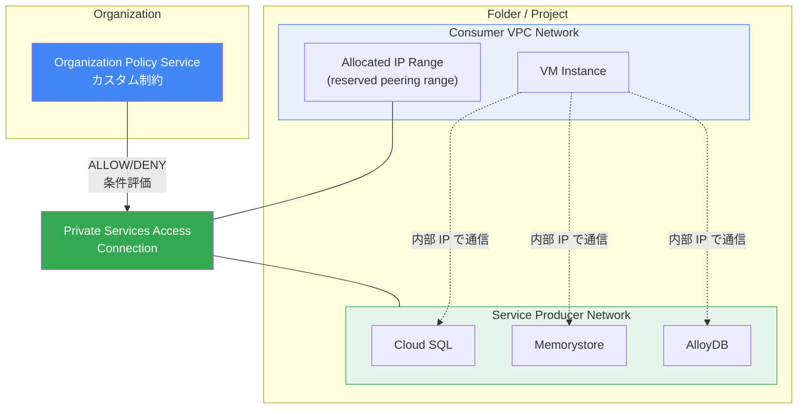

# Virtual Private Cloud (VPC): Organization Policy Service カスタム制約が Private Services Access 接続で GA

**リリース日**: 2026-05-06

**サービス**: Virtual Private Cloud (VPC)

**機能**: Organization Policy Service custom constraints GA for private services access connections

**ステータス**: General Availability (GA)

[このアップデートのインフォグラフィックを見る](https://takech9203.github.io/google-cloud-news-summary/20260506-vpc-org-policy-private-services-access-ga.html)

## 概要

Google Cloud の Organization Policy Service カスタム制約が、Private Services Access (PSA) 接続に対して General Availability (GA) となった。これにより、リソースタイプ `servicenetworking.googleapis.com/Connection` に対するカスタム制約を本番環境で完全にサポートされた状態で使用できるようになる。

Private Services Access は、VPC ネットワークとサービスプロデューサーのネットワーク間のプライベート接続を提供する機能であり、Cloud SQL、Memorystore、AlloyDB などのマネージドサービスへのプライベート接続に広く使用されている。今回の GA により、組織全体でこれらのプライベート接続に対するきめ細かいポリシー制御が可能になった。

対象ユーザーは、大規模な組織でネットワークセキュリティとガバナンスを管理するクラウドアーキテクト、ネットワーク管理者、セキュリティチームである。

**アップデート前の課題**

- Private Services Access 接続の作成や変更に対して、組織レベルでの細かい制御が困難だった
- 特定の VPC ネットワークのみでプライベート接続を許可するといったポリシーを組織全体に一括適用する手段が限られていた
- 割り当てられた IP レンジ名に基づいた接続制限をプログラム的に強制する方法がなかった
- カスタム制約は Preview 段階であり、本番環境での使用には SLA が保証されていなかった

**アップデート後の改善**

- `servicenetworking.googleapis.com/Connection` リソースに対するカスタム制約が GA となり、本番環境で完全サポートされる
- CEL (Common Expression Language) を使用して、接続に使用可能な VPC ネットワークや割り当てレンジ名に対する柔軟な条件を定義できる
- 組織、フォルダ、プロジェクトの各レベルでポリシーを適用でき、階層的なガバナンスが実現する
- CREATE および UPDATE メソッドの両方に制約を適用可能

## アーキテクチャ図



Organization Policy Service のカスタム制約が Private Services Access 接続の作成・更新時に CEL 条件を評価し、ポリシーに違反する接続を拒否する構成を示す。

## サービスアップデートの詳細

### 主要機能

1. **VPC ネットワークに基づく接続制限**
   - 特定の VPC ネットワークからのみプライベート接続を許可または拒否できる
   - `resource.network` フィールドを使用して条件を定義
   - 例: 特定のネットワークでのプライベート接続作成を禁止

2. **割り当てレンジ名に基づく制限**
   - `resource.reservedPeeringRanges` フィールドを使用して、使用可能な IP レンジ名を制御
   - 命名規則に基づいたレンジの許可・拒否が可能
   - 例: `legacy-` プレフィックスで始まるレンジ名の使用を禁止

3. **CREATE および UPDATE メソッドの制御**
   - 新規接続の作成時だけでなく、既存接続の変更時にもポリシーを適用
   - 違反する変更はブロックされるが、既存の接続には遡及適用されない

## 技術仕様

### サポートされるリソースフィールド

| フィールド | 説明 |
|------|------|
| `resource.network` | プライベート接続に使用される VPC ネットワーク |
| `resource.reservedPeeringRanges` | プライベート接続に割り当てられた IP レンジ名のリスト |

### カスタム制約の構成

```yaml
name: organizations/ORGANIZATION_ID/customConstraints/custom.servicenetworkingRestrictNetwork
resourceTypes:
  - servicenetworking.googleapis.com/Connection
methodTypes:
  - CREATE
  - UPDATE
condition: "resource.network == 'projects/PROJECT_ID/global/networks/VPC_NETWORK'"
actionType: DENY
displayName: Prevent private connections for a specific network.
description: Private connections can't be created for the specified VPC network.
```

### 必要な IAM ロール

| ロール | 説明 |
|------|------|
| `roles/orgpolicy.policyAdmin` | 組織ポリシーの作成・管理に必要 |

## 設定方法

### 前提条件

1. Organization Policy Administrator (`roles/orgpolicy.policyAdmin`) IAM ロールが付与されていること
2. 組織 ID を把握していること
3. gcloud CLI がインストール・認証済みであること

### 手順

#### ステップ 1: カスタム制約の YAML ファイルを作成

```yaml
# restrict-psa-network.yaml
name: organizations/ORGANIZATION_ID/customConstraints/custom.restrictPsaNetwork
resourceTypes:
  - servicenetworking.googleapis.com/Connection
methodTypes:
  - CREATE
  - UPDATE
condition: "resource.network == 'projects/PROJECT_ID/global/networks/RESTRICTED_NETWORK'"
actionType: DENY
displayName: Restrict private services access for specific network
description: Prevents private connections from being created for the restricted network.
```

#### ステップ 2: カスタム制約を設定

```bash
gcloud org-policies set-custom-constraint restrict-psa-network.yaml
```

#### ステップ 3: カスタム制約が作成されたことを確認

```bash
gcloud org-policies list-custom-constraints --organization=ORGANIZATION_ID
```

#### ステップ 4: 組織ポリシーを作成して適用

```yaml
# policy-restrict-psa-network.yaml
name: organizations/ORGANIZATION_ID/policies/custom.restrictPsaNetwork
spec:
  rules:
    - enforce: true
```

```bash
gcloud org-policies set-policy policy-restrict-psa-network.yaml
```

## メリット

### ビジネス面

- **コンプライアンス強化**: 組織全体でプライベート接続の使用を一元的に制御でき、規制要件への対応が容易になる
- **ガバナンスの一元化**: 個々のプロジェクトではなく組織レベルでポリシーを管理できるため、運用コストを削減

### 技術面

- **きめ細かい制御**: CEL を使用した柔軟な条件式により、ネットワーク名や IP レンジ名など複数の属性に基づいた制御が可能
- **階層的な適用**: 組織、フォルダ、プロジェクトの各レベルでの継承と上書きにより、例外処理も柔軟に対応
- **GA の信頼性**: SLA に裏付けられた本番環境での安定した動作が保証される

## デメリット・制約事項

### 制限事項

- カスタム制約は既存の接続に対して遡及的には適用されない（新規作成・更新時のみ評価）
- リソースタイプごとに最大 20 個のカスタム制約という上限がある
- ポリシー適用後、Google Cloud が enforcement を開始するまで約 2 分の遅延がある

### 考慮すべき点

- Private Services Access は VPC Network Peering を使用して実装されるため、ピアリングの制約（非推移性など）も引き続き適用される
- IPv6 アドレスレンジは Private Services Access ではサポートされていない
- カスタム制約の条件式は CEL で記述する必要があり、複雑な条件の場合はテストが重要

## ユースケース

### ユースケース 1: 本番環境ネットワークの保護

**シナリオ**: 大規模組織で、開発環境の VPC ネットワークからのみプライベート接続を許可し、本番環境への意図しない接続変更を防止したい。

**実装例**:
```yaml
name: organizations/123456789/customConstraints/custom.denyProdPsa
resourceTypes:
  - servicenetworking.googleapis.com/Connection
methodTypes:
  - CREATE
  - UPDATE
condition: "resource.network == 'projects/prod-project/global/networks/prod-vpc'"
actionType: DENY
displayName: Block PSA changes on production network
description: Prevents modifications to private service access connections on the production VPC network.
```

**効果**: 本番環境のプライベート接続が意図しない変更から保護され、可用性リスクを低減。

### ユースケース 2: IP レンジ命名規則の強制

**シナリオ**: 組織として IP レンジ名に特定の命名規則を適用し、レガシーな命名規則のレンジが使用されないようにしたい。

**実装例**:
```yaml
name: organizations/123456789/customConstraints/custom.denyLegacyRanges
resourceTypes:
  - servicenetworking.googleapis.com/Connection
methodTypes:
  - CREATE
  - UPDATE
condition: "resource.reservedPeeringRanges.exists(range, range.startsWith('legacy-'))"
actionType: DENY
displayName: Deny legacy range names for PSA
description: Private connections cannot use allocated ranges with names starting with 'legacy-'.
```

**効果**: 命名規則の統一により、IP アドレス管理の可視性と運用効率が向上。

## 料金

Organization Policy Service のカスタム制約の使用自体に追加料金は発生しない。Private Services Access の料金については、[VPC 料金ページ](https://cloud.google.com/vpc/pricing#psa-pricing)を参照。

## 関連サービス・機能

- **Organization Policy Service**: カスタム制約の基盤となるサービス。ビルトイン制約とカスタム制約の両方を提供
- **Service Networking API**: Private Services Access 接続の管理 API。カスタム制約のリソースタイプとして使用される
- **VPC Network Peering**: Private Services Access の基盤技術。プライベート接続はピアリング接続として実装される
- **Cloud SQL / Memorystore / AlloyDB**: Private Services Access を利用する代表的なマネージドサービス
- **Private Service Connect**: Private Services Access とは異なるプライベート接続方式で、エンドポイントベースの接続を提供

## 参考リンク

- [インフォグラフィック](https://takech9203.github.io/google-cloud-news-summary/20260506-vpc-org-policy-private-services-access-ga.html)
- [公式リリースノート](https://docs.cloud.google.com/release-notes#May_06_2026)
- [Private Services Access ドキュメント - 組織ポリシーによる制限](https://docs.cloud.google.com/vpc/docs/private-services-access#org-policies)
- [VPC カスタム制約の管理](https://docs.cloud.google.com/vpc/docs/custom-constraints)
- [Organization Policy Service カスタム制約の作成](https://docs.cloud.google.com/organization-policy/create-custom-constraints)
- [VPC 料金ページ](https://cloud.google.com/vpc/pricing#psa-pricing)

## まとめ

Organization Policy Service のカスタム制約が Private Services Access 接続に対して GA となったことで、組織全体のプライベート接続ガバナンスが強化された。特に大規模組織において、どの VPC ネットワークでプライベート接続を許可するか、どの IP レンジ名を使用可能とするかを CEL 条件で柔軟に制御できる点が大きな価値となる。既に Private Services Access を利用している組織は、セキュリティポスチャの強化策としてカスタム制約の導入を検討することを推奨する。

---

**タグ**: #VPC #OrganizationPolicy #PrivateServicesAccess #ServiceNetworking #ネットワークセキュリティ #GA #カスタム制約
